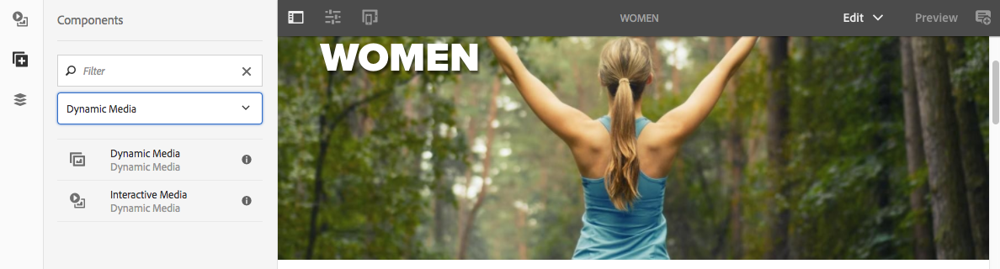

# 将Dynamic Media Assets添加到页面 {#adding-dynamic-media-assets-to-pages}

要将Dynamic Media功能添加到您在网站上使用的资产中，您可以将 **Dynamic Media** 或 **交互式媒体** 组件。 为此，可进入布局模式并启用Dynamic Media组件。 然后，您可以将这些组件添加到页面，并将资产添加到该组件。 Dynamic Media 组件和交互式媒体组件是智能组件，它们知道您添加的是图像还是视频，并能据此相应地更改提供的选项。

如果您使用AEM作为WCM，则可以直接将Dynamic Media资产添加到页面。 如果您为 WCM 使用第三方，请[链接](linking-urls-to-yourwebapplication.md)或[嵌入](embed-code.md)资产。有关响应式第三方网站，请参阅[将优化的图像交付到响应式网站](responsive-site.md)。

>[!NOTE]
>
>您必须先发布资产，然后才能将资产添加到AEM中的页面。 请参阅 [发布Dynamic Media Assets](publishing-dynamicmedia-assets.md).

## 将Dynamic Media组件添加到页面 {#adding-a-dynamic-media-component-to-a-page}

向页面添加Dynamic Media组件与向任何页面添加组件相同。 以下各节详细介绍了Dynamic Media组件。

>[!NOTE]
>
>如果网页上有一个Dynamic Media组件由具有只读权限的用户访问，则该页面会损坏，并且这些组件无法正确呈现。 原因是重构了页面，以确保组件的属性良好，并且任何引用的资产和配置都可以访问。 然后，页面会再次呈现，导致组件中断；由于用户的只读访问权限，无法重新呈现页面上的相应组件代码。
>  
>要避免出现此问题，请确保AEM Sites用户拥有访问资产的必要权限。

1. 在 AEM 中，打开您要添加 Dynamic Media 组件的页面。
1. 在页面左侧的面板（您可能需要切换侧面板的显示）中，单击 **[!UICONTROL 组件]** 图标。
1. 在 **[!UICONTROL 组件]** 标题，在下拉列表中，选择 **[!UICONTROL Dynamic Media]**. 如果没有可用的Dynamic Media组件列表，您可能需要启用要使用的Dynamic Media组件。 请参阅 [启用Dynamic Media组件](#enabling-dynamic-media-components).

   

1. 将您要使用的Dynamic Media组件拖动到页面上所需位置。
1. 将鼠标指针直接悬停在组件上。 当组件被蓝色框包围时，点按一次以显示组件的工具栏。 点按 **[!UICONTROL 配置]** （扳手）图标。
1. [编辑组件](#dynamic-media-components) 根据需要，单击复选标记以保存更改。

### 启用Dynamic Media组件 {#enabling-dynamic-media-components}

如果没有可添加到页面的Dynamic Media组件，则可能意味着您需要首先启用要使用的组件。

1. 在 AEM 中，打开您要添加 Dynamic Media 组件的页面。
1. 在工具栏左侧，点按页面顶部附近的页面信息图标，然后点按 **[!UICONTROL 编辑模板]** 从下拉列表中。

   

1. 在页面顶部附近工具栏右侧的下拉列表中，点按 **[!UICONTROL 结构]**.

   

1. 在页面底部附近，点按 **[!UICONTROL 布局容器]** 要打开其工具栏，请点按策略图标。
1. 在 **[!UICONTROL 布局容器]** 页面下 **[!UICONTROL 属性]** 标题，确保 **[!UICONTROL 允许的组件]** 选项卡。

   

1. 滚动直到您看到 **[!UICONTROL Dynamic Media]**.
1. 点按左侧的>图标 **[!UICONTROL Dynamic Media]** 要展开列表，请选择要启用的Dynamic Media组件。

   

1. 在 **[!UICONTROL 布局容器]** ，点按完成（复选标记）图标。

1. 在页面顶部附近工具栏右侧的下拉列表中，点按 **[!UICONTROL 初始内容]**，则 [将Dynamic Media组件添加到页面](#adding-a-dynamic-media-component-to-a-page) 和往常一样。

## 本地化Dynamic Media组件 {#localizing-dynamic-media-components}

您可以通过以下两种方式之一将Dynamic Media组件本地化：

* 在“站点”的网页中，打开“属 **[!UICONTROL 性]** ”，然后选择“ **[!UICONTROL 高级]** ”选项卡。 选择所需的本地化语言。

   

* 从站点选择器中，选择所需的页面或页面群组。 点按 **[!UICONTROL 属性]** ，然后选择 **[!UICONTROL 高级]** 选项卡。 选择所需的本地化语言。

   >[!NOTE]
   >
   >请注意，并非所有语言都在 **[!UICONTROL 语言]** 菜单当前已分配令牌。

## Dynamic Media组件 {#dynamic-media-components}

Dynamic Media和交互式媒体可在 [!UICONTROL Dynamic Media] 选项卡 [!UICONTROL 组件]. 对于任何交互式资产（例如交互式视频、交互式图像或传送集），请使用[!UICONTROL 交互式媒体]组件。对于所有其他 Dynamic Media 资产，请使用 Dynamic Media 组件。

>[!NOTE]
>
>默认情况下，这些组件不可用，在使用之前需要通过模板编辑器来提供。 [在它们可用后](/help/sites-authoring/templates.md#editing-templates-template-authors) 在模板编辑器中，您可以像向任何其他AEM组件添加组件一样，将组件添加到页面。

### Dynamic Media 组件 {#dynamic-media-component}

Dynamic Media组件是智能的 — 根据您添加的是图像还是视频，您有各种不同的选项。 该组件支持图像预设、基于图像的查看器（例如图像集、旋转集、混合媒体集）和视频。此外，查看器是响应式的。 也就是说，屏幕的大小会根据屏幕大小自动更改。 所有查看器都是 HTML5 查看器。

>[!NOTE]
>
>如果具有只读权限的用户访问的网页上存在Dynamic Media组件、交互式媒体组件，或两者都存在，则会出现分页，并且这些组件无法正确呈现。 原因是重构了页面，以确保组件的属性良好，并且任何引用的资产和配置都可以访问。 然后，页面会再次呈现，导致组件中断；由于用户的只读访问权限，无法重新呈现页面上的相应组件代码。
>  
>要避免出现此问题，请确保AEM Sites用户拥有访问资产的必要权限。

>[!NOTE]
>
>添加 Dynamic Media 组件时，如果 **[!UICONTROL Dynamic Media 设置]**&#x200B;为空或无法正常添加资产，请检查以下各项：
>
>* 您已经[启用了 Dynamic Media](config-dynamic.md)。默认情况下，Dynamic Media 处于禁用状态。
>* 图像具有金字塔 TIFF 文件。在启用 Dynamic Media 之前导入的图像没有金字塔 TIFF 文件。

>

#### 处理图像时 {#when-working-with-images}

Dynamic Media 组件允许您添加动态图像，包括图像集、旋转集和混合媒体集。您可以缩放图像，并在适当的情况下在旋转集内旋转图像，或从其他类型的集合中选择图像。

您还可以直接在组件中配置查看器预设、图像预设或图像格式。要使图像成为响应式图像，您可以设置断点，或应用响应式图像预设。

您必须通过单击 **[!UICONTROL 编辑]** 图标，然后 **[!UICONTROL Dynamic Media设置]**.

>[!NOTE]
>
>默认情况下，Dynamic media图像组件是自适应的。 如果要使其变为固定大小，请在 **[!UICONTROL 高级]** 选项卡 **[!UICONTROL 宽度]** 和 **[!UICONTROL 高度]** 设置。

* **[!UICONTROL 查看器预设]**
从下拉菜单中选择现有的查看器预设。 如果未显示您要查找的查看器预设，则可能需要将其显示出来。请参阅管理查看器预设。如果您正在使用图像预设，则无法选择查看器预设，反之亦然。如果您查看的是图像集、旋转集或混合媒体集，这是唯一可用的选项。显示的查看器预设也是智能的 - 仅显示相关的查看器预设。

* **[!UICONTROL 查看器修饰符]**
查看器修饰符采用名称=值对和分隔符的形式，允许您按照《查看器参考指南》中所述更改查看器。 查看器修饰符的示例为后景图像=img.jpg&amp;caption=text.vtt，1，该示例为视频缩略图设置不同的图像，并将隐藏式字幕/子标题文件与视频关联。

* **[!UICONTROL 图像预设]**
从下拉菜单中选择现有的图像预设。 如果未显示您要查找的图像预设，则可能需要将其显示出来。请参阅管理图像预设。如果您正在使用图像预设，则无法选择查看器预设，反之亦然。如果您查看的是图像集、旋转集或混合媒体集，则此选项不可用。

* **[!UICONTROL 图像修饰符]**
您可以通过提供其他图像命令来应用图像效果。 这些内容在图像预设和图像提供命令参考中有介绍。
如果您查看的是图像集、旋转集或混合媒体集，则此选项不可用。

* **[!UICONTROL 断点]**
如果您在响应式网站上使用此资产，则需要添加图像断点。 图像断点之间需要使用逗号 (,) 进行分隔。当图像预设中未定义高度或宽度时，可以使用此选项。如果您查看的是图像集、旋转集或混合媒体集，则此选项不可用。您可以通过单击 **[!UICONTROL 编辑]** 中。

* **[!UICONTROL 标题]**
更改图像的标题。

* **[!UICONTROL 替换文本]**
为已关闭图形的用户在图像中添加标题。
如果您查看的是图像集、旋转集或混合媒体集，则此选项不可用。

* **[!UICONTROL URL，在中打开]**
您可以设置资产以打开链接。 设置 URL，并在打开方式中指示是要在同一窗口中还是在新窗口中打开该 URL。如果您查看的是图像集、旋转集或混合媒体集，则此选项不可用。

* **[!UICONTROL 宽度]** 和 **[!UICONTROL 高度]**
如果希望图像具有固定大小，请输入值（以像素为单位）。 将这两个值留空会使资产成为自适应资产。

#### 处理视频时 {#when-working-with-video}

使用Dynamic Media组件将动态视频添加到您的网页。 编辑该组件时，您可以选择使用预定义的视频查看器预设，以在页面上播放视频。

您必须通过单击 **[!UICONTROL 编辑]** 中。

>[!NOTE]
>
>默认情况下，Dynamic Media 视频组件为自适应组件。如果要使其变为固定大小，请在组件中使用 **[!UICONTROL 宽度]** 和 **[!UICONTROL 高度]** 在 [!UICONTROL 高级] 选项卡。

* **[!UICONTROL 查看器预设]**
从下拉菜单中选择现有的视频查看器预设。 如果未显示您要查找的查看器预设，则可能需要将其显示出来。请参阅管理查看器预设。

* **[!UICONTROL 查看器修饰符]**
查看器修饰符采用名称=值对和分隔符的形式，允许您按照《Adobe查看器参考指南》中所述更改查看器。 查看器修饰符的示例为后验图像=img.jpg&amp;caption=text.vtt，1

   例如，通过查看器修饰符，您可以执行以下操作：

   * 将字幕文件与视频关联 [标题。](https://experienceleague.adobe.com/docs/dynamic-media-developer-resources/library/viewers-aem-assets-dmc/video/command-reference-url-video/r-html5-video-viewer-url-caption.html)
   * 将导航文件与视频关联 [导航。](https://experienceleague.adobe.com/docs/dynamic-media-developer-resources/library/viewers-aem-assets-dmc/video/command-reference-url-video/r-html5-video-viewer-url-navigation.html)

您可以编辑以下内容 [!UICONTROL 高级设置] 单击 **[!UICONTROL 编辑]** 中。

* **[!UICONTROL 标题]**
更改视频的标题。

* **[!UICONTROL 宽度]** 和 **[!UICONTROL 高度]**
如果您希望视频具有固定大小，请输入值（以像素为单位）。 将这两个值留空会使视频成为自适应资产。

#### 使用智能裁剪时 {#when-working-with-smart-crop}

使用Dynamic Media组件将智能裁剪图像资产添加到您的网页。 编辑该组件时，您可以选择使用预定义的视频查看器预设，以在页面上播放视频。

另请参阅 [图像配置文件](image-profiles.md).

您可以编辑以下内容 [!UICONTROL Dynamic Media设置] 单击 **[!UICONTROL 编辑]** 中。

>[!NOTE]
>
>默认情况下，Dynamic media图像组件是自适应的。 如果要使其变为固定大小，请在“高级”选项卡的组件中设置 [!UICONTROL 它] ，并使用“宽度”和“高 **** 度” ****。

* **[!UICONTROL 图像修饰符]**
您可以通过提供其他图像命令来应用图像效果。 这些内容在图像预设和图像提供命令参考中有介绍。
如果您查看的是图像集、旋转集或混合媒体集，则此选项不可用。

您可以编辑以下内容 **[!UICONTROL 高级]** 单击 **[!UICONTROL 编辑]** 中。

* **[!UICONTROL 标题]**
更改智能裁剪图像的标题。

* **[!UICONTROL 替换文本]**
为关闭了图形的用户添加智能裁剪图像的标题。
如果您查看的是图像集、旋转集或混合媒体集，则此选项不可用。

* **[!UICONTROL URL，在中打开]**
您可以设置资产以打开链接。 设置 URL，并在打开方式中指示是要在同一窗口中还是在新窗口中打开该 URL。如果您查看的是图像集、旋转集或混合媒体集，则此选项不可用。

* **[!UICONTROL 高度]** 和 **[!UICONTROL 宽度]**
如果您希望智能裁剪图像具有固定大小，请输入值（以像素为单位）。 将这两个值留空会使视频成为自适应资产。

### 交互式媒体组件 {#interactive-media-component}

交互式媒体组件适用于具有交互功能的资产，例如热点或图像映射。如果您具有交互式图像、交互式视频或传送横幅，请使用交互式媒体组件。

交互式媒体组件是智能的 — 根据您添加的是图像还是视频，您可以选择各种选项。 此外，查看器是响应式的 - 其屏幕大小可根据设备屏幕大小自动进行更改。所有查看器都是 HTML5 查看器。

>[!NOTE]
>
>如果具有只读权限的用户访问的网页上存在Dynamic Media组件、交互式媒体组件，或两者都存在，则会出现分页，并且这些组件无法正确呈现。 原因是重构了页面，以确保组件的属性良好，并且任何引用的资产和配置都可以访问。 然后，页面会再次呈现，导致组件中断；由于用户的只读访问权限，无法重新呈现页面上的相应组件代码。
> 
>要避免出现此问题，请确保AEM Sites用户拥有访问资产的必要权限。

您可以通过在组件中单击&#x200B;**[!UICONTROL 编辑]**，来编辑以下&#x200B;**[!UICONTROL 常规]**&#x200B;设置。

* **[!UICONTROL 查看器预设]**
从下拉菜单中选择现有的查看器预设。 如果未显示您要查找的查看器预设，则可能需要将其显示出来。查看器预设必须先发布，然后才能使用。请参阅管理查看器预设。

* **[!UICONTROL 标题]**
更改视频的标题。

* **[!UICONTROL 宽度]** 和 **[!UICONTROL 高度]**
如果您希望视频具有固定大小，请输入值（以像素为单位）。 将这两个值留空会使视频成为自适应资产。

您可以通过在组件中单击&#x200B;**[!UICONTROL 编辑]**，来编辑以下&#x200B;**[!UICONTROL 添加到购物车]**&#x200B;设置。

* **[!UICONTROL 显示产品资产]**
默认情况下，此值处于选中状态。 产品资产会按“商务”模块中的定义显示产品的图像。清除复选标记不会显示产品资产。

* **[!UICONTROL 显示产品价格]**
默认情况下，此值处于选中状态。 产品价格会按“商务”模块中的定义显示项目的价格。清除复选标记不会显示产品价格。

* **[!UICONTROL 显示产品表单]**
默认情况下，此值未选中。 产品表单包含所有产品变量，例如大小和颜色。清除复选标记不会显示产品变量。

### 全景媒体组件 {#panoramic-media-component}

全景媒体组件适用于那些球面全景图像的资产。 此类图像可提供360°的房间、属性、位置或景观观看体验。 要使图像符合球面全景，它必须具有以下任一或两者：

* 宽高比为2:1。
* 使用关键字“等长方形”、（“球形”+“全景”）或（“球形”+“全景”）进行标记。 请参阅 [使用标记](/help/sites-authoring/tags.md).

纵横比和关键字条件都适用于资产详细信息页面和“全景媒体”WCM组件的全景资产。

您可以通过点按 **[!UICONTROL 配置]** 中。

* **[!UICONTROL 查看器预设]**
从“查看器预设”下拉菜单中选择一个现有的查看器。

如果您要查找的查看器预设不可见，请勾选以确保该查看器预设已发布。 您必须先发布查看器预设，然后才能使用这些预设。 请参阅[管理查看器预设](managing-viewer-presets.md)。

### 使用HTTP/2交付Dynamic Media资产 {#using-http-to-delivery-dynamic-media-assets}

HTTP/2是经过更新的新Web协议，可改进浏览器和服务器的通信方式。 它提供了更快的信息传输，并降低了所需的处理能力。 现在，Dynamic Media资产的交付可以通过HTTP/2进行，从而提供更好的响应和加载时间。

请参阅 [HTTP2内容交付](http2.md) 有关开始使用HTTP/2与您的Dynamic Media帐户的完整详细信息。

>[!MORELIKETHIS]
>
>* [了解使用AEM Dynamic Media进行色彩管理](https://helpx.adobe.com/experience-manager/kt/assets/using/dynamic-media-color-management-technical-video-setup.html)
>* [在AEM Dynamic Media中使用自定义视频缩略图](https://helpx.adobe.com/experience-manager/kt/assets/using/dynamic-media-video-thumbnails-feature-video-use.html)
>* [了解带有AEM Dynamic Media的资产查看器](https://helpx.adobe.com/experience-manager/kt/assets/using/dynamic-media-viewer-feature-video-understand.html)
>* [在AEM Dynamic Media中使用交互式视频](https://helpx.adobe.com/experience-manager/kt/assets/using/dynamic-media-interactive-video-feature-video-use.html)
>* [在AEM Dynamic Media中使用视频播放器](https://helpx.adobe.com/experience-manager/kt/assets/using/dynamic-media-video-player-feature-video-use.html)
>* [在AEM Dynamic Media中使用图像锐化](https://helpx.adobe.com/experience-manager/6-4/assets/using/best-practices-for-optimizing-the-quality-of-your-images.html)

