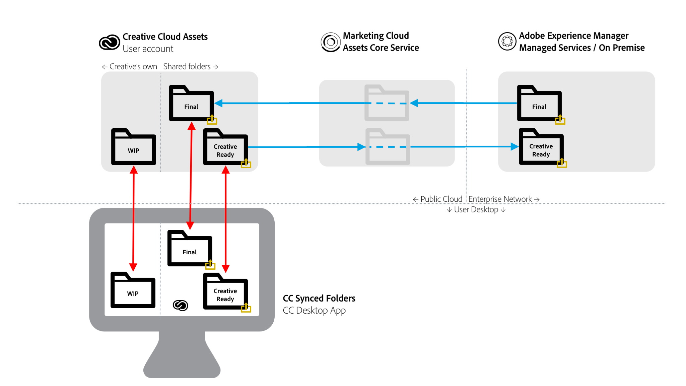

# AEM到Creative Cloud文件夹共享最佳实践 {#aem-to-creative-cloud-folder-sharing-best-practices}

>[!CAUTION]
>
>已弃用AEM到Creative Cloud文件夹共享功能。 Adobe强烈建议使用较新的功能，如 [Adobe资产链接](https://helpx.adobe.com/cn/enterprise/using/adobe-asset-link.html) 或AEM [桌面应用程序](https://helpx.adobe.com/experience-manager/desktop-app/aem-desktop-app.html)。 了解AEM和Creative Cloud [集成最佳实践的更多信息](/help/assets/aem-cc-integration-best-practices.md)。

Adobe Experience Manager(AEM)可以配置为允许AEM Assets的用户与Creative Cloud用户共享文件夹，这样，在Creative Cloud资产服务中，这些用户便可以作为共享文件夹。 该功能可用于创意团队和AEM Assets用户之间交换文件，尤其是当创意用户无权访问AEM Assets实例（他们不在企业网络中）时。

这种集成可用于两种用例，尤其是与没有直接访问AEM Assets权限的用户合作时：

* 与Creative Cloud文件用户共享AEM Assets的一组特定资产(例如，为新的营销活动设计作品的创意简介和一组获准资产)
* 从Creative Cloud用户接收新文件。

>[!NOTE]
>
>在阅读此文档之前，您可以查阅AEM和 [Creative Cloud集成的整体最佳实践](aem-cc-integration-best-practices.md) ，以获得主题的更高级别概述。

## 概述 {#overview}

AEM到Creative Cloud文件夹共享依赖于AEM Assets和Creative Cloud帐户之间的文件夹和文件的服务器端共享。 在桌面上使用Creative Cloud桌面应用程序的创意专业人士还可以使用Adobe CreativeSync技术将共享文件夹直接放在其磁盘上。

下图提供了集成的概述。

集成包括以下元素：

* **AEM Assets** ，部署在企业网络（托管服务或内部部署）中的服务器：此处启动文件夹共享。
* **Adobe Marketing Cloud资产核心服务**:充当AEM与Creative Cloud存储服务之间的中介。 使用集成的公司的管理员需要在Marketing Cloud组织和AEM Assets实例之间建立信任关系。 它们还定 [义了经批准的Creative Cloud协](https://experienceleague.adobe.com/docs/core-services/interface/assets/t-admin-add-cc-user.html?lang=en#assets)作者的列表,AEM Assets用户也可以共享文件夹以增加安全性。
* **Creative Cloud资产Web服务** (存储和Creative Cloud文件Web UI):这是与之共享了AEM Assets文件夹的特定Creative Cloud用户能够接受邀请并在其Creative Cloud帐户存储中查看该文件夹的位置。
* **Creative Cloud桌面应用程序**:（可选）允许通过与Creative Cloud资产存储同步，从创意用户的桌面直接访问共享文件夹／文件。

## 特点和限制 {#characteristics-and-limitations}

* **更改的单向传播：** 文件更改仅向一个方向传播——从最初创建（上传）资产的系统(AEM或Creative Cloud资产)。 该集成不提供两个系统之间的完全自动化的双向同步。

* **版本控制:**

   * AEM仅在更新时创建资产的版本(如果文件源于AEM，并在此更新)。
   * Creative Cloud资产提供其 [自己的版本](https://helpx.adobe.com/creative-cloud/help/versioning-faq.html) ，该功能针对进行中的更新（基本上，将更新存储最多10天）

* **空间限制：** 交换的文件大小和数量受创意用户的特 [定Creative Cloud资源配额](https://helpx.adobe.com/creative-cloud/kb/file-storage-quota.html) (取决于订阅级别)和最大文件大小限制(5GB)的限制。 此外，该组织在Adobe Marketing Cloud资产核心服务中的资产配额也限制了空间。

* **空间要求：** 共享文件夹中的文件还需要先物理存储在AEM中，然后存储在Creative Cloud帐户中，并在Marketing Cloud资产核心服务中缓存副本。
* **网络和带宽：** 共享文件夹中的文件和所有更新需要通过网络在系统之间传输。 您应确保仅共享相关文件和更新。
* **文件夹类型**:不支持共享类型 `sling:OrderedFolder`的“资产”文件夹。 如果要共享文件夹，则在AEM Assets创建文件夹时，不要选择“已排序”选项。

## Best practices {#best-practices}

利用AEM到Creative Cloud文件夹共享的最佳实践包括：

* **卷注意事项：** AEM/Creative Cloud文件夹共享应用于共享较少数量的文件，例如，与特定活动或活动相关的文件。 要共享较大的资产集（与组织中所有已批准的资产一样），请使用其他分发方法(例如，AEM Assets品牌门户)或AEM桌面应用程序。
* **避免共享深层层次：** 共享功能会定期运行，不允许选择性取消共享。 通常，仅应考虑使用没有子文件夹或层次结构非常浅的文件夹（如1个子文件夹级别）进行共享。
* **为单向共享单独使用文件夹：** 应使用单独的文件夹将最终资产从AEM Assets共享到Creative Cloud文件，将创意就绪型资产从Creative Cloud文件共享回AEM Assets。 它与这些文件夹的良好命名规范一起，为AEM Assets和Creative Cloud用户创建了一个更易于理解的工作环境。
* **避免在共享文件夹中出现WIP:** 共享文件夹不应用于“正在进行的工作”-在“Creative Cloud文件”中使用单独的文件夹来执行需要频繁更改文件的工作。
* **开始共享文件夹外的新工作：** 新设计（创意文件）应在“Creative Cloud文件”的单独WIP文件夹中启动，当它们准备好与AEM Assets用户共享时，应将其移动或保存到共享文件夹。
* **简化共享结构：** 要实现更易于管理的操作设置，请考虑简化共享结构。 与所有创意用户共享不同，AEM Assets文件夹应仅与团队代表共享，如创意总监或团队经理。 创意方面的经理将接收最终资产，决定工作分配，然后让设计人员在自己的Creative Cloud帐户中处理WIP资产。 他们可以使用Creative Cloud协作功能来协调工作，最后选择并放回准备共享到AEM Assets的资源到他们的创意就绪共享文件夹。

下图说明了一个根据AEM Assets现有最终资产创建新设计的示例配置。

