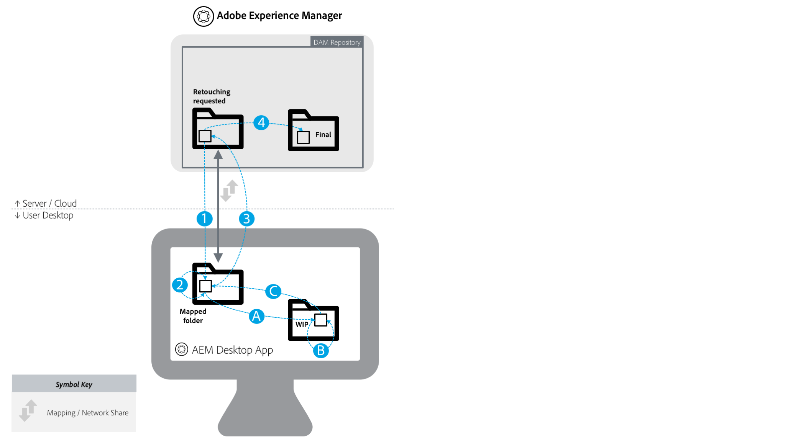

# AEM和Creative Cloud集成最佳实践 {#aem-and-creative-cloud-integration-best-practices}

<!-- TBD: Reconcile with 6.5 article that's ahead of this article now in terms of content streamlining and structuring.
-->

Adobe Experience Manager资产是一款数字资产管理(DAM)解决方案，可与Adobe Creative Cloud集成，帮助DAM用户与创意团队协作，从而简化内容创建过程中的协作。

Adobe Creative Cloud为创意团队提供解决方案和服务生态系统，帮助他们创建数字资产。 它包括桌面和移动应用程序、云服务(如存储与桌面同步或Web体验)以及像Adobe Stock这样的市场。

阅读以了解根据您的用例在桌面和企业级DAM之间选择哪些集成，以及连接工作流的相关最佳实践。

>[!NOTE]
>
>AEM到Creative Cloud文件夹共享已弃用，本指南不再涵盖它。 Adobe建议使用较新的功 [能(如Adobe资](https://helpx.adobe.com/cn/enterprise/using/adobe-asset-link.html) 产链接 [或AEM](https://docs.adobe.com/content/help/zh-Hans/experience-manager-desktop-app/using/introduction.html) 桌面应用程序)为创意用户提供对AEM中管理的资产的访问权限。

## 创意人员、营销人员和DAM用户的协作需求 {#collaboration-needs-of-creatives-marketers-and-dam-users}

| 要求 | 用例 | 涉及的表面 |
|---|---|---|
| 简化桌面创意人员的体验 | 简化创意专业人士（或更广泛地说，是使用桌面设备、使用本机资源创建应用程序的用户）从DAM(AEM Assets)访问资产的过程。 他们需要一种简单明了的方法来发现、使用（打开）、编辑和保存对AEM的更改，以及上传新文件。 | Win或Mac桌面； Creative Cloud应用程序 |
| 提供来自Adobe Stock的高质量、现成可用资产 | 营销人员通过协助资产采购和发现来帮助加快内容创建流程。 创意专业人士直接在其创意工具中使用获准的资产。 | AEM Assets; Adobe Stock市场； 元数据字段 |
| 按组织分发和共享资产 | 内部部门／地方分支机构和外部合作伙伴、分销商和代理使用父组织共享的已批准资产。 该组织希望安全、无缝地共享创建的资产，以扩大重用范围。 | Brand Portal, Asset Share Commons |

## Adobe产品支持协作需求 {#adobe-offerings-to-support-the-collaboration-need}

| 相关角色的价值主张 | Adobe产品 | 涉及的表面 |
|---|---|---|
| 创意用户从AEM中发现资产、打开并使用资产、编辑更改并上传到AEM，以及将新文件上传到AEM，而无需离开Creative Cloud应用程序。 | [Adobe Asset Link](https://helpx.adobe.com/cn/enterprise/using/adobe-asset-link.html) | Photoshop、Illustrator和InDesign |
| 商业用户简化了资产的打开和使用、编辑更改并上传到AEM以及从桌面环境将新文件上传到AEM的过程。 他们使用通用集成在本机桌面应用程序中打开任何资产类型，包括非Adobe类型。 | [AEM 桌面应用程序](https://docs.adobe.com/content/help/en/experience-manager-desktop-app/using/using.html) | AEM桌面应用程序在Win和Mac桌面上 |
| 营销人员和商业用户从AEM内部发现、预览、许可、保存和管理Adobe Stock资产。 授权和保存的资源提供精选的Adobe Stock元数据以更好地进行管理。 | [Experience Manager和Adobe Stock整合](aem-assets-adobe-stock.md) | AEM web界面 |

本文主要介绍协作需求的前两个方面。作为一个用例，简要提及了资产的大规模分发和采购。对于此类需求解决方案，请考虑 Adobe Brand Portal 或 Asset Share Commons。Alternate solutions such as [Brand Portal](https://helpx.adobe.com/cn/experience-manager/brand-portal/user-guide.html), solutions that can be built based on [Asset Share Commons](https://adobe-marketing-cloud.github.io/asset-share-commons/) components, [Link Share](/help/assets/link-sharing.md), using [Experience Manager Assets](/help/assets/managing-assets-touch-ui.md) should be reviewed based on specific requirement.

<!-- 
## Terms and definitions {#terms-and-definitions}

The terms used in this document may have a different meaning in other contexts. In particular, the following terms pertaining to the digital asset lifecycle are used when referring to workflows between a creative professional's desktop and DAM:

* **Work-in-progress or creative work-in-progress (WIP):** A phase in asset lifecycle where an asset undergoes multiple changes and is typically not yet ready to be shared with broader teams.
* **Creative-ready assets:** Assets that are ready to be shared with a broader team, or have been  selected / approved  by the creative team for sharing with marketing or LOB teams.
* **Asset approvals:** The approval process that runs for assets already uploaded to DAM, which typically includes brand approvals, legal approvals, and so on.
* **Final asset:** An asset that has gone through all  approvals/metadata  tagging and is ready to be used by the broader team. Such an asset is stored in DAM and made available to all (or all interested) users. It can be used in marketing channels or by creative teams to create designs.
* **Minor asset  update/change:** A quick and small change to a digital asset. It is often made in response to a retouching or minor editing request, asset review, or approval (for example, reposition, change text size, adjust saturation/brightness, color, and so on).
* **Major asset  update/change:** A change to a digital asset that requires considerable work, and sometimes must be done over a longer period of time. It typically includes multiple changes. The asset must be saved multiple times while being updated. Major asset updates typically cause the asset to enter a WIP stage.
* **DAM:** Digital asset management. In this document, it is synonymous with AEM Experience Manager Assets, unless specifically mentioned otherwise.
* **Creative user:** A creative professional, who creates digital assets using Creative Cloud apps and services. In some cases, a creative user may be a member of a creative team who may use Creative Cloud, but does not create digital assets (like a creative director or creative team manager).
* **DAM user:** A typical user of a DAM system. Depending on the organization, a DAM user can be a marketing or a non-marketing user, for example a Line-of-Business (LOB) user, librarian, sales person, and so on.
-->

### 用例映射

| 用例 | AEM 桌面应用程序 | 文件夹共享 | 其他解决方案 |
|---|---|---|---|
| 与Creative用户共享较少数量(1)的DAM资产 | ✔✔ | ✔ |  |
| 与Creative用户共享更多(2)个DAM资产 | ✔✔ | ✘ | [Brand Portal](https://docs.adobe.com/content/help/zh-Hans/experience-manager-brand-portal/using/home.html)   [资产共享](assets-finder-editor.md) |
| 与有权访问DAM的用户共享DAM资产 | ✔✔ | ✔ | [链接共享](link-sharing.md) |
| 与无权访问DAM的用户共享DAM资产 | ✘ | ✔✔ | [Brand Portal](https://docs.adobe.com/content/help/zh-Hans/experience-manager-brand-portal/using/home.html)   [资产共享](assets-finder-editor.md) |
| 将较少的资产数量／数量保存到DAM | ✔✔ | ✔ | [Web UI上传](managing-assets-touch-ui.md) |
| 将更多资产保存到DAM(3) | ✔✔ | ✘ | [Web UI上传自定](managing-assets-touch-ui.md) 义脚本   /工具 |
| 将大量资产迁移到DAM | ✘ | ✘ | [迁移指南](assets-migration-guide.md) |
| 在桌面上快速打开资源 | ✔✔ | ✘ |  |
| 在桌面上快速打开和更改资源 | ✔✔ | ✘ |  |

符号的图例：

* ✔✔: 首选解决方案
* ✔: 可接受的解决方案
* ✘: 不应用于用例

附加说明：

* （一）资产数量较少： 例如，与项目或活动相关的小型资产集
* （二）资产数量较大： 例如，组织中所有已批准的资产
* (3)使用AEM桌面应用程序上传文件夹功能

要支持资产分发使用案例，应考虑其他解决方案：

* [面向AEM Assets](https://helpx.adobe.com/cn/experience-manager/brand-portal/user-guide.html) 、可配置的SaaS加载项的品牌门户，用于发布资产。
* 自定义解决方案是基于资 [产共享共享共享](https://adobe-marketing-cloud.github.io/asset-share-commons/) 共享代码库创建的。
* AEM链 [接共享](/help/assets/link-sharing.md) ，以使用链接临时共享资产。
* [AEM AssetsWeb界面](/help/assets/managing-assets-touch-ui.md) ，与由AEM访问控制设置保护的外部方的区域以及必要的IT/网络配置调整进行界面，使这些外部用户能够访问AEM。

## 主要概念和用例 {#key-concepts-and-use-cases}

### 常用术语表 {#glossary-of-common-terms}

* **正在进行的工作或正在进行的创意工作 (WIP)：**&#x200B;资产生命周期中的一个阶段，在此阶段中，资产会经历多次更改，通常尚未准备好与更广的团队共享。
* **创意就绪资产：**&#x200B;已准备好与更广的团队共享的资产，或者已经由创意团队选择/批准与营销或 LOB 团队共享的资产。
* **资产批准：**&#x200B;为已上传到 DAM 的资产运行的批准流程，通常包括品牌批准、法律批准等。
* **最终资产：**&#x200B;已完成所有批准/元数据标记并可供更广的团队使用的资产。此类资产存储在 DAM 中，可供所有（或所有感兴趣的）用户使用。它可用于营销渠道或由创意团队用来创建设计。
* **次要资产更新/更改：**&#x200B;对数字资产进行快速、微小的更改。它通常是响应润饰或次要编辑请求、资产审阅或批准（例如，重新定位、更改文本大小、调整饱和度/亮度、颜色等）而生成的。
* **主要资产更新/更改：**&#x200B;需要大量工作，并且有时必须在较长的一段时间内完成的数字资产更改。它通常包括多项更改。更新资产时必须多次保存。主要资产更新通常会导致资产进入 WIP 阶段。
* **DAM：**&#x200B;数字资产管理。在本文档中，除非另有特别说明，否则它与 AEM Experience Manager Assets 同义。
* **创意用户：**&#x200B;使用 Creative Cloud 应用程序和服务创建数字资产的创意专业人士。在某些情况下，创意用户可能是使用 Creative Cloud 但不创建数字资产的创意团队成员（如创意总监或创意团队经理）。
* **DAM 用户：** DAM 系统的典型用户。根据组织的不同，DAM 用户可以是营销或非营销用户，例如业务线 (LOB) 用户、管理员、销售人员等。

### 使用AEM和Creative Cloud集成时的注意事项 {#considerations-when-using-aem-and-creative-cloud-integration}

* 查看桌 [面应用程序最佳实践](https://docs.adobe.com/content/help/en/experience-manager-desktop-app/using/troubleshoot.html#best-practices-to-prevent-troubles)
* 查看 [Adobe Stock集成](aem-assets-adobe-stock.md)
* 请参阅 [Adobe资产链接](https://helpx.adobe.com/cn/enterprise/using/adobe-asset-link.html)

这是Experience Manager和Creative Cloud集成最佳实践的简要总结。 阅读本文档的其余部分，详细了解这些内容。

* **对于使用 Photoshop、InDesign 或 Illustrator 的创意用户：** Adobe Asset Link 提供了最佳用户体验，包括清晰处理从 AEM 中签出的正在进行的资产
* **简化从桌面访问任何通用文件格式或应用程序资产的操作：**&#x200B;请使用 AEM 桌面应用程序
* **了解在 DAM 中存储资产的原因和时间：**&#x200B;将提供给组织中更广泛团队的更新
* **关注共享的资产数量：**&#x200B;如果您的用例是资产分发，则管理和安全可能是最重要的方面。考虑使用为大规模操作而构建的工具，如 Brand Portal。
* **了解资产生命周期：**&#x200B;了解组织中不同团队处理资产的方式
* **谨慎处理对资产的频繁保存：** Adobe Asset Link 通过 PS、AI、ID 为您提供相关服务。对于其他应用程序，除非您需要在 DAM 中完成所有更改，否则不要在映射/共享文件夹中执行正在进行的任务

### 从AEM Assets获得Adobe Stock资产 {#access-to-adobe-stock-assets-from-aem-assets}

[AEM和Adobe Stock集成](/help/assets/aem-assets-adobe-stock.md) ，使AEM用户能够从Adobe Stock搜索、预览、许可和保存资产到中。 已授权和保存的Adobe Stock资源已选择Stock元数据，可用于通过额外过滤器搜索这些元数据。

有关此集成的几个要点：

* 将Adobe库中的资源保存到AEM后，它们将成为常规的AEM Assets，并将二进制保存到AEM存储库。 某些与Adobe Stock相关的元数据会保存到AEM中的资产，否则，摄取过程与任何其他文件看起来相同。 例如，如果智能标记处于活动状态，则在保存这些资产时会向其添加标记。
* 保存到AEM的资源是副本，而不是返回到Adobe Stock的链接。

**将从Adobe Stock保存到AEM的Creative Cloud中的资源处理**。 此集成独立于Adobe资产链接，但Adobe资产链接会以这种方式识别从Stock保存的这些资产，并在Photoshop、Illustrator或InDesign的Adobe资产链接扩展UI中在这些资产上显示其他元数据和Stock图标。 这些文件可用于浏览、打开等——因为它们是保存到AEM时的常规AEM资源。
在具有Adobe资源链接扩展的Creative Cloud应用程序中工作的创意用户除了能够访问从Adobe Stock到AEM的已授权的资源外，还可以使用Creative Cloud库面板搜索、预览和许可Adobe Stock资源。
获得Adobe Stock许可并保存到AEM中的资源将提供给访问AEM Assets部署的更多团队，而通过Creative Cloud库面板获得Adobe Stock资源许可的创意团队将仅在默认Creative Cloud帐户中为自己提供这些资源。

<!-- 
TBD: A condensed version of the below content is better placed in the Adobe DAM article.
-->

## 关于在DAM中存储资产 {#about-storing-assets-in-a-dam}

要在创意团队和营销／业务线(LOB)团队之间设计一个高效的工作流程并选择最佳支持功能，请务必了解资产何时以及为何存储在DAM中。

### 资产存储在DAM中的原因 {#why-assets-are-stored-in-dam}

将资产存储在DAM中，使资产易于访问和查找。 它确保整个组织或生态系统（包括合作伙伴、客户等）中的大量用户都能利用资产。

大多数组织选择只存储与下游营销/LOB流程相关的资产(通过AEM Sites发布到Web渠道等渠道或Adobe Experience Cloud提供的其他渠道-Marketing Cloud、Advertising Cloud，以及Analytics Cloud衡量，向用户／合作伙伴提供等)。 此外，组织会存储在DAM中可能要经过审核／批准流程的资产。 这样，DAM存储的资产大多具有很高的杠杆利用机会，并避免存储闲置资产。

存储资产还需要考虑技术和资源利用方面的考虑因素。 DAM围绕存储的资产提供其他服务，包括提取元数据、版本控制、生成预览/转码、管理引用和添加访问控制信息。 这些服务会消耗更多的时间和基础架构资源。

通常，存储所有资产和更新是不可取的。 例如，如果对特定资产的更新质量不佳，并且会消耗大量资源，则资产可能不会存储在DAM中。

### 资产存储在DAM中时 {#when-assets-are-stored-in-dam}

创意团队（和组织）通常对在资产生命周期的每个阶段存储资产不感兴趣。 例如，在以下情况下，它们会避免存储资产：

* 尚未完成或有待试验的资产
* 未能通过创意／内部团队审阅周期的资源
* 与相关资产相比，团队有更好的候选人来向外部团队展示其工作

通常，以下类资产存储在DAM中：

* 达到一定期限且被视为可共享的资产
* 创意团队预先选择的资源
* 根据特定合同或协议（例如，从RAW文件转换的JPG文件、从PSD原始文件转换的TIFF/图像），市场营销可使用或请求的特定资产格式

### 资产更新存储在DAM中时 {#when-updates-to-assets-are-stored-in-dam}

通常，只应将与更广泛的DAM用户集相关的资产更新存储在DAM中。 它确保用户（营销和类似功能）只能在DAM资产时间轴中看到相关版本。

通常与资产生命周期中的重大里程碑相关的更改。 例如，创意团队提供的初始创意就绪资产或基于请求／审阅的正式更新应存储在DAM中并进行版本控制。

创意团队在请求更改DAM中现有资产后进行更新以供营销团队审阅，这是相关更新的示例。 它应存储在DAM中并进行版本控制，以便进一步参考或还原到先前版本。

以下是通常不相关的更新示例：

* 上传资产的早期版本，在准备好进行营销审阅之前
* 在创作团队确定资产准备就绪之前，在进行中工作阶段频繁对资产进行创作性更改

### 用户访问DAM {#user-access-to-dam}

AEM Assets根据对AEM Assets部署的访问支持两类用户。 通常，企业网络（防火墙）内的用户可以直接访问DAM。 企业网络之外的其他用户将无法直接访问。 用户类型决定从技术角度可以使用哪些集成。

#### 直接访问DAM的创意用户 {#creative-users-with-direct-access-to-dam}

通常，内部创意团队或已加入内部网络的代理／创意专业人士有权访问DAM实例，包括AEM登录。

在这种情况下，AEM桌面应用程序有助于提供对最终／批准的资产的轻松访问，并允许您将创意就绪型资产保存到DAM。

#### 无权访问DAM的创意用户 {#creative-users-without-access-to-dam}

没有直接访问DAM实例的外部机构和自由职业者可能需要访问已批准的资产或希望将其新设计添加到DAM。

在这种情况下，您可以利用AEM/Creative Cloud集成来改进工作流。 先决条件是创意用户必须拥有Adobe ID，并拥有具有存储服务的Creative Cloud帐户。

使用以下策略提供对最终／批准资产的访问：

* 要提供对大量资产的访问，请执行以下操作： 使用 [AEM Assets品牌门户](https://helpx.adobe.com/cn/experience-manager/brand-portal/user-guide.html)，或客户在AEM发布基础架构 [上实施资](assets-finder-editor.md) 产共享。

* 要提供对几个资源的访问，请执行以下操作： 与Adobe Creative Cloud的AEM文件夹共享可以用于AEM Assets品牌门户或资产共享。 请注意，此集成存在某些限制，本文将更详细地介绍这些限制。

### Use Cases {#use-cases}

以下用例描述了DAM与设计人员桌面之间的各种工作流类型。

#### 使用DAM中的资产创建新设计 {#creating-new-designs-using-assets-from-dam}

下图说明了数字资产生命周期。 它描述了创意用户和DAM用户（营销人员、LOB用户）如何利用现有资产并使用它们创建更多资产，并将其发送以供审批。

资产生命周期包括以下阶段：

1. 将批准的资产共享到创意桌面： 创意用户（在桌面上）可以使用DAM的最终资产
1. 创建新设计（创意数字资产）: 新文件存储在进行中(WIP)区域。
1. 在新设计中使用（放置）已批准的资产： 创意用户使用Creative Cloud应用程序中现有的已批准资产生成新资产
1. 频繁保存WIP更新： 创意用户快速迭代并频繁保存文件。 在此阶段，创意用户可能会与他人协作，但经常保存的更新通常对DAM用户不感兴趣。
1. 资源已达到创意就绪状态，并保存到“创意就绪”文件夹
1. 资产更新： 资产更新或新文件对DAM中的用户可用
1. 资产投入生产： 这是一个DAM流程，具体取决于组织，它可能包括标记、批准和更改访问控制。 在此阶段，该资产被视为最终资产，能否被利用DAM的更多团队使用。 创意用户也可以使用它创建其他资源。

以下是一些关于如何通过此过程管理资产的一般建议：

* 为WIP文件使用专用存储区／系统(如“Adobe Creative Cloud资产”同步文件夹): 与DAM用户无关的频繁更新最好由专用系统处理，而不是从AEM Assets内部处理。 WIP资产可以使用Adobe Creative Cloud桌面应用程序同步到本地磁盘，保存在本地存储，依此类推。
* 对上传到DAM的最终资产和资产使用单独的文件夹／共享： 特此说明，最终资产应具有自己的映射／共享文件夹（上面的“最终”示例），而要上传回DAM的资产应具有自己的(“Creative Ready”)

#### 更改在DAM中管理的现有资产 {#changing-existing-assets-managed-in-dam}

在某些情况下，DAM中的资产可能需要更改。 示例包括：

* 在AEM Assets完成的审查和批准中要求更改资产
* 现有最终资产的主要更新
* 对现有文件进行快速编辑（尤其是在最终批准之前）

在这种情况下，AEM桌面应用程序提供了执行这些操作的最简单方法。

下图所示的事件流：

<!-- TBD for formatting. 
This article will get fixed automatically when 6.5 content is ported to it.
And 6.5 content will be ported after updating it for AEM desktop app 2.0 best practices.
And it will be updated for DA2.0 best practices after 6.5 repo is available for writers to edit content in.
-->

* **1:** 将资产从DAM共享到桌面，或在所选应用程序(如Adobe Photoshop等)中直接在桌面上打开它。 建议签出以锁定文件。
* **2:** 次要更新： 编辑文件并保存更改。
* 步骤2的替代流程

   * **答：** 主要更新： 如果文件需要详细的更改集，则应间歇性地保存并复制到WIP文件夹／区域。
   * **B:** 在WIP文件夹中继续处理文件。 保存的更改未同步到DAM中的版本
   * **C:** 更新完成后，文件将被复制回或保存到映射的文件夹

* **3:** 资产更新会反映在DAM中。 检入资产以将其解锁。
* **4:** 资产投入生产。

以下是关于如何在整个过程中管理资产的一些一般建议：

* 避免直接保存您从AEM桌面应用程序映射的网络共享中打开的文件，除非您对文件所做的更改很小。
* 如果要对文件进行其他更改、间歇性保存或与创意团队协作，请将文件复制到单独的WIP文件夹。

#### 批量上传到DAM {#bulk-upload-to-dam}

在某些情况下，您可能需要同时将大量文件上传到DAM，例如：

* 上传照片或大型项目的结果
* 上传创意机构提供的资产
* 如果在DAM之外进行选择，则从较大的集上传选定资产

请注意，此描述是指将文件作为桌面用户工作流程的常规部分进行操作（例如，每周或每张照片上传等）。 此处未涵盖大型资产迁移。

如果要批量上传资产，您可以利用以下功能：

* 要上传大型／分层文件夹，请使用AEM桌面应用程序，它提供“文 [件夹上传](https://helpx.adobe.com/experience-manager/desktop-app/aem-desktop-app.html#bulkupload) ”功能。 您还可以上传分层文件夹结构。 资源在后台上传，因此不会绑定到Web浏览器会话
* 如果要从单个文件夹上传几个文件，请直接将它们从桌面拖到Web UI，或使用AEM AssetsWeb UI中的“创建”选项。

>[!NOTE]
>
>根据您的业务要求，您还可以使用自定义上传程序。

#### 直接从桌面管理数字资产 {#managing-digital-assets-directly-from-desktop}

如果您使用网络文件共享来管理数字资产，只需使用AEM桌面应用程序映射的网络共享即可被视为便捷的替代方式。 从网络文件共享转换时，请记住，AEM Web UI提供了丰富的数字资产管理功能，这些功能远远超出网络共享(搜索、集合、元数据、协作、预览等)的可能，AEM桌面应用程序提供一个方便的链接，用于将服务器端DAM存储库与桌面上的工作连接起来。

避免使用AEM桌面应用程序直接在AEM Assets的网络共享中管理资源。 例如，避免使用AEM桌面应用程序移动／复制多个文件。 请改用AEM AssetsWeb UI将文件夹从Finder/Explorer拖动到网络共享或使用AEM Assets文件夹上传功能。

#### 资产迁移 {#asset-migration}

要规划和执行从现有系统到新系统的资产迁移，或迁移存储在服务器上的大量资产，请参 [阅迁移指南](/help/assets/assets-migration-guide.md)。 AEM桌面应用程序和AEM到Creative Cloud集成不支持此类迁移。 由于要摄取的资产数量庞大，以及元数据映射、转换和摄取方面的其他要求，因此应使用不同的工具和方法来处理迁移。

>[!MORELIKETHIS]
>
>* [Adobe Asset Link](https://helpx.adobe.com/in/enterprise/using/adobe-asset-link.html)
>* [AEM桌面应用程序最佳实践](https://docs.adobe.com/content/help/en/experience-manager-desktop-app/using/archive/best-practices-for-v1.html)
>* [AEM Brand Portal](https://docs.adobe.com/content/help/en/experience-manager-brand-portal/using/introduction/brand-portal.html)
>* [AEM和Adobe Stock集成](aem-assets-adobe-stock.md)

