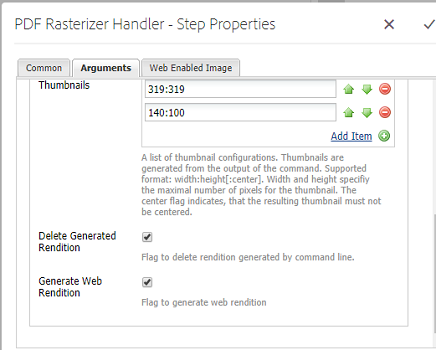

# 使用 PDF 光栅器 {#using-pdf-rasterizer}

有时，当您将大型、内容密集型PDF或AI文件上传到Adobe Experience Manager(AEM)资产时，默认库可能无法生成准确的输出。 在这种情况下，与默认库的输出相比，Adobe的PDF光栅化器库可以生成更可靠、更准确的输出。

Adobe建议对以下对象使用PDF光栅器库：

* 内容密集的繁重AI或PDF文件。
* 未开箱生成缩览图的AI或PDF文件。
* 具有Pantone Matching System(PMS)颜色的AI文件。

与开箱即用输出相比，使用PDF光栅器生成的缩略图和预览的质量更高，因此，可以跨设备提供一致的查看体验。 Adobe PDF光栅器库不支持任何色彩空间转换。 它始终输出为RGB，而与源文件的色彩空间无关。

1. 从“软件分发”在AEM实例上安装PDF光栅 [器包](https://experience.adobe.com/#/downloads/content/software-distribution/en/aem.html?package=/content/software-distribution/en/details.html/content/dam/aem/public/adobe/packages/cq640/product/assets/aem-assets-pdf-rasterizer-pkg)。

   >[!NOTE]
   >
   >PDF光栅器库仅可用于Windows和Linux。

1. 从访问AEM Assets工作流控制 `https://[AEM_server]:[port]/workflow`台。
1. 打开DAM **[!UICONTROL 更新资产工作流]** 页面。
1. 配置以下内容以跳过PDF和AI文件的默认缩略图和Web再现生成：

   * 打开缩 **[!UICONTROL 略图流程]** ，并在跳过 `application/pdf` MIME类型字 `application/postscript` 段中添 **[!UICONTROL 加或添加]** 。

   

   * 在“启 **[!UICONTROL 用Web的图像]** ”选项卡中，根 `application/pdf` 据您的要 `application/postscript` 求在“跳 **[!UICONTROL 过列表]** ”下添加或添加。

   

1. 打开“ **[!UICONTROL 栅格化PDF/AI图像预览再现]** ”步骤，并删除要跳过默认生成预览图像再现的MIME类型。 例如，从MIME类型 *列表中删除MIME*&#x200B;类型 *application/pdf、* application */postscript* 或 **[!UICONTROL application]** /illustrator。

   

1. 将“PDF栅 **[!UICONTROL 格处理程序”步骤从侧面板]** 拖到“处理缩略图” **[!UICONTROL 步骤的下方]** 。
1. 为PDF光栅处理程序步 **[!UICONTROL 骤配置以下参数]** :

   * MIME类型： *application/pdf* 或 *application/postscript*
   * 命令: `PDFRasterizer -d -p 1 -s 1280 -t PNG -i ${file}`
   * 添加缩略图大小： 319:319, 140:100, 48:48。 根据需要添加自定义缩略图配置。

   该命令的命令行参 `PDFRasterizer` 数可以包括以下参数：

   **-d**: 标记可实现文本、矢量图稿和图像的平滑渲染。 创建更优质的图像。 但是，包含此参数会导致命令运行缓慢并增加图像大小。

   `-p`: 页码。 默认值是所有页面。 “*”表示所有页面。

   **-s**: 最大图像尺寸（高度或宽度）。 此值将转换为每页的DPI。 如果页面大小不同，则每个页面都可能按不同数量缩放。 默认值为实际页面大小。

   **-t**: 输出图像类型。 有效类型有JPEG、PNG、GIF和BMP。 默认值为JPEG。

   **-i**: 输入PDF的路径。 它是一个必需参数。

   `-h`: 帮助

1. 要删除中间演绎版，请选择“删 **[!UICONTROL 除生成的演绎版]**”。
1. 要使PDF栅格化生成Web再现，请选择“ **[!UICONTROL 生成Web再现]**”。

   

1. 在“启用Web的图像” **[!UICONTROL 选项卡中指定设置]** 。

   

1. 保存工作流。
1. 要启用PDF栅格化器以处理带有PDF库的PDF页面，请从“工 **[!UICONTROL 作流”控制台打开]** “DAM流程子资产”模型。
1. 从侧面板中，将“PDF栅格化处理程序”步骤拖至“创 **[!UICONTROL 建支持Web的图像演绎版]** ”步骤下。
1. 为PDF光栅处理程序步 **[!UICONTROL 骤配置以下参数]** :

   * MIME类型： `application/pdf` 或 `application/postscript`
   * 命令: `PDFRasterizer -d -p 1 -s 1280 -t PNG -i ${file}`
   * 添加缩略图大小： 319:319, 140:100, 48:48。 根据需要添加自定义缩略图配置。

   PDFRasterizer命令的命令行参数可以包括：

   **-d**: 标记可实现文本、矢量图稿和图像的平滑渲染。 创建更优质的图像。 但是，包含此参数会导致命令运行缓慢并增加图像大小。

   **-p**: 页码。 默认值是所有页面。 星号表 `*` 示所有页面。

   **-s**: 最大图像尺寸（高度或宽度）。 此值将转换为每页的DPI。 如果页面大小不同，则每个页面都可能按不同数量缩放。 默认值为实际页面大小。

   **-t**: 输出图像类型。 有效类型有JPEG、PNG、GIF和BMP。 默认值为JPEG。

   **-i**: 输入PDF的路径。 它是一个必需参数。

   **-h**: 帮助

1. 要删除中间演绎版，请选择“删 **[!UICONTROL 除生成的演绎版]**”。
1. 要使PDF栅格化生成Web再现，请选择“ **[!UICONTROL 生成Web再现]**”。

   

1. 在“启用Web的图像” **[!UICONTROL 选项卡中指定设置]**。

   

1. 保存工作流。
1. 将PDF文件或AI文件上传到AEM Assets。 PDF栅格化器可生成文件的缩略图和Web再现。
