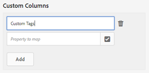

# 资产报表 {#asset-reports}

资产报告允许您评估[!DNL Adobe Experience Manager Assets]部署的实用程序。 使用[!DNL Assets]，您可以为数字资产生成各种报告。 这些报告提供有关系统使用情况、用户如何与资产交互以及下载和共享哪些资产的有用信息。

使用报告中的信息得出关键成功指标，衡量企业内部和客户采用[!DNL Assets]的情况。

[!DNL Assets]报告框架使用[!DNL Sling]作业以有序方式异步处理报表请求。 它可用于大型存储库。 异步报表处理提高了报表生成的效率和速度。

报表管理界面直观，包括用于访问归档报表和视图报表运行状态（成功、失败和排队）的细粒度选项和控件。

生成报告后，系统会通过电子邮件（可选）和收件箱通知通知您。 您可以从报告列表页面视图、下载或删除报告，其中显示所有以前生成的报告。

## 先决条件 {#prerequisite-for-reporting}

要生成报告，请确保：

* 从&#x200B;**[!UICONTROL 工具]** > **[!UICONTROL 操作]** > **[!UICONTROL Web控制台]**&#x200B;启用[!UICONTROL Day CQ DAM事件记录器]服务。
* 选择要活动的事件。 例如，要生成有关已下载资产的报告，请选择[!UICONTROL 已下载资产(DOWNLOADED)]。

## 生成报告{#generate-reports}

[!DNL Experience Manager Assets] 为您生成以下标准报表：

* 上传
* 下载
* 到期时间
* 修改
* 发布
* [!DNL Brand Portal] 发布
* 磁盘使用情况
* 文件
* 链接共享

[!DNL Adobe Experience Manager] 管理员可以轻松地为您的实施生成和自定义这些报告。管理员可以按照以下步骤生成报告：

1. 在[!DNL Experience Manager]接口中，单击&#x200B;**[!UICONTROL 工具]** > **[!UICONTROL 资产]** > **[!UICONTROL 报告]**。

   

1. 在[!UICONTROL 资产报表]页面上，单击工具栏中的&#x200B;**[!UICONTROL 创建]**。
1. 在&#x200B;**[!UICONTROL 创建报告页面]**&#x200B;页面中，选择要创建的报告，然后单击&#x200B;**[!UICONTROL 下一步]**。

   

   >[!NOTE]
   >
   >默认情况下，内容片段和链接共享包含在资产[!UICONTROL 下载的报告]中。 选择相应的选项以创建链接共享报告或从下载报告中排除内容片段。

   >[!NOTE]
   >
   >[!UICONTROL 下载]报告仅显示单独选择并使用快速操作下载或下载的资产的详细信息。 但是，它不包含下载文件夹内的资产详细信息。

1. 在存储报告的CRX存储库中配置报告详细信息，如标题、描述、缩略图和文件夹路径。 默认情况下，文件夹路径为`/content/dam`。 可以指定其他路径。

   

   选择报表的日期范围。

   您可以选择立即或在将来的日期和时间生成报表。

   >[!NOTE]
   >
   >如果选择稍后计划报表，请确保在“日期”和“时间”字段中指定日期和时间。 如果不指定任何值，报表引擎会将其视为即时生成的报表。

   配置字段可能因您创建的报告类型而异。 例如，**[!UICONTROL 磁盘使用情况]**&#x200B;报告提供了在计算资产使用的磁盘空间时包含资产演绎版的选项。 您可以选择在子文件夹中包含或排除资产，以便计算磁盘使用情况。

   >[!NOTE]
   >
   >**[!UICONTROL 磁盘使用情况]**&#x200B;报表不包含日期范围字段，因为它仅指示当前磁盘空间使用情况。

   

   创建&#x200B;**[!UICONTROL 文件]**&#x200B;报告时，可以包含／排除子文件夹。 但是，您不能为此报表包含资产演绎版。

   

   **[!UICONTROL 链接共享]**&#x200B;报告显示与[!DNL Assets]内外部用户共享的资产的URL。 其中包括共享资产的用户的电子邮件 ID、接受共享资产的用户的电子邮件 ID、链接的共享日期和到期日期。列不可自定义。

   **[!UICONTROL 链接共享]**&#x200B;报告不包含子文件夹和再现的选项，因为它只发布显示在`/var/dam/share`下的共享URL。

   

1. 单击工具栏中的&#x200B;**[!UICONTROL 下一步]**。

1. 在&#x200B;**[!UICONTROL 配置列]**&#x200B;页面中，默认情况下会选择某些列显示在报告中。 您可以选择更多列。 取消选择选定列，以在报告中将其排除。

   

   要显示自定义列名或属性路径，请在CRX的`jcr:content`节点下配置资产二进制的属性。 或者，通过属性路径选取器添加它。

   

1. 单击工具栏中的&#x200B;**[!UICONTROL 创建]**。 系统会显示一条消息，通知已开始生成报告。
1. 在[!UICONTROL 资产报表]页面上，报表生成状态基于报表作业的当前状态，例如[!UICONTROL 成功]、[!UICONTROL 失败]、[!UICONTROL 排队]或[!UICONTROL 计划]。 通知收件箱中显示相同的状态。要视图报告页面，请单击报告链接。 或者，选择报告，然后单击工具栏中的&#x200B;**[!UICONTROL 视图]**。

   

   单击工具栏中的&#x200B;**[!UICONTROL 下载]**&#x200B;以下载CSV格式的报告。

## 添加自定义列{#add-custom-columns}

您可以向以下报表添加自定义列，以根据自定义要求显示更多数据：

* 上传
* 下载
* 到期时间
* 修改
* 发布
* [!DNL Brand Portal] 发布
* 文件

要向这些报表添加自定义列，请执行以下步骤：

1. 在[!DNL Manager interface]中，单击&#x200B;**[!UICONTROL 工具]** > **[!UICONTROL 资产]** > **[!UICONTROL 报告]**。
1. 在[!UICONTROL 资产报表]页面上，单击工具栏中的&#x200B;**[!UICONTROL 创建]**。

1. 在&#x200B;**[!UICONTROL 创建报告]**&#x200B;页面中，选择要创建的报告，然后单击&#x200B;**[!UICONTROL 下一步]**。
1. 根据需要配置报告详细信息，如标题、说明、缩略图、文件夹路径和日期范围。

1. 要显示自定义列，请在&#x200B;**[!UICONTROL 自定义列]**&#x200B;下指定列的名称。

   

1. 使用属性路径选取器在CRXDE的`jcr:content`节点下添加属性路径。 或者，在属性路径字段中键入路径。

   

   或者，在属性路径字段中键入路径。

   

   要添加更多自定义列，请单击&#x200B;**[!UICONTROL 添加]**&#x200B;并重复步骤5和6。

1. 单击工具栏中的&#x200B;**[!UICONTROL 创建]**。 系统会显示一条消息，通知已开始生成报告。

## 配置清除服务{#configure-purging-service}

要删除不再需要的报表，请从Web控制台中配置DAM报表清除服务，以根据现有报表的数量和年龄来清除现有报表。

1. 从`https://[aem_server]:[port]/system/console/configMgr`访问Web控制台（配置管理器）。
1. 打开&#x200B;**[!UICONTROL DAM报告清除服务]**&#x200B;配置。
1. 在`scheduler.expression.name`字段中指定清除服务的频率（时间间隔）。 您还可以配置报告的年龄和数量阈值。
1. 保存更改。
