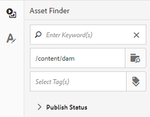
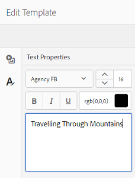
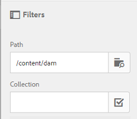

# 资产模板 {#asset-templates}

资产模板是一种特殊的资产类别，有助于快速重新利用数字和打印媒体中视觉上丰富的内容。 资产模板包括固定消息传送部分和可编辑部分两部分。

固定消息部分可以包含专有内容，如品牌徽标和禁用进行编辑的版权信息。 可编辑的部分可以在字段中包含可视内容和文本内容，这些内容可以编辑以自定义消息传送。

在保护全局签名的同时灵活地进行有限的编辑，这使得资产模板非常适合作为各种功能的内容伪像快速调整和分发内容。 重新调整内容用途有助于降低管理打印和数字渠道的成本，并在这些渠道中提供整体一致的体验。

作为营销人员，您可以在AEM Assets中存储和管理模板，并使用单个基本模板轻松创建多个个性化打印体验。 您可以创建各种类型的营销宣传资料，包括小册子、传单、明信片、名片等，以便向客户清晰地传达您的营销信息。 您还可以从现有或新打印输出组合多页打印输出。 最重要的是，您可以轻松地同时提供数字和打印体验，从而为用户提供一致的集成体验。

虽然资产模板大多是InDesign文件，但熟练InDesign并不妨碍创建亮丽的工件。 您无需将InDesign模板的字段与创建目录时需要的产品字段进行映射。 您可以直接在Web界面上以WYSIWYG模式编辑模板。 但是，要InDesign处理您的编辑更改，您必须首先配置AEM Assets以与InDesign服务器集成。

能够从Web界面编辑InDesign模板，有助于促进创意和营销人员之间的更大协作，同时缩短本地促销活动的上市时间。

您可以使用资产模板执行以下操作：

* 从Web界面修改可编辑的模板字段
* 控制文本的基本样式，例如字体大小、样式和标记级别的类型
* 使用内容选取器更改模板中的图像
* 预览模板编辑
* 合并多个模板文件以创建多页对象

当您为宣传资料选择模板时，AEM Assets会创建您可以编辑的模板副本。 原始模板将保留，以确保全局标牌保持不变，并可重复使用以强制保持品牌一致性。

您可以采用以下格式，在父文件夹中导出更新的文件：

* INDD
* PDF
* JPG

您也可以将这些格式的输出下载到本地系统。

## 创建宣传资料{#creating-a-collateral}

假设您想要创建数字可打印宣传资料（如宣传册、传单和广告等），以便在即将开展的活动中进行宣传，并与全球直销店共享。 根据模板创建宣传资料有助于跨渠道提供统一的客户体验。 设计人员可以使用创意解决方案(如InDesign)创建促销活动模板（单页或多页），并为您将模板上传到AEM Assets。 在创建宣传资料之前，请预先将一个或多个INDD模板上传到Experience Manager并提供。

1. 单击或点按AEM徽标，然后单击/点按导航页面上的&#x200B;**[!UICONTROL Assets]**。
1. 从选项中，选择&#x200B;**[!UICONTROL 模板]**。

   

1. 单击/点按&#x200B;**[!UICONTROL 创建]**，然后从菜单中选择要创建的宣传资料。 例如，选择&#x200B;**[!UICONTROL 手册]**。

   

1. 提前将一个或多个INDD模板上传到并提供Experience Manager。 选择手册的模板，然后单击/点按&#x200B;**[!UICONTROL 下一步]**。

   

1. 为手册指定名称和可选描述。

   

1. （可选）单击/点按&#x200B;**[!UICONTROL 标签]**&#x200B;字段旁边的&#x200B;**[!UICONTROL 标签]**&#x200B;图标，然后为手册选择一个或多个标签。 单击/点按&#x200B;**[!UICONTROL Confirm]**&#x200B;以确认您的选择。

   

1. 单击&#x200B;**[!UICONTROL 创建]**。对话框确认创建了新手册。 单击/点按&#x200B;**[!UICONTROL 打开]**&#x200B;以在编辑模式下打开手册。

   

   或者，关闭对话框，然后导航到您开始使用的“模板”页面中的文件夹，以查看您创建的手册。 在卡片视图中，宣传品的类型显示在其缩略图上。 例如，在本例中，“手册”显示在缩略图上。

   

## 编辑宣传资料{#editing-a-collateral}

您可以在创建宣传资料后立即对其进行编辑。 或者，您也可以从模板页面或资产页面中打开该模板。

1. 要打开宣传资料进行编辑，请执行以下操作之一：

   * 打开您在[创建宣传资料](asset-templates.md#creating-a-collateral)步骤7中创建的宣传资料（本例中为手册）。
   * 在“模板”页面中，导航到创建宣传品的文件夹，然后单击/点按宣传品缩览图上的编辑快速操作。
   * 在宣传品的资产页面中，单击/点按工具栏中的编辑图标。
   * 选择宣传品，然后单击/点按工具栏中的编辑图标。

   

   资产查找器和文本编辑器显示在页面左侧。 默认情况下，会打开文本编辑器。

   您可以使用文本编辑器修改要在文本字段中显示的文本。 您可以在标记级别修改字体大小、样式、颜色和类型。

   使用资产查找器，您可以浏览或搜索AEM Assets中的图像，并将模板中可编辑的图像替换为您选择的图像。

   

   可编辑内容将显示在右侧。 要在AEM Assets中编辑字段，模板中的相应字段必须标记为InDesign。 换言之，应将其标记为可在InDesign中编辑。

   

   >[!NOTE]
   >
   >确保将您的AEM实例与InDesign服务器集成，以使AEM Assets能够从InDesign模板提取数据并使其可供编辑。 有关详细信息，请参阅[将AEM Assets与InDesign Server集成](indesign.md)。

1. 要修改可编辑字段中的文本，请单击/点按可编辑字段列表中的文本字段，然后编辑该字段中的文本。

   

   您可以使用提供的选项编辑文本属性，例如字体样式、颜色、大小。

1. 单击/点按&#x200B;**[!UICONTROL 预览]**&#x200B;图标以预览文本更改。

   

1. 要交换图像，请单击/点按&#x200B;**[!UICONTROL 资产查找器]**&#x200B;图标。

   

1. 从可编辑字段列表中选择图像字段，然后将所需图像从资产选取器拖到可编辑的字段。

   

   您还可以使用关键词、标记并根据图像的发布状态来搜索图像。 您可以浏览AEM Assets存储库并导航到所需图像的位置。

   

1. 单击/点按&#x200B;**[!UICONTROL 预览]**&#x200B;图标以预览图像。

   

1. 要编辑多页宣传资料中的特定页面，请使用底部的页面导航器。

   

1. 单击/点按工具栏上的&#x200B;**[!UICONTROL 预览]**&#x200B;图标以预览所有更改。 单击/点按&#x200B;**[!UICONTROL 完成]**&#x200B;以保存对宣传资料的编辑更改。

   >[!NOTE]
   >
   >“预览”和“完成”图标仅在宣传品中可编辑的图像字段没有任何缺失的图标时启用。 如果宣传资料中缺少图标，则是因为AEM无法解析InDesign模板中的图像。 通常，AEM在以下情况下无法解析图像：
   >
   >* 图像未嵌入到基础InDesign模板中
   >* 图像从本地文件系统链接

   >
   >要启用AEM以解析图像，请执行以下操作：
   >
   >* 创建InDesign模板时嵌入图像（请参阅[关于链接和嵌入式图形](https://helpx.adobe.com/indesign/using/graphics-links.html)）。
   >* 将AEM装载到您的本地文件系统，然后将缺失的图标映射到现有AEM资产。

   >
   >有关使用InDesign文档的更多信息，请参阅[在AEM](https://helpx.adobe.com/experience-manager/kb/best-practices-idd-docs-aem.html)中使用InDesign文档的最佳实践。

1. 要为手册生成PDF格式副本，请在对话框中选择Acrobat选项，然后单击&#x200B;**[!UICONTROL 继续]**。
1. 辅助资料会在您开始使用的文件夹中创建。 要查看演绎版，请打开宣传品，然后从GlobalNav列表中选择&#x200B;**[!UICONTROL 演绎版]**。

   

1. 单击/点按演绎版列表中的PDF演绎版，以下载PDF文件。 打开PDF文件以查看宣传资料。

   

## 合并宣传资料{#merge-collateral}

1. 单击或点按&#x200B;**[!UICONTROL 工具>资产]**。
1. 从选项中，选择&#x200B;**[!UICONTROL 模板]**。
1. 单击/点按&#x200B;**[!UICONTROL 创建]** ，然后从菜单中选择&#x200B;**[!UICONTROL 合并]**。

   

1. 在“模板合并”页面中，单击/点按合并图标。

   

1. 导航到要合并的宣传品所在的位置，单击/点按要合并的宣传品缩略图以选择它们。

   

   您甚至可以从OmniSearch框中搜索模板。

   

   您可以浏览AEM Assets存储库或收藏集，导航到所需模板的位置，然后选择要合并的模板。

   

   您可以应用各种过滤器来搜索所需的模板。 例如，您可以根据文件类型或标记搜索模板。

   

1. 单击/点按工具栏中的&#x200B;**[!UICONTROL 下一步]** 。
1. 在&#x200B;**[!UICONTROL 预览并重新排序]**&#x200B;屏幕中，根据需要重新排列模板，并预览要合并的模板选择。 然后，单击/点按工具栏中的&#x200B;**[!UICONTROL 下一步]**。

   

1. 在配置模板屏幕中，指定宣传品的名称。 （可选）指定您认为合适的任何标记。 如果要以PDF格式导出输出，请选择&#x200B;**[!UICONTROL Acrobat(.PDF)]**&#x200B;选项。 默认情况下，宣传资料采用JPG和InDesign格式导出。 要更改多页宣传资料的显示缩略图，请单击/点按&#x200B;**[!UICONTROL 更改缩略图]**。

   

1. 单击/点按&#x200B;**[!UICONTROL 保存]** ，然后单击/点按对话框中的&#x200B;**[!UICONTROL 确定]**&#x200B;以关闭对话框。 多页面辅助资料会在您开始使用的文件夹中创建。

   >[!NOTE]
   >
   >您以后无法编辑合并的宣传资料，也无法使用它创建其他宣传资料。
