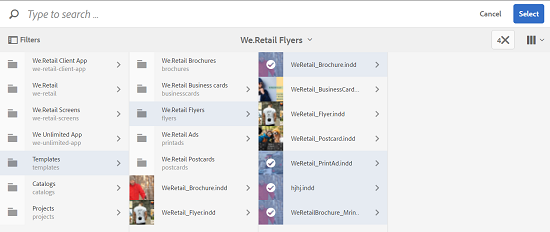

# 资产模板 {#asset-templates}

资产模板是一种特殊的资产类别，它有助于快速为数字和印刷媒体重用视觉效果丰富的内容。 资产模板包括两个部分，即固定消息部分和可编辑部分。

固定消息部分可以包含专有内容，如品牌徽标和禁用进行编辑的版权信息。 可编辑部分可在可编辑以自定义消息的字段中包含可视内容和文本内容。

在保护全局签名的同时灵活地进行有限的编辑，这使得资产模板成为快速调整内容和分发内容的理想构件块，并将其作为各种功能的内容伪像。 内容重用有助于降低管理印刷和数字渠道的成本，并在这些渠道提供全面、一致的体验。

作为营销人员，您可以在AEM Assets存储和管理模板，并使用单个基本模板轻松创建多个个性化的印刷体验。 您可以创建各种类型的营销宣传资料，包括小册子、传单、明信片、名片等，以便向客户清晰地传达您的营销信息。 您还可以从现有或新的打印输出组合多页打印输出。 最重要的是，您可以轻松同时提供数字和印刷体验，为用户提供一致、集成的体验。

虽然资产模板大多为InDesign文件，但熟练InDesign并不妨碍创建明星对象。 您无需将InDesign模板的字段与产品字段进行映射，在创建目录时，您需要这些字段。 您可以直接在Web界面上以WYSIWYG模式编辑模板。 但是，要使InDesign处理编辑更改，您必须先将AEM Assets配置为与InDesign服务器集成。

从Web界面编辑InDesign模板的能力有助于促进创意人员与营销人员之间的更紧密协作，同时缩短本地促销活动的上市时间。

您可以使用资产模板执行以下操作：

* 从Web界面修改可编辑的模板字段
* 控制文本的基本样式，例如字体大小、样式和标记级别的文字
* 使用内容选取器更改模板中的图像
* 预览模板编辑
* 合并多个模板文件以创建多页对象

当您为宣传品选择模板时，AEM Assets会创建可编辑的模板副本。 原始模板将保留，这可确保您的全球标牌保持不变，并可以重复使用，以实现品牌一致性。

可以采用以下格式导出父文件夹内的更新文件：

* INDD
* PDF
* JPG

您还可以将这些格式的输出下载到本地系统。

## 创建宣传资料{#creating-a-collateral}

请考虑您希望为即将到来的活动制作数字可打印宣传品（如小册子、传单和广告）并与全球直销店共享的场景。 根据模板创建宣传资料有助于跨渠道提供统一的客户体验。 设计人员可以使用创意解决方案(如InDesign)创建活动模板（单页或多页），并为您将模板上传到AEM Assets。 在创建宣传品之前，应提前将一个或多个INDD模板上传到Experience Manager并供使用。

1. 单击或点按AEM徽标，然后单击／点按导航页面上的&#x200B;**[!UICONTROL 资产]**。
1. 从选项中，选择&#x200B;**[!UICONTROL 模板]**。

   

1. 单击／点按&#x200B;**[!UICONTROL 创建]**，然后从菜单中选择要创建的宣传品。 例如，选择&#x200B;**[!UICONTROL Brochure]**。

   

1. 提前将一个或多个INDD模板上传到Experience Manager并可用。 为宣传册选择模板，然后单击／点按&#x200B;**[!UICONTROL 下一步]**。

   

1. 指定手册的名称和可选说明。

   

1. （可选）单击／点按&#x200B;**[!UICONTROL 标记]**&#x200B;字段旁边的&#x200B;**[!UICONTROL 标记]**&#x200B;图标，然后为手册选择一个或多个标记。 单击／点按&#x200B;**[!UICONTROL 确认]**&#x200B;以确认您的选择。

   

1. 单击&#x200B;**[!UICONTROL 创建]**。对话框会确认新手册的制作。 单击／点按&#x200B;**[!UICONTROL 打开]**&#x200B;以编辑模式打开宣传册。

   

   或者，关闭对话框并导航到您开始使用的“模板”页面中的文件夹，以视图您创建的小册子。 附属品的类型显示在其缩略图上的卡片视图。 例如，在这种情况下，Brochure会显示在缩略图上。

   

## 编辑宣传资料{#editing-a-collateral}

您可以在创建宣传品后立即对其进行编辑。 或者，也可以从模板页面或资产页面打开它。

1. 要打开要编辑的宣传品，请执行下列操作之一：

   * 打开您在[创建宣传资料](asset-templates.md#creating-a-collateral)的步骤7中创建的宣传资料（本例中为宣传册）。
   * 在“模板”页面中，导航到创建宣传品的文件夹，然后单击／点按宣传品缩略图上的编辑快速操作。
   * 在宣传品的资产页面中，单击／点按工具栏中的编辑图标。
   * 选择宣传品，然后单击／点按工具栏中的编辑图标。

   

   资产查找器和文本编辑器显示在页面左侧。 默认情况下，文本编辑器处于打开状态。

   您可以使用文本编辑器修改要在文本字段中显示的文本。 您可以在标记级别修改字体大小、样式、颜色和文字。

   使用资产查找器，您可以在AEM Assets内浏览或搜索图像，并将模板中的可编辑图像替换为您选择的图像。

   

   可编辑内容显示在右侧。 要在AEM Assets编辑字段，模板中的相应字段必须以InDesign标记。 换言之，它们应当标记为可在InDesign中编辑。

   

   >[!NOTE]
   >
   >确保您的AEM实例与InDesign服务器相集成，使AEM Assets能够从InDesign模板提取数据并使其可供编辑。 有关详细信息，请参阅[将AEM Assets与InDesign Server集成](indesign.md)。

1. 要修改可编辑字段中的文本，请单击／点按可编辑字段列表中的文本字段，然后编辑该字段中的文本。

   

   您可以编辑文本属性，例如字体样式、颜色和大小，使用提供的选项。

1. 单击／点按&#x200B;**[!UICONTROL 预览]**&#x200B;图标以预览文本更改。

   

1. 要交换图像，请单击／点按&#x200B;**[!UICONTROL 资产查找器]**&#x200B;图标。

   

1. 从可编辑字段的列表中选择图像字段，然后将所需图像从资产选取器拖到可编辑字段。

   

   您还可以使用关键字、标记并根据图像的发布状态搜索图像。 您可以浏览AEM Assets存储库并导航到所需图像的位置。

   

1. 单击／点按&#x200B;**[!UICONTROL 预览]**&#x200B;图标以预览图像。

   

1. 要在多页宣传资料中编辑特定页面，请使用底部的页面导航器。

   

1. 单击／点按工具栏上的&#x200B;**[!UICONTROL 预览]**&#x200B;图标以预览所有更改。 单击／点按&#x200B;**[!UICONTROL 完成]**&#x200B;以保存对宣传资料的编辑更改。

   >[!NOTE]
   >
   >只有在宣传品中的可编辑图像字段没有任何缺失的图标时，预览和完成图标才会启用。 如果宣传品中缺少图标，则是因为AEM无法解析InDesign模板中的图像。 通常，AEM在以下情况下无法解析图像：
   >
   >* 图像未嵌入在基础InDesign模板中
   >* 图像从本地文件系统链接

   >
   >要启用AEM解析图像，请执行以下操作：
   >
   >* 创建InDesign模板时嵌入图像（请参阅[关于链接和嵌入图形](https://helpx.adobe.com/indesign/using/graphics-links.html)）。
   >* 将AEM装载到您的本地文件系统，然后将缺少的图标与现有AEM资产进行映射。

   >
   >有关使用InDesign文档的详细信息，请参阅[在AEM](https://helpx.adobe.com/experience-manager/kb/best-practices-idd-docs-aem.html)中使用InDesign文档的最佳实践。

1. 要为手册生成PDF再现，请在对话框中选择“Acrobat”选项，然后单击&#x200B;**[!UICONTROL 继续]**。
1. 附属品会在您开始使用的文件夹中创建。 要视图演绎版，请打开宣传品，然后从GlobalNav列表中选择&#x200B;**[!UICONTROL 演绎版]**。

   

1. 单击／点按演绎版列表中的PDF演绎版，以下载PDF文件。 打开PDF文件以查看宣传资料。

   

## 合并附属品{#merge-collateral}

1. 单击或点按&#x200B;**[!UICONTROL 工具>资产]**。
1. 从选项中，选择&#x200B;**[!UICONTROL 模板]**。
1. 单击／点按&#x200B;**[!UICONTROL 创建]**，然后从菜单中选择&#x200B;**[!UICONTROL 合并]**。

   

1. 在模板合并页面中，单击／点按合并图标。

   

1. 导航到要合并的宣传品所在的位置，单击／点按要合并的宣传品的缩略图以选择它们。

   

   您甚至可以从OmniSearch框中搜索模板。

   

   您可以浏览AEM Assets存储库或集合，导航到所需模板的位置，然后选择它们进行合并。

   

   您可以应用各种过滤器来搜索所需的模板。 例如，您可以根据文件类型或标记搜索模板。

   

1. 单击／点按工具栏中的&#x200B;**[!UICONTROL 下一步]**。
1. 在&#x200B;**[!UICONTROL 预览和重新排序]**&#x200B;屏幕中，根据需要重新排列模板并预览要合并的模板选择。 然后，单击／点按工具栏中的&#x200B;**[!UICONTROL 下一步]**。

   

1. 在“配置模板”屏幕中，指定宣传品的名称。 （可选）指定您认为合适的任何标记。 如果要以PDF格式导出输出，请选择&#x200B;**[!UICONTROL Acrobat(.PDF)]**&#x200B;选项。 默认情况下，辅助材料以JPG和InDesign格式导出。 要更改多页宣传资料的显示缩略图，请单击／点按&#x200B;**[!UICONTROL 更改缩略图]**。

   

1. 单击／点按&#x200B;**[!UICONTROL 保存]**，然后单击／点按对话框中的&#x200B;**[!UICONTROL 确定]**&#x200B;以关闭对话框。 将在您开始使用的文件夹中创建多页宣传资料。

   >[!NOTE]
   >
   >以后不能编辑合并的宣传资料，也不能使用它创建其他宣传资料。

