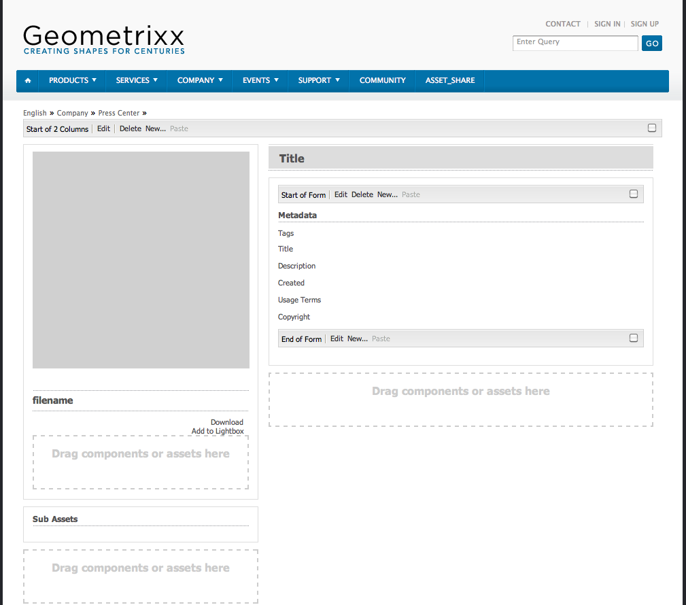
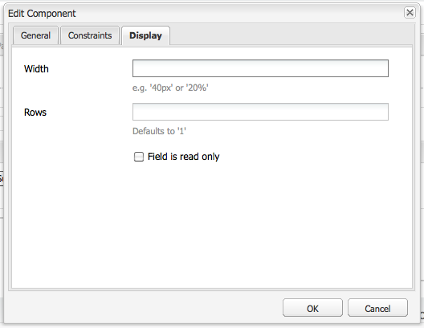
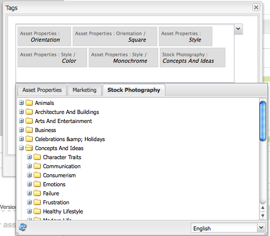

# 创建和配置资产编辑器页面{#creating-and-configuring-asset-editor-pages}

本文档将介绍以下内容：

* 创建自定义资产编辑器页面的原因。
* 如何创建和自定义资产编辑器页面，这些页面是WCM页面，您可以通过它们视图和编辑元数据，以及对资产执行操作。
* 如何同时编辑多个资产。

>[!NOTE]
>
>资产共享可用作开放源代码引用实施。 请参阅[资产共享公域](https://adobe-marketing-cloud.github.io/asset-share-commons/)。 官方不支持。

## 为何要创建和配置资产编辑器页面？{#why-create-and-configure-asset-editor-pages}

数字资产管理正在越来越多的场景中使用。 当从面向受过专业培训的小用户群（如摄影师或分类学者）的小规模解决方案转向更大、更多样化的用户群（如商业用户、WCM作者、记者等）时，面向专业用户的Adobe Experience Manager(AEM)资产的强大用户界面会提供太多信息和利益相关方开始请求特定用户界面或应用程序以访问与其相关的数字资产。

这些以资产为中心的应用程序可以是企业内部网中的简单照片库，员工可以从贸易展访问或面向公众的网站(如随Geometrixx提供的示例)的新闻中心上传照片。 以资产为中心的应用程序还可以扩展到包括购物车、结帐和验证流程在内的完整解决方案。

创建以资产为中心的应用程序在很大程度上成为一个无需编码的配置过程，只需了解用户组及其需求以及所使用元数据的知识。 使用AEM Assets创建的以资产为中心的应用程序具有可扩展性：借助适当的编码工作量，可以创建用于搜索、查看和修改资产的可重用组件。

AEM中以资产为中心的应用程序由资产编辑器页面组成，该页面可用于获取特定资产的详细视图。 资产编辑器页面还允许编辑元数据，前提是访问资产的用户具有必要的权限。

## 创建和配置资产共享页面{#creating-and-configuring-an-asset-share-page}

您可以自定义DAM Finder功能，并创建具有所需所有功能的页面，这些页面称为资产共享页面。 要创建新的资产共享页面，您可以使用Geometrixx资产共享模板添加该页面，然后自定义用户可以对该页面执行的操作，确定查看者如何查看资产，以及决定用户如何构建查询。

以下是创建自定义资产共享页面的一些用例：

* 新闻中心
* 适用于内部企业用户的图像搜索引擎
* 网站用户的图像数据库
* 元数据编辑器的媒体标记界面

### 创建资产共享页面{#creating-an-asset-share-page}

要创建新的资产共享页面，您可以在处理网站时或通过数字资产管理器进行创建。

>[!NOTE]
>
>默认情况下，当您从数字资产管理器中的&#x200B;**New**&#x200B;创建资产共享页面时，系统会自动为您创建资产查看器和资产编辑器。

要在&#x200B;**网站**&#x200B;控制台中创建新的资产共享页面，请执行以下操作：

1. 在&#x200B;**[!UICONTROL 网站]**&#x200B;选项卡中，导航到要创建资产共享页面的位置，然后单击&#x200B;**[!UICONTROL 新建]**。

1. 选择&#x200B;**[!UICONTROL 资产共享]**&#x200B;页面，然后单击&#x200B;**[!UICONTROL 创建]**。 将创建新页面，资产共享页面将列在&#x200B;**[!UICONTROL 网站]**&#x200B;选项卡中。

使用GeometrixxDAM资产共享模板创建的基本页面如下所示：

要自定义资产共享页面，您可以使用Sidekick中的元素，还可以编辑查询生成器属性。 页面&#x200B;**[!UICONTROL Geometrixx按中心]**&#x200B;是基于此模板的页面的自定义版本：

要通过数字资产管理器创建新的资产共享页面，请执行以下操作：

1. 在数字资产管理器的&#x200B;**[!UICONTROL 新建]**&#x200B;中，选择&#x200B;**[!UICONTROL 新建资产共享]**。
1. 在&#x200B;**[!UICONTROL 标题]**&#x200B;中，输入资产共享页面的名称。 如果需要，请输入URL的名称。

   

1. 多次-单击资产共享页面以将其打开并配置页面。

   

   默认情况下，当您从&#x200B;**[!UICONTROL New]**&#x200B;创建资产共享页面时，系统会自动为您创建资产查看器和资产编辑器。

#### 自定义操作{#customizing-actions}

您可以通过一系列预定义操作来确定用户可以对选定数字资产执行的操作。

要向“资产共享”页面添加操作，请执行以下操作：

1. 在要自定义的“资产共享”页面中，单击Sidekick中的&#x200B;**[!UICONTROL 操作]**。

   可以执行以下操作：
   

| 操作 | 描述 |
|---|---|
| [!UICONTROL 删除操作] | 用户可以删除选定的资产。 |
| [!UICONTROL 下载操作] | 允许用户将选定资产下载到其计算机。 |
| [!UICONTROL Lightbox 操作] | 将资产保存到“Lightbox”   您可以在其中对其执行其他操作。 这在工作时很方便   跨多个页面处理资产。 Lightbox还可用作   资产购物车。 |
| [!UICONTROL 移动操作] | 用户可以将资产移动到其他资产   位置 |
| [!UICONTROL 标记操作] | 允许用户向选定资产添加标记 |
| [!UICONTROL 查看资产操作] | 在资产编辑器中打开资产   用户操作。 |

1. 将相应的操作拖至页面上的&#x200B;**Actions**&#x200B;区域。 这样做会创建用于执行该操作的按钮。

   

#### 确定如何显示搜索结果{#determining-how-search-results-are-presented}

通过预定义的镜头列表确定结果的显示方式。

要更改查看搜索结果的方式：

1. 在要自定义的资产共享页面中，单击&#x200B;**[!UICONTROL 搜索]**。

   

1. 将相应的镜头拖动到页面的顶部中心。 在新闻中心，镜头已可用。 用户按相应的镜头图标以根据需要显示搜索结果。

可使用以下镜头：

| 镜头 | 描述 |
|---|---|
| **[!UICONTROL 列出镜头]** | 以列表方式显示资产并提供详细信息。 |
| **[!UICONTROL 马赛克镜头]** | 以马赛克风格展示资产。 |

#### 马赛克镜头 {#mosaic-lens}

#### 列出镜头 {#list-lens}

#### 自定义查询生成器{#customizing-the-query-builder}

查询构建器允许您输入搜索词并为资产共享页面创建内容。 编辑查询生成器时，您还可以确定每页显示的搜索结果数，在您多次单击资产时打开的资产编辑器、查询搜索的路径以及自定义节点类型。

要自定义查询生成器，请执行以下操作：

1. 在要自定义的“资产共享”页面中，单击查询生成器中的&#x200B;**[!UICONTROL 编辑]**。 默认情况下，**[!UICONTROL “常规”]**&#x200B;选项卡打开。

1. 选择每页的结果数、资产编辑器的路径（如果您有自定义的资产编辑器）和操作标题。

   

1. 单击&#x200B;**[!UICONTROL 路径]**&#x200B;选项卡。 输入要运行搜索的一个或多个路径。 如果用户使用“路径”谓词，则这些路径将被覆盖。

   

1. 根据需要输入其他节点类型。

1. 在&#x200B;**[!UICONTROL 查询生成器URL]**&#x200B;字段中，您可以覆盖或环绕查询生成器，并使用现有查询生成器组件输入新的servlet URL。 在&#x200B;**[!UICONTROL 源URL]**&#x200B;字段中，您也可以覆盖源URL。

   

1. 在&#x200B;**[!UICONTROL 文本]**&#x200B;字段中，输入要显示的结果文本和结果页码。 完成更改后，单击&#x200B;**[!UICONTROL 确定]**。

   

#### 添加谓词{#adding-predicates}

AEM Assets包含许多谓词，您可以将其添加到“资产共享”页面。 这样，用户就可以进一步缩小搜索范围。 在某些情况下，它们可能会覆盖查询生成器参数（例如，“路径”参数）。

要添加谓词，请执行以下操作：

1. 在要自定义的资产共享页面中，单击&#x200B;**[!UICONTROL 搜索]**。

   

1. 将相应的谓词拖到查询生成器下的“资产共享”页面。 这样做会创建相应的字段。

   

   以下谓词可用：

| 谓词 | 描述 |
|---|---|
| **[!UICONTROL 日期谓词]** | 允许用户搜索在特定日期前后修改过的资产。 |
| **[!UICONTROL 选项谓词]** | 站点所有者可以指定要搜索的属性（如属性谓词中的属性，如cq:tags）和要从中填充选项的内容树（如标记树）。 这样做会生成一列表选项，用户可以在这些选项中选择选定属性（标记属性）应具有的值（标记）。 此谓词允许您构建列表控件，如标签的列表、文件类型、图像方向等。 它适用于一组固定选项。 |
| **[!UICONTROL 路径谓词]** | 允许用户根据需要定义路径和子文件夹。 |
| **[!UICONTROL 属性谓词]** | 站点所有者指定要搜索的属性，如tiff:ImageLength，然后用户可以输入一个值，如800。这将返回所有高800像素的图像。 此谓词对于您的属性可以具有任意值很有用。 |

有关详细信息，请参阅[谓词javadocs](https://helpx.adobe.com/experience-manager/6-4/sites/developing/using/reference-materials/javadoc/com/day/cq/search/eval/package-summary.html)。

1. 要进一步配置谓词，请多次单击该谓词。 例如，打开路径谓词时，需要分配根路径。

   

## 创建和配置资产编辑器页面{#creating-and-configuring-an-asset-editor-page}

您可以自定义资产编辑器，以确定用户如何视图和编辑数字资产。 为此，您需要创建一个新的“资产编辑器”页面，然后自定义视图以及用户可以对该页面执行的操作。

>[!NOTE]
>
>如果要向DAM资产编辑器添加自定义字段，请向`/apps/dam/content/asseteditors.`添加新cq:Widget节点

### 创建“资产编辑器”页面{#creating-the-asset-editor-page}

创建资产编辑器页面时，最好在资源共享页面的正下方创建该页面。

要创建资产编辑器页面，请执行以下操作：

1. 在&#x200B;**[!UICONTROL 网站]**&#x200B;选项卡中，导航到要创建资产编辑器页面的位置，然后单击&#x200B;**[!UICONTROL 新建]**。

1. 选择&#x200B;**[!UICONTROL Geometrixx资产编辑器]**&#x200B;并单击&#x200B;**[!UICONTROL 创建]**。 将创建新页面，该页面将列在&#x200B;**[!UICONTROL 网站]**&#x200B;选项卡中。

使用Geometrixx资产编辑器模板创建的基本页面如下所示：

要自定义资产编辑器页面，请使用Sidekick中的元素。 从&#x200B;**[!UICONTROL Geometrixx新闻中心]**&#x200B;访问的资产编辑器页面是基于此模板的自定义页面版本：

#### 设置从资产共享页面{#setting-which-asset-editor-opens-from-an-asset-share-page}打开的资产编辑器

在创建自定义资产编辑器页面后，您需要确保在多次单击您创建的自定义资产共享的资产时，会在自定义编辑器页面中打开资产。

要设置“资产编辑器”页面，请执行以下操作：

1. 在“资产共享”页面中，单击查询生成器旁边的&#x200B;**[!UICONTROL 编辑]**。

   

1. 如果尚未选择&#x200B;**[!UICONTROL 常规]**&#x200B;选项卡，请单击它。

1. 在资产编辑器的&#x200B;**[!UICONTROL 路径]**&#x200B;字段中，输入您希望资产共享页面在中打开资产的资产编辑器的路径，然后单击&#x200B;**[!UICONTROL 确定]**。

   

#### 添加资产编辑器组件{#adding-asset-editor-components}

您可以通过向页面添加组件来确定资产编辑器具有哪些功能。

要添加资产编辑器组件，请执行以下操作：

1. 在要自定义的“资产编辑器”页面中，在Sidekick中选择&#x200B;**[!UICONTROL 资产编辑器]**。 将显示所有可用的资产编辑器组件。

   >[!NOTE]
   >
   >您可以自定义的内容取决于可用的组件。 要启用组件，请转至“设计”模式，然后选择需要启用的组件。

1. 将组件从Sidekick拖动到资产编辑器，并在组件对话框中进行任何修改。 下表对这些组件进行了说明，并在随后的详细说明中进行了说明。

   >[!NOTE]
   >
   >在设计资产编辑器页面时，您可以创建只读或可编辑的组件。 用户知道，如果铅笔的图像出现在该组件中，则可以编辑该字段。 默认情况下，大多数组件都设置为只读。

   | 组件 | 描述 |
   |---|---|
   | **[!UICONTROL 元数据] 格式和 [!UICONTROL 元数据文本字段]** | 允许您向资产添加其他元数据，并对该资产执行操作（如提交）。 |
   | **[!UICONTROL 子资产]** | 允许您自定义子资产。 |
   | **标记** | 允许用户选择标记并将其添加到资产。 |
   | **[!UICONTROL 缩略图]** | 显示资产的缩略图及其文件名，并允许您添加替代文本。 您还可以在此处添加资产编辑器操作。 |
   | **[!UICONTROL 标题]** | 显示可自定义的资产标题。 |

   

#### 元数据表单和文本字段——配置视图元数据组件{#metadata-form-and-text-field-configuring-the-view-metadata-component}

元数据表单是包含开始和结束操作的表单。 在中间输入&#x200B;**[!UICONTROL Text]**&#x200B;字段。 有关使用表单的详细信息，请参见[Forms](../sites-authoring/default-components.md)。

1. 通过单击表单的开始区域中的&#x200B;**[!UICONTROL 编辑]**&#x200B;创建开始操作。 如果需要，可以输入Box标题。 默认情况下，Box标题为&#x200B;**[!UICONTROL Metadata]**。 如果希望生成验证的java脚本客户端代码，请选中“客户端验证”复选框。

   

1. 通过单击表单的“结束”区域中的&#x200B;**[!UICONTROL 编辑]**，创建“结束”操作。 例如，您可能希望创建一个&#x200B;**[!UICONTROL Submit]**&#x200B;按钮，以允许用户提交其元数据更改。 或者，您可以添加将元数据重置为其原始状态的&#x200B;**[!UICONTROL 重置]**&#x200B;按钮。

   

1. 在&#x200B;**[!UICONTROL 表单开始符]**&#x200B;和&#x200B;**表单结尾**&#x200B;之间，将元数据文本字段拖动到表单。 用户将元数据填充到这些文本字段中，他们可以提交或完成其他操作。

1. 多次-单击字段名称，例如&#x200B;**标题**&#x200B;以打开元数据字段并进行更改。 在[!UICONTROL 编辑组件]窗口的&#x200B;**[!UICONTROL 常规]**&#x200B;选项卡中，您定义命名空间和字段标签以及类型，例如`dc:title`。

   

   有关修改元数据表单中可用命名空间的信息，请参阅[自定义和扩展AEM Assets](extending-assets.md)。

1. 单击&#x200B;**[!UICONTROL 约束]**&#x200B;选项卡。 您可以在此选择字段是否为必填字段，并根据需要添加任何约束。

   

1. 单击&#x200B;**[!UICONTROL 显示]**&#x200B;选项卡。 在此，您可以为元数据字段输入新的宽度和行数。 选中&#x200B;**字段为只读**&#x200B;复选框，以允许用户编辑元数据。

   

   以下是包含各种字段的元数据表单的示例：

   

在“资产编辑器”页面上，用户随后可以在元数据字段中输入值（如果可编辑）并执行结束操作（例如，提交更改）。

#### 子资产 {#sub-assets}

子资产组件是您可以视图和选择子资产的位置。 您可以确定[主资产](assets.md#what-are-digital-assets)和子资产下显示的名称。

多次-单击子资产组件以打开子资产对话框，您可以在该对话框中更改主资产和任何子资产的标题。 默认值显示在相应字段的下方。

以下是已填充子资产组件的示例：

例如，如果您选择了子资产，请注意组件如何显示相应的页面以及框标题从子资产更改为同级。

#### 标记 {#tags}

标记组件是一个组件，用户可以在该组件中为资产分配现有标记，这有助于以后的组织和检索。 您可以使此组件为只读，因此用户无法添加标记，而只能视图标记。

多次-单击标记组件以打开标记对话框，您可以根据需要从标记中更改标题，也可以选择已分配的命名空间。 要使此字段可编辑，请清除“隐藏编辑”按钮复选框。 ****&#x200B;默认情况下，标记是可编辑的。

如果用户可以编辑标记，则可以单击铅笔，通过从“标记”下拉菜单中选择标记来添加标记。

以下是已填充的标记组件：

#### 缩略图 {#thumbnail}

缩略图组件是资产显示选定缩略图的位置（对于许多格式，缩略图会自动提取）。 此外，该组件还显示文件名以及可修改的[操作。](assets-finder-editor.md#adding-asset-editor-actions)

多次-单击缩略图组件以打开缩略图对话框，在该对话框中可以更改替代文本。 默认情况下，缩略图alt文本默认为&#x200B;**[!UICONTROL 单击以下载]**&#x200B;资产。

以下是已填充的缩略图组件的示例：

#### 标题 {#title}

标题组件显示资产的标题和说明。

默认情况下，它处于只读模式，因此用户无法编辑它。 要使其可编辑，请多次单击组件并清除&#x200B;**隐藏编辑按钮**&#x200B;复选框。 此外，为多个资产输入标题。

如果可以编辑标题，则可以通过单击铅笔打开&#x200B;**资产属性**&#x200B;窗口来添加标题和说明。 此外，您还可以通过选择日期和时间来打开和关闭资产。

当用户通过单击铅笔图标编辑标题时，他们可以更改&#x200B;**标题**、**说明**，然后输入&#x200B;**开启**&#x200B;和&#x200B;**关闭时间**&#x200B;以打开和关闭资产。

以下是已填充标题组件的示例：

#### 添加资产编辑器操作{#adding-asset-editor-actions}

您可以通过一系列预定义操作来确定用户可以对选定数字资产执行的操作。

要向“资产编辑器”页面添加操作，请执行以下操作：

1. 在要自定义的“资产编辑器”页面中，单击Sidekick中的&#x200B;**[!UICONTROL 资产编辑器]**。 

   

   可以执行以下操作：

   | 操作 | 描述 |
   |---|---|
   | [!UICONTROL 下载] | 允许用户下载所选内容   资源。 |
   | [!UICONTROL 编辑者] | 允许用户编辑图像   （交互式编辑） |
   | [!UICONTROL Lightbox] | 将资源保存到   “lightbox”，您可以在其中对其执行其他操作。 这就来了   在跨多个页面处理资产时非常方便。 |
   | [!UICONTROL 锁定] | 允许用户锁定资产。 此   默认情况下未启用功能，需要在列表中启用   组件。 |
   | [!UICONTROL 引用] | 单击此图标可显示哪些页面   资产正在被使用。 |
   | [!UICONTROL 版本控制] | 允许您创建和恢复   资产的版本。 |

1. 将相应的操作拖至页面上的&#x200B;**Actions**&#x200B;区域。 这样做会创建用于执行该操作的按钮。

## 使用“资产编辑器”页面{#multi-editing-assets-with-the-asset-editor-page}编辑多个资产

借助AEM Assets，您可以同时更改多个资产。 在选定资产后，您可以同时更改其：

* 标记
* 元数据

要使用“资产编辑器”页面对资产进行多次编辑，请执行以下操作：

1. 打开Geometrixx **[!UICONTROL 按中心]**&#x200B;页，地址为`http://localhost:4502/content/geometrixx/en/company/press.html`。
1. 选择资产：

   * 在Windows上：`Ctrl + click`每个资产。
   * 在Mac上：`Cmd + click`每个资产。

   要选择资产范围，请执行以下操作：单击第一个资产，然后单击最后一个资产`Shift + click`。

1. 在&#x200B;**操作**&#x200B;字段（页面的左侧部分）中单击&#x200B;**[!UICONTROL 编辑元数据]**。

1. Geometrixx **[!UICONTROL 按中心资产编辑器]**&#x200B;将在新选项卡中打开。 资产的元数据会按如下方式显示：

   * 标记不适用于所有资产，但仅适用于少数几个资产，以斜体显示。
   * 应用于所有资产的标记会以普通字体显示。
   * 除标记之外的元数据：仅当所有选定资产的值相同时，才会显示字段的值。

1. 单击&#x200B;**[!UICONTROL 下载]**&#x200B;以下载包含资产原始演绎版的ZIP文件。
1. 单击&#x200B;**[!UICONTROL 标记]**&#x200B;字段旁边的铅笔图标以编辑标记：

   * 并不适用于所有资产，但只适用于少数资产的标记具有灰色背景。
   * 应用于所有资源的标记具有白色背景。

   您可以：

   * 单击`x`图标以删除所有资产的标记。
   * 单击`+`图标以将标记添加到所有资产。
   * 单击`arrow`并选择一个标记，以向所有资产添加新标记。

   单击&#x200B;**[!UICONTROL 确定]**&#x200B;将更改写入表单。 将自动选中&#x200B;**标记**&#x200B;字段旁边的框。

1. 编辑“说明”字段。 例如，将其设置为：`This is a common description`。 编辑字段时，其值会在提交表单时覆盖选定资产的现有值。 编辑字段时，将自动选中该字段旁边的框。

   `This is a common description`

   编辑字段时，其值会在提交表单时覆盖选定资产的现有值。

   注意：编辑字段时，将自动选中该字段旁边的框。

1. 单击&#x200B;**[!UICONTROL 更新元数据]**&#x200B;以提交表单并保存对所有资产所做的更改。 只修改选定的元数据。
