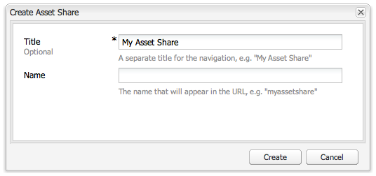
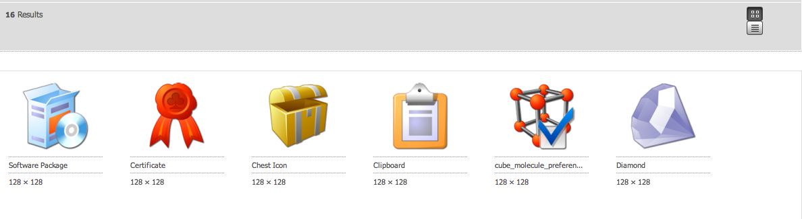
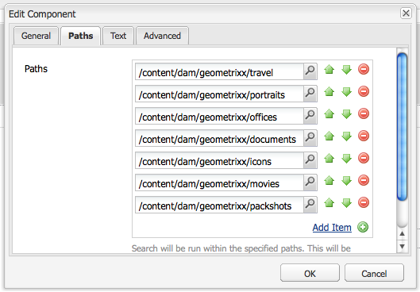

# 创建和配置资产编辑器页面 {#creating-and-configuring-asset-editor-pages}

本文档将介绍以下内容：

* 创建自定义资产编辑器页面的原因。
* 如何创建和自定义资产编辑器页面，这些页面是WCM页面，您可以通过这些页面查看和编辑元数据，以及对资产执行操作。
* 如何同时编辑多个资产。

>[!NOTE]
>
>资产共享可用作开源引用实施。 请参阅[资产共享共用](https://adobe-marketing-cloud.github.io/asset-share-commons/) 。 它不受官方支持。

## 为何要创建和配置资产编辑器页面？ {#why-create-and-configure-asset-editor-pages}

数字资产管理正在越来越多地使用。 当专业用户从小规模解决方案（面向专业培训用户群，例如摄影师或分类学家）转移到更大、更多样的用户组（例如业务用户、WCM作者、记者等）时，专业用户的[!DNL Adobe Experience Manager Assets]强大的用户界面可能会提供太多信息，而利益相关方开始请求特定的用户界面或应用程序访问与他们相关的数字资产。

这些以资产为中心的应用程序可以是内联网中的简单照片库，员工可以从贸易展访问上传照片，也可以在面向公众的网站(如随Geometrixx提供的示例)中的新闻中心上传照片。 以资产为中心的应用程序还可以扩展到包括购物车、结帐和验证流程在内的完整解决方案。

创建以资产为中心的应用程序在很大程度上成为一种不需要编码的配置过程，只需了解用户组及其需求以及所使用元数据的知识即可。 使用[!DNL Assets]创建的以资产为中心的应用程序具有可扩展性：通过适当的编码工作，可以创建用于搜索、查看和修改资产的可重复使用组件。

[!DNL Experience Manager]中以资产为中心的应用程序包含资产编辑器页面，该页面可用于获取特定资产的详细视图。 资产编辑器页面还允许编辑元数据，前提是访问资产的用户具有必要的权限。

## 创建和配置资产共享页面 {#creating-and-configuring-an-asset-share-page}

您可以自定义DAM查找器功能，并创建具有所需所有功能的页面（称为资产共享页面）。 要创建新的“Geometrixx共享”页面，您可以使用资产共享模板添加该页面，然后自定义用户可以在该页面上执行的操作，确定查看者如何查看资产，并决定用户如何构建查询。

以下是创建自定义资产共享页面的一些用例：

* 记者新闻中心
* 面向内部企业用户的图像搜索引擎
* 网站用户的图像数据库
* 元数据编辑器的媒体标记界面

### 创建资产共享页面 {#creating-an-asset-share-page}

要创建新的资产共享页面，您可以在您在网站上工作时创建该页面，也可以从数字资产管理器创建该页面。

>[!NOTE]
>
>默认情况下，当您从数字资产管理器中的&#x200B;**New**&#x200B;创建资产共享页面时，系统会自动为您创建资产查看器和资产编辑器。

要在&#x200B;**网站**&#x200B;控制台中创建新的资产共享页面，请执行以下操作：

1. 在&#x200B;**[!UICONTROL 网站]**&#x200B;选项卡中，导航到要创建资产共享页面的位置，然后单击&#x200B;**[!UICONTROL 新建]**。

1. 选择&#x200B;**[!UICONTROL 资产共享]**&#x200B;页面，然后单击&#x200B;**[!UICONTROL 创建]**。 随即会创建新页面，资产共享页面会列在&#x200B;**[!UICONTROL 网站]**&#x200B;选项卡中。

使用GeometrixxDAM资产共享模板创建的基本页面如下所示：

要自定义资产共享页面，您既可以使用Sidekick中的元素，也可以编辑查询生成器属性。 页面&#x200B;**[!UICONTROL Geometrixx中心]**&#x200B;是基于此模板的页面的自定义版本：

要通过数字资产管理器创建新的资产共享页面，请执行以下操作：

1. 在数字资产管理器的&#x200B;**[!UICONTROL New]**&#x200B;中，选择&#x200B;**[!UICONTROL New Asset Share]**。
1. 在&#x200B;**[!UICONTROL 标题]**&#x200B;中，输入资产共享页面的名称。 如果需要，请输入URL的名称。

   

1. 双击资产共享页面以将其打开并配置页面。

   

   默认情况下，当您从&#x200B;**[!UICONTROL New]**&#x200B;创建“资产共享”页面时，系统会自动为您创建资产查看器和资产编辑器。

#### 自定义操作 {#customizing-actions}

您可以通过一系列预定义操作来确定用户可对选定的数字资产执行的操作。

要向“资产共享”页面添加操作，请执行以下操作：

1. 在要自定义的资产共享页面中，单击Sidekick中的&#x200B;**[!UICONTROL 操作]**。

   可以执行以下操作：
   

| 操作 | 描述 |
|---|---|
| [!UICONTROL 删除操作] | 用户可以删除选定的资产。 |
| [!UICONTROL 下载操作] | 允许用户将选定资产下载到其计算机。 |
| [!UICONTROL Lightbox 操作] | 将资产保存到“Lightbox”   您可以在其中对其执行其他操作。 这在工作时会很方便   跨多个页面使用资产。 灯箱还可用作   资产的购物车。 |
| [!UICONTROL 移动操作] | 用户可以将资产移动到其他资产   位置 |
| [!UICONTROL 标记操作] | 允许用户向选定资产添加标记 |
| [!UICONTROL 查看资产操作] | 在资产编辑器中为   用户操作。 |

1. 将相应的操作拖到页面上的&#x200B;**Actions**&#x200B;区域。 这样做会创建一个用于执行该操作的按钮。

   

#### 确定如何显示搜索结果 {#determining-how-search-results-are-presented}

从预定义的镜头列表中确定结果的显示方式。

要更改查看搜索结果的方式，请执行以下操作：

1. 在要自定义的资产共享页面中，单击&#x200B;**[!UICONTROL 搜索]**。

   

1. 将相应的镜头拖到页面的顶部中心。 在“Press Center（按压中心）”中，镜头已可用。 用户按相应的镜头图标以根据需要显示搜索结果。

提供以下镜头：

| 镜头 | 描述 |
|---|---|
| **[!UICONTROL 列出镜头]** | 以列表方式显示资产及其详细信息。 |
| **[!UICONTROL 马赛克镜头]** | 以马赛克方式展示资产。 |

#### 马赛克镜头 {#mosaic-lens}

#### 列出镜头 {#list-lens}

#### 自定义查询生成器 {#customizing-the-query-builder}

通过查询生成器，您可以输入搜索词并为“资产共享”页面创建内容。 在编辑查询生成器时，您还可以确定每页显示的搜索结果数量、在双击资产时打开的资产编辑器、查询搜索的路径以及自定义节点类型。

要自定义查询生成器，请执行以下操作：

1. 在要自定义的资产共享页面中，单击查询生成器中的&#x200B;**[!UICONTROL 编辑]**。 默认情况下，将打开&#x200B;**[!UICONTROL General]**&#x200B;选项卡。

1. 选择每页的结果数、资产编辑器的路径（如果您有自定义的资产编辑器）和操作标题。

   

1. 单击&#x200B;**[!UICONTROL 路径]**&#x200B;选项卡。 输入一个或多个将运行搜索的路径。 如果用户使用“路径”谓词，则会覆盖这些路径。

   

1. 如果需要，请输入其他节点类型。

1. 在&#x200B;**[!UICONTROL 查询生成器URL]**&#x200B;字段中，您可以覆盖或隐藏查询生成器，并使用现有的查询生成器组件输入新的servlet URL。 在&#x200B;**[!UICONTROL 信息源URL]**&#x200B;字段中，您还可以覆盖信息源URL。

   

1. 在&#x200B;**[!UICONTROL Text]**&#x200B;字段中，输入要显示的结果文本和结果页码。 完成更改后，单击&#x200B;**[!UICONTROL 确定]**。

   

#### 添加谓词 {#adding-predicates}

[!DNL Experience Manager Assets] 包括可添加到“资产共享”页面的多个谓词。这样，您的用户就可以进一步缩小搜索范围。 在某些情况下，它们可能会覆盖查询生成器参数(例如，Path（路径）参数)。

要添加谓词，请执行以下操作：

1. 在要自定义的资产共享页面中，单击&#x200B;**[!UICONTROL 搜索]**。

   

1. 将相应的谓词拖到查询生成器下的资产共享页面中。 这样做会创建相应的字段。

   

   以下谓词可用：

| 谓词 | 描述 |
|---|---|
| **[!UICONTROL 日期谓词]** | 允许用户搜索在特定日期之前和之后修改的资产。 |
| **[!UICONTROL 选项谓词]** | 站点所有者可以指定要搜索的属性（如属性谓词中的cq:tags）和用于从中填充选项的内容树（例如标记树）。 这样做会生成一个选项列表，用户可以在其中选择选定属性（标记属性）应具有的值（标记）。 此谓词允许您生成列表控件，如标记列表、文件类型、图像方向等。 它非常适用于一组固定的选项。 |
| **[!UICONTROL 路径谓词]** | 允许用户根据需要定义路径和子文件夹。 |
| **[!UICONTROL 属性谓词]** | 网站所有者指定要搜索的属性（如tiff:ImageLength），然后用户可以输入一个值（如800）。这会返回所有高度为800像素的图像。 如果您的属性可以具有任意值，则此谓词非常有用。 |

有关更多信息，请参阅[谓词javaocs](https://helpx.adobe.com/experience-manager/6-4/sites/developing/using/reference-materials/javadoc/com/day/cq/search/eval/package-summary.html)。

1. 要进一步配置谓词，请双击该谓词。 例如，打开“路径谓词”时，需要分配根路径。

   

## 创建和配置资产编辑器页面 {#creating-and-configuring-an-asset-editor-page}

您可以自定义资产编辑器，以确定用户如何查看和编辑数字资产。 为此，您需要创建一个新的资产编辑器页面，然后自定义用户在该页面上可执行的视图和操作。

>[!NOTE]
>
>如果要向DAM资产编辑器添加自定义字段，请向`/apps/dam/content/asseteditors.`添加新的cq:Widget节点

### 创建资产编辑器页面 {#creating-the-asset-editor-page}

创建资产编辑器页面时，最佳做法是将页面创建到资产共享页面的正下方。

要创建资产编辑器页面，请执行以下操作：

1. 在&#x200B;**[!UICONTROL 网站]**&#x200B;选项卡中，导航到要创建资产编辑器页面的位置，然后单击&#x200B;**[!UICONTROL 新建]**。

1. 选择&#x200B;**[!UICONTROL Geometrixx资产编辑器]**，然后单击&#x200B;**[!UICONTROL 创建]**。 随即会创建新页面，并且该页面会列在&#x200B;**[!UICONTROL 网站]**&#x200B;选项卡中。

使用Geometrixx资产编辑器模板创建的基本页面如下所示：

要自定义资产编辑器页面，请使用Sidekick中的元素。 从&#x200B;**[!UICONTROL Geometrixx按键中心]**&#x200B;访问的资产编辑器页面是基于此模板的页面自定义版本：

#### 设置从资产共享页面中打开的资产编辑器 {#setting-which-asset-editor-opens-from-an-asset-share-page}

创建自定义资产编辑器页面后，您需要确保在双击您创建的自定义资产共享时，在自定义编辑器页面中打开资产。

要设置资产编辑器页面，请执行以下操作：

1. 在“资产共享”页面中，单击查询生成器旁边的&#x200B;**[!UICONTROL 编辑]**。

   

1. 如果尚未选择&#x200B;**[!UICONTROL 常规]**&#x200B;选项卡，请单击该选项卡。

1. 在&#x200B;**[!UICONTROL 资产编辑器的路径]**&#x200B;字段中，输入您希望资产共享页面在中打开资产的资产编辑器的路径，然后单击&#x200B;**[!UICONTROL 确定]**。

   

#### 添加资产编辑器组件 {#adding-asset-editor-components}

您可以通过向页面添加组件来确定资产编辑器具有的功能。

要添加资产编辑器组件，请执行以下操作：

1. 在要自定义的资产编辑器页面中，选择Sidekick中的&#x200B;**[!UICONTROL 资产编辑器]**。 将显示所有可用的资产编辑器组件。

   >[!NOTE]
   >
   >您可以自定义的内容取决于可用的组件。 要启用组件，请转到设计模式，然后选择需要启用的组件。

1. 将组件从Sidekick拖动到资产编辑器，并在组件对话框中进行任何修改。 下表对这些组件进行了描述，并在后面的详细说明中进行了描述。

   >[!NOTE]
   >
   >设计资产编辑器页面时，您可以创建只读或可编辑的组件。 用户知道，如果某个组件中出现铅笔图像，则可以编辑该字段。 默认情况下，大多数组件都设置为只读。

   | 组件 | 描述 |
   |---|---|
   | **[!UICONTROL 元数] 据格式 [!UICONTROL 和元数据文本字段]** | 允许您向资产添加其他元数据，并对该资产执行诸如提交之类的操作。 |
   | **[!UICONTROL 子资产]** | 允许您自定义子资产。 |
   | **标记** | 允许用户选择标记并将其添加到资产。 |
   | **[!UICONTROL 缩略图]** | 显示资产的缩略图及其文件名，并允许您添加替换文本。 您也可以在此处添加资产编辑器操作。 |
   | **[!UICONTROL 标题]** | 显示资产标题，该标题可进行自定义。 |

   

#### 元数据表单和文本字段 — 配置查看元数据组件 {#metadata-form-and-text-field-configuring-the-view-metadata-component}

元数据表单是一个包含开始和结束操作的表单。 在中间，输入&#x200B;**[!UICONTROL 文本]**&#x200B;字段。 有关使用表单的更多信息，请参阅[Forms](../sites-authoring/default-components.md)。

1. 通过单击表单“开始”区域中的&#x200B;**[!UICONTROL 编辑]**&#x200B;创建开始操作。 如有需要，您可以输入框标题。 默认情况下，框标题为&#x200B;**[!UICONTROL Metadata]**。 如果希望生成用于验证的java-script客户端代码，请选中客户端验证复选框。

   

1. 通过单击表单“结束”区域中的&#x200B;**[!UICONTROL 编辑]**&#x200B;创建“结束”操作。 例如，您可能希望创建一个&#x200B;**[!UICONTROL Submit]**&#x200B;按钮，以允许用户提交其元数据更改。 或者，您也可以添加将元数据重置为其原始状态的&#x200B;**[!UICONTROL Reset]**&#x200B;按钮。

   

1. 在&#x200B;**[!UICONTROL 表单开始]**&#x200B;和&#x200B;**表单结束**&#x200B;之间，将元数据文本字段拖动到表单。 用户将元数据填充到这些文本字段中，以便提交或完成其他操作。

1. 双击字段名称，例如&#x200B;**Title**&#x200B;以打开元数据字段并进行更改。 在[!UICONTROL 编辑组件]窗口的&#x200B;**[!UICONTROL 常规]**&#x200B;选项卡中，您可以定义命名空间和字段标签以及类型，例如`dc:title`。

   

   有关修改元数据表单中可用的命名空间的信息，请参阅[自定义和扩展 [!DNL Assets]](extending-assets.md)。

1. 单击&#x200B;**[!UICONTROL Constraints]**&#x200B;选项卡。 在此，您可以选择字段是否为必填字段，并在必要时添加任何约束。

   

1. 单击&#x200B;**[!UICONTROL Display]**&#x200B;选项卡。 在此，您可以为元数据字段输入新的宽度和行数。 选中&#x200B;**字段为只读**&#x200B;复选框，允许用户编辑元数据。

   

   以下是包含各种字段的元数据表单的示例：

   

然后，在资产编辑器页面上，用户可以在元数据字段中输入值（如果可编辑）并执行结束操作（例如，提交更改）。

#### 子资产 {#sub-assets}

您可以在子资产组件中查看和选择子资产。 您可以确定[主资产](assets.md#what-are-digital-assets)和子资产下显示的名称。

双击子资产组件以打开子资产对话框，您可以在该对话框中更改主资产和任何子资产的标题。 默认值显示在相应字段的下方。

以下是填充的子资产组件示例：

例如，如果您选择了子资产，请注意组件如何显示相应的页面，以及框标题如何从子资产更改为同级资产。

#### 标记 {#tags}

“标记”组件是一个组件，用户可以在其中将现有标记分配给资产，这有助于以后进行组织和检索。 您可以将此组件设为只读，因此用户无法添加标记，而只能查看它们。

双击标记组件以打开标记对话框，根据需要，您可以在该对话框中从标记更改标题，以及在该对话框中选择已分配的命名空间。 要使此字段可编辑，请清除&#x200B;**隐藏编辑**&#x200B;按钮复选框。 默认情况下，标记是可编辑的。

如果用户可以编辑标记，则他们可以单击铅笔图标以添加标记，方法是从“标记”下拉菜单中选择标记。

以下是已填充的标记组件：

#### 缩略图 {#thumbnail}

缩略图组件是资产显示选定缩略图的位置（对于许多格式，缩略图会自动提取）。 此外，该组件还显示文件名以及可修改](assets-finder-editor.md#adding-asset-editor-actions)的[操作。

双击缩略图组件以打开缩略图对话框，您可以在该对话框中更改替换文本。 默认情况下，缩略图替换文本默认为&#x200B;**[!UICONTROL 单击以下载]**&#x200B;资产。

以下是填充的缩略图组件示例：

#### 标题 {#title}

标题组件显示资产的标题和描述。

默认情况下，该选件处于只读模式，因此用户无法对其进行编辑。 要使其可编辑，请双击该组件并清除&#x200B;**隐藏编辑按钮**&#x200B;复选框。 此外，还为多个资产输入标题。

如果可以编辑标题，则可以通过单击铅笔打开&#x200B;**资产属性**&#x200B;窗口来添加标题和描述。 此外，您还可以通过选择日期和时间来打开和关闭资产。

当用户通过单击“铅笔”图标来编辑标题时，他们可以更改&#x200B;**标题**、**描述**，然后输入&#x200B;**开启**&#x200B;和&#x200B;**关闭时间**&#x200B;以打开和关闭资产。

以下是填充的标题组件示例：

#### 添加资产编辑器操作 {#adding-asset-editor-actions}

您可以通过一系列预定义操作来确定用户可对选定的数字资产执行的操作。

要向资产编辑器页面添加操作，请执行以下操作：

1. 在要自定义的资产编辑器页面中，单击Sidekick中的&#x200B;**[!UICONTROL 资产编辑器]**。 

   

   可以执行以下操作：

   | 操作 | 描述 |
   |---|---|
   | [!UICONTROL 下载] | 允许用户下载所选内容   资产。 |
   | [!UICONTROL 编辑者] | 允许用户编辑图像   （交互式编辑） |
   | [!UICONTROL Lightbox] | 将资产保存到   “灯箱”，您可以在其中对其执行其他操作。 这就来了   在跨多个页面处理资产时，会非常方便。 |
   | [!UICONTROL 锁定] | 允许用户锁定资产。 此   功能默认未启用，需要在列表中启用   组件。 |
   | [!UICONTROL 引用] | 单击此图标可在哪些页面上显示   正在使用资产。 |
   | [!UICONTROL 版本控制] | 允许您创建和恢复   资产的版本。 |

1. 将相应的操作拖到页面上的&#x200B;**Actions**&#x200B;区域。 这样做会创建一个用于执行该操作的按钮。

## 使用资产编辑器页面编辑多个资产 {#multi-editing-assets-with-the-asset-editor-page}

通过[!DNL Assets]，您可以一次更改多个资产。 选择资产后，您可以同时更改其：

* 标记
* 元数据

要使用“资产编辑器”页面对资产进行多次编辑，请执行以下操作：

1. 在`http://localhost:4502/content/geometrixx/en/company/press.html`打开Geometrixx **[!UICONTROL 按中心]**&#x200B;页面。
1. 选择资产：

   * 在Windows上：`Ctrl + click`每个资产。
   * 在Mac上：`Cmd + click`每个资产。

   要选择资产范围，请执行以下操作：单击第一个资产，然后单击最后一个资产`Shift + click`。

1. 在&#x200B;**Actions**&#x200B;字段中单击&#x200B;**[!UICONTROL Edit Metadata]**（页面左侧）。

1. Geometrixx **[!UICONTROL 按中心资产编辑器]**&#x200B;页面会在新选项卡中打开。 资产的元数据显示如下：

   * 标记（并非适用于所有资产，而仅适用于少数资产）以斜体显示。
   * 应用于所有资产的标记将以普通字体显示。
   * 标记以外的元数据：仅当字段值与所有选定资产的值相同时，才会显示该字段值。

1. 单击&#x200B;**[!UICONTROL 下载]**&#x200B;以下载包含原始演绎版资产的ZIP文件。
1. 单击&#x200B;**[!UICONTROL Tags]**&#x200B;字段旁边的铅笔图标以编辑标记：

   * 并非适用于所有资产，但仅适用于少数资产的标记具有灰色背景。
   * 应用于所有资产的标记具有白色背景。

   您可以：

   * 单击`x`图标，以删除所有资产的标记。
   * 单击`+`图标，将标记添加到所有资产。
   * 单击`arrow`并选择一个标记，以向所有资产添加新标记。

   单击&#x200B;**[!UICONTROL 确定]**&#x200B;将更改写入表单。 将自动选中&#x200B;**Tags**&#x200B;字段旁边的框。

1. 编辑描述字段。 例如，将其设置为：`This is a common description`。 编辑字段时，其值会在提交表单时覆盖选定资产的现有值。 编辑字段时，将自动选中字段旁边的框。

   `This is a common description`

   编辑字段时，其值会在提交表单时覆盖选定资产的现有值。

   注意：编辑字段时，会自动选中字段旁边的框。

1. 单击&#x200B;**[!UICONTROL 更新元数据]**&#x200B;以提交表单并保存所有资产的更改。 仅修改选中的元数据。
