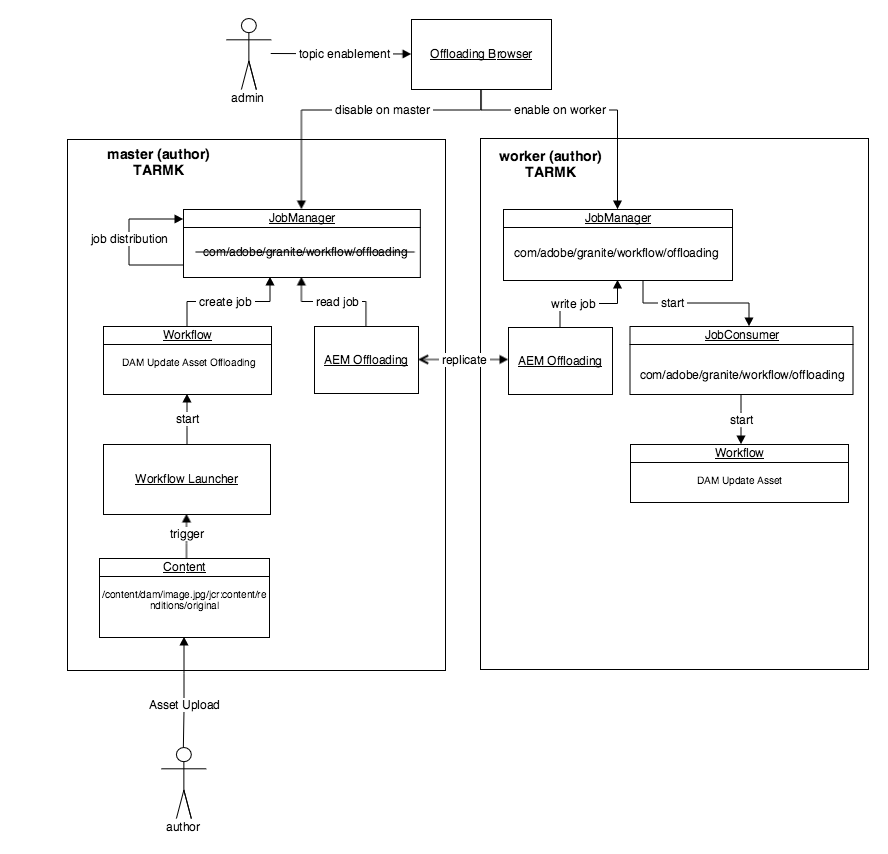

# Assets 卸载最佳实践 {#assets-offloading-best-practices}

>[!CAUTION]
>
>AEM 6.4已结束扩展支持，本文档将不再更新。 有关更多详细信息，请参阅 [技术支助期](https://helpx.adobe.com/cn/support/programs/eol-matrix.html). 查找支持的版本 [此处](https://experienceleague.adobe.com/docs/).

>[!WARNING]
>
>此功能已弃用 [!DNL Experience Manager] 6.4起，并于 [!DNL Experience Manager] 6.5.相应计划。

在Adobe Experience Manager Assets中处理大文件和运行工作流可能会占用大量CPU、内存和I/O资源。 特别是，资产的大小、工作流、用户数量和资产摄取频率都可能会影响系统的整体性能。 资源密集型操作包括资产摄取和复制工作流。 在单个创作实例上大量使用这些工作流可能会对创作效率产生不利影响。

将这些任务卸载到专用的工作器实例可以减少CPU、内存和IO开销。 通常，卸载的思想是将消耗大量CPU/内存/IO资源的任务分发到专用工作器实例。 以下部分包括建议的资产卸载用例。

## [!DNL Experience Manager Assets] 卸载 {#aem-assets-offloading}

[!DNL Experience Manager] 资产会实施用于卸载的特定于本机资产的工作流扩展。 它以卸载框架提供的通用工作流扩展为基础，但在实施中包含其他特定于资产的功能。 资产卸载的目标是对上传的资产高效运行DAM更新资产工作流。 资产卸载使您能够更好地控制摄取工作流。

## [!DNL Experience Manager] 资产卸载组件 {#aem-assets-offloading-components}

下图描述了资产卸载流程中的主要组件：

### DAM更新资产卸载工作流 {#dam-update-asset-offloading-workflow}

DAM更新资产卸载工作流在用户上传资产的主（作者）服务器上运行。 此工作流由常规工作流启动器触发。 此卸载工作流不会处理上传的资产，而是使用主题创建新作业 *com/adobe/granite/workflow/offloading*. 卸载工作流会将目标工作流的名称（在本例中为DAM更新资产工作流）和资产的路径添加到作业的有效负载。 创建卸载作业后，主实例上的卸载工作流将等待卸载作业运行之后才卸载。

### 作业管理器 {#job-manager}

作业管理器将新作业分配给工作器实例。 在设计分发机制时，务必要考虑主题启用。 只能将作业分配到启用了作业主题的实例。 禁用主题 `com/adobe/granite/workflow/offloading` 在主系统上，并在工作器上启用它，以确保将工作分配给工作器。

### [!DNL Experience Manager] 卸载 {#aem-offloading}

卸载框架标识了分配给工作实例的工作流卸载作业，并使用复制将它们物理地传输到工作器，包括其有效负载（例如，要摄取的图像）。

### 工作流卸载作业使用者 {#workflow-offloading-job-consumer}

一旦在员工上写了工作，工作经理就会致电负责 *com/adobe/granite/workflow/offloading* 主题。 然后，作业使用者在资产上运行DAM更新资产工作流。

## Sling拓扑 {#sling-topology}

Sling拓扑组 [!DNL Experience Manager] 实例，并使它们能够相互感知，而与基础持久性无关。 Sling拓扑的这一特性允许您为非群集、群集和混合场景创建拓扑。 实例可向整个拓扑公开属性。 框架提供用于侦听拓扑（实例和属性）中更改的回调。 Sling拓扑为Sling分布式作业提供了基础。

### Sling分布式作业 {#sling-distributed-jobs}

Sling分布式作业有助于在拓扑成员的一组实例之间分配作业。 Sling作业基于功能的理念。 作业由其作业主题定义。 要运行作业，实例必须为特定作业主题提供作业使用者。 作业主题是分配机制的主要驱动因素。

作业仅分发给为主题提供作业使用者的实例。 通过在实例上启用/禁用作业使用者，您可以定义实例的功能并影响分发机制。 将实例的可用作业使用者广播到整个拓扑。

在此上下文中，术语分配表示将作业分配给提供作业使用者的特定实例。 对实例的分配存储在存储库中。 换句话说，默认情况下，Sling分布式作业可以分配给拓扑中的任何实例。 但是，其他作业只能由共享同一存储库的实例运行。 这意味着这些作业只能由属于同一群集的实例运行。 不会运行分配给其他群集实例的作业。

### Granite卸载框架 {#granite-offloading-framework}

Granite卸载框架补充了Sling作业分发，以运行分配给非群集实例的作业。 它不执行任何分发（实例分配）。 但是，它会标识已分发到非群集实例的Sling作业，并将它们传输到目标实例以执行。 目前，卸载使用复制来执行此作业传输。 要运行作业，卸载会定义输入和输出，然后将输入和输出与作业结合以构建作业负载。

Sling分布式作业提供作业和分发框架。 Granite卸载仅负责将作业分发到非群集实例的特殊情况的传输。

除了传输之外，卸载框架还为工作流引擎提供了扩展。 它允许框架在工作流中创建分布式作业作为工作流的一部分，并等待其完成，然后再进行工作流。 它是使用工作流引擎中的工作流外部步骤API实施的。 其中一个扩展有助于对工作流进行通用分发。 不支持分发单个工作流步骤。

卸载框架还附带一个用户界面(UI)，用于显示和控制整个拓扑中的作业主题启用情况。 UI允许您方便地配置Sling分布式作业的主题启用集。 您还可以在没有UI的情况下设置卸载。

## 资产卸载的一般指导和最佳实践 {#general-guidance-and-best-practices-for-asset-offloading}

每个实施都是唯一的，因此，没有一刀切的卸载配置。 以下部分提供有关资产摄取卸载的指导和最佳实践。

资产卸货还会对系统施加间接费用，包括操作间接费用。 如果您在资产摄取加载时遇到问题，Adobe建议您先改进配置，而不要卸载。 在移动到资产卸载之前，请考虑以下选项：

* 扩展硬件
* 优化工作流
* 使用临时工作流
* 限制用于工作流的核心数量

如果您认为资产卸载是一种适合您的方法，Adobe将提供以下指导：

* 建议部署基于TarMK的部署
* 基于TarMK的资产卸载并非为广泛的横向扩展而设计
* 确保作者与工作人员之间的网络性能令人满意

### 建议的资产卸载部署 {#recommended-assets-offloading-deployment}

使用 [!DNL Experience Manager] 和Oak，有多种部署方案。 对于资产卸载，建议使用共享数据存储进行基于TarMK的部署。 下图概述了建议的部署：

有关配置数据存储的详细信息，请参阅 [在AEM中配置节点存储和数据存储](../sites-deploying/data-store-config.md).

### 关闭自动代理管理 {#turning-off-automatic-agent-management}

Adobe建议您关闭自动代理管理，因为它不支持无二进制复制，并且在设置新的卸载拓扑时可能会造成混淆。 此外，它不会自动支持无二进制复制所需的正向复制流。

1. 从URL打开配置管理器 `http://localhost:4502/system/console/configMgr`.
1. 打开的配置 `OffloadingAgentManager` (`http://localhost:4502/system/console/configMgr/com.adobe.granite.offloading.impl.transporter.OffloadingAgentManager`)。
1. 禁用自动代理管理。

### 使用正向复制 {#using-forward-replication}

默认情况下，卸载传输使用反向复制将卸载的资产从工作程序拉回到主程序。 反向复制代理不支持无二进制复制。 您应该配置卸载以使用转发复制将卸载的资产从工作程序推回主程序。

1. 如果您使用反向复制从默认配置迁移，请禁用或删除所有名为“ ”的代理 `offloading_outbox`&quot;和&quot; `offloading_reverse_*`&quot; ，其中&amp;ast;表示目标实例的Sling ID。
1. 在每个工作器上，创建指向主复制代理的新转发复制代理。 该过程与从主代理到工作代理创建转发代理的过程相同。 请参阅 [创建用于卸载的复制代理](../sites-deploying/offloading.md#creating-replication-agents-for-offloading) 有关设置卸载复制代理的说明。
1. 的打开配置 `OffloadingDefaultTransporter`  (`http://localhost:4502/system/console/configMgr/com.adobe.granite.offloading.impl.transporter.OffloadingDefaultTransporter`)。
1. 更改属性的值 `default.transport.agent-to-master.prefix` 从 `offloading_reverse` to `offloading`.

<!-- TBD: Make updates to the configuration for allow and block list after product updates are done.
TBD: Update the property in the last step when GRANITE-30586 is fixed.
-->

### 在作者和工作人员之间使用共享数据存储和无二进制复制  {#using-shared-datastore-and-binary-less-replication-between-author-and-workers}

建议使用无二进制复制来减少资产卸载的传输开销。 要了解如何为共享数据存储设置无二进制复制，请参阅 [在AEM中配置节点存储和数据存储](/help/sites-deploying/data-store-config.md). 资产卸载的过程并不不同，只是它涉及其他复制代理。 由于无二进制复制仅适用于转发复制代理，因此您还应将转发复制用于所有卸载代理。

### 关闭运输包 {#turning-off-transport-packages}

默认情况下，卸载会创建一个包含卸载作业和作业负载（原始资产）的内容包，并使用单个复制请求传输此单个卸载包。 使用无二进制复制时，创建这些卸载包会产生反作用，因为在创建包时，会再次将二进制文件序列化到包中。 可以关闭这些传输包的使用，这会导致卸载作业和负载在多个复制请求中传输，每个负载条目一个。 这样，就可以利用无二进制复制的好处。

1. 打开的组件配置 *卸载DefaultTransporter* 组件位置 [http://localhost:4502/system/console/configMgr/com.adobe.granite.offloading.impl.transporter.OffloadingDefaultTransporter](http://localhost:4502/system/console/configMgr/com.adobe.granite.offloading.impl.transporter.OffloadingDefaultTransporter)
1. 禁用属性 *复制包(default.transport.contentpackage)*.

### 禁用工作流模型的传输 {#disabling-the-transport-of-workflow-model}

默认情况下， *DAM更新资产卸载* 卸载工作流会将工作流模型添加到作业负载中，以在工作器上调用。 因为此工作流遵循现成的 *DAM更新资产* 默认情况下，可以删除此附加有效负载。

如果从作业负载中禁用了工作流模型，请确保使用其他工具（如包管理器）将更改分发到引用的工作流模型。

要禁用工作流模型的传输，请修改DAM更新资产卸载工作流。

1. 从中打开工作流控制台 [http://localhost:4502/libs/cq/workflow/content/console.html](http://localhost:4502/libs/cq/workflow/content/console.html).
1. 打开“模型”(Models)选项卡。
1. 打开DAM更新资产卸载工作流模型。
1. 打开DAM工作流卸载步骤的步骤属性。
1. 打开参数选项卡，然后取消选择添加要输入的模型和将模型添加到输出选项。
1. 保存对模型所做的更改。

### 优化轮询间隔 {#optimizing-the-polling-interval}

工作流卸载是使用主工作流上的外部工作流实现的，该工作流轮询是否在工作器上完成卸载的工作流。 外部工作流进程的默认轮询间隔为5秒。 Adobe建议您将资产卸载步骤的轮询间隔至少增加到15秒，以减少主资产的卸载开销。

1. 从中打开工作流控制台 [http://localhost:4502/libs/cq/workflow/content/console.html](http://localhost:4502/libs/cq/workflow/content/console.html).

1. 打开“模型”(Models)选项卡。
1. 打开DAM更新资产卸载工作流模型。
1. 打开DAM工作流卸载步骤的步骤属性。
1. 打开“共用”选项卡，并调整“时段”属性的值。
1. 保存对模型所做的更改。

## 更多资源 {#more-resources}

本文档重点介绍资产卸载。 以下是关于卸载的其他文档：

* [卸载作业](/help/sites-deploying/offloading.md)
* [资产工作流卸载程序](/help/sites-administering/workflow-offloader.md)
