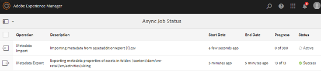

# 异步操作 {#asynchronous-operations}

>[!CAUTION]
>
>AEM 6.4已结束扩展支持，本文档将不再更新。 有关更多详细信息，请参阅 [技术支助期](https://helpx.adobe.com/cn/support/programs/eol-matrix.html). 查找支持的版本 [此处](https://experienceleague.adobe.com/docs/).

为减少对性能的不利影响， [!DNL Adobe Experience Manger Assets] 异步处理某些长时间运行且资源密集型资产操作。 异步处理包括将多个任务排入队列，并最终以序列方式执行这些任务，但以系统资源的可用性为前提。 这些操作包括：

* 删除许多资产。
* 移动许多资产或包含许多引用的资产.
* 批量导出和导入资产元数据。

您可以从 **[!UICONTROL 异步作业状态]** 页面。

>[!NOTE]
>
>默认情况下， [!DNL Assets] 任务并行执行。 如果 `N` 是CPU核心的数量， `N/2` 默认情况下，任务可以并行执行。 要对任务队列使用自定义设置，请修改 **[!UICONTROL 异步操作默认队列]** 配置 [!UICONTROL Web控制台]. 有关更多信息，请参阅[队列配置](https://sling.apache.org/documentation/bundles/apache-sling-eventing-and-job-handling.html#queue-configurations)。

## 监视异步操作的状态 {#monitoring-the-status-of-asynchronous-operations}

只要 [!DNL Assets] 异步处理操作时，您会在 [!DNL Experience Manager] [收件箱](/help/sites-authoring/inbox.md) 和通过电子邮件发送。 要查看异步操作状态的详细信息，请导航到&#x200B;**[!UICONTROL 异步作业状态]**&#x200B;页面。

1. 在 [!DNL Experience Manager] 界面点击 **[!UICONTROL 操作]** > **[!UICONTROL 作业]**.

1. 在&#x200B;**[!UICONTROL 异步作业状态]**&#x200B;页面中，查看操作的详细信息。

   

   要确定操作进度，请参阅 **[!UICONTROL 状态]** 列。 根据进度，将显示以下状态之一：

   * **[!UICONTROL 活动]**：正在处理操作。
   * **[!UICONTROL 成功]**：操作已完成.
   * **[!UICONTROL 失败]**&#x200B;或&#x200B;**[!UICONTROL 错误]**：无法处理该操作.
   * **[!UICONTROL 已计划]**：该操作计划稍后处理.

1. 要停止活动操作，请从列表中选择该操作，然后单击 **[!UICONTROL 停止]**  中。

1. 要查看其他详细信息（例如说明和日志），请选择操作并单击 **[!UICONTROL 打开]**  中。 此时会显示任务详细信息页面。

   

1. 要从列表中删除该操作，请从工具栏中选择&#x200B;**[!UICONTROL 删除]**。要以 CSV 文件下载详细信息，请单击&#x200B;**[!UICONTROL 下载]**。

   >[!NOTE]
   >
   >如果任务的状态为活动或已排队，则无法删除该任务。

## 清除已完成的任务 {#purge-completed-tasks}

[!DNL Experience Manager Assets] 每天1时执行清除任务，以删除已完成且已超过一天的异步任务。

<!-- TBD: Find out from the engineering team and mention the time zone of this 1:00 am task.
-->

您可以修改清除任务的计划以及删除之前保留已完成任务详细信息的持续时间。 您还可以配置在任何时间点保留详细信息的已完成任务的最大数量。

1. 在 [!DNL Experience Manager] 界面点击 **[!UICONTROL 工具]** > **[!UICONTROL 操作]** > **[!UICONTROL Web控制台]**.
1. 打开 **[!UICONTROL Adobe CQ已计划DAM异步作业清除]** 任务。
1. 指定删除已完成任务后的天数阈值，以及保留历史记录中详细信息的任务的最大数量。 保存更改。

   

## 配置异步删除操作的阈值 {#configure-thresholds-for-asynchronous-delete-operations}

如果要删除的资产或文件夹数量超过设置的阈值数，将异步执行删除操作。

1. 在 [!DNL Experience Manager] 界面点击 **[!UICONTROL 工具]** > **[!UICONTROL 操作]** > **[!UICONTROL Web控制台]**.
1. 从 [!UICONTROL Web控制台]，打开 **[!UICONTROL 异步删除操作作业处理]** 配置。
1. 在 **[!UICONTROL 资产的阈值数]** 框中，指定要异步删除资产、文件夹或引用的阈值数。 保存更改。

   

## 为异步移动操作配置阈值 {#configure-thresholds-for-asynchronous-move-operations}

如果要移动的资产、文件夹或引用数量超过设置的阈值数，将异步执行移动操作。

1. 在 [!DNL Experience Manager] 界面，单击 **[!UICONTROL 工具]** > **[!UICONTROL 操作]** > **[!UICONTROL Web控制台]**.
1. 从 [!UICONTROL Web控制台]，打开 **[!UICONTROL 异步移动操作作业处理]** 配置。
1. 在 **[!UICONTROL 资产/引用的阈值数]** 框中，指定要异步移动资产、文件夹或引用的阈值数。 保存更改。

   

>[!MORELIKETHIS]
>
>* [在Experience Manager中配置电子邮件](/help/sites-administering/notification.md).
>* [批量导入和导出资产元数据](/help/assets/metadata-import-export.md)。

