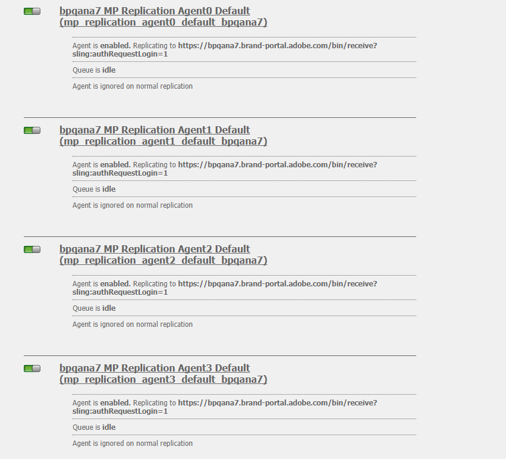

# 配置AEM资产与Brand Portal的集成 {#configure-aem-assets-integration-with-brand-portal}

了解如何将AEM资产与Brand Portal集成，以便将资产和集合发布到Brand Portal。

如果您是Adobe Experience Manager(AEM)Assets Brand Portal客户，则可以将AEM Assets与Brand Portal集成，以启用将资产发布到Brand Portal的功能。 您可以通过Adobe.io界面设置此集成。

> [!Note]
>
>Adobe建议升级到AEM 6.4.1.0或更高版本，以确保AEM Assets Brand Portal已与AEM Assets集成。 AEM 6.4中的限制会在配置与Brand Portal的集成时导致错误，并且复制会失败。

首先，在Marketing cloud公共网关中创建包含身份验证机制的应用程序。 然后，使用从网关获取的应用程序ID在AEM资产实例中创建配置文件。

使用此配置可将资产从AEM资产发布到Brand Portal。 在后端，AEM服务器使用网关验证您的配置文件，然后将AEM资产与Brand Portal集成。

>[!NOTE]
>
>用于配置身份验证集成的UI托管在 [https://legacy-oauth.cloud.adobe.io/](https://legacy-oauth.cloud.adobe.io/)，此前在https://marketing.adobe.com/developer/中托管 [该UI](https://marketing.adobe.com/developer/)。

## 创建JWT应用程序 {#create-jwt-application}

1. 使用您的 [Adobe](https://legacy-oauth.cloud.adobe.io/) ID登录https://legacy-oauth.cloud.adobe.io/。 您可以访问 [!UICONTROL JWT应用程序] 页面。

   >[!NOTE]
   >
   >只有在您是单位的系统管理员时，才可以创建应用程序ID。 租户是您在Adobe Marketing cloud中注册的组织的技术名称。

2. 选择 **[!UICONTROL 添加应用程序]** ，以创建应用程序。
3. 指定应用 **[!UICONTROL 程序名称]** 和可选 **[!UICONTROL 说明]**。
4. 从“组 **[!UICONTROL 织]** ”列表中，选择要为其同步资产的组织。
5. 从列 **[!UICONTROL 表中]** ，选 **[!UICONTROL 择dam-read]**、 **[!UICONTROL dam-sync、]********** write Share和Cc-Share。
6. 点按／单击 **[!UICONTROL 添加]**。 将创建JWT服务应用程序。 您可以编辑应用程序并保存。
7. 复制为新应用程序生成的应用程序ID。

   >[!NOTE]
   >
   >请确保不会因疏忽而复制应用程序机密而不是应用程序ID。

## 创建新云配置 {#create-a-new-cloud-configuration}

1. 在本地 **[!UICONTROL AEM]** Assets实例的导航页面中，点按／单击左侧的 **[!UICONTROL 工具]** 图标。

   

2. Navigate to **[!UICONTROL Cloud Services > Legacy Cloud Services]**.

   

3. 在“云 [!UICONTROL 服务] ”页面中，在 **[!UICONTROL Adobe Experience cloud下找到Assets Brand Portal]** service ****。

   

4. 点按／单击服务 **[!UICONTROL 下方的]** “立即配置”链接，以显示“创 [建配置”对话框] 。
5. 在“创 [!UICONTROL 建配置] ”对话框中，指定新配置的标题和名称，然后点按／单 **[!UICONTROL 击创建]**。

   

6. 在 [!UICONTROL AEM Assets Brand Portal复制对话框中] ，在租户URL字段中指定组 [!UICONTROL 织的URL] 。
7. 在“客 [!UICONTROL 户端ID] ”字段中，粘贴您复制的应用程序ID，该ID位于创建应用程 [序过程的末尾](#create-jwt-application)。 单击&#x200B;**[!UICONTROL 确定]**。

   

8. 要使资产（从AEM发布）对Brand Portal的常规用户公开可用，请启用“公共文 **[!UICONTROL 件夹发布]** ”复选框。

   >[!NOTE]
   >
   >从AEM 6.3.2.1 **[!UICONTROL 开始]** ，可以使用启用公共文件夹发布选项。

9. 在“ [!UICONTROL Brand Portal配置] ”页面中，点按／单 **[!UICONTROL 击显示公钥]** ，以显示为实例生成的公钥。

   

   或者，单击 **[!UICONTROL “下载OAuth网关的公钥]** ”以下载包含公钥的文件。 然后，打开文件以显示公钥。

## 支持集成 {#enable-integration}

1. 使用步骤向Marketing cloud添加新配置的最后一步中提到的以下方法之一 [显示公钥](#create-a-new-cloud-configuration)。

   * 单击“ **[!UICONTROL 显示公钥]** ”按钮以显示该键。
   * 打开包含密钥的下载文件。

2. 打开Marketing cloud开发人员连接界面，然后单击您在创建应用程序中创 [建的应用程序](#create-jwt-application)。
3. 将公钥粘贴到配置接 **[!UICONTROL 口的]** “公钥”字段
4. Tap/click **[!UICONTROL Save]**. 系统会显示一条消息，确认应用程序已更新。

## 测试集成 {#test-the-integration}

1. 在本地 **[!UICONTROL AEM]** Assets实例的导航页面中，单击左侧 **[!UICONTROL 的工具]** 图标。

   

2. 导航到“部 **[!UICONTROL 署”>“复制”]**。

   

3. 在复制 [!UICONTROL 页面中] ，点按／单击作 **[!UICONTROL 者上的代理]**。

   

4. 要验证AEM作者与Brand Portal之间的连接，请打开四个复制代理中的任意一个，然后单击“测 **[!UICONTROL 试连接”]**。

   >[!NOTE]
   >
   >复制代理并行工作并平等地共享作业分配，从而将发布速度提高了四倍于原始速度。 配置云服务后，无需进行其他配置即可启用复制代理，默认情况下激活复制代理可启用多个资产的并行发布。

   >[!NOTE]
   >
   >请避免禁用任何复制代理，因为这可能导致某些资产的复制失败。

   

5. 查看测试结果的底部以验证复制是否成功。

   

复制成功后，您可以将资产、文件夹和收藏集发布到Brand Portal。 有关详细信息，请参阅：

* [将资产和文件夹发布到Brand Portal](brand-portal-publish-folder.md)
* [将集合发布到Brand Portal](brand-portal-publish-collection.md)

## Publish assets to Brand Portal {#publish-assets-to-brand-portal}

复制成功后，您可以将资产、文件夹和收藏集发布到Brand Portal。 要将资产发布到Brand Portal，请执行以下步骤：

>[!NOTE]
>
>Adobe建议交错发布，最好在非高峰时段发布，这样AEM作者就不会占用过多的资源。

1. 从“资产”控制台中，将指针悬停在所需的资产上，然后从快速操 **[!UICONTROL 作中选择]** “发布”选项。

   或者，选择要发布到Brand Portal的资产。

   

2. 要将资产发布到Brand Portal，可以使用以下两个选项：
   * [立即发布资产](#publish-now)
   * [稍后发布资产](#publish-later)

### 立即发布资产 {#publish-now}

要将选定资产发布到Brand Portal，请执行以下任一操作：

* 从工具栏中，选择“快 **[!UICONTROL 速发布”]**。 然后从菜单中，选择 **[!UICONTROL 发布到Brand Portal]**。

* 从工具栏中，选择管 **[!UICONTROL 理发布]**。

   1. 然后，从“操 **[!UICONTROL 作]** ”中选 **[!UICONTROL 择发布到品牌门户]**，从“计划”中选 **[!UICONTROL 择“]******&#x200B;立即发布”。 Tap/ click **[!UICONTROL Next].**

   2. 在范 **[!UICONTROL 围内]**，确认您的选择，然后点按／单 **[!UICONTROL 击发布到品牌门户]**。

将显示一条消息，指明资产已排队等候发布到Brand Portal。 登录到Brand Portal界面，查看已发布的资产。

### 稍后发布资产 {#publish-later}

要计划将资产发布到Brand Portal以后的日期或时间，请执行以下操作：

1. 选择要发布的资产／文件夹后，从顶 **[!UICONTROL 部的工具栏中选择]** “管理发布”。
2. 在“管 **[!UICONTROL 理发布]** ”页面上，从Action **[!UICONTROL Portal中选择发布到Brand Portal]** ，然后从Scheduling Portal中选 ************&#x200B;择Publish to Brand Portal。

   

3. 选择激 **[!UICONTROL 活日期]** ，然后指定时间。 Tap/ click **[!UICONTROL Next]**.
4. 选择激 **[!UICONTROL 活日期]** ，然后指定时间。 Tap/ click **[!UICONTROL Next]**.
5. 在“工作流”下指定工作流 **[!UICONTROL 标题]**。 点按／单击稍 **[!UICONTROL 后发布]**。

   

现在，登录到Brand Portal，查看已发布的资产是否在Brand Portal界面上可用。

