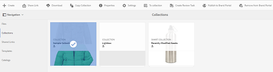
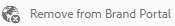

# 将收藏集发布到 Brand Portal {#publish-collections-to-brand-portal}

作为Adobe Experience Manager(AEM)资产管理员，您可以将集合发布到组织的AEM Assets品牌门户实例。 但是，您必须首先将AEM Assets与Brand Portal集成。 有关详细信息，请参阅[使用 Brand Portal 配置 AEM Assets](configure-aem-assets-with-brand-portal.md)。

如果您随后修改了AEM Assets的原始集合，则在您再次发布集合之前，这些更改不会反映在Brand Portal中。 此特性可确保品牌门户中不提供正在进行的更改。 只有管理员发布的已批准更改才会出现在 Brand Portal 中。

>[!NOTE]
>
>无法将内容片段发布到 Brand Portal。Therefore, if you select content fragment(s) on AEM Author, then **[Publish to Brand Portal]** action is not available.
>
>如果包含内容片段的集合从AEM作者发布到Brand Portal，则文件夹中除内容片段外的所有内容都将复制到Brand Portal界面。

## 将集合发布到Brand Portal {#publish-a-collection-to-brand-portal}

1. 在AEM AssetsUI中，点按／单击AEM徽标。 然后，从导航 **[!UICONTROL 页面转至]** “资产 **[!UICONTROL ”>]** “集合”。
2. 从收藏集控制台中，选择要发布到Brand Portal的收藏集。

   

3. From the toolbar, tap/click **[!UICONTROL Publish to Brand Portal]**.

   

4. In the confirmation dialog, tap/click **[!UICONTROL Publish]**.
5. 关闭确认消息。
6. 以管理员身份登录到Brand Portal。 已发布的收藏集将显示在“收藏集”控制台中。

   

## 取消发布收藏集 {#unpublish-collections}

您可以取消发布从AEM Assets发布到Brand Portal的集合。 取消发布原始集合后，Brand Portal用户将不再可用其副本。

1. 从您的AEM Assets实例的集合控制台中，选择要取消发布的集合。

   

2. From the toolbar, tap/click the **[!UICONTROL Remove from Brand Portal]** icon.

   

3. In the dialog, tap/click **[!UICONTROL Unpublish]**.
4. 关闭确认消息。收藏集将从 Brand Portal 界面中删除。
