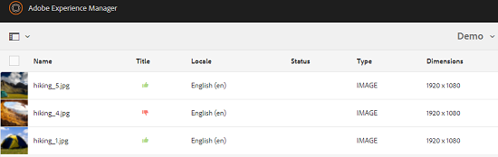

# 审核文件夹资源和收藏集 {#review-folder-assets-and-collections}

>[!CAUTION]
>
>AEM 6.4已结束扩展支持，本文档将不再更新。 有关更多详细信息，请参阅 [技术支助期](https://helpx.adobe.com/cn/support/programs/eol-matrix.html). 查找支持的版本 [此处](https://experienceleague.adobe.com/docs/).

为文件夹或收藏集中的资产设置审核工作流，并与审阅人或创意合作伙伴共享该工作流，以寻求反馈。

Adobe Experience Manager Assets允许您为文件夹或收藏集中的资产设置临时审阅工作流，并与审阅人或创意合作伙伴共享该工作流以寻求反馈。

您可以将审核工作流与项目关联或创建独立的审核任务。

共享资产后，审阅人可以批准或拒绝资产。 在工作流的各个阶段发送通知，以通知目标收件人有关各种任务的完成情况。 例如，当您共享文件夹或收藏集时，审阅人会收到一则通知，指出已共享文件夹/收藏集以供审阅。

审核人员完成审核（批准或拒绝资产）后，您会收到审核完成通知。

## 为文件夹创建审核任务 {#creating-a-review-task-for-folders}

1. 从Assets用户界面中，选择要为其创建审核任务的文件夹。
1. 在工具栏中，点按/单击&#x200B;**[!UICONTROL 创建审核任务]**&#x200B;图标，以打开&#x200B;**[!UICONTROL 审核任务]**&#x200B;页面。如果您在工具栏中看不到该图标，请点按/单击&#x200B;**[!UICONTROL 更多]**，然后选择该图标。

   

1. （可选）从 **[!UICONTROL 项目]** 列表中，选择要将审核任务关联到的项目。 默认情况下， **[!UICONTROL 无]** 选项。 如果不想将任何项目与审核任务关联，请保留此选择。

   >[!NOTE]
   >
   >只有您具有编辑者级别权限（或更高级别）的项目才会显示在 **[!UICONTROL 项目]** 列表。

1. 输入审核任务的名称，然后从 **[!UICONTROL 分配给]** 列表。

   >[!NOTE]
   >
   >选定项目的成员/组在 **[!UICONTROL 分配给]** 列表。

1. 输入审核任务的说明、任务优先级和到期日期。

   

1. 在高级选项卡中，输入用于创建URI的标签。

   

1. 点按／单 **[!UICONTROL 击提交]**，然后点按／单 **[!UICONTROL 击完成]** ，关闭确认消息。 新任务的通知将发送给审批者。
1. 登录到 [!DNL Experience Manager] 资产作为审批者，并导航到资产UI。 要批准资产，请单击/点按 **[!UICONTROL 通知]** 图标，然后从列表中选择审核任务。

   

1. 在&#x200B;**[!UICONTROL 审查任务]**&#x200B;页面中，检查审查任务的详细信息，然后点按/单击&#x200B;**[!UICONTROL 审查]**。
1. 在&#x200B;**[!UICONTROL 审核任务]**&#x200B;页面中，选择资产，然后点按/单击&#x200B;**[!UICONTROL 批准/拒绝]**&#x200B;图标以批准或拒绝（根据需要）。

   

1. 点按/单击 **[!UICONTROL 完成]** 图标。 在对话框中，输入评论，然后点按/单击  **[!UICONTROL 完成]** 确认。
1. 导航到资产UI，然后打开文件夹。 资产的批准状态图标会同时显示在卡片视图和列表视图中。

   **信息卡视图**

   

   **列表视图**

   

## 为集合创建审核任务 {#creating-a-review-task-for-collections}

1. 从收藏集页面中，选择要为其创建审阅任务的收藏集。
1. 在工具栏中，点按/单击&#x200B;**[!UICONTROL 创建审核任务]**&#x200B;图标，以打开&#x200B;**[!UICONTROL 审核任务]**&#x200B;页面。如果您在工具栏中看不到该图标，请点按/单击&#x200B;**[!UICONTROL 更多]**，然后选择该图标。

   

1. （可选）从 **[!UICONTROL 项目]** 列表中，选择要将审核任务关联到的项目。 默认情况下， **[!UICONTROL 无]** 选项。 如果不想将任何项目与审核任务关联，请保留此选择。

   >[!NOTE]
   >
   >只有您具有编辑者级别权限（或更高级别）的项目才会显示在 **[!UICONTROL 项目]** 列表。

1. 输入审核任务的名称，然后从 **[!UICONTROL 分配给]** 列表。

   >[!NOTE]
   >
   >选定项目的成员/组在 **[!UICONTROL 分配给]** 列表。

1. 输入审核任务的说明、任务优先级和到期日期。

   

1. 点按／单 **[!UICONTROL 击提交]**，然后点按／单 **[!UICONTROL 击完成]** ，关闭确认消息。 新任务的通知将发送给审批者。
1. 登录到 [!DNL Experience Manager] 资产作为审批者，并导航到资产控制台。 要批准资产，请点按/单击 **[!UICONTROL 通知]** 图标，然后从列表中选择审核任务。
1. 在&#x200B;**[!UICONTROL 审查任务]**&#x200B;页面中，检查审查任务的详细信息，然后点按/单击&#x200B;**[!UICONTROL 审查]**。
1. 收藏集中的所有资产都会在审核页面上可见。 选择资产，然后点按/单击 **[!UICONTROL 批准/拒绝]** 图标以批准或拒绝资产。

   

1. 点按/单击 **[!UICONTROL 完成]** 图标。 在对话框中，输入评论，然后点按/单击 **[!UICONTROL 完成]** 确认。
1. 导航到收藏集控制台并打开收藏集。 资产的批准状态图标会同时显示在卡片视图和列表视图中。

   **信息卡视图**

   

   **列表视图**

   
