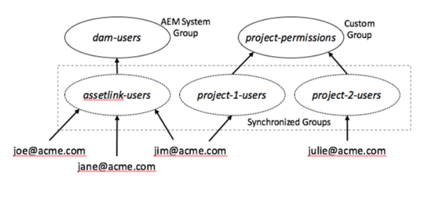

# 为Adobe资产链接配置Experience Manager Assets {#adobe-asset-link}

[Adobe资产链接(AAL)](https://www.adobe.com/cn/creativecloud/business/enterprise/adobe-asset-link.html) 简化了内容创建过程中创意人员与营销人员之间的协作。 它可将Adobe Experience Manager Assets与Creative Cloud桌面应用程序Adobe InDesign、Adobe Photoshop和Adobe Illustrator关联。 通过Adobe资产链接面板，创意人员无需离开他们最熟悉的创意应用程序即可访问和修改存储在AEM Assets中的内容。

要将Experience Manager Assets配置为与资产链接一起使用，请实施以下任务。 使用Experience Manager管理员帐户进行配置：

1. 根据需要安装包。 详细信息位于 [先决条件](#prerequisites).

1. 配置Experience Manager [手动](#manual-configuration) 或使用 [软件包](#configure-using-package).

1. 要将Creative Cloud授权用户与Experience Manager用户进行映射，请管理 [用户访问控制](#user-access).

1. 创建 [自定义查询索引](#create-custom-index)，配置 [FPO呈现](https://helpx.adobe.com/enterprise/using/configure-aem-assets-6-for-asset-link.html#configfporendition) InDesign和配置 [Adobe Stock集成](/help/assets/aem-assets-adobe-stock.md).

## 各种功能的先决条件和支持 {#prerequisites}

确保根据需要安装相应的Service Pack和包。 请参阅每个Experience Manager版本和特定功能的以下要求。

| 资产功能 | Experience Manager版本和支持要求 |
|--- |--- |
| 资产链接默认有效 | Experience Manager6.4.4和6.4.6或更高版本。   Adobe建议安装最新版本 [Experience Manager服务包(SP)](https://experienceleague.adobe.com/docs/experience-manager-release-information/aem-release-updates/aem-releases-updates.html) 使用AAL之前。 |
| 资产链接在安装包后可正常工作 | 对于Experience Manager6.4.0 - 6.4.3，请安装 [adobe-asset-link-support](https://experience.adobe.com/#/downloads/content/software-distribution/en/aem.html?package=/content/software-distribution/en/details.html/content/dam/aem/public/adobe/packages/cq640/featurepack/adobe-asset-link-support) 包。 |
| Adobe Stock 集成 | Experience Manager6.4.2或更高版本 |
| 可视或相似度搜索 | NA |

## 使用配置包配置Experience Manager {#configure-using-package}

Adobe建议您安装 [adobe-asset-link-config](https://experience.adobe.com/#/downloads/content/software-distribution/en/aem.html?package=/content/software-distribution/en/details.html/content/dam/aem/public/adobe/packages/cq640/product/assets/adobe-asset-link-config) 配置包可自动执行大多数配置任务，然后是一些手动任务。 或者，您也可以 [手动配置](#manual-configuration).

>[!CAUTION]
>
>如果您的Experience Manager实例配置为使用Adobe IMS帐户进行用户登录，请勿使用配置包。 相反， [手动配置](#manual-configuration) 您的Experience Manager实例。

1. 要打开包管理器，请在Experience ManagerWeb界面中访问 **[!UICONTROL 工具]** > **[!UICONTROL 部署]** > **[!UICONTROL 包共享]**. 安装 `adobe-asset-link-config` 包。

1. 访问&#x200B;**[!UICONTROL 工具]** > **[!UICONTROL 运营]** > **[!UICONTROL Web 控制台]**。定位 **[!UICONTROL AdobeGranite OAuth IMS提供程序]** ，然后单击以对其进行编辑。

   设置以下属性并保存更改。

   * [!UICONTROL 组映射]:除非需要，否则留空。 有关详细信息，请参阅 [组映射](#group-mapping).
   * [!UICONTROL 组织]:输入您在Adobe Admin Console中使用的组织ID。 有关组织ID的更多信息，请参阅 [创建用户组](https://helpx.adobe.com/enterprise/using/create-aal-user-group.html).

1. 定位 **[!UICONTROL AdobeGranite载体身份验证处理程序]** ，然后单击以对其进行编辑。

   添加 **[!UICONTROL InDesignAem2]** 客户端ID **[!UICONTROL 允许的OAuth客户端ID]** 配置属性。

## 手动配置Experience Manager {#manual-configuration}

如果您选择不使用配置包，或者如果您的Experience Manager部署配置为支持用户使用Adobe IMS帐户登录，请手动配置Experience Manager。

要手动配置Experience Manager，请执行以下操作：

1. 要访问配置管理器，请访问 **[!UICONTROL 工具]** > **[!UICONTROL 操作]** > **[!UICONTROL Web控制台]**. 选择 **[!UICONTROL OSGi]** > **[!UICONTROL 配置]** 菜单。

1. 找到 **[!UICONTROL AdobeGranite OAuth IMS提供程序]** 配置，然后单击以对其进行编辑。

   设置以下配置并单击 **[!UICONTROL 保存]**.

   * [!UICONTROL 授权端点]: ` https://ims-na1.adobelogin.com/ims/authorize/v1`
   * [!UICONTROL 令牌端点]: ` https://ims-na1.adobelogin.com/ims/token/v1`
   * [!UICONTROL 配置文件端点]: ` https://ims-na1.adobelogin.com/ims/profile/v1`
   * [!UICONTROL 验证URL]: ` https://ims-na1.adobelogin.com/ims/validate_token/v1`
   * [!UICONTROL 组织]:在 [Adobe Admin Console](https://adminconsole.adobe.com/).
   * [!UICONTROL 组映射]:留空，除非您有特殊用例。 有关详细信息，请参阅 [组映射](#group-mapping).

1. 定位 **[!UICONTROL AdobeGranite载体身份验证处理程序]** ，然后单击以对其进行编辑。

   将以下客户端ID添加到 **[!UICONTROL 允许的OAuth客户端ID]** 配置属性： `InDesignAem2, cc-europa-desktop_0_1, cc-europa-desktop_1_0, cc-europa-desktop_2_0, cc-europa-desktop_3_0, cc-europa-desktop_4_0, cc-europa-desktop_5_0, cc-europa-desktop_6_0, cc-europa-desktop_7_0, cc-europa-desktop_8_0, cc-europa-desktop_9_0, and cc-europa-desktop_10_0`.

   添加 `Client ID`，单击 `+`. 单击 **[!UICONTROL 保存]** 添加所有ID后。

1. 在 **[!UICONTROL AdobeGranite OAuth应用程序和提供程序]** 配置，检查现有 **[!UICONTROL AdobeGranite OAuth身份验证处理程序]** 实例。 如果您在 `Config ID` 值 `ims`，请按照此过程中的说明使用。 否则，请单击 `+` 创建配置实例。 设置以下属性值并单击 **[!UICONTROL 保存]**.

   * [!UICONTROL 客户端ID]:不要更改
   * [!UICONTROL 客户端密钥]:不要更改
   * [!UICONTROL 配置ID]: ` ims`
   * [!UICONTROL 范围]: `AdobeID, OpenID, read_organizations` （其他值也可能在配置中）
   * [!UICONTROL 提供程序ID]: ` ims`
   * [!UICONTROL 创建用户]: ` Checked`
   * [!UICONTROL 用户ID属性]: `Email` ，用于新建配置。 否则，请勿更改。

1. 找到 **[!UICONTROL Apache Jackrabbit Oak默认同步处理程序]** 配置 **[!UICONTROL 同步处理程序名称]** `ims` ，然后单击以对其进行编辑。

   设置以下配置属性，然后单击 **[!UICONTROL 保存]**.

   * [!UICONTROL 用户过期时间和用户成员资格过期]:“m”后跟的时间（以分钟为单位），没有空格。 例如， `15m` 15分钟。 有关详细信息，请参阅 [组映射](#group-mapping).
   * [!UICONTROL 用户自动成员资格]:不要更改
   * [!UICONTROL 用户动态成员资格]: ` Deslect`

1. 找到 **[!UICONTROL AdobeGranite OAuth身份验证处理程序]** 配置，然后单击以对其进行编辑。 无需进行任何更改，请单击 **[!UICONTROL 保存]**.

1. 要调整承载身份验证处理程序的相对优先级，请在CRXDE中导航到 `/apps/system/config`. 定位 `com.adobe.granite.auth.oauth.impl.BearerAuthenticationHandler.config` 并打开其配置。 最后，添加 `service.ranking=I"-10"`. 保存更改。

   >[!NOTE]
   >
   >使用载体令牌进行身份验证的每个请求都会产生三次Adobe IMS调用、用户同步以及在Experience Manager中创建登录令牌的开销。 为了克服此开销，Adobe资产链接会捕获Experience Manager响应中返回的登录令牌，并随后发送请求。 要使此过程正常工作，必须调整承载身份验证处理程序的相对优先级。

1. （可选）如果Experience Manager用户的电子邮件ID中包含大写或混合大小写的域名，请选择 **[!UICONTROL 将锁定用户更改为小写]** in **[!UICONTROL AdobeGranite ACP平台配置]** Experience ManagerWeb控制台中。

## 迁移到业务配置文件后的其他配置 {#configure-migration-activity}

Adobe资产链接用户能够连接到Experience Manager，以允许从企业(CCE)组织的主Creative Cloud进行IMS登录。 Experience Manager使用客户端ID来标识允许的IMS组织。 迁移到业务配置文件后，需要在承载身份验证处理程序的Experience Manager中为IMS组织配置客户端ID和密钥。 有关业务用户档案的更多信息，请参阅 [Adobe配置文件简介](https://helpx.adobe.com/enterprise/kb/introducing-adobe-profiles.html).

仅当您使用不同的Adobe IMS组织进行企业Experience Manager和Creative Cloud(CCE)，并且这两个组织之间建立了域信任关系时，才需要进行其他配置。

>[!NOTE]
>
>* Experience Manager6.4.8.4中提供了业务配置文件的扩展修补程序。
>* 如果您将同一Adobe IMS组织与Experience Manager和CCE结合使用，则现有配置仍可继续工作。

**前提条件**

1. 为AAL配置了承载身份验证的已启动且正在运行的Experience Manager实例。
1. 升级到 [Experience Manager6.4.8.4](https://experience.adobe.com/#/downloads/bin/softwaredistribution/package/download.file/aem-6.4.8-cfp-4.0.zip?path=%2Fcontent%2Fdam%2Faem%2Fpublic%2Fadobe%2Fpackages%2Fcq640%2Fcumulativefixpack%2Faem-6.4.8-cfp-4.0.zip&amp;generatedtoken=gfy3UD3tGMGhlWljluoOv2kbd50ZzFYM26LjFqNf5jYRrFe8m6ZO_ehnb9IOyTBKTX88dsydLpo1fbl2BA3Xi9Bm-mEQjBH2XgUF99WYEWgrfU_EVYGMXgbxca2tSc83xt6XG7BYULOCQxoLJ4l2APg-MpFNy7Gcda9U9B-UTsSBfOJnnSO3qPiUcJ5C-qmb0lmFsG36sp9Lq5s9ZydyIWS65Z7WY286SKSUQ64nRzM%3D)

1. 联系人 [!UICONTROL 客户支持] 以获取扩展的修复包(EFP)，以便迁移到业务配置文件。 在Experience Manager实例上安装EFP。

1. 联系人 [!UICONTROL 客户支持] 以获取用于IMS组织承载身份验证的客户端ID和密钥。

以下是迁移到业务配置文件后需要的其他配置：

1. 在 **[!UICONTROL AdobeGranite OAuth IMS配置提供程序]** (`com.adobe.granite.auth.ims.impl.ImsConfigProviderImpl`)，设置：

   * OAuth配置ID(`oauth.configmanager.ims.configid`): `ims` （验证一次，您可能已配置它）

   * IMS拥有实体(`ims.owningEntity`):您的IMS组织ID

   

1. 打开 **[!UICONTROL 承载验证处理程序]** 配置并添加从 [!UICONTROL 客户支持] 到 **[!UICONTROL 允许的OAuth客户端ID]**.

   

1. 打开 **[!UICONTROL AdobeGranite OAuth应用程序和提供程序]** 配置和添加 **[!UICONTROL 客户端ID]** 和 **[!UICONTROL 客户端密钥]** （密钥），从客户支持部门获取。

   确保 **[!UICONTROL 配置ID]** 字段(`oauth.config.id`)包含的值与 **[!UICONTROL OAuth配置ID]** 字段(`oauth.configmanager.ims.configid`)。

   

1. 打开 **[!UICONTROL AdobeGranite IMS群集Exchange令牌预处理器]** 配置并将其设置为 `enable`.

## 管理用户访问控制 {#user-access}

本节介绍如何管理用户及其对Experience Manager存储库的访问。

### 组映射 {#group-mapping}

组映射确定Experience Manager中的组与Adobe IMS中的组对应的方式。 它在如何向Adobe资产链接用户授予访问Experience Manager Assets的权限中起着重要作用。

与Adobe资产链接一起使用时，Experience Manager会将用户管理功能委派给Adobe IMS。 它会自动创建与Adobe IMS中的用户和组相对应的用户和组。 此外，它还可以在Experience Manager中同步用户、组和组成员资格，以匹配Adobe IMS中的用户、组和组成员资格。

例如，假定Adobe资产链接用户是Adobe IMS组资产链接用户的成员。 在这种情况下，当来自Adobe IMS组的用户首次连接到Adobe资产链接时，将在Experience Manager中创建名为assetlink-users的同步组。 当Adobe IMS组中的每个新用户首次通过Experience Manager资产链接连接到Experience Manager时，他们会将其添加到Adobe中的相应组。

Experience Manager中与Adobe IMS中的组对应并与之同步的组，可以直接获得访问权限，也可以通过使它们成为其他组的成员。 以下是如何管理权限的示例。

以下规则适用于Experience Manager中的组映射：

* 确保 **[!UICONTROL 组映射]** 属性 **[!UICONTROL AdobeGranite OAuth IMS提供程序]** 配置为空。
* Adobe资产链接用户群组成员资格将在用户进行身份验证时以及 **[!UICONTROL 用户过期时间]** 属性 **[!UICONTROL Apache Jackrabbit Oak默认同步处理程序]** 配置已过。 目前，可以将用户添加到Experience Manager中的组或从组中删除用户，以便与Adobe IMS中的内容同步。
* 避免组名称冲突。 确保在Adobe IMS中创建的组（用于管理用户）所使用的名称与所有Experience Manager系统组名称不同。

   例如，确保它们与 `dam-users` 群组和由Experience Manager管理员创建的群组。

   名称与Experience Manager系统组或手动创建组的名称冲突的Adobe IMS组不会用于控制用户权限。
* 如果Adobe IMS用户连接到Experience Manager实例，而该实例的用户名与之前创建的Experience Manager用户冲突，则Adobe IMS用户会获得另一个名称，并添加编号以使其唯一。

**设置首次访问控制**

通过Adobe资产链接进行连接的用户只有在获得所需权限后，才能查看资产并与其进行交互。 的 [组映射](#group-mapping) 上文部分讨论了如何在Experience Manager中创建与Adobe IMS内组织中的用户组相对应并与之同步的用户组。 建议Experience Manager管理员使用这些组来管理Adobe资产链接用户的访问控制。

对于与Adobe IMS组（用于管理用户访问控制）同步的每个Experience Manager组：

1. 确保组有一个可用于从Adobe资产链接进行初始连接的成员。
1. 使用该用户登录到Adobe资产链接，然后连接到Experience Manager。 此连接应会失败。
1. 在Experience Manager中，在Adobe IMS中找到与该组对应的组，并为其授予所需的访问控制。 例如，新组将成为dam-users组的成员。
1. 关闭Adobe资产链接并重新启动Creative Cloud应用程序。
1. 要验证用户是否具有预期的访问权限，请重新打开Adobe资产链接。

执行这些步骤后，同一组中的其他用户在首次尝试时可以使用Adobe资产链接连接到Experience Manager。 他们自动拥有与群组中其他用户相同的权限。

## 管理Experience ManagerAdobe资产链接的用户 {#manage-users}

AdobeExperience Manager链接用户在登录到其Creative Cloud应用程序后，能够与资产链接。 此身份验证使用Adobe IMS技术并在Experience Manager中创建用户信息（如果不存在）。 Experience Manager企业客户通常使用与Experience Manager集成的外部身份提供程序管理其用户。 身份提供程序包括Adobe IMS以及使用SAML和LDAP协议的其他产品。 或者，也可以在本地Experience Manager创建和管理用户。

从Adobe资产链接连接到Experience Manager的用户与从以前的直接登录Experience Manager中存储的现有用户信息没有冲突，如果：

* 直接登录到Experience Manager的所有用户名都与Adobe IMS中用于Creative Cloud登录的用户名不同。
* Adobe IMS用作身份提供程序，用于直接Experience Manager登录。
* 用户使用同一帐户直接Experience Manager登录之前，可从Adobe资产链接连接到Experience Manager。

另一方面，必须更新因直接Experience Manager登录而创建的用户信息，以便在以下情况下与Adobe资产链接一起使用：

* 同一用户名（如用户的电子邮件地址）用于以下两个用户名：Creative Cloud中的帐户（使用Adobe IMS），以及外部标识提供商（而非Adobe IMS）中的帐户。
* 同时使用相同的用户名 — Creative Cloud中的帐户和本地Experience Manager帐户。
* Adobe IMS中的Creative Cloud帐户是联合ID，由与Experience Manager集成以进行直接登录的相同外部身份提供程序提供这些ID。

通过这些方案创建的用户没有用户所需的资产，该资产已与Adobe IMS同步。

要更新Experience Manager中的此类用户以使用Adobe资产链接，请执行以下操作：

1. 在Experience ManagerWeb控制台中，找到 **[!UICONTROL Apache Jackrabbit Oak外部主体配置]** 配置，然后单击以对其进行编辑。 取消选择 **[!UICONTROL 外部身份保护]** 复选框，然后单击 **[!UICONTROL 保存]**.
1. 要在Experience Manager中访问用户管理界面，请导航到 **[!UICONTROL 工具]** > **[!UICONTROL 安全性]** > **[!UICONTROL 用户]**. 选择要更新的用户，然后记下该用户浏览器URL路径的结尾，以 `/home/users`. 或者，您也可以在CRXDE中搜索用户名。 示例用户路径： `/home/users/x/xTac082TDh-guJzzG7WM`.
1. 在CRXDE中，导航到用户路径，选择用户节点，然后通过选择 **[!UICONTROL 属性]** 选项卡。 此节点具有 `jcr:primaryType` 属性值 `rep:User`.
1. 在 **[!UICONTROL 属性]** 选项卡区域，输入 `Name` 值 `rep:externalId`, `Type` 值 `String`和 `Value` 值 `rep:authorizableId`;`ims`，其中 `rep:authorizableId` 是 `rep:authorizableId` 节点的属性。 (使用分号时不带空格，以分隔 `rep:authorizableId` 值 `ims`.)
1. 单击 **[!UICONTROL 添加]** 按钮，然后单击 **[!UICONTROL 全部保存]**.
1. 对要升级以使用Adobe资产链接的任何其他用户重复步骤2至5。
1. 在Experience ManagerWeb控制台中，找到 **[!UICONTROL Apache Jackrabbit Oak外部主体配置]** 配置，然后单击以对其进行编辑。 取消选择 **[!UICONTROL 外部身份保护]** 复选框，然后单击 **[!UICONTROL 保存]**.

>[!NOTE]
>
>如果服务在几分钟内未恢复，请重新启动Experience Manager，以便成功进行身份验证。

进行此更改后，更新的Experience Manager用户可以与Adobe资产链接连接，并继续使用更新前使用的直接登录Experience Manager方法。 成功使用Adobe IMS进行身份验证后，Experience Manager用户配置文件信息将与Adobe IMS中的用户配置文件同步。

有一种方法可以执行多个Experience Manager用户的批量迁移，以使他们能够使用Adobe资产链接。 请联系Adobe关怀，以获取有关启用此选项的更多信息和帮助。

作为这些步骤的替代方法，在某些情况下，可能会向Adobe资产链接用户提供对Experience Manager的快速访问。 在这种情况下，在Experience Manager用户管理或Experience ManagerCRXDE与Adobe资产链接连接之前，会通过用户管理或CRXDE找到并删除预先存在的用户信息。 在连接后的Experience Manager中创建新用户信息。 仅当您确定没有作为用户节点的子节点添加的重要数据时，才使用此方法。 此类额外数据是用户节点的子节点，而非 `tokens`, `preferences`, `profile`, `profiles`, `profiles/public`和 `rep:policy/*` 节点。

## 有条件地启动资产处理工作流 {#auto-start-workflow}

在Experience Manager6.4中，管理员可以配置工作流，以根据预定义的条件自动执行和处理资产。

例如，此配置对于业务线用户和营销人员非常有用，可用于在一些特定文件夹上创建自定义工作流。 假设某机构照片拍摄的所有资产都可以添加水印，或者可以处理由自由人上传的所有资产以创建特定演绎版。

有关更多信息和Experience Manager配置，请参阅 [对资产自动执行工作流](https://experienceleague.adobe.com/docs/experience-manager-65/assets/using/assets-workflow.html#auto-execute-workflow-on-some-assets).

## 在Experience Manager6.4.x版本中创建自定义索引 {#create-custom-index}

Experience Manager包含用于查询的索引。 为指定版本创建以下自定义索引。 Experience Manager6.4.0默认包含此索引。 Adobe资产链接需要此索引来确定用户已签出的资产。

1. 在CRXDE中，找到 `/oak:index` 节点。 创建名为的节点 `cqDrivelock` 设置 `Type` to `oak:QueryIndexDefinition`.

1. 将以下属性添加到新节点并保存更改：

   * `Name: type; Type: string; Value: property`

   * `Name: propertyNames; Type: Name[] (click the "Multi" button); Value: cq:drivelock`

<!--
## Configure visual or similarity search {#configure-visual-similarity-search}

Visual Search capability allows you to search for visually similar assets in the AEM Assets repository, using the Adobe Asset Link panel. The functionality is available in 6.5.0 or later versions and only the indexed assets are searched. For more information, see [how to configure visual search](https://experienceleague.adobe.com/docs/experience-manager-65/assets/using/search-assets.html#configvisualsearch).

-->

## 为仅用于置入的呈现版本生成Adobe InDesign {#fpo-renditions}

Experience Manager提供仅用于放置(FPO)的演绎版。 这些FPO呈现文件大小较小，但纵横比相同。 如果FPO演绎版不适用于资产，Adobe InDesign会改用原始资产。 此回退机制可确保创意工作流持续进行，不会出现任何中断。 有关更多信息，请参阅 [生成FPO呈现](https://helpx.adobe.com/enterprise/using/configure-aem-assets-6-for-asset-link.html#configfporendition).

## 与Adobe Stock集成 {#adobe-stock-integration}

组织将其Adobe Stock帐户与Experience Manager Assets集成。 它可帮助营销人员将获得许可的高品质、免版税的照片、矢量、插图、视频、模板和3D资产提供给他们的创意和营销项目。 创意专业人士可以使用资产链接面板来使用这些资产。

要与Adobe Stock集成，请参阅 [Adobe Stock资产(Experience Manager Assets)](/help/assets/aem-assets-adobe-stock.md). Experience Manager6.4.2或更高版本才能与Adobe Stock集成。

## Experience Manager相关问题疑难解答 {#troubleshoot}

如果您在配置或使用Adobe资产链接时遇到问题，请尝试以下操作：

* 确保您的部署满足先决条件。 具体而言，请确保安装了相应的功能包或包。
* 联系贵组织的合作伙伴或系统集成商。
* 如果您的Creative Cloud用户无法在签出的资产中进行验证，请检查电子邮件ID中域名的大小写。 要修复此问题，请参阅 [手动配置](#manual-configuration).
* 有关更多信息，请参阅 [资产链接故障诊断](https://helpx.adobe.com/enterprise/kb/asset-link-troubleshooting.html).

>[!MORELIKETHIS]
>
>* [关于 Adobe Asset Link](https://helpx.adobe.com/enterprise/using/adobe-asset-link.html)
>* [在Creative Cloud桌面应用程序中使用资产链接并管理资产](https://helpx.adobe.com/enterprise/using/manage-assets-using-adobe-asset-link.html)
>* [配置Adobe Experience Manager Assetsas a Cloud Service](https://helpx.adobe.com/enterprise/using/configure-aem-assets-for-asset-link.html).

