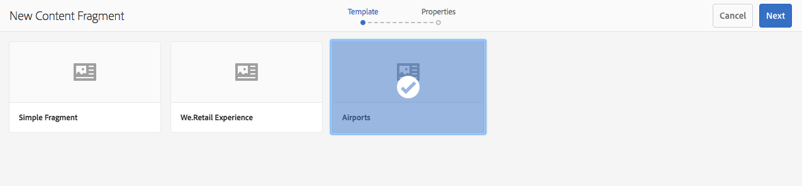
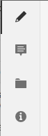

# 管理内容片段 {#managing-content-fragments}

>[!CAUTION]
>
>某些内容片段功能需要应用 [AEM 6.4 Service Pack 2(6.4.2.0)或更高版本](/help/release-notes/sp-release-notes.md)。

内容片段存储为资 **[!UICONTROL 产]**，因此主要通过“资产”控制台 **[!UICONTROL 进行管理]** 。

>[!NOTE]
>
>内容片段随后用于创作页面；请参 [阅使用内容片段进行页面创作](/help/sites-authoring/content-fragments.md)。

## 创建内容片段 {#creating-content-fragments}

### 创建内容模型 {#creating-a-content-model}

[在创建包含结构化内容的内容片段之前](content-fragments-models.md) ，可以启用和创建内容片段模型。

>[!NOTE]
>
>有关模 [板的更多信息](/help/sites-developing/customizing-content-fragments.md) ，请参阅开发内容片段；用于简单内容片段。

### 创建内容片段 {#creating-a-content-fragment}

创建内容片段的方法（基本上）对于简单片段和结构化片段都是相同的：

1. 导航到要 **[!UICONTROL 创建片段]** 的Assets文件夹。
1. 选择 **[!UICONTROL 创建]**，然后选择 **[!UICONTROL 内容片段]** ，以打开向导。
1. 向导的第一步要求您指定新片段的基础。

   * 这可以是：

      * [模板](/help/sites-developing/content-fragment-templates.md) -例如简 **[!UICONTROL 单片段]**
      * [模型](content-fragments-models.md) -用于创建需要结构化内容的片段；例如 **Airport模型**
   * 将显示所有可用的模板和模型。
   选择后，使用“下 **[!UICONTROL 一步]** ”继续。

   

1. 在属性 **[!UICONTROL 步骤中]** ，指定：

   * **[!UICONTROL 基本]**

      * **[!UICONTROL 标题]**

         片段标题。

         强制.

      * **[!UICONTROL 描述]**
      * **[!UICONTROL 标记]**
   * **[!UICONTROL 高级]**

      * **[!UICONTROL 名称]**

         姓名；将用于形成URL。

         强制；将自动从标题派生，但可以更新。

1. 选 **[!UICONTROL 择创建]** ，以完成操作，然后打开片段 **[!UICONTROL 进行编辑]** ，或返回控制台并执行完 **[!UICONTROL 成]**。

## 内容片段的操作 {#actions-for-a-content-fragment}

在“资 **[!UICONTROL 产]** ”控制台中，您的内容片段可以执行一系列操作：

* 工具栏中；选择片段后，所有相应的操作都可用。
* 作为 [快速行动](/help/sites-authoring/basic-handling.md#quick-actions);可用于单个片段卡的操作子集。

选择片段以显示包含适用操作的工具栏：

* **[!UICONTROL 下载]**

   * 将片段另存为ZIP文件；您可以定义是否包括元素、变量、元数据。

* **[!UICONTROL 创建]**
* **[!UICONTROL 签出]**
* **[!UICONTROL 属性]**

   * 允许您查看和／或编辑片段的元数据。

* **[!UICONTROL 编辑]**

   * 允许您打开片 [段以编辑内容](content-fragments-variations.md) ，以及其元素、变量、关联内容和元数据。

* **[!UICONTROL 管理标记]**
* **[!UICONTROL 目标收藏集]**

   * 将片段添加到集合。
   * 在将集合与片段关 [联时也可以执行此操作](content-fragments-assoc-content.md#adding-associated-content)。

* **[!UICONTROL 复制／粘贴]**
* **[!UICONTROL 移动]**
* **[!UICONTROL 快速发布]**
* **[!UICONTROL 管理发布]**
* **[!UICONTROL 删除]**

>[!NOTE]
>
>其中许多操作 [是资产和](managing-assets-touch-ui.md) /或桌面应用程 [序的标准操作](https://helpx.adobe.com/experience-manager/desktop-app/aem-desktop-app.html)。

## 打开片段编辑器 {#opening-the-fragment-editor}

要打开片段进行编辑，请执行以下操作：

>[!CAUTION]
>
>要编辑内容片段，您需要 [相应的权限](/help/sites-developing/customizing-content-fragments.md#asset-permissions)。 如果您遇到问题，请联系您的系统管理员。

1. 使用“ **[!UICONTROL 资产]** ”控制台导航到内容片段的位置。
1. 通过以下任一方式打开片段进行编辑：

   * 单击／点按片段或片段链接（这取决于控制台视图）。
   * 选择片段，然后从工 **[!UICONTROL 具栏中]** “编辑”。
   片段编辑器将打开：

   

   >[!NOTE]
   >
   >1. 当内容页面上已引用片段时，将显示一条消息。
      >
      >
   2. 可使用“切换侧面板”图标隐藏／显 **[!UICONTROL 示侧面板]** 。

1. 使用侧面板中的图标在三种模式之间导航：

   * 变量：编 [辑内容和](#editing-the-content-of-your-fragment) 管 [理变量](#creating-and-managing-variations-within-your-fragment)
   * [注释](content-fragments-variations.md#annotating-a-content-fragment)
   * [关联的内容](#associating-content-with-your-fragment)
   * [元数据](#viewing-and-editing-the-metadata-properties-of-your-fragment)
   

1. 进行更改后，根据需要 **[!UICONTROL 使用]** “保 **[!UICONTROL 存”或“取消]** ”。

   >[!NOTE]
   >
   >“保 **[!UICONTROL 存]** ”和“取消 **[!UICONTROL ”将退出编辑器——有关这两个选项如何对内容片段进行操作的完整信息，请参阅]** “保存”、“取消”和“版本”。

## 保存、取消和版本 {#save-cancel-and-versions}

>[!NOTE]
>
>还可以从时间 [轴创建、比较和还原版本](https://helpx.adobe.com/experience-manager/6-3/assets/using/content-fragments-managing.html#timeline-for-content-fragments)。

该编辑器有两个选项：

* **[!UICONTROL 保存]**

   将保存最新更改并退出编辑器。

   >[!CAUTION]
   >
   >要编辑内容片段，您需要 [相应的权限](/help/sites-developing/customizing-content-fragments.md#asset-permissions)。 如果您遇到问题，请联系您的系统管理员。

   >[!NOTE]
   >
   >在选择“保存”之前，可以保留在编辑器中并进行一系列 **[!UICONTROL 更改]**。

   >[!CAUTION]
   >
   >除了简单地保存更改外，“保 **[!UICONTROL 存]** ”还会更新任何引用，并确保调度程序根据需要被刷新。 这些更改可能需要时间进行处理。 因此，对于大型／复杂／重负载的系统，可能会产生性能影响。
   >
   >
   >使用“保存”时请牢记这 **[!UICONTROL 一点]** ，然后快速重新输入片段编辑器以进行和保存进一步的更改。

* **[!UICONTROL 取消]**

   将退出编辑器，而不保存最新更改。

在编辑内容片段时，AEM会自动创建版本，以确保在取消更改时可以恢复以 **[!UICONTROL 前的]** 内容：

1. 打开内容片段进行编辑时，AEM会检查是否存在基于cookie的令牌，该令牌指示编辑会 *话是否存在* :

   1. 如果找到令牌，则片段被视为现有编辑会话的一部分。
   1. 如果令牌不可 *用* ，并且用户开始编辑内容，则会创建一个版本，并将此新编辑会话的令牌发送到客户端，并将其保存在Cookie中。

1. 当存在活动的编 *辑会话* ，所编辑的内容会每600秒（默认）自动保存一次。

   >[!NOTE]
   >
   >使用该机制可以配置自动保存 `/conf` 间隔。
   >
   >默认值，请参阅：
   >
   >`/libs/settings/dam/cfm/jcr:content/autoSaveInterval`

1. 如果用户选择取 **[!UICONTROL 消编辑]** ，则恢复在编辑会话开始时创建的版本，并删除令牌以结束编辑会话。
1. 如果用户选择“保 **[!UICONTROL 存]** ”编辑，则更新的元素／变量将被保留，并删除令牌以结束编辑会话。

## 编辑片段内容 {#editing-the-content-of-your-fragment}

打开片段后，可以使用“变量” [选项卡](content-fragments-variations.md) ，创作内容。

## 在片段中创建和管理变量 {#creating-and-managing-variations-within-your-fragment}

创建主内容后，您便可以创建和管理该内容 [的变](content-fragments-variations.md) 体。

## 将内容与片段关联 {#associating-content-with-your-fragment}

您还可以将 [内容与片段](content-fragments-assoc-content.md) 关联。 这提供了一个连接，以便在将资产（即图像）添加到内容页面时，可以（可选）与片段一起使用。

## 查看和编辑片段的元数据（属性） {#viewing-and-editing-the-metadata-properties-of-your-fragment}

您可以使用元数据选项卡查看和编辑片段的 [!UICONTROL 属性](content-fragments-metadata.md) 。

## 内容片段的时间轴 {#timeline-for-content-fragments}

除了标准选项之外，时间轴还 [提供特定于内容片段的信息](managing-assets-touch-ui.md#timeline) 和操作：

* 查看有关版本、注释和注释的信息
* 版本操作

   * **[!UICONTROL 还原到此版本](#reverting-to-a-version)**（选择现有片段，然后选择特定版本）
   * **[!UICONTROL 与当前版本比较](#comparing-fragment-versions)**（先选择一个现有片段，然后选择特定版本）
   * 添加标 **[!UICONTROL 签和]** /或 **[!UICONTROL 评论]** （选择现有片段，然后选择特定版本）
   * **[!UICONTROL 另存为版本]** （选择现有片段，然后选择时间轴底部的向上箭头）

* 注释操作

   * **[!UICONTROL 删除]**

>[!NOTE]
>
>评论包括：
>
>* 适用于所有资产的标准功能
>* 在时间轴中制作
>* 与片段资产相关
>
>
注释（针对内容片段）包括：
>
>* 在片段编辑器中输入
>* 特定于片段中的选定文本段

例如：

## 比较片段版本 {#comparing-fragment-versions}

在 **[!UICONTROL 选择特定版本后]** ，时间轴中可 [!UICONTROL 以执行](https://helpx.adobe.com/experience-manager/6-3/assets/using/content-fragments-managing.html#timeline-for-content-fragments) “与当前版本比较”操作。

此选项将打开：

* 当 **[!UICONTROL 前]** （最新）版本（左）

* 所选版 **本v&lt;*x.y*>** （右）

它们将并排显示，其中：

* 所有差异都会高亮显示

   * 删除的文本——红色
   * 插入的文本——绿色
   * 替换文本——蓝色

* 全屏图标允许您自行打开任一版本；然后切换回并行视图
* 您可以 **[!UICONTROL 还原到]** 特定版本
* **[!UICONTROL 完成]** ，将返回控制台

>[!NOTE]
>
>在比较片段时，无法编辑片段内容。

## Reverting to a Version  {#reverting-to-a-version}

您可以还原到片段的特定版本：

* 直接从时间 [!UICONTROL 轴](content-fragments-managing.md#timeline-for-content-fragments)。

   选择所需的版本，然后执 **[!UICONTROL 行还原到此版本操作]** 。

* 将某 [个版本与当前版本进行比较时](content-fragments-managing.md#comparing-fragment-versions) ，您可 **[!UICONTROL 以还原到选定版本]** 。

## 发布和引用片段 {#publishing-and-referencing-a-fragment}

>[!CAUTION]
>
>如果您的片段基于模型，则应确保该 [模型已发布](content-fragments-models.md#publishing-a-content-fragment-model)。
>
>如果发布的内容片段尚未发布模型，则会显示一个选择列表以指示此情况，并且该模型将随片段一起发布。

必须发布内容片段才能在发布环境中使用。 可以发布它们：

* 创建后；从“资 **[!UICONTROL 产]** ”控制台。
* 当您发 [布使用片段的页面时](/help/sites-authoring/content-fragments.md#publishing);片段将列在页面引用中。

>[!CAUTION]
>
>在发布和／或引用片段后，当作者打开片段以再次进行编辑时，AEM将显示一条警告消息。 这将警告对片段所做的更改也会影响引用的页面。

## 删除片段 {#deleting-a-fragment}

要删除片段，请执行以下操作：

1. 在“资 **[!UICONTROL 产]** ”控制台中，导航到内容片段的位置。
1. 选择片段。

   >[!NOTE]
   >
   >The **[!UICONTROL Delete]** action is not available as a quick action.

1. Select **[!UICONTROL Delete]** from the toolbar.
1. 确认删 **[!UICONTROL 除]** 。

   >[!CAUTION]
   >
   >如果片段已在页面中被引用，您将看到一条警告消息，需要您确认是否继续执行&#x200B;**[!UICONTROL 强制删除]**。片段及其内容片段组件将从任何内容页面中删除。

