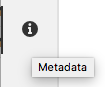

# 元数据 - 片段属性 {#metadata-fragment-properties}

>[!CAUTION]
>
>某些内容片段功能要求应用[AEM 6.4 Service Pack 2(6.4.2.0)或更高版本](/help/release-notes/sp-release-notes.md)。

## 编辑属性/元数据{#editing-properties-meta-data}

您可以视图和编辑内容片段的元数据（属性）：

1. 在&#x200B;**[!UICONTROL 资产]**&#x200B;控制台中，导航到内容片段的位置。
1. 可以任选其一：

   * 选择[视图属性以打开对话框](managing-assets-touch-ui.md#editing-properties)。 打开进行查看后，您还可以进行编辑。
   * 打开Edit](content-fragments-managing.md#opening-the-fragment-editor)的[内容片段，然后从侧面板中选择&#x200B;**[!UICONTROL Metadata]**。

   

1. **[!UICONTROL 基本]**&#x200B;选项卡提供了可进行视图或编辑的选项：

   * 缩览图，您可以为其&#x200B;**上载图像**
   * **标题**
   * **描述**
   * **标记**
   * 已创建（仅显示）
   
