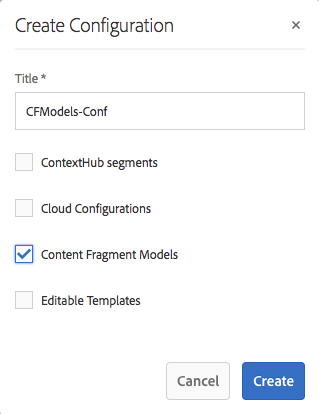

# 内容片段模型 {#content-fragment-models}

>[!CAUTION]
>
>AEM 6.4已结束扩展支持，本文档将不再更新。 有关更多详细信息，请参阅 [技术支助期](https://helpx.adobe.com/cn/support/programs/eol-matrix.html). 查找支持的版本 [此处](https://experienceleague.adobe.com/docs/).

>[!CAUTION]
>
>某些内容片段功能需要应用 [AEM 6.4 Service Pack 2(6.4.2.0)或更高版本](../release-notes/sp-release-notes.md).

内容片段模型为 [内容片段](content-fragments.md).

## 启用内容片段模型 {#enable-content-fragment-models}

>[!CAUTION]
>
>如果未启用 **[!UICONTROL 内容片段模型]**, **[!UICONTROL 创建]** 选项将不可用于创建新模型。

要启用内容片段模型，您需要：

* 在配置管理器中启用内容片段模型的使用
* 将配置应用到 Assets 文件夹

### 在配置管理器中启用内容片段模型 {#enable-content-fragment-models-in-configuration-manager}

至 [创建新的内容片段模型](#creating-a-content-fragment-model) you **必须** 首先使用配置管理器启用它们：

1. 导航到&#x200B;**[!UICONTROL 工具]**、**[!UICONTROL 常规]**，然后打开&#x200B;**[!UICONTROL 配置浏览器]**。
   * 请参阅 [配置浏览器文档](/help/sites-administering/configurations.md) 以了解更多信息。
1. 选择适合您网站的位置。
1. 使用&#x200B;**[!UICONTROL “创建”]**&#x200B;来打开对话框，您需要：

   1. 指定&#x200B;**[!UICONTROL 标题]**。
   1. 选择 **[!UICONTROL 内容片段模型]** 以启用其用途。

   

1. 选择&#x200B;**[!UICONTROL “创建”]**&#x200B;以保存定义。

### 将配置应用到 Assets 文件夹 {#apply-the-configuration-to-your-assets-folder}

配置 **[!UICONTROL 全球]** 已为内容片段模型启用，则用户创建的任何模型都可以在任何“资产”文件夹中使用。

要将其他配置（即不包括全局配置）与类似的 Assets 文件夹一起使用，您必须定义连接。可使用&#x200B;**[!UICONTROL 云服务]**&#x200B;选项卡（位于相应文件夹的&#x200B;**[!UICONTROL 文件夹属性]**&#x200B;中）中的&#x200B;**[!UICONTROL 配置]**&#x200B;完成来此操作。

## 创建内容片段模型 {#creating-a-content-fragment-model}

1. 导航到 **[!UICONTROL 工具]**, **[!UICONTROL 资产]**，然后打开 **[!UICONTROL 内容片段模型]**.
1. 导航到与您的 [配置](#enable-content-fragment-models).
1. 使用&#x200B;**[!UICONTROL “创建”]**&#x200B;打开向导。

   >[!CAUTION]
   >
   >如果[未启用内容片段模型](#enable-content-fragment-models)，则&#x200B;**“创建”**&#x200B;选项将不可用。

1. 指定&#x200B;**[!UICONTROL 模型标题]**。 您还可以根据需要添加&#x200B;**[!UICONTROL 描述]**。

   

1. 使用&#x200B;**[!UICONTROL “创建”]**&#x200B;以保存空模型。 将显示一条消息，指示操作是否成功，您可以选择&#x200B;**[!UICONTROL “打开”]**&#x200B;来立即编辑模型，或&#x200B;**[!UICONTROL “完成”]**&#x200B;以返回到控制台。

## 定义内容片段模型 {#defining-your-content-fragment-model}

内容片段模型有效地定义了生成的内容片段的结构。 使用模型编辑器，您可以添加和配置必填字段：

>[!CAUTION]
>
>编辑现有内容片段模型可能会影响从属片段。

1. 导航到 **[!UICONTROL 工具]**, **[!UICONTROL 资产]**，然后打开 **[!UICONTROL 内容片段模型]**.

1. 导航到包含内容片段模型的文件夹。
1. 打开所需的模型进行&#x200B;**[!UICONTROL “编辑”]**；使用快速操作或选择模型，然后从工具栏中选择操作。

   打开模型编辑器后，会显示：

   * 左：字段已定义
   * 右侧：可用于创建字段的&#x200B;**[!UICONTROL 数据类型]**（可在创建字段后使用的&#x200B;**[!UICONTROL 属性]**）

   >[!NOTE]
   >
   >当字段为 **必需**, **标签** 在左窗格中指示的将标有星号标记(**&amp;ast;**)。

   

1. **添加字段**

   * 将字段的必需数据类型拖到所需位置：

   

   * 将字段添加到模型后，右侧面板将显示可以为该特定数据类型定义的&#x200B;**属性**。您可以在此定义该字段的必需内容。例如：

   

1. **移除字段**

   选择必填字段，然后单击/点按垃圾桶图标。 系统将要求您确认该操作。

   

1. 添加所有必填字段并定义属性后，请使用 **[!UICONTROL 保存]** 来保留定义。 例如：

   

## 删除内容片段模型 {#deleting-a-content-fragment-model}

>[!CAUTION]
>
>删除内容片段模型可能会影响从属片段。

要删除内容片段模型，请执行以下操作：

1. 导航到 **[!UICONTROL 工具]**, **[!UICONTROL 资产]**，然后打开 **[!UICONTROL 内容片段模型]**.

1. 导航到包含内容片段模型的文件夹。
1. 选择您的模型，然后从工具栏中&#x200B;**[!UICONTROL 删除]**。

   >[!NOTE]
   >
   >如果引用了模型，则会发出警告。 采取适当措施。

## 发布内容片段模型 {#publishing-a-content-fragment-model}

在发布任何相关内容片段时/之前，需要发布内容片段模型。

要发布内容片段模型，请执行以下操作：

1. 导航到 **[!UICONTROL 工具]**, **[!UICONTROL 资产]**，然后打开 **[!UICONTROL 内容片段模型]**.

1. 导航到包含内容片段模型的文件夹。
1. 选择您的模型，然后从工具栏中&#x200B;**[!UICONTROL “发布”]**。

   >[!NOTE]
   >
   >如果发布的内容片段的模型尚未发布，则会显示一个选择列表来指示该情况，并且模型将随该片段一起发布。
