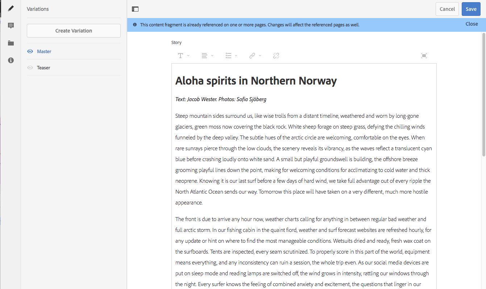
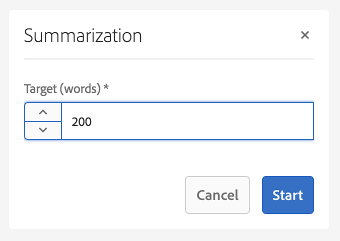
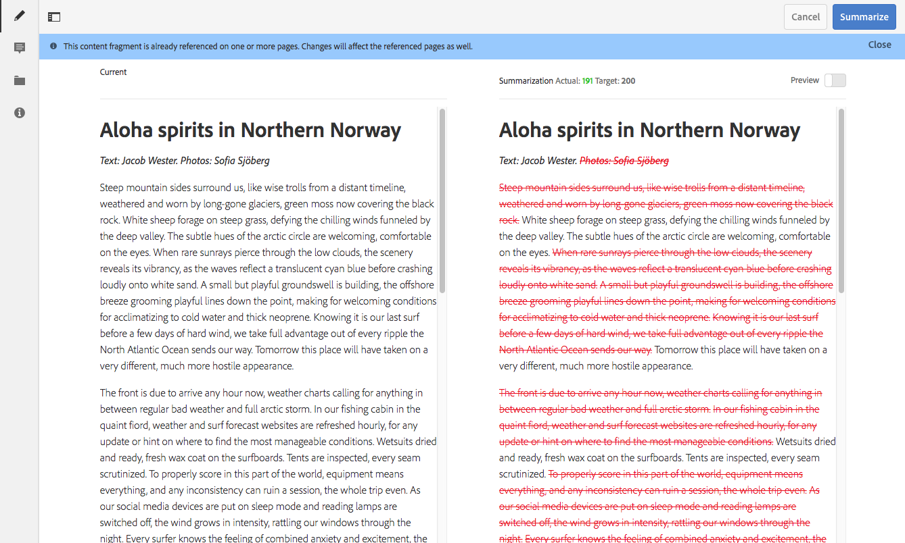

# 变体 – 创作片段内容 {#variations-authoring-fragment-content}

>[!CAUTION]
>
>AEM 6.4已结束扩展支持，本文档将不再更新。 有关更多详细信息，请参阅 [技术支助期](https://helpx.adobe.com/cn/support/programs/eol-matrix.html). 查找支持的版本 [此处](https://experienceleague.adobe.com/docs/).

>[!CAUTION]
>
>某些内容片段功能需要应用 [AEM 6.4 Service Pack 2(6.4.2.0)或更高版本](../release-notes/sp-release-notes.md).

[变体](content-fragments.md#constituent-parts-of-a-content-fragment) 是内容片段的一项重要功能，因为它们允许您创建和编辑主控内容的副本，以供在特定渠道和/或方案中使用。

从&#x200B;**“变体”**&#x200B;选项卡，您可：

* [输入内容](#authoring-your-content) 对于片段
* [创建和管理变体](#managing-variations) 的 **主控** 内容

根据正在编辑的数据类型执行一系列其他操作；例如：

* [将可视化资产插入片段](#inserting-assets-into-your-fragment)（图像）
* 在[富文本](#rich-text)、[纯文本](#plain-text)和 [Markdown](#markdown) 之间选择进行编辑

* [上传内容](#uploading-content)

* [查看关键统计信息](#viewing-key-statistics)（关于多行文本）
* [总结文本](#summarizing-text)

* [使变体与主控内容同步](#synchronizing-with-master)

>[!CAUTION]
>
>片段发布和/或引用后，当作者再次打开片段进行编辑时，AEM 将显示警告。这是为了警告，对片段所做的更改也会影响引用的页面。

## 创作内容 {#authoring-your-content}

当您打开内容片段进行编辑时，**变体**&#x200B;选项卡将默认打开。 在此，您可以为主要或任何变体创作内容。 您可以：

* 直接在&#x200B;**“变体”**&#x200B;选项卡中进行编辑
* 打开 [全屏编辑器](#full-screen-editor) 至：

   * 选择[格式](#formats)
   * 查看更多编辑选项([富文本](#rich-text)格式)
   * 访问[操作](#actions)

例如：

* 编辑简单片段

   一个简单的片段由一个多行文本字段组成（可以从全屏编辑器添加可视资产）。

   

* 使用结构化内容编辑片段

   结构化片段包含在内容模型中定义的各种数据类型的字段。 对于任何多行字段， [全屏编辑器](#full-screen-editor) 中。

   

### 全屏编辑器 {#full-screen-editor}

编辑多行文本字段时，可以打开全屏编辑器：

全屏编辑器提供：

* 各种[操作](#actions)的访问权限
* 根据[格式](#formats)，其他格式选项（[富文本](#rich-text)）

### 操作 {#actions}

当全屏编辑器（即多行文本）打开时，以下操作也可用（适用于所有[格式](#formats)）

* 选择 [格式](#formats) ([富文本](#rich-text), [纯文本](#plain-text), [Markdown](#markdown))
* [显示文本统计信息](#viewing-key-statistics)
* [上传内容](#uploading-content)
* [与主要内容同步](#synchronizing-with-master)（编辑变体时）
* [总结文本](#summarizing-text)
* [注释](content-fragments-variations.md#annotating-a-content-fragment) 您的文本

* [将可视化资产插入片段](#inserting-assets-into-your-fragment)（图像）

### 格式 {#formats}

用于编辑多行文本的选项取决于所选的格式：

* [富文本](#rich-text)
* [纯文本](#plain-text)
* [Markdown](#markdown)

使用全屏编辑器时可以选择格式。

### 富文本 {#rich-text}

富文本编辑允许您设置格式：

* 粗体
* 斜体
* 下划线
* 对齐方式：左、中、右
* 带项目符号的列表
* 编号列表
* 缩进：增加、减少
* 创建/中断超链接
* 打开全屏编辑器，其中提供了以下格式选项：

   * 从 Word/粘贴文本
   * 插入表
   * 段落样式：段落，标题 1/2/3
   * [插入可视资产](#inserting-assets-into-your-fragment)
   * 搜索
   * 查找/替换
   * 拼写检查程序
   * [注释](content-fragments-variations.md#annotating-a-content-fragment)

也可以从全屏编辑器访问[操作](#actions)。

### 纯文本 {#plain-text}

纯文本允许快速输入内容，而无需设置格式或标记信息。 您还可以打开全屏编辑器以进一步[操作](#actions)。

>[!CAUTION]
>
>如果您选择&#x200B;**纯文本**，则可能会丢失已插入&#x200B;**富文本**&#x200B;或&#x200B;**标记**&#x200B;中的任何格式、标记和/或资产。

### Markdown {#markdown}

>[!NOTE]
>
>有关完整信息，请参阅 [Markdown](content-fragments-markdown.md) 文档。

这允许您使用 Markdown 设置文本格式。 您可以定义：

* 标题
* 段落和换行符
* 链接
* 图像
* 块引号
* 列表
* 强调
* 代码块
* 反斜线转义

您还可以打开全屏编辑器以进一步[操作](#actions)。

>[!CAUTION]
>
>如果在&#x200B;**富文本**&#x200B;和&#x200B;**标记**&#x200B;之间切换，您可能会在“引述块”和“代码块”中遇到意料之外的体验效果，因为这两种格式在处理方式上可能有所不同。

### 查看关键统计信息 {#viewing-key-statistics}

当打开全屏编辑器时，**文本统计信息**&#x200B;操作将显示有关文本的一系列信息。例如：

### 上传内容 {#uploading-content}

为了简化内容片段的创作过程，您可以上传在外部编辑器中准备的文本，并将其直接添加到片段中。

### 摘要文本 {#summarizing-text}

摘要文本旨在帮助用户将其文本的长度减少到预定义的字数，同时保留关键点和整体含义。

>[!NOTE]
>
>在更高的技术水平上，该系统根据特定算法保持其认为提供&#x200B;*最佳信息密度和唯一性比*&#x200B;的句子。

>[!CAUTION]
>
>内容片段必须具有作为上级的有效语言文件夹；用于确定要使用的语言模型。
>
>例如，`en/`与以下路径相同：
>
>`/content/dam/my-brand/en/path-down/my-content-fragment`

>[!CAUTION]
>
>英语是现成的。
>
>其他语言可作为语言模型包从软件发行版获得：
>
>* [Software Distribution的法语(fr)](https://experience.adobe.com/#/downloads/content/software-distribution/en/aem.html?package=/content/software-distribution/en/details.html/content/dam/aem/public/adobe/packages/cq630/product/smartcontent-model-fr)
>* [德语(de)来自Software Distribution](https://experience.adobe.com/#/downloads/content/software-distribution/en/aem.html?package=/content/software-distribution/en/details.html/content/dam/aem/public/adobe/packages/cq630/product/smartcontent-model-de)
>* [Software Distribution的意大利语(it)](https://experience.adobe.com/#/downloads/content/software-distribution/en/aem.html?package=/content/software-distribution/en/details.html/content/dam/aem/public/adobe/packages/cq630/product/smartcontent-model-it)
>* [Software Distribution的西班牙语(es)](https://experience.adobe.com/#/downloads/content/software-distribution/en/aem.html?package=/content/software-distribution/en/details.html/content/dam/aem/public/adobe/packages/cq630/product/smartcontent-model-es)
>

1. 选择&#x200B;**[!UICONTROL 主要变体]**&#x200B;或所需的变体。
1. 打开全屏编辑器。

1. 从工具栏中选择&#x200B;**[!UICONTROL “摘要文本”]**。

   

1. 指定目标字数并选 **[!UICONTROL 开始]**：
1. 原始文本与建议的摘要并排显示：

   * 任何要删除的句子都以红色高亮显示，并带有点进。
   * 单击任何高亮显示的句子以将其保留在摘要内容中。
   * 单击任何未高亮显示的句子以将其删除。

   

1. 选择&#x200B;**[!UICONTROL “摘要”]**&#x200B;以确认更改。

### 批注内容片段 {#annotating-a-content-fragment}

要对片段添加注释：

1. 选择&#x200B;**[!UICONTROL 主要变体]**&#x200B;或所需的变体。
1. 打开全屏编辑器。
1. 选择一些文本。 的 **[!UICONTROL 注释]** 图标将变为可用。

   

1. 此时将打开一个对话框。 您可以在此输入注释。

1. 关闭全屏编辑器和 **[!UICONTROL 保存]** 片段。

### 查看、编辑和删除注释 {#viewing-editing-deleting-annotations}

注释：

* 在编辑器的全屏和正常模式下，由文本上的高亮显示指示。然后，可通过单击高亮显示的文本，查看、编辑和/或删除注释的完整详细信息，此时将重新打开对话框。

   >[!NOTE]
   >
   >如果对一段文本应用了多个注释，则会提供一个下拉选择器。

* 删除应用了注释的整个文本时，也会删除注释。

* 可以通过选择&#x200B;**[!UICONTROL “注释”]**&#x200B;选项卡，列出和删除注释。

   

* 可以在[时间线](https://helpx.adobe.com/experience-manager/6-3/assets/using/content-fragments-managing.html#timeline-for-content-fragments)中查看和删除所选片段。

### 将资产插入片段 {#inserting-assets-into-your-fragment}

要简化创作内容片段的过程，您可以直接添加[资产](managing-assets-touch-ui.md)（图像）到片段。

将它们添加到片段的段落序列中，且不加任何格式；在[页面上使用/引用片段时](/help/sites-authoring/content-fragments.md)，可以编排格式。

>[!CAUTION]
>
>无法在引用页面上移动或删除这些资产，必须在片段编辑器中完成此操作。
>
>但是，必须在[页面编辑器](/help/sites-authoring/content-fragments.md)中编排资产格式（例如，大小）。 资产在片段编辑器中的呈现形式仅用于创作内容流。

>[!NOTE]
>
>将[图像](content-fragments.md#fragments-with-visual-assets)添加到片段和/或页面有多种方法。

1. 将光标定位到要添加图像的位置。
1. 使用&#x200B;**[!UICONTROL 插入资产]**&#x200B;图标，打开搜索对话框。

   

1. 在对话框中，您可以：

   * 导航到 DAM 中的所需资产
   * 在 DAM 中搜索资产

   找到后，单击缩略图以选择所需的资产。

1. 使用&#x200B;**[!UICONTROL 选择]**&#x200B;将资产添加到当前位置的内容片段的段落系统中。

   >[!CAUTION]
   >
   >如果在添加资产后，您将格式更改为：
   >
   >* **纯文本**：资产将从片段中完全丢失。
   >* **Markdown**：资产将不可见，但在您恢复为&#x200B;**富文本**&#x200B;时仍将存在。

## 管理变体 {#managing-variations}

### 创建变体 {#creating-a-variation}

各种变体允许您获取&#x200B;**主要**&#x200B;内容，并根据不同目的（如有需要）进行更改。

要创建新变体：

1. 打开片段并确保侧面板可见。
1. 选择&#x200B;**[!UICONTROL “变体”]**&#x200B;图标栏。
1. 选择&#x200B;**[!UICONTROL “创建变体”]**。
1. 将打开一个对话框，为新变体指定&#x200B;**[!UICONTROL 标题]**&#x200B;和&#x200B;**[!UICONTROL 描述]**。
1. 选择 **[!UICONTROL 添加]**，片段&#x200B;**[!UICONTROL 主要内容]**&#x200B;将被复制到新变体中，该变体现在打开进行[编辑](#editing-a-variation)。

   >[!NOTE]
   >
   >创建新变体时，复制的始终是&#x200B;**主要内容**，而不是当前打开的变体。

### 编辑变体 {#editing-a-variation}

在执行以下任一操作后，您可以对变体内容进行更改：

* [创建变体](#creating-a-variation).
* 打开现有片段，然后从侧面板中选择所需的变体。

### 重命名变体 {#renaming-a-variation}

要重命名现有变体，请执行以下操作：

1. 打开片段，然后从侧面板中选择&#x200B;**[!UICONTROL “变体”]**。
1. 选择所需的变体。
1. 从&#x200B;**[!UICONTROL 操作]**&#x200B;下拉列表中选择&#x200B;**[!UICONTROL 重命名]**。

1. 在结果对话框中输入新的&#x200B;**[!UICONTROL 标题]**&#x200B;和/或&#x200B;**[!UICONTROL 描述]**。

1. 确认&#x200B;**[!UICONTROL 重命名]**&#x200B;操作。

>[!NOTE]
>
>这仅影响变体&#x200B;**标题**。

### 删除变体 {#deleting-a-variation}

要删除现有变体，请执行以下操作：

1. 打开片段，然后从侧面板中选择&#x200B;**[!UICONTROL 变体]**。
1. 选择所需的变体。
1. 从&#x200B;**[!UICONTROL “操作”]**&#x200B;下拉菜单中选择&#x200B;**[!UICONTROL “删除”]**。

1. 确认对话框中的&#x200B;**[!UICONTROL 删除]**&#x200B;操作。

>[!NOTE]
>
>无法删除&#x200B;**母版**。

### 与母版同步 {#synchronizing-with-master}

**母版**&#x200B;是内容片段的一个组成部分，从定义上讲，它包含内容的母版副本，而变体则包含该内容的单独更新和定制版本。 更新主控时，这些更改也可能与变体相关，因此需要传播到这些变体中。

在编辑变体时，您有权使用将变体的当前元素与主要内容同步的操作。 这样，您就可以自动将对母版所做的更改复制到所需的变体。

>[!CAUTION]
>
>同步仅可将更改从&#x200B;***母版**复制到变体*。
>
>将仅同步变体的当前元素。
>
>同步仅适用于&#x200B;**多行文本**&#x200B;数据类型。
>
>不提供将更改&#x200B;*从变体传输到&#x200B;**母版***选项。

1. 在片段编辑器中打开内容片段。 确保&#x200B;**母版**&#x200B;已编辑。
2. 选择一个特定的变体，然后从以下任一位置选择相应的同步操作：

   * **“操作”**&#x200B;下拉选择器 – **将当前元素与母版同步**
   * 全屏编辑器的工具栏 – **与母版同步**

3. 母版和变体将并排显示：

   * 绿色表示添加的内容（添加到变体）
   * 红色表示内容已移除（从变体中）

   

4. 选择&#x200B;**[!UICONTROL “同步”]**，则将更新并显示变体。
