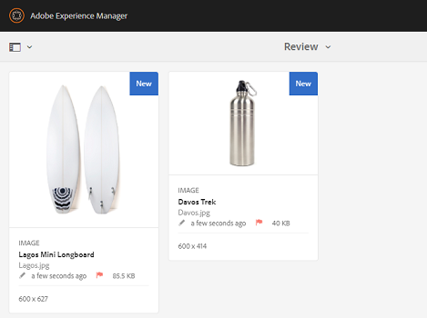

# 资产{#digital-rights-management-in-assets}的Digital Rights Management

数字资产通常与指定使用条款和持续时间的许可证相关联。 由于[!DNL Adobe Experience Manager Assets]与[!DNL Experience Manager]平台完全集成，因此您可以有效地管理资产过期信息和资产状态。 您还可以将许可信息与资产关联。

## 资产过期 {#asset-expiration}

资产过期是强制实施资产许可要求的有效方式。 它可确保发布的资产在过期时取消发布，这样不会发生任何许可证违规。 没有管理员权限的用户无法编辑、复制、移动、发布和下载过期的资产。

您可以在卡和列表视图的[!DNL Assets]控制台中视图资产的过期状态。

*图：在卡视图中，卡上的标记指示已过期的资产。*

*图：在列表视图中，“状  态”列显示“  过期”横幅。*

您可以在左边栏的[!UICONTROL 时间轴]中视图资产的过期状态。

>[!NOTE]
>
>资产的到期日期对不同时区的用户显示不同。

您还可以在&#x200B;**[!UICONTROL 引用]**&#x200B;边栏中视图资产的过期状态。 它管理资产过期状态以及复合资产与引用的子资产、收藏集和项目之间的关系。

1. 导航到要视图其引用网页和复合资产的资产。
1. 选择资产，然后单击[!DNL Experience Manager]徽标。

   

1. 从菜单中选择&#x200B;**[!UICONTROL 引用]**。

   

   对于已过期的资产，引用边栏的顶部会显示到期状态&#x200B;**[!UICONTROL 资产已过期]**。

   

   如果资产已过期子资产，引用边栏会显示状态&#x200B;**[!UICONTROL 资产已过期子资产]**。

   

### 搜索已过期的资产{#search-expired-assets}

您可以在“搜索”面板中搜索过期的资产，包括过期的子资产。

1. 在[!DNL Assets]控制台中，单击工具栏中的&#x200B;**[!UICONTROL 搜索]**&#x200B;以显示“搜索”框。

   

1. 将光标置于Omnisearch框中，按Enter键可显示搜索结果页面。

   

1. 单击[!DNL Experience Manager]徽标以显示搜索面板。

   

1. 单击&#x200B;**[!UICONTROL Expiry Status]**&#x200B;选项以展开它。

   

1. 选择&#x200B;**[!UICONTROL 已过期]**。 到期的资产会显示在搜索结果中。

   

当您选择&#x200B;**[!UICONTROL 已过期]**&#x200B;选项时，[!DNL Assets]控制台将仅显示复合资产引用的已过期资产和子资产。 在子资产过期后，不会立即显示引用已过期子资产的复合资产。 而是会在[!DNL Experience Manager]检测到下次运行调度程序时引用过期的子资产后显示这些子资产。

如果您将已发布资产的到期日修改为早于当前调度程序周期的日期，计划仍会在下次运行时将此资产检测为已过期资产，并相应地反映其状态。

此外，如果故障或错误导致调度程序无法检测当前周期中的已过期资产，调度程序将在下一个周期中重新检查这些资产，并检测其已过期状态。

要启用[!DNL Assets]控制台以显示引用复合资产以及已过期的子资产，请在[!DNL Experience Manager]配置管理器中配置&#x200B;**[!UICONTROL Adobe CQ DAM Expiry Notification]**&#x200B;工作流。

1. 打开[!DNL Experience Manager] Configuration Manager。
1. 选择&#x200B;**[!UICONTROL Adobe CQ DAM到期通知]**。 默认情况下，会选择&#x200B;**[!UICONTROL 基于时间的调度程序]**，该计划会在特定时间作业以检查资产是否已过期子资产。 作业完成后，已过期的子资产和引用的资产会在搜索结果中显示为过期。

   

1. 要定期运行该作业，请清除&#x200B;**[!UICONTROL 基于时间的计划程序规则]**&#x200B;字段，并在&#x200B;**[!UICONTROL 周期性计划程序]**&#x200B;字段中修改时间（以秒为单位）。例如，示例表达式“0 0 0 &amp;ast; &amp;ast; ?”会在 00 小时开始作业。
1. 选择&#x200B;**[!UICONTROL 发送电子邮件]**&#x200B;以在资产过期时接收电子邮件。

   >[!NOTE]
   >
   >只有资产创建者（将特定资产上传到[!DNL Assets]的人员）在资产过期时才会收到电子邮件。 有关在整体[!DNL Experience Manager]级别配置电子邮件通知的更多详细信息，请参阅[如何配置电子邮件通知](/help/sites-administering/notification.md)。

1. 在&#x200B;**[!UICONTROL 以秒为单位的上一通知字段中，指定资产在您希望收到有关过期的通知时在资产过期之前的秒数。]**&#x200B;如果您是管理员或资产创建者，您会在资产到期前收到一条消息，通知您资产将在指定时间后过期。

   资产过期后，您会收到确认到期的其他通知。 此外，会取消激活过期的资产。

1. 单击&#x200B;**[!UICONTROL 保存]**。

## 资产状态{#asset-states}

[!DNL Assets]控制台可显示资产的各种状态。 根据特定资产的当前状态，其卡片视图会显示一个标签，用于描述其状态，例如“已过期”、“已发布”、“已批准”、“被拒绝”等。

1. 在[!DNL Assets]用户界面中，选择一个资产。

   

1. 单击工具栏中的&#x200B;**[!UICONTROL 发布]**。 如果工具栏上未显示&#x200B;**发布**，请单击工具栏上的&#x200B;**[!UICONTROL 更多]**，然后找到&#x200B;**[!UICONTROL 发布]**&#x200B;选项。

   

1. 从菜单中选择&#x200B;**[!UICONTROL 发布]**，然后关闭确认对话框。
1. 退出选择模式。 资产的发布状态会显示在卡片视图中资产缩略图的底部。 在列表视图中，已发布列显示资产发布的时间。

   

1. 要显示其资产详细信息页面，请在[!DNL Assets]界面中，选择资产，然后单击&#x200B;**[!UICONTROL 属性]**。

   

1. 在高级选项卡中，从&#x200B;**[!UICONTROL 过期]**&#x200B;字段中设置资产的过期日期。

   

   *图： [!UICONTROL “资] 产属性”页中的“  高级”选项卡，以设置资产过期时间。*

1. 单击&#x200B;**[!UICONTROL 保存]**，然后单击&#x200B;**[!UICONTROL 关闭]**&#x200B;以显示资产控制台。
1. 资产的发布状态会在卡片视图中资产缩略图底部指示过期状态。 在“列表”视图中，资产的状态显示为&#x200B;**[!UICONTROL Expired]**。

   

1. 在[!DNL Assets]控制台中，选择一个文件夹，然后在该文件夹上创建审核任务。
1. 在审核任务中审核和批准/拒绝资产，然后单击&#x200B;**[!UICONTROL 完成]**。
1. 导览至创建了审核任务的文件夹。 您批准/拒绝的资产的状态将显示在卡片视图的底部。 在“列表”视图中，批准和到期状态将显示在相应的列中。

   

1. 要根据资产的状态搜索资产，请单击&#x200B;**[!UICONTROL 搜索]**&#x200B;以显示“搜索”栏。

   

1. 按返回并单击[!DNL Experience Manager]以显示搜索面板。
1. 在搜索面板中，单击&#x200B;**[!UICONTROL 发布状态]**&#x200B;并选择&#x200B;**[!UICONTROL 已发布]**&#x200B;以在[!DNL Assets]中搜索已发布的资产。

   

1. 单击&#x200B;**[!UICONTROL 批准状态]**&#x200B;并单击相应选项以搜索已批准或已拒绝的资产。

   

1. 要根据资产的到期状态搜索资产，请在“搜索”面板中选择&#x200B;**[!UICONTROL 到期状态]**，然后选择相应的选项。

   

1. 您还可以根据各种搜索彩块化下的状态组合来搜索资产。 例如，您可以通过在搜索彩块化中选择相应选项，来搜索在审核任务中已批准但尚未过期的已发布资产。

   

## Digital Rights Management位于[!DNL Assets] {#digital-rights-management-in-assets-1}

此功能强制您接受许可协议，然后您才能从[!DNL Adobe Experience Manager Assets]下载许可资产。

如果您选择受保护的资产并单击&#x200B;**[!UICONTROL 下载]**，则会将您重定向到许可页面以接受该许可协议。 如果您不接受许可协议，则&#x200B;**[!UICONTROL Download]**&#x200B;选项不可用。

如果所选内容包含多个受保护的资产，则一次选择一个资产，接受许可协议，然后继续下载该资产。

如果满足以下任一条件，则资产被视为受保护：

* 资产元数据属性`xmpRights:WebStatement`指向包含资产许可协议的页面路径。
* 资产元数据属性`adobe_dam:restrictions`的值是指定许可协议的原始HTML。

>[!NOTE]
>
>[!DNL Experience Manager]早期版本中用于存储许可证的位置`/etc/dam/drm/licenses`已弃用。
>
>如果您创建或修改许可证页面，或从以前的[!DNL Experience Manager]版本移植它们，Adobe建议您将它们存储在`/apps/settings/dam/drm/licenses`或`/conf/&ast;/settings/dam/drm/licenses`下。

### 下载受DRM保护的资源{#downloading-drm-assets}

1. 在卡片视图中，选择要下载的资产，然后单击&#x200B;**[!UICONTROL 下载]**。
1. 在&#x200B;**[!UICONTROL 版权管理]**&#x200B;页面，从列表中选择要下载的资产。
1. 在[!UICONTROL 许可证]窗格中，选择&#x200B;**[!UICONTROL 同意]**。 资产旁边会显示一个勾形。 单击&#x200B;**[!UICONTROL 下载]**&#x200B;选项。

   >[!NOTE]
   >
   >**[!UICONTROL 仅当您选择同意受保护资产的许可协议时，才启用]**&#x200B;下载选项。 但是，如果您的选择包含受保护和不受保护的资源，则窗格中仅列出受保护的资源，并且启用了&#x200B;**[!UICONTROL 下载]**&#x200B;选项以下载不受保护的资源。 要同时接受多个受保护资产的许可协议，请从列表中选择资产，然后选择“同 **[!UICONTROL 意”]**。

   

1. 在对话框中，单击&#x200B;**[!UICONTROL 下载]**&#x200B;以下载资产或其演绎版。
