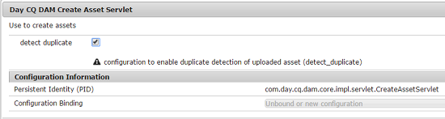

# 启用重复项检测功能 {#enabling-duplicate-detection}

如果您尝试上传存在于Adobe Experience Manager(AEM)资产中的资产，重复检测功能会将其标识为重复。 重复检测默认为禁用。 要启用该功能，请执行以下步骤：

1. 打开 **[!UICONTROL Adobe Experience ManagerWeb控制台配置]** (位于 `https://[server]:[port]/system/console/configMgr`)。
1. Edit the configuration for the servlet **[!UICONTROL Day CQ DAM Create Asset]**.
1. Select the **[!UICONTROL detect duplicate]** option, and click/tap **[!UICONTROL Save]**.

   

检测重复功能现在在AEM Assets启用。 当用户尝试上传AEM中存在的资产时，系统会检查是否存在冲突并指示它。 资产使用存储在的SHA-1哈希进行标识，这 `jcr:content/metadata/dam:sha1`意味着无论文件名如何，都会检测重复资产。

>[!MORELIKETHIS]
>
>* [重复现有存储库中的资产（社区成员提供的教程）](https://experience-aem.blogspot.com/2019/06/aem-65-find-duplicate-assets-binaries-in-existing-repository.html)

