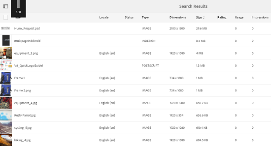

# 增强了AEM中资产的排序 {#enhanced-sorting-of-assets-in-aem}

了解AEM Assets如何通过服务器端排序来一次对文件夹资产或搜索查询进行排序，而不是在客户端按批次对它们进行排序。

增强了Adobe Experience Manager(AEM)Assets的搜索功能，可高效地对文件夹列表视图和搜索结果页面中的大量资产进行排序。 您还可以对时间轴条目进行排序。

AEM Assets通过服务器端排序来一次对文件夹或搜索查询中的整个资产集（无论资产大小）进行排序，而不是在客户端按批次对它们进行排序。 这样，预取的结果可以快速显示在用户界面上，使排序操作更加响应快捷。

## 在列表视图中对资产排序 {#sorting-assets-in-list-view}

AEM Assets允许您根据以下字段对文件夹资产进行排序：

* 区域设置
* 状态
* 类型
* 大小
* 评级
* 修改日期
* 发布日期
* 使用
* 点击量
* 展示次数
* 已签出

1. 导航到包含大量资产的文件夹。
1. 单击/点按布局图标，然后切换到列表视图。

   

1. 单击/点按资产列表中任何列标题旁边的排序图标。

   

   资产列表会根据字段值进行排序。

   

>[!NOTE]
>
>要对`Name`或`Title`列中的值进行排序，请叠加`/libs/dam/gui/content/commons/availablecolumns`并将`sortable`的值更改为`True`。

## 在搜索结果中对资产进行排序 {#sorting-assets-in-search-results}

您可以根据以下字段对搜索结果进行排序：

* 标题
* 状态
* 类型
* 大小
* 修改日期
* 发布日期

1. 从OmniSearch框中，根据所需的条件搜索资产。

   

1. 单击/点按布局图标，然后切换到列表视图。 如果搜索结果已显示在列表视图中，请跳过此步骤。
1. 单击/点按资产列表中任何列标题旁边的排序图标。 资产列表会根据字段值进行排序。

   

## 在时间轴中对资产排序 {#sorting-assets-in-timeline}

AEM Assets允许您按时间顺序对时间轴条目（如批注、版本、工作流和活动）进行排序。

1. 从资产UI中，选择要为其显示时间轴的资产。
1. 单击/点按全局导航图标，然后选择&#x200B;**[!UICONTROL 时间轴]**。

   

1. 在时间轴中，从列表中选择一个条目。 例如，选择&#x200B;**[!UICONTROL Comments]**&#x200B;以显示与资产关联的注释列表。

   

1. 单击/点按&#x200B;**[!UICONTROL Date]**&#x200B;标签旁边的&#x200B;**[!UICONTROL 排序]**&#x200B;图标。 根据您的选择，这些注释会按时间顺序/时间顺序排列，按时间顺序或时间顺序将其添加到资产中。

   
