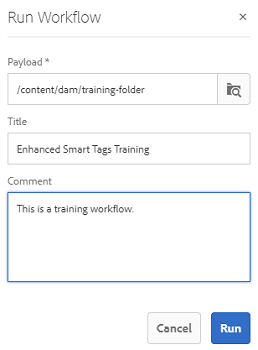
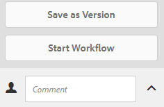

# 增强型智能标记 {#enhanced-smart-tags}

## 增强型智能标记概述{#overview-of-enhanced-smart-tags}

处理数字资产的组织越来越多地在资产元数据中使用分类控制的词汇。 基本上，它包括员工、合作伙伴和客户通常用来引用和搜索特定类别数字资产的关键词列表。 使用分类控制的词汇标记资产可确保通过基于标记的搜索轻松识别和检索资产。

与自然语言词汇相比，基于业务分类的数字资产标记有助于使其与公司的业务保持一致，并确保最相关的资产出现在搜索中。

例如，汽车制造商可以使用型号名称标记汽车图像，以便在搜索各种型号的图像以设计促销活动时，只显示相关图像。

要使智能内容服务应用正确的标记，您必须对其进行培训以识别您的分类。 要培训服务，请首先组织一组最能描述这些资产的资产和标记。 在资产上应用这些标记并运行培训工作流，以帮助服务学习。

培训标记并准备就绪后，该服务现在可以通过标记工作流将这些标记应用于资产。

在后台，智能内容服务使用Adobe Sensei的AI框架，根据您的标记结构和业务分类培训其图像识别算法。 然后，可使用此内容智能对不同的资产集应用相关标记。

智能内容服务是在[!DNL Adobe I/O]上托管的云服务。 要在Adobe Experience Manager(AEM)中使用它，系统管理员必须将您的AEM实例与[!DNL Adobe I/O]集成。

总之，以下是使用智能内容服务的主要步骤：

* 入门
* 审核资产和标记（分类定义）
* 培训智能内容服务
* 自动标记

## 前提条件 {#prerequisites}

在使用智能内容服务之前，请确保满足以下条件以在[!DNL Adobe I/O]上创建集成：

* 具备拥有组织管理员权限的 Adobe ID 帐户。
* 已为您的组织启用智能内容服务。

## 入门 {#onboarding}

智能内容服务可作为AEM的加载项进行购买。 购买后，系统会向贵组织的管理员发送一封电子邮件，其中包含指向[!DNL Adobe I/O]的链接。

管理员可以按照链接将智能内容服务与AEM集成。 要将服务与AEM Assets集成，请参阅[配置智能标记](config-smart-tagging.md)。

管理员配置服务并在AEM中添加用户时，载入过程即已完成。

>[!NOTE]
>
>如果您使用的是AEM 6.3或更低版本，并且需要为资产提供自动标记服务，请参阅[智能标记](https://helpx.adobe.com/experience-manager/6-3/assets/using/touch-ui-smart-tags.html)。 智能标记不使用AI功能，因此不如增强型智能标记功能准确。

## 审核资产和标记{#reviewing-assets-and-tags}

载入后，您首先需要确定一组标记，以在您的业务环境中最好地描述这些图像。

接下来，查看图像以识别最能代表您产品以满足特定业务需求的图像集。 确保策划集中的资产符合[智能内容服务培训准则](smart-tags-training-guidelines.md)。

将资产添加到文件夹中，并从属性页面将标记应用于每个资产。 然后，在此文件夹上运行培训工作流。 经过策划的资产集使智能内容服务能够使用您的分类定义有效地培训更多资产。

>[!NOTE]
>
>1. 培训是一个不可撤消的过程。 Adobe建议您在对标记培训智能内容服务之前，先查看策划资产集中的标记。
>1. 在开始任何标记的培训之前，请阅读[智能内容服务培训指南](smart-tags-training-guidelines.md)。
>1. 首次培训智能内容服务时，Adobe建议您至少在两个不同的标记上对其进行培训。

>

## 培训智能内容服务{#training-the-smart-content-service}

为使智能内容服务能够识别您的业务分类，请在一组资产上运行该分类，这些资产已经包含与您的业务相关的标记。 培训后，该服务可以对类似的资产集应用相同的分类。

您可以对服务进行多次培训，以提高其应用相关标记的能力。 在每个培训周期后，运行标记工作流并检查您的资产是否进行了正确标记。

您可以定期或根据需要培训智能内容服务。

>[!NOTE]
>
>培训工作流仅在文件夹上运行。

### 定期培训{#periodic-training}

您可以启用智能内容服务，以便对文件夹中的资产和关联的标记进行定期培训。 打开资产文件夹的属性页面，在&#x200B;**[!UICONTROL 详细信息]**&#x200B;选项卡下选择&#x200B;**[!UICONTROL 启用智能标记]**，然后保存更改。

为文件夹选择此选项后，AEM会自动运行培训工作流，以对文件夹资产及其标记上的智能内容服务进行培训。 默认情况下，培训工作流每周在星期六凌晨12:30运行。

### 按需培训{#on-demand-training}

您可以根据需要从工作流控制台中培训智能内容服务。

1. 点按/单击 AEM 徽标，然后转到&#x200B;**[!UICONTROL 工具 > 工作流 > 模式]**。
1. 从&#x200B;**[!UICONTROL 工作流模型]**&#x200B;页面中，选择&#x200B;**[!UICONTROL 智能标记培训]**&#x200B;工作流，然后点按/单击工具栏中的&#x200B;**[!UICONTROL 启动工作流]**。
1. 在&#x200B;**[!UICONTROL 运行工作流]**&#x200B;对话框中，浏览到有效负荷文件夹，该文件夹包含用于培训服务的标记资产。
1. 指定工作流的标题并添加注释。 然后，点按/单击&#x200B;**[!UICONTROL 运行]**。 将提交资产和标记以供培训。

   

>[!NOTE]
>
>在处理文件夹中的资产以进行培训后，只会在后续培训周期中处理已修改的资产。

### 查看培训报告{#viewing-training-reports}

要检查是否在资产培训集中的标记上对智能内容服务进行了培训，请从报表控制台中查看培训工作流报表。

1. 点按/单击 AEM 徽标，然后转到&#x200B;**[!UICONTROL 工具 > Assets > 报表]**。
1. 在&#x200B;**[!UICONTROL 资产报表]**&#x200B;页面中，点按/单击&#x200B;**[!UICONTROL 创建]**。
1. 选择&#x200B;**[!UICONTROL 智能标记培训]**&#x200B;报表，然后点按/单击工具栏中的&#x200B;**[!UICONTROL 下一步]**。
1. 指定报表的标题和描述。在&#x200B;**[!UICONTROL 计划报告]**&#x200B;下，保持选中&#x200B;**[!UICONTROL 立即]**&#x200B;选项。如果要安排以后的计划报告，请选择&#x200B;**[!UICONTROL 稍后]**，然后指定日期和时间。然后，点按/单击工具栏中的&#x200B;**[!UICONTROL 创建]**。
1. 在&#x200B;**[!UICONTROL 资产报表]**&#x200B;页面中，选择生成的报表。要查看报表，请点按/单击工具栏中的&#x200B;**[!UICONTROL 查看]**&#x200B;图标。
1. 查看报告的详细信息。

   报表显示您培训的标记的培训状态。**[!UICONTROL 培训状态]**&#x200B;列中的绿色表示已为标记培训“智能内容服务”。黄色表示服务未针对特定标记进行完整培训。在这种情况下，使用特定标记添加更多图像并运行培训工作流以在标签上完整地培训服务。

   如果在此报表中未看到标记，请再次为这些标记运行培训工作流。

1. 要下载报表，请从列表中选择该报表，然后点按/单击工具栏中的&#x200B;**[!UICONTROL 下载]**&#x200B;图标。 报表将下载为Excel文件。

## 自动标记资产{#tagging-assets-automatically}

在培训了智能内容服务后，您可以触发标记工作流，以自动对其他相似资产集应用适当的标记。

您可以定期或在需要时运行标记工作流。

>[!NOTE]
>
>标记工作流可在资产和文件夹上运行。

### 定期标记{#periodic-tagging}

您可以启用智能内容服务来定期标记文件夹中的资产。 打开资产文件夹的属性页面，在&#x200B;**[!UICONTROL 详细信息]**&#x200B;选项卡下选择&#x200B;**[!UICONTROL 启用智能标记]**，然后保存更改。

为文件夹选择此选项后，智能内容服务会自动为文件夹中的资产添加标记。 默认情况下，标记工作流每天中午12:00运行。

### 按需标记{#on-demand-tagging}

您可以从以下内容触发标记工作流，以便立即标记您的资产：

* “工作流”控制台
* 时间轴

>[!NOTE]
>
>如果您从时间轴运行标记工作流，则一次最多可以对15个资产应用标记。

#### 从工作流控制台中标记资产{#tagging-assets-from-the-workflow-console}

1. 点按/单击 AEM 徽标，然后转到&#x200B;**[!UICONTROL 工具 > 工作流 > 模式]**。
1. 从&#x200B;**[!UICONTROL 工作流模型]**&#x200B;页面中，选择 **[!UICONTROL DAM 智能标记资产]**&#x200B;工作流，然后点按/单击工具栏中的&#x200B;**[!UICONTROL 启动工作流]**。

   

1. 在&#x200B;**[!UICONTROL 运行工作流]**&#x200B;对话框中，浏览到包含要自动应用标记的资产的有效负荷文件夹。
1. 指定工作流的标题和可选注释。 然后，点按/单击&#x200B;**[!UICONTROL 运行]**。

   

   导航到资产文件夹并查看标记，以验证智能内容服务是否正确标记了您的资产。 有关详细信息，请参阅[管理智能标记](managing-smart-tags.md)。

#### 从时间轴{#tagging-assets-from-the-timeline}标记资产

1. 从Assets用户界面中，选择包含要应用智能标记的资产或特定资产的文件夹。
1. 点按/单击GlobalNav图标，然后打开时间轴。
1. 点按/单击底部的箭头，然后点按/单击&#x200B;**[!UICONTROL 启动工作流]**。

   

1. 选择&#x200B;**[!UICONTROL DAM智能标记资产]**&#x200B;工作流，并指定工作流的标题。
1. 点按/单击&#x200B;**[!UICONTROL 开始]**。 工作流会将您的标记应用于资产。 导航到资产文件夹并查看标记，以验证智能内容服务是否正确标记了您的资产。 有关详细信息，请参阅[管理智能标记](managing-smart-tags.md)。

>[!NOTE]
>
>在后续的标记周期中，只有已修改的资产会再次使用新培训的标记进行标记。
>
>但是，如果标记工作流的最后一个标记周期与当前标记周期之间的间隔超过24小时，则即使是未更改的资产也会进行标记。
>
>对于定期标记工作流，当间隔超过6个月时，将标记未更改的资产。
