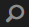

# GQL全文搜索 {#gql-full-text-search}

浏览[!DNL Experience Manager] Assets中的GQL全文搜索功能。 可使用它根据特定元数据（如标题、描述和作者名称）搜索资产。

通过 GQL 全文搜索功能，您可以根据标题、描述和作者等特定元数据来搜索资产。

要根据资产的元数据（例如标题）搜索资产，请在搜索面板中指定元数据关键字后跟其值。GQL全文搜索功能将仅获取其元数据与您输入的相应值完全匹配的资产。

例如，要搜索标题为“Target”的资产，请执行以下步骤：

## 搜索资产 {#searching-assets}

1. 在Assets用户界面的工具栏中，单击或点按&#x200B;**[!UICONTROL 搜索]**&#x200B;图标，以显示Omnisearch框。

   

1. 在Omnisearch框中光标，按Enter。
1. 单击或点按GlobalNav图标以显示&#x200B;**[!UICONTROL Filters]**&#x200B;面板。
1. 在Omni Search框中，指定值“Target”。 要将搜索限制为特定文件夹，请单击或点按“筛选器”面板中的浏览图标，然后选择该文件夹。 在这种情况下，仅在文件夹及其下的子文件夹内搜索匹配项。

   >[!NOTE]
   >
   >您还可以对文件夹执行全文搜索。 在这种情况下，必须指定非空全文搜索词。

   

1. 按&#x200B;**[!UICONTROL Enter]**。 [!DNL Assets]用户界面仅显示标题与“Target”完全匹配的资产。

GQL全文搜索功能允许您根据以下内容搜索资产：

* 通过使用 And 运算将您为多个元数据字段（属性）指定的值进行组合而构成的复杂查询
* 一个元数据字段的多个值
* 子字符串匹配

GQL全文搜索功能允许您根据以下元数据属性搜索资产。属性的名称（例如作者、标题等）和值区分大小写。

>[!NOTE]
>
>GQL全文搜索仅适用于全文谓词。

| 属性 | 搜索格式（facet值） |
|---|---|
| [!UICONTROL 标题] | title:John |
| [!UICONTROL 创建者] | creator:John |
| [!UICONTROL 参与者] | contributor:John |
| [!UICONTROL 位置] | location:India |
| [!UICONTROL 描述] | description:&quot;Sample Image&quot; |
| [!UICONTROL 创建者工具] | creatortool:&quot;Adobe Photoshop 7.0&quot; |
| [!UICONTROL 版权所有者] | copyrightowner:&quot;Adobe Systems&quot; |
| [!UICONTROL 参与者] | 参与者：John |
| [!UICONTROL 使用条款] | usageterms:&quot;CopyRights Reserved&quot; |
| [!UICONTROL 创建时间] | 已创建:YYYY-MM-DDTHH:MM:SS.000+05:30.YYYY-MM-DDTHH:MM:SS.000+05:30 |
| [!UICONTROL 过期日期] | expires:YYYY-MM-DDTHH:MM:SS.000+05:30..YYYY-MM-DDTHH:MM:SS.000+05:30 |
| [!UICONTROL 开始时间] | ontime:YYYY-MM-DDTHH:MM:SS.000+05:30.YYYY-MM-DDTHH:MM:SS.000+05:30 |
| [!UICONTROL 结束时间] | offtime:YYYY-MM-DDTHH:MM:SS.000+05:30.YYYY-MM-DDTHH:MM:SS.000+05:30 |
| [!UICONTROL 时间范围] （过期日期、开始时间、结束时间） | facet字段：下限……上限 |
| [!UICONTROL 路径] | /content/dam/&lt;folder name> |
| [!UICONTROL PDF 标题] | pdftitle:&quot;Adobe Document&quot; |
| [!UICONTROL 主题] | subject:&quot;Training&quot; |
| [!UICONTROL 标记] | tags:&quot;Location And Travel&quot; |
| [!UICONTROL 类型] | type:&quot;image\png&quot; |
| [!UICONTROL 图像宽度] | width:lowerbound..上限 |
| [!UICONTROL 图像高度] | height:lowerbound..上限 |
| [!UICONTROL 人员] | person:John |

以下是复杂查询的一些搜索格式示例：

* 要显示带有多个彩块化字段的所有资产（例如：“标题”为 John Doe，且“创建者工具”为 Adobe Photoshop），请使用以下搜索格式：

tiltle:&quot;John Doe&quot; creatortool :Adobe&amp;ast;

* 要显示彩块化值不是单个字词而是句子的所有资产（例如：“标题”为 Scott Reynolds），请使用以下搜索格式：

title:&quot;Scott Reynolds&quot;

* 要显示含有的一个属性具有多个值的资产（例如：“标题”为 Scott Reynolds 或 John Doe），请使用以下搜索格式：

title:&quot;Scott Reynolds&quot; OR &quot;John Doe&quot;

* 要显示含有的属性值以特定字符串开头的资产（例如：“标题”为 Scott Reynolds），请使用以下搜索格式：

title:&quot;Scott&quot;

* 要显示含有的属性值以特定字符串结束的资产（例如：“标题”为 Scott Reynolds），请使用以下搜索格式：

title:&quot;Reynolds&quot;

* 要显示含有的属性值包含特定字符串的资产（例如：“标题”为 Basel Meeting Room），请使用以下搜索格式：

标题：&quot;Meeting&quot;;

* 要显示包含特定字符串并带有特定属性值的资产（例如：在“标题”为 John Doe 的资产中搜索字符串 Adobe），请使用以下搜索格式：

&amp;ast;Adobe&amp;ast;title:&quot;John Doe &quot;OR title:&quot;John Doe&quot; &amp;ast;Adobe&amp;ast;

>[!NOTE]
>
>不能将属性路径、限制、大小和orderby与任何其他属性绑定。
>
>用户生成属性的关键字是其属性编辑器中的字段标签（以小写形式显示），并删除空格。

>[!NOTE]
>
>如果您编写JCR查询以仅搜索子资产，则还会显示匹配的引用资产以及匹配的子资产。

全文搜索还支持诸如 — 、^等运算符。 要将这些字母作为字符串文字搜索，请用双引号将搜索表达式引住。 例如，使用“Notebook - Beauty”而不是“Notebook - Beauty”。

## 提升搜索 {#boosting-search}

您可以提高特定资产的关键词相关性，以帮助根据关键词提高搜索量。 换言之，在您基于这些关键词进行搜索时，向其促销特定关键词的图像会显示在搜索结果的顶部。

1. 从资产UI中，打开要提升关键词的资产的属性页面。
1. 切换到&#x200B;**[!UICONTROL Advanced]**&#x200B;选项卡，然后单击/点按&#x200B;**[!UICONTROL 提升搜索关键词]**&#x200B;下的&#x200B;**[!UICONTROL 添加]**。

   

1. 在&#x200B;**[!UICONTROL 搜索提升]**&#x200B;框中，指定要提升对图像搜索的关键字，然后单击/点按&#x200B;**[!UICONTROL 添加]**。 如有必要，请以相同方式指定多个关键词。

   

1. 单击/点按&#x200B;**[!UICONTROL 保存并关闭]**。
1. 使用Omnisearch框搜索关键词。 您为其促销此关键词的资产将显示在热门搜索结果中。
