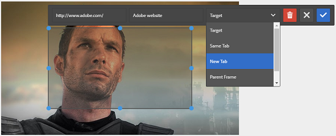

# 添加图像映射{#adding-image-maps}

了解如何将超链接的图像映射添加到图像资源。

图像映射允许您添加一个或多个超链接区域，这些区域的功能与其他超链接类似。

1. 执行以下任一操作以打开&#x200B;**[!UICONTROL 就地图像编辑器]**:

   * 使用快速操作，点按&#x200B;**[!UICONTROL 卡片]**&#x200B;视图中资产上显示的&#x200B;**[!UICONTROL 编辑]**&#x200B;图标。 在列表视图中，选择资产，然后点按工具栏中的&#x200B;**编辑**&#x200B;图标。

      >[!NOTE]
      >
      >快速操作在&#x200B;**[!UICONTROL 列表]**&#x200B;视图中不可用。

   * 在&#x200B;**[!UICONTROL 卡片]**&#x200B;或&#x200B;**[!UICONTROL 列表]**&#x200B;视图中，选择资产并点按工具栏上的&#x200B;**[!UICONTROL 编辑]**&#x200B;图标。
   * 点按资产页面中的&#x200B;**[!UICONTROL 编辑]**&#x200B;图标。

      

1. 要插入图像映射，请点按工具栏中的&#x200B;**[!UICONTROL 启动映射]**&#x200B;图标。

   

1. 选择图像映射的形状。 所选形状的热点将放置在图像上。

   

1. 点按热点，然后输入URL和替代文本。 在&#x200B;**[!UICONTROL 目标]**&#x200B;列表中，指定要显示图像映射的位置，例如同一选项卡、新选项卡或iFrame。 例如，输入`https://www.adobe.com`作为URL，输入`Adobe website`作为替代文本，然后从&#x200B;**[!UICONTROL 目标]**&#x200B;列表中指定&#x200B;**[!UICONTROL 新建选项卡]**，以使图像映射在新选项卡中打开。

   

1. 点按&#x200B;**[!UICONTROL 确认]**&#x200B;图标，然后点按工具栏中的&#x200B;**[!UICONTROL 完成]**&#x200B;图标以保存更改。

   

   要删除图像映射，请点按热点，然后点按&#x200B;**[!UICONTROL 删除]**&#x200B;图标。

   

1. 要视图图像映射，请导航到资产详细信息页面，然后将光标悬停在图像上。

   

   如果启用了Dynamic Media选项，请导航到资产编辑器，然后点按&#x200B;**[!UICONTROL 映射]**&#x200B;图标以视图所有已应用的图像映射。
