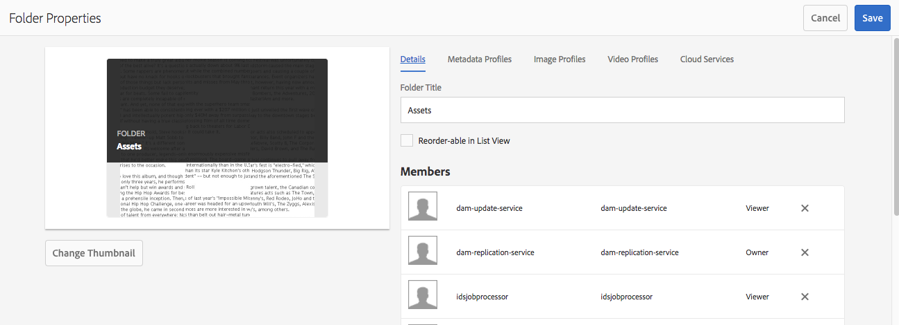
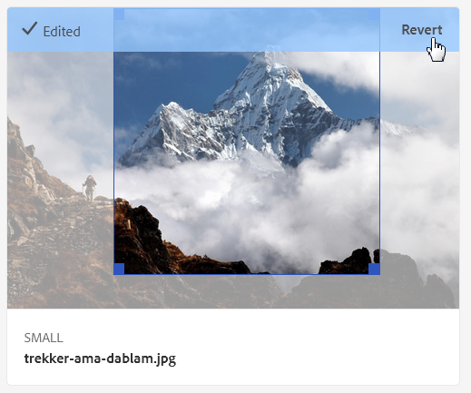

# Dynamic Media image profiles {#image-profiles}

上传图像时，您可以通过将图像用户档案应用到文件夹，在上传时自动裁剪图像。

>[!NOTE]
>
>智能裁切仅在Dynamic Media -Scene7模式下可用。

>[!IMPORTANT]
>
>图像用户档案不适用于PDF、GIF或INDD(Adobe InDesign)文件。

## Crop options {#crop-options}

<!-- CQDOC-16069 for paragraph directly below -->

智能裁剪坐标取决于长宽比。 即，对于图像用户档案中的各种智能裁剪设置，如果长宽比对于图像用户档案中添加的尺寸是相同的，则会将相同的长宽比发送到Dynamic Media。 因此，Adobe建议您使用相同的裁剪区域。 这样做将确保不会影响图像用户档案中使用的不同尺寸。

请注意，您创建的每个智能裁剪生成都需要额外的处理。 例如，添加五个以上的智能裁剪长宽比可能会导致资产摄取速度变慢。 它还可能增加系统的负载。 由于您可以在文件夹级别应用智能裁剪，因此Adobe建议您仅在需要智能裁剪的 *位置* ，在文件夹上使用它。

您有两个图像裁剪选项可供您选择。 您还可以选择自动创建颜色和图像色板。

<table> 
 <tbody> 
  <tr> 
   <td><strong>选项</strong></td> 
   <td><strong>何时使用</strong></td> 
   <td><strong>描述</strong></td> 
  </tr> 
  <tr> 
   <td>像素裁剪</td> 
   <td>仅根据尺寸批量裁切图像。</td> 
   <td>
要使用此选项，请从“ <strong>裁剪选项</strong> ”下拉列表中选择“像素裁剪”。
 
要从图像的侧边进行裁剪，请输入要从图像的任一侧边或各个侧边裁剪的像素数。裁剪的图像多少取决于图像文件中的 ppi（每英寸像素数）设置。
 
图像用户档案像素裁剪采用以下方式进行渲染：  
 
    <ul> 
     <li>值包括顶部、底部、左侧和右侧。</li> 
     <li>左上角被视为0,0，并从那里计算像素裁剪。</li> 
     <li>裁剪起点：左为X，上为Y</li> 
     <li>水平计算：原始图像的水平像素尺寸减去“左”，然后减去“右”。</li> 
     <li>垂直计算：垂直像素高度减去“顶部”，然后减去“底部”。</li> 
    </ul> 
例如，假定您的图像为4000 x 3000像素。 您使用以下值：顶部=250，底部=500，左侧=300，右侧=700。
 
从左上角(300,250)，使用（4000-300-700、3000-250-500或3000,2250）的填充空间进行裁剪。
 </td> 
  </tr> 
  <tr> 
   <td>智能裁剪</td> 
   <td>根据图像的可视焦点批量裁剪图像。</td> 
   <td>
Smart Crop利用Adobe Sensei人工智能的强大功能快速实现批量图像裁剪自动化。 Smart Crop可自动检测并裁切到任何图像的焦点，以捕获预期的兴趣点，而不管屏幕大小。
 
要使用智能裁剪，请 <strong>从“裁剪选项</strong> ”下拉列表中选择智能裁剪，然后在响应式图像裁剪的右侧，启用（打开）该功能。
 
大、中和小的默认断点大小通常涵盖大多数图像在移动和平板电脑设备、桌面和横幅上使用的所有大小。 如果需要，可以编辑“大”、“中”和“小”的默认名称。
 
要添加更多断点，请单击“添 <strong>加裁剪”</strong>;要删除裁剪，请单击垃圾桶图标。
 </td> 
  </tr> 
  <tr> 
   <td>颜色和图像样本</td> 
   <td>批量为每个图像生成一个图像样本。</td> 
   <td>
<strong>注意</strong>:Dynamic Media Classic不支持智能色板。
 
从显示颜色或纹理的产品图像自动定位和生成高质量样本。
 
要使用颜色和图像色板， <strong>请从</strong> “裁剪选项”下拉列表中选择“智能裁剪”，然后在“颜色和图像色板”的右侧，启用（打开）该功能。 在“宽度”和“高度”文本框中输入像素值。
 
虽然所有图像裁剪都可从演绎版边栏中使用，但只能通过复制URL功能使用色板。 请注意，必须使用您自己的查看组件在站点上呈现色板。 (这种情况的例外是传送横幅。 Dynamic Media为传送横幅中使用的色板提供查看组件。)
 
<strong>使用图像色板</strong>
 
图像样本的URL非常简单。 即：
 
<code>/is/image/company/&lt;asset_name&gt;:Swatch</code>
 
其中， <code>:Swatch</code> 资产请求会附加到该资产请求。
 
<strong>使用色板</strong>
 
要使用色板，您需要 <code>req=userdata</code> 使用以下项：
 
<code>/is/image/&lt;company_name&gt;/&lt;swatch_asset_name&gt;:Swatch?req=userdata</code>
 
例如，以下是Dynamic Media Classic(Scene7)中的样本资产：
 
<code>https://my.company.com:8080/is/image/DemoCo/Sleek:Swatch</code>
 
下面是样本资产的相应 <code>req=userdata</code> URL:
 
<code>https://my.company.com:8080/is/image/DemoCo/Sleek:Swatch?req=userdata</code>
 
答 <code>req=userdata</code> 复如下：
 
<code class="code">SmartCropDef=Swatch
       SmartCropHeight=200.0
       SmartCropRect=0.421671,0.389815,0.0848564,0.0592593,200,200
       SmartCropType=Swatch
       SmartCropWidth=200.0
       SmartSwatchColor=0xA56DB2</code>
 
您还可以请 <code>req=userdata</code> 求XML或JSON格式的响应，如以下各个URL示例所示：
 
<code>https://my.company.com:8080/is/image/DemoCo/Sleek:Swatch?req=userdata,xml</code>

<code>SmartSwatchColor</code>

</td></tr></tbody></table>

## USM 锐化 {#unsharp-mask}

You use **Unsharp Mask** to fine-tune a sharpening filter effect on the final downsampled image. You can control intensity of effect, radius of the effect (measured in pixels), and a threshold of contrast that will be ignored. This effect uses the same options as Adobe Photoshop’s “Unsharp Mask” filter.

>[!NOTE]
>
>USM锐化仅应用于PTIFF（金字塔tiff）中缩减采样率超过50%的缩小再现。 这意味着PTIFF中最大的演绎版不受USM锐化的影响，而缩略图等较小的演绎版则会发生更改（并将显示USM锐化）。

In **Unsharp Mask**, you have the following filtering options:

<table> 
 <tbody> 
  <tr> 
   <td><strong>选项</strong></td> 
   <td><strong>描述</strong></td> 
  </tr> 
  <tr> 
   <td>数量</td> 
   <td>控制应用于边缘像素的对比度量。 默认值为1.75。对于高分辨率图像，最高可将其增加到5。 可以考虑使用数量来衡量滤镜强度。范围是0-5。</td> 
  </tr> 
  <tr> 
   <td>半径</td> 
   <td>确定边缘像素周围影响锐化的像素数量。对于高分辨率图像，输入 1 到 2。低值仅锐化边缘像素；高值锐化较宽范围的像素。正确的值取决于图像大小。默认值为0.2。范围为0-250。</td> 
  </tr> 
  <tr> 
   <td>阈值</td> 
   <td>
确定应用USM锐化滤镜时要忽略的对比度范围。换句话说，此选项确定锐化的像素与周围区域必须存在多大的不同，才能被视为边缘像素并进行锐化。 要避免引入杂色，请尝试0到255之间的值。
 </td> 
  </tr> 
 </tbody> 
</table>

有关“锐化”的信息，请参阅[锐化图像](/help/assets/assets/s7_sharpening_images.pdf)。

## Creating Dynamic Media image profiles {#creating-image-profiles}

要为其他资产类型定义高级处理参数，请参 [阅配置资产处理](config-dms7.md#configuring-asset-processing)。

**要创建Dynamic Media图像用户档案，请执行以下操作**:

1. Tap the AEM logo and navigate to **[!UICONTROL Tools > Assets > Image Profiles]**.
1. 点按 **[!UICONTROL 创建]** ，以添加新的图像用户档案。
1. 输入用户档案名和／或USM锐化、裁剪或色板值。

   您可能会发现，使用特定于其目标的用户档案名称很有帮助。 例如，如果要创建仅生成色板的用户档案，即禁用（关闭）智能裁剪，启用（打开）颜色和图像色板，则可以使用用户档案名“智能色板”。

   另请参阅[智能裁切和智能色板选项](#crop-options)和[钝化蒙版](#unsharp-mask)。

   

1. 点按&#x200B;**[!UICONTROL 保存]**。此时新创建的配置文件会显示在可用配置文件列表中。

## 编辑或删除Dynamic Media图像用户档案 {#editing-or-deleting-image-profiles}

1. Tap the AEM logo and navigate to **[!UICONTROL Tools > Assets > Image Profiles]**.
1. 选择要编辑或删除的图像配置文件。要编辑图像配置文件，请选择&#x200B;**[!UICONTROL 编辑图像处理配置文件]**。To remove it, select **[!UICONTROL Delete Image Processing Profile]**.

   

1. 如果是进行编辑操作，请保存更改。如果是进行删除操作，请确认您要删除配置文件。

## 将Dynamic Media图像用户档案应用到文件夹 {#applying-an-image-profile-to-folders}

当您将图像配置文件分配给文件夹之后，该文件夹中的所有子文件夹都会自动继承父文件夹的配置文件。这就意味着您只能为每个文件夹分配一个图像配置文件。因此，您在上传、存储、使用资产以及将资产存档的过程中，请妥善安排文件夹结构。

如果您为文件夹分配了一个不同的图像配置文件，新配置文件就会取代之前的配置文件。此前存在的文件夹资产将保持不变。新用户档案将应用于稍后添加到该文件夹的资产。

在用户界面中，卡中显示的用户档案名称会指示已为其分配用户档案的文件夹。

在向现有图像用户档案添加智能裁剪时，如果要为资产存储库中的现有资产生成裁剪， [则需要重新触发](assets-workflow.md) DAM更新资产工作流。

您可以将图像用户档案应用到特定文件夹或全局应用于所有资产。

### 将Dynamic Media图像用户档案应用到特定文件夹 {#applying-image-profiles-to-specific-folders}

您可以从“工具”菜单中将图像配置文件应用到 **[!UICONTROL 文件夹]** ，或者如果您在文件夹中，也可以从“属 **[!UICONTROL 性”]**。 本节将介绍这两种将图像配置文件应用到文件夹的方法。

如果文件夹已经分配了配置文件，则文件夹名称正下方会显示配置文件的名称。

#### Applying Dynamic Media image profiles to folders from Profiles user interface {#applying-image-profiles-to-folders-from-profiles-user-interface}

1. Tap the AEM logo and navigate to **[!UICONTROL Tools > Assets > Image Profiles]**.
1. 选择您要应用到一个或多个文件夹的图像配置文件。

   

1. Tap **[!UICONTROL Apply Processing Profile to Folder(s)]** and select the folder or multiple folders you want use to receive the newly uploaded assets and tap/click **[!UICONTROL Apply]**. 如果文件夹已经分配了配置文件，则文件夹名称正下方会显示配置文件的名称。

#### 从属性将Dynamic Media图像用户档案应用到文件夹 {#applying-image-profiles-to-folders-from-properties}

1. 点按AEM徽标，导航到 **[!UICONTROL 资产]** ，然后导航到您要应用图像用户档案的文件夹。
1. 在文件夹中，点按复选标记以将其选中，然后点按 **[!UICONTROL 属性]**。
1. 点按&#x200B;**[!UICONTROL 图像配置文件]**&#x200B;选项卡。从&#x200B;**[!UICONTROL 配置文件名称]**&#x200B;下拉列表中，选择配置文件，然后点按&#x200B;**[!UICONTROL 保存并关闭]**。如果文件夹已经分配了配置文件，则文件夹名称正下方会显示配置文件的名称。

   

### 全局应用Dynamic Media图像用户档案 {#applying-an-image-profile-globally}

除了将用户档案应用到文件夹之外，您还可以全局应用一个用户档案，以便上传到任何文件夹中的AEM资产的任何内容都应用了选定的。

**要全局应用Dynamic Media图像用户档案**:

1. 执行下列操作之一：

   * 导航到 **https://&lt;AEM服务器>/mnt/overlay/dam/gui/content/assets/foldersharewizard.html/content/dam** ，应用相应的用户档案并点按 **保存**。

      

   * 导航到CRXDE Lite到以下节点： `/content/dam/jcr:content`.

      添加属性， `imageProfile:/conf/global/settings/dam/adminui-extension/imageprofile/<name of image profile>` 然后点 **[!UICONTROL 按全部保存]**。

      

## 编辑单个图像的智能裁剪或智能色板 {#editing-the-smart-crop-or-smart-swatch-of-a-single-image}

>[!NOTE]
>
>智能裁切仅在Dynamic Media -Scene7模式下可用。

您可以手动重新对齐图像的智能裁剪窗口或调整其大小以进一步调整其焦点。

编辑智能裁剪并保存后，更改会传播到您对特定图像使用裁剪的任何地方。

如果需要，您可以重新运行智能裁剪以再次生成其他裁剪。

另请参 [阅编辑多个图像的智能裁剪或智能色板](#editing-the-smart-crop-or-smart-swatch-of-multiple-images)。

**要编辑单个图像的智能裁剪或智能色板，请执行以下操作**:

1. 点按AEM徽标并导航到 **[!UICONTROL 资产]**，然后导航到应用了智能裁剪或智能色板图像用户档案的文件夹。

1. 点按文件夹以打开其内容。
1. 点按要调整其智能裁剪或智能色板的图像。
1. 在工具栏中，点按 **[!UICONTROL 智能裁剪]**。

1. 执行以下操作之一：

   * 在页面的右上角附近，向左或向右拖动滑块条，分别增加或减少图像显示。
   * 在图像上，拖动角手柄以调整裁剪或色板的可查看区域的大小。
   * 在图像上，将框／色板拖动到新位置。 您只能编辑图像色板；色板是静态的。
   * 在图像上方，点按 **[!UICONTROL 还原]** ，以撤消所有编辑并恢复原始裁剪或色板。

1. 在页面的右上角附近，点按保 **[!UICONTROL 存]**，然 **[!UICONTROL 后点]** 按关闭，以返回到资产文件夹。

## 编辑多个图像的智能裁剪或智能色板 {#editing-the-smart-crop-or-smart-swatch-of-multiple-images}

将包含智能裁剪的图像用户档案应用到文件夹后，该文件夹中的所有图像都应用了裁剪。 如果需要，您可以手 *动重新* 对齐或调整多个图像中的智能裁剪窗口的大小，以进一步调整其焦点。

编辑智能裁剪并保存后，更改会传播到您对特定图像使用裁剪的任何地方。

如果需要，您可以重新运行智能裁剪以再次生成其他裁剪。

**要编辑多个图像的智能裁剪或智能色板，请执行以下操作**:

1. 点按AEM徽标并导航到 **[!UICONTROL 资产]**，然后导航到应用了智能裁剪或智能色板图像用户档案的文件夹。
1. 在文件夹中，点按 **[!UICONTROL 更多操作]** (...)图标，然后点按 **[!UICONTROL 智能裁剪]**。

1. 在“编 **[!UICONTROL 辑智能裁切]** ”页面上，执行下列任一操作：

   * 调整页面上图像的查看大小。

      在断点名称下拉列表卡的右侧，向左或向右拖动滑块以更改可查看图像显示的大小。

      

   * 根据断点名称过滤可查看图像的列表。 在以下示例中，图像会在断点名称“Medium”上筛选。

      在页面的右上角附近，从下拉列表卡中选择断点名称以筛选您看到的图像。 （请参阅上图。）

      

   * 调整智能裁剪框的大小。 执行下列任一操作：

      * 如果图像仅包含智能裁剪或智能色板，请在图像上拖动裁剪框的角手柄以调整裁剪的可查看区域的大小。
      * 如果图像同时具有智能裁剪和智能色板，请在图像上拖动裁剪框的角手柄以调整裁剪的可查看区域的大小。 或者，点按或单击图像下方的智能色板（色板为静态），然后拖动裁剪框的角手柄以调整色板可查看区域的大小。

      

   * 移动智能裁剪框。 执行下列任一操作：

      * 如果图像仅具有智能裁剪或智能色板，则在图像上将裁剪框拖到新位置。
      * 如果图像同时具有智能裁剪和智能色板，请在图像上将智能裁剪框拖到新位置。 或者，点按图像下方的智能色板（色板为静态），然后将智能色板裁剪框拖到新位置。

      

   * 撤消所有编辑并恢复原始智能裁剪或智能色板（仅适用于当前编辑会话）。

      点按 **[!UICONTROL 图像]** 上方的还原。

      

1. 在页面的右上角附近，点按&#x200B;**[!UICONTROL 保存]**。然后点 **[!UICONTROL 按关]** 闭以返回资产文件夹。

## Removing an image profile from folders {#removing-an-image-profile-from-folders}

当您将图像配置文件从文件夹删除之后，该文件夹中的所有子文件夹都会自动删除从父文件夹继承的配置文件。但是，此前对文件夹中的文件所做的处理均予以保留。

您可以从“工具”菜单中的文件夹删除图像配置文件；如果您在 **[!UICONTROL 文件夹中]** ，也可以从“属性”中 **[!UICONTROL 删除]**。 本节将介绍这两种将图像配置文件从文件夹删除的方法。

### 通过用户档案用户界面将Dynamic Media图像用户档案从文件夹删除 {#removing-image-profiles-from-folders-via-profiles-user-interface}

1. Tap the AEM logo and navigate to **[!UICONTROL Tools > Assets > Image Profiles]**.
1. 选择您要从一个或多个文件夹删除的图像配置文件。
1. 点按&#x200B;**[!UICONTROL 从文件夹删除处理配置文件]**，然后选择一个或多个要从中删除配置文件的文件夹，然后点按&#x200B;**[!UICONTROL 删除]**。

   您可以确认图像用户档案不再应用于文件夹，因为该名称不再显示在文件夹名称的下方。

### 通过属性将Dynamic Media图像用户档案从文件夹删除 {#removing-image-profiles-from-folders-via-properties}

1. 点按AEM徽标并导 **[!UICONTROL 航]** “资产”，然后导航到您要从中删除图像用户档案的文件夹。
1. 在文件夹中，点按复选标记以选择它，然后点按 **[!UICONTROL 属性]**。
1. Select the **[!UICONTROL Image Profiles]** tab.
1. From the **[!UICONTROL Profile Name]** drop-down list, select **[!UICONTROL None]**, then tap **[!UICONTROL Save &amp; Close]**.

   如果文件夹已经分配了配置文件，则文件夹名称正下方会显示配置文件的名称。
