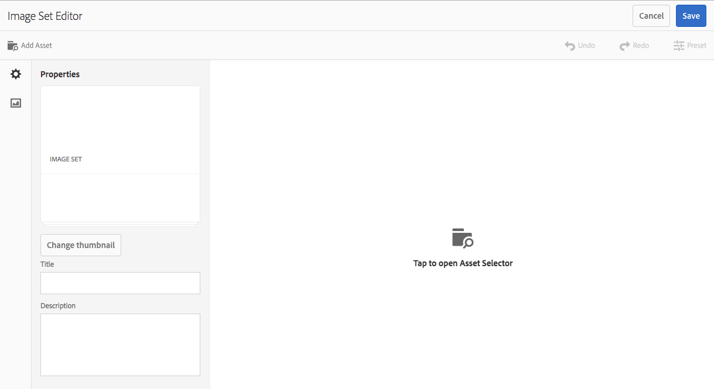

# 图像集 {#image-sets}

借助图像集，用户可以通过单击缩略图来查看项目的不同视图，从而为用户提供集成式查看体验。图像集使您可以展示同一项目的替换视图，并且查看器提供了可用于仔细检查图像的缩放工具。

Image Sets are designated by a banner with the word **[!UICONTROL IMAGESET]**. 此外，如果图像集已发布，则横幅上会显示由 **[!UICONTROL World]** 图标指示的发布日期以及由铅笔图标指示的上次修改日期 **** 。

在图像集中，您还可以通过创建图像集并添加缩略图来创建色板。

当您希望以不同的颜色、模式或外表显示某个项目时，此应用程序尤其有用。要创建带有颜色样本的图像集，您要向用户展示的每种不同的颜色、模式或外表都需要有一个图像。每种颜色、模式或外表还需要有一个颜色、模式或外表样本。

例如，假定您要展示帽檐颜色各异的帽子图像，且帽檐分别为红色、绿色和蓝色。在这种情况下，您需要准备同一款帽子的三张拍照。这三张拍照分别对应红色、绿色和蓝色的帽檐。您还需要准备红色、绿色和蓝色三种颜色的样本。颜色样本用作用户在样本集查看器中单击以查看红标、绿标或蓝标帽子的缩略图。

>[!NOTE]
>
>有关资产用户界面的信息，请参 [阅使用触屏UI管理资产](managing-assets-touch-ui.md)。

## 快速入门：图像集 {#quick-start-image-sets}

要快速设置并运行图像集，请执行以下操作：

1. [为多个视图上传主图像。](#uploading-assets-in-image-sets)

   首先为图像集上传图像。由于用户可以在图像集查看器中缩放图像，因此在选择图像时，请考虑缩放因素。确保图像的最大尺寸至少有2000像素，以实现最佳缩放细节。 Dynamic Media可以渲染每幅高达2500万像素的图像。 例如，您可以使用5000 x 5000万像素的图像或任何其他大小的组合，最高可达2500万像素。

   AEM 资产支持很多种图像文件格式，但建议使用无损的 TIFF、PNG 和 EPS 图像。

1. [创建图像集。](#creating-image-sets)

   在图像集中，用户在图像集查看器中单击缩略图。

   要在资产中创建图像集，请点按 **[!UICONTROL 创建>图像集]**。 Then, add images and tap **[!UICONTROL Save]**.

   You can also create image sets automatically through [batch set presets](/help/assets/config-dms7.md#creating-batch-set-presets-to-auto-generate-image-sets-and-spin-sets).

   **重要** -批集由IPS（图像生产系统）创建，作为资产摄取的一部分，并且仅在Dynamic Media -Scene7模式下可用。

   See [Preparing Image Set assets for upload and Uploading your files](#uploading-assets-in-image-sets).

   See [Working with Selectors.](working-with-selectors.md)

1. Add [Image Set Viewer presets](managing-viewer-presets.md), as needed.

   Administrators can create or modify Image **[!UICONTROL Set Viewer Presets]**. To see your image set with a viewer preset, select the image set, and in the left-rail drop-down menu, select **[!UICONTROL Viewers]**.

   See **[!UICONTROL Tools > Assets > Viewer Presets]** to create or edit viewer presets.

1. （可选）查 [看使用批集](image-sets.md#viewing-image-sets) 预设创建的图像集。
1. [预览图像集。](previewing-assets.md)

   选择图像集后，您便可以预览该图像集。点按缩略图图标以在选定的查看器中检查图像集。 您可以从左边栏下拉菜 **[!UICONTROL 单的]** “查看器”菜单中选择不同的查看器。

1. [发布图像集。](publishing-dynamicmedia-assets.md)

   发布图像集时，将会激活 URL 和嵌入字符串。此外，您必须发 [布已创建的任何自定义](managing-viewer-presets.md) 查看器预设。 现成查看器预设已发布。

1. [将URL关联到Web 应用程序](linking-urls-to-yourwebapplication.md) , [或嵌入视频查看器或图像查看器](embed-code.md)。

   在发布图像集后，AEM 资产会为该图像集创建 URL 调用并将其激活。预览资产时，您可以复制这些 URL。或者，也可以将它们嵌入到您的网站上。

   选择图像集，然后在左边栏下拉菜单中选择&#x200B;**[!UICONTROL 查看器]**。

   请参 [阅将图像集链接到网页和嵌入视](linking-urls-to-yourwebapplication.md) 频查看器或图像查看器 。

要编辑图像集，请参阅编 [辑图像集。](#editing-image-sets) 此外，您还可以视图和编 [辑图像集属性](managing-assets-touch-ui.md#editing-properties)。

如果您在创建集时遇到问题，请参阅Dynamic Media -Scene7模式 [疑难解答中的图像和集](troubleshoot-dms7.md#images-and-sets)。

## Uploading assets in Image Sets {#uploading-assets-in-image-sets}

首先为图像集上传图像。由于用户可以在图像集查看器中缩放图像，因此在选择图像时，请考虑缩放因素。确保图像的最大尺寸至少为2000像素。图像集支持很多种图像文件格式，但建议使用无损的 TIFF、PNG 和 EPS 图像。

You can upload images for Image Sets as you would [upload any other asset in Assets](managing-assets-touch-ui.md#uploading-assets).

### 准备要上传的图像集资产 {#preparing-image-set-assets-for-upload}

在创建图像集之前，请确保图像的大小和格式均合适。

要创建多视图的图像集，您需要多个图像，它们要从不同视角显示一个项目或显示同一项目的不同方面。其目标是突出一个项目的各项重要功能，以便查看者能够全面地了解该项目的外观或用途。

由于用户可以缩放图像集中的图像，请确保图像的最大尺寸至少有 2000 像素。资产支持很多种图像文件格式，但建议使用无损的 TIFF、PNG 和 EPS 图像。

>[!NOTE]
>
>此外，如果您使用缩略图指示产品样本，则需要以下各项：
>
>您需要小插图，也就是同一图像的不同拍照，以显示该图像的不同颜色、模式或外表。您还需要与不同颜色、模式或外表相对应的缩略图文件。例如，要通过显示同一款夹克的黑色、咖色和绿色版的图像集展示缩略图，您需要：
>
>* 同一款夹克的黑色、咖色和绿色版拍照。
>* 黑色、咖色和绿色版的缩略图。

>

## 创建图像集 {#creating-image-sets}

您可以通过用户界面或API创建图像集。 本节介绍如何在用户界面中创建图像集。

>[!NOTE]
>
>You can also create image sets automatically through [batch set presets](/help/assets/config-dms7.md#creating-batch-set-presets-to-auto-generate-image-sets-and-spin-sets).

**重要：** 批集由IPS（图像生产系统）创建，作为资产摄取的一部分，并且仅在Dynamic Media -Scene7模式下可用。

将资产添加到资产集时，资产会按字母数字顺序自动添加。 在添加资产后，您可以手动对资产重新排序或排序。

>[!NOTE]
>
>文件名中包含(逗 `,` 号)的资产不支持图像集。

**要创建图像集，请执行以下操作**:

1. In **Assets**, navigate to where you want to create an image set, tap **[!UICONTROL Create]**, and select **[!UICONTROL Image Set]**. 您还可以从包含资产的文件夹中创建旋转集。

   

1. 在“图像集编辑器”页面的“标 **[!UICONTROL 题]** ”字段中，输入图像集的名称。 该名称会显示在图像集的横幅中。（可选）输入说明。

   

   >[!NOTE]
   >
   >创建图像集时，您可以更改图像集缩略图，或允许 AEM 根据图像集中的资产自动选择缩略图。To select a thumbnail, tap **[!UICONTROL Change thumbnail]** and select any image (you can navigate to other folders to find images as well). 如果您选择了缩略图，然后决定让 AEM 从图像集生成缩略图，请选择&#x200B;**[!UICONTROL 切换到自动缩略图]**。

1. 执行以下操作之一：

   * 在“图像集编辑器”页 **[!UICONTROL 面的左上角]** ，点按 **[!UICONTROL 添加资产]**。
   * 在“图像集编辑 **[!UICONTROL 器”页面的中]** 间，点 **[!UICONTROL 按以打开资产选择器]**。

   点按以选择要包含在图像集中的资产。 选定资产上有一个复选标记图标。When you are finished, near the upper-right corner of the page, tap **[!UICONTROL Select]**.

   借助资产选择器，您可以通过键入关键字并点按&#x200B;**[!UICONTROL 返回]**&#x200B;来搜索资产。您还可以应用过滤器来优化搜索结果。您可以按路径、收藏集、文件类型和标记进行过滤。选择过滤器，然后点按工具栏上的&#x200B;**[!UICONTROL 过滤器]**&#x200B;图标。Change the view by tapping the **[!UICONTROL View]** icon and selecting **[!UICONTROL Column View]**, **[!UICONTROL Card View]**, or **[!UICONTROL List View]**.

   See [Working with Selectors.](working-with-selectors.md)

   

1. 将资产添加到资产集时，资产会按字母数字顺序自动添加。 在添加资产后，您可以手动对资产重新排序或排序。

   如有必要，请将资产的“ **[!UICONTROL 重新排序]** ”图标拖至资产文件名的右侧，以在设置的列表中向上或向下重新排序图像。

   

   If you want to change a thumbnail or swatch, tap the **[!UICONTROL Thumbnail]** icon next to the image and navigate to the thumbnail or swatch you want. When done selecting all the images tap **[!UICONTROL Save]**.

1. （可选）执行以下操作之一：

   * 要删除图像，请选择该图像，然后点按删 **[!UICONTROL 除资产]**。
   * To apply a preset, near the upper-right corner of the page, tap **[!UICONTROL Preset]**, then select a preset to apply to all the assets at once.

1. 点按&#x200B;**[!UICONTROL 保存]**。您新创建的图像集会显示在创建时所用的文件夹中。

## 查看图像集 {#viewing-image-sets}

您可以在用户界面中创建图像集，也可以使用批 [集预设自动创建](/help/assets/config-dms7.md#creating-batch-set-presets-to-auto-generate-image-sets-and-spin-sets)。

**重要** —批集由IPS图像生 [产系统创建] ，作为资产摄取的一部分，并且仅在Dynamic Media -Scene7模式下可用。)

但是，使用批集预设创建的集 *不会* 显示在用户界面中。 您可以通过三种不同的方式视图这些集。 （即使您在用户界面中创建了图像集，这些方法也可用。）

* 打开单个资产的属性时。 属性指明所选资产是其成员(在“集 **[!UICONTROL 成员”下]**)。 点按集的名称可查看整个集。

   

* 来自任何集的成员图像。Select the **[!UICONTROL Sets]** menu to display the sets that the asset is a member of.

   

* From search, you can select **[!UICONTROL Filters]**, then expand **[!UICONTROL Dynamic Media]** and select **[!UICONTROL Sets]**.

   搜索会返回在UI中手动创建或通过批集预设自动创建的匹配集。 对于自动集，搜索查询使用与AEM搜索不同的“具有开始”搜索条件（基于使用“包含”搜索条件）进行。 将过滤器设 **[!UICONTROL 置为]** “集”是搜索自动集的唯一方法。

   

>[!NOTE]
>
>您可以按照编辑图像集中的说明，通过用户界面 [视图集](#editing-image-sets)。

## 编辑图像集 {#editing-image-sets}

您可以对图像集执行各种编辑任务，如：

* 向图像集中添加图像。
* 对图像集中的图像重新排序。
* 删除图像集中的资产。
* 应用查看器预设。
* 删除图像集。

**要编辑图像集**:

1. 执行下列任一操作：

   * 将鼠标悬停在图像集资产上，然后点按 **[!UICONTROL 编辑]** （铅笔图标）。
   * 将鼠标悬停在图像集资产上，点按 **[!UICONTROL 选择]** （复选标记图标），然后点按工 **[!UICONTROL 具栏]** 上的编辑。
   * 点按图像集资产，然后点按工 **[!UICONTROL 具栏]** 上的编辑（铅笔图标）。

1. 要编辑图像集中的图像，请执行以下任意操作：

   * 要对资产重新排序，请将图像拖动到新位置（选择重新排序图标以移动项目）。
   * 要按升序或降序对项目排序，请点按列标题。
   * To add an asset or update an existing asset, tap the **[!UICONTROL Add Asset]**. 导航到资产，选择它，然 **[!UICONTROL 后点]** 按页面右上角附近的选择。

   >[!NOTE]
   >如果通过将缩略图替换为其他图像来删除AEM用的缩略图图像，则仍会显示原始资产。

   * 要删除资产，请选择该资产，然后点按删 **[!UICONTROL 除资产]**。
   * To apply a preset, near the upper-right corner of the page, tap **[!UICONTROL Preset]**, then select a viewer preset.
   * 要添加或更改缩略图，请选择资产右侧的缩略图图标。 导航到新的缩略图或样本资产，将其选中，然后点按 **[!UICONTROL 选择]**。
   * To delete an entire Image Set, navigate to the Image Set, select it, and tap **[!UICONTROL Delete]**.

   >[!NOTE]
   >
   >您可以导航到图像组，点按左边栏中的&#x200B;**[!UICONTROL 设置成员]**，然后点按单个资产上的“铅笔”图标以打开编辑窗口，来编辑图像。****

1. 完成 **[!UICONTROL 编辑]** 后，点按保存。

## 预览图像集 {#previewing-image-sets}

See [Previewing assets](previewing-assets.md).

## 发布图像集 {#publishing-image-sets}

请参阅[发布资产](publishing-dynamicmedia-assets.md)。
