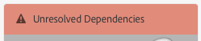
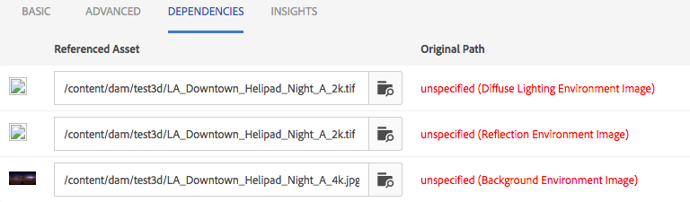

# 安装和配置AEM 3D {#installing-and-configuring-aem-d}

>[!IMPORTANT]
>
>AEM 6.4中不再支持AEM 3D。 Adobe建议您将AEM中的3D资源功 [能用作Cloud Service](https://docs.adobe.com/content/help/en/experience-manager-cloud-service/assets/dynamicmedia/assets-3d.html)[或AEM 6.5.3或更高版本。](https://docs.adobe.com/content/help/en/experience-manager-65/assets/dynamic/assets-3d.html)

AEM 3D（版本3.0）的安装和配置涉及以下事项：

1. 安装Autodesk® FBX® SDK库。
1. 下载和安装本机3D代码包。
1. 配置3D资产摄取工作流并重新启动AEM。
1. 验证AEM 3D的设置。

另请参阅 [使用3D资产](assets-3d.md)。

另请参 [阅AEM 3D Assets发行说明](/help/release-notes/aem3d-release-notes.md) ，了解先决条件、支持的浏览器以及其他重要的发行说明。

另请参阅 [使用3D站点组件](using-the-3d-sites-component.md)。

>[!NOTE]
>
>在下载和安装3D包之前，请确保您已成功安装所有必备的AEM包。 See the [AEM 3D Release Notes.](install-config-3d.md)

## 安装Autodesk FBX SDK库 {#installing-the-autodesk-fbx-sdk-library}

本机AEM 3D代码需要Autodesk FBX库来支持FBX文件格式。 (Adobe当前无法再分发此库。)

另请参阅 [高级配置设置](advanced-config-3d.md)。

1. 登录安装AEM的主机。

   * 如果这是Windows服务器部署，请以管理员身份登录到服务器。
   * 如果这是MAC或Windows桌面，请确保您具有管理员权限。

1. 使用适用于您的操作系统的链 **接下载FBX SDK 2016.1.2版**

   * **Windows**

      [https://download.autodesk.com/us/fbx_release_older/2016.1.2/fbx20161_2_fbxsdk_vs2010_win.exe](https://download.autodesk.com/us/fbx_release_older/2016.1.2/fbx20161_2_fbxsdk_vs2010_win.exe)

   * **OS X**

      [https://download.autodesk.com/us/fbx_release_older/2016.1.2/fbx20161_2_fbxsdk_clang_mac.pkg.tgz](https://download.autodesk.com/us/fbx_release_older/2016.1.2/fbx20161_2_fbxsdk_clang_mac.pkg.tgz)

   * **Linux**

      [https://download.autodesk.com/us/fbx_release_older/2016.1.2/fbx20161_2_fbxsdk_linux.tar.gz](https://download.autodesk.com/us/fbx_release_older/2016.1.2/fbx20161_2_fbxsdk_linux.tar.gz)

1. 安装FBX SDK:

   * Windows. 安装到AEM所在的同一驱动器。
   * Mac。 安装到AEM所在的同一分区。
   * Linux. 解压下载的包并按照中的说明操作 `<yourFBXSDKpath>/Install_FbxFileSdk.txt`。 将SDK安装到 `/usr`。

## 下载和安装本机3D代码包 {#downloading-and-installing-the-native-d-code-package}

>[!NOTE]
>
>在继续安装和配置AEM 3D之前，Adobe建议您部署任何适用的服务包和其他相关功能包。 See [AEM 3D Release Notes](/help/release-notes/aem3d-release-notes.md).

另请参阅 [高级配置设置](advanced-config-3d.md)。

**安装本机3D代码包**:

1. 执行下列操作之一：

   * 如果这是Windows Server部署，请以管理员身份登录到服务器。
   * 如果这是Mac或Windows桌面，请确保您具有管理员权限。

1. 确保您有支持的浏览器可用于访问AEM。

   请参 [阅系统要求](/help/release-notes/aem3d-release-notes.md#system-requirements)。

1. 访问 [软件分发门户](https://experience.adobe.com/#/downloads/content/software-distribution/en/aem.html)。 找到功能包的3.0.1 `AEM-6.4-DynamicMedia-3D` 版并下载它。

1. 在AEM中，单击“ **[!UICONTROL 工具”>“管理”>“部署”>“包管理器]**”。

1. 将下载的功能包上传到AEM。 找到它并单击“ **[!UICONTROL 安装]**”。

1. 在“安 **[!UICONTROL 装包]** ”对话框中，展开“ **高级设置**”，然后将“ **[!UICONTROL 访问控制处理]** ”设 **置为“**&#x200B;合并”。
1. 单 **[!UICONTROL 击]** “安装”开始安装包。

   该文件 `sample-3D-content.zip` 放在“资产” **[!UICONTROL 根文]** 件夹中。 有关 [其他信息，请参阅验证AEM](#validating-the-setup-of-aem-d) 3D的设置。

## 配置3D资产摄取工作流并重新启动AEM {#configuring-the-d-asset-ingestion-workflow-and-restarting-aem}

**要配置3D资产摄取工作流，请执行以下操作**:

1. 在AEM中，单击AEM徽标以访问全局导航控制台，然后单击工 **[!UICONTROL 具]** 图标并导航 **[!UICONTROL 到工作流>模型]**。
1. 在“工 **[!UICONTROL 作流模型]** ”页面上，将指针悬 **** 停在“DAM更新资产”工作流上，当出现复选标记时，选择它。

1. On the toolbar, click **[!UICONTROL Edit]**.
1. 在“DAM **[!UICONTROL 更新资产]** ”屏幕的AEM浮动面板中，单 **[!UICONTROL 击工作流]** 右侧的加号图标以展开列表。 在列表 **[!UICONTROL 中选择]** “处理步骤”。
1. 拖 **[!UICONTROL 动流程步骤]** ，并将其放入工作流中，就在工作 **[!UICONTROL 流末尾附近的DAM更新资产工作流完成组件之]** 前。

   

1. 多次单击新添加的进程步骤。
1. 在“步 **[!UICONTROL 骤属性]** ”对话框的“公用”选 **[!UICONTROL 项卡的“标]** 题 **[!UICONTROL ”字段下，输入适合的流程说明，如]**`Process 3D content`。
1. Click the **[!UICONTROL Process]** tab.

1. 从“处 **[!UICONTROL 理]** ”(Process)下拉菜单 **[!UICONTROL 中]**，选择“Geometric 3D Object Service”（几何3D对象服务），然后选中“Handler **[!UICONTROL Advance”(处理]** 程序高级)复选框。

   

1. 在对话框的右上角附近，单击复选标记图标以返回到DAM更新资产页面。
1. 在“DAM更新资产”页面 **[!UICONTROL 的右上角]** ，单击 **[!UICONTROL 同步以保存已编]** 辑的工作流模型。
1. 重新启动AEM。

   重新启动后，您可以上传3D内容并让AEM处理它。

   继续 [验证AEM 3D的设置](#validating-the-setup-of-aem-d)。

## 验证AEM 3D的设置 {#validating-the-setup-of-aem-d}

1. 在AEM中，单击 **[!UICONTROL 工具>资产]**，然后 `sample-3D-content.zip`下载并展开下载的文件。 (您现在可以在AEM `sample-3D-content.zip` 中删除。)

   确保您在卡片视图 **[!UICONTROL 中]** ，以在其余步骤中上传和处理反馈。

1. 创建一个名为的文 `test3d` 件夹以接收测试内容。
1. 将所有文件从上 `sample-3D-content/images` 传到文 `test3d` 件夹。
1. 等待上传和处理完成。 您可能需要刷新浏览器。

   将三个文 `.fbx` 件从上 `sample-3D-content/` 传到文 `test3d` 件夹。

   尚未上传。ma模型文件。

1. 在卡片视图中，观察3d资产卡片上显示的消息横幅。

   每个资产都会通过多个处理步骤进行。 创建 **[!UICONTROL 预览...处理步]** 骤完成后，卡将更新为缩略图。 完成最终处理后，横幅将替换为 **[!UICONTROL NEW]** 指示符。

   >[!NOTE]
   >
   >在3D处理过程中，期望CPU利用率很高。 根据可用的CPU容量，完成所有处理可能需要花费大量时间。

   

1. 您现在将学习如何解析文件依赖关系。

   在卡 **[!UICONTROL 的未解析的]** Dependencies `stage-helipad.fbx` 横幅上，单击感叹号图 **[!UICONTROL 标以导航到资产的属性并打开Dependencies]** 选项卡 **** 。

   

1. 单击文 **[!UICONTROL 件名右侧的]** “文件夹／放大镜”图标以打开资产浏览器并解析依赖关系，如下所示：

   

1. 单 **[!UICONTROL 击保]** 存 **[!UICONTROL 和关]** 闭 **[!UICONTROL ，分别完成资产处理并返回]**&#x200B;卡视图。
1. 处理完成后，您会在卡视图中看 **[!UICONTROL 到以下内容]**:

   

1. 在test3d页面上，单击卡 `logo-sphere.fbx` 以在详细信息视图 **[!UICONTROL 中打开模型]**。

   在logo-sphere.fbx页面的右上角附近，单击“舞台聚焦”图标以展开下拉菜单，然后选择 `stage-spotlights.fbx`。

   

1. 从“舞台 **[!UICONTROL 聚焦]** ”下拉列表中，选择 `stage-helipad.fbx`。

   使用鼠标左键调整视图。 背景和模型光照会发生变化，以反映新的舞台选择。

   

## 配置对Adobe Dimension资产的支持 {#configuring-support-for-adobe-dimension-assets}

>[!NOTE]
>
>此配置任务是可选的。

您可以选择在AEM 3D中为Adobe Dimension资产配置支持。

您必须配置外部转换服务，以允许在AEM中获取、预览和发布Adobe Dimension3D资产。 服务将从专有的Adobe Dimension(`.dn`)格式转换为glTF的变体(格式 `.glb` 为文件)，该变体与Dn资产一起保存为再现。 此再 `.glb` 现用于在AEM Assets、站点和屏幕中基于Web查看3D资产，也可供下载以用于第三方应用程序。

>[!NOTE]
>
>转换服务由AmazonAWS中的Adobe托管。 在正确配置服务后，上 `.dn` 传到AEM的文件随后通过AmazonS3中的临时存储被安全地复制到转换服务。 转换结果通过临时S3存储传回AEM。 所有转让及存储均获保障。 此外，内容在S3中持续存在，且转换服务只短暂（通常不超过几分钟）。

**为Adobe Dimension资产配置支持**:

1. 请与AdobeAEM客户经理、供应专家或支持代表联系，请求AEM 3D服 **务的凭据**。

   >[!NOTE]
   >
   >每个组织只需要一组凭据，而不管在哪个AEM实例上安装了凭据。

1. 确认您收到以下信息：

   * accountId
   * customerId
   * 密码
   * identityPoolId
   * userPoolId
   * clientId

1. 以管理员身份登录AEM作者实例，在其中安装凭据，然后打开 **[!UICONTROL CRXDE Lite]**。
1. 通过在CRXDE Lite中执行以下操作，配置新凭据信息：

   1. 导航到 `/libs/settings/dam/v3D/services/dncr` 并将属 `clientId` 性设置为新值。
   1. 导航到 `/libs/settings/dam/v3D/services/aws` 新值并 `accountId`将 `customerId`、 `identityPoolId`和属 `userPoolId` 性设置为新值。
   1. 将新密码值加载到属 `encryptedPassword` 性中。 点按全部保存时，此值会自 **[!UICONTROL 动加密]**。
   1. 点按 **[!UICONTROL 全部保]**&#x200B;存 `encryptedPassword` ，重新加载页面，然后验证属性是否显示由花括号括起的其他字符串。 此外观表示密码已正确加密且安全。

1. 通过在CRXDE Lite中执 `.glb` 行以下操作，指定转换再现的 **[!UICONTROL 格式]**:

   1. 导航到 `/libs/settings/dam/v3D/services/dncr` CRXDE Lite **[!UICONTROL 中]**。
   1. 将属 `outputFormat` 性设置为 `Dn` 或 `generic`。

      设置为时， `Dn`转换 `.glb` 包括特定于Adobe的扩展（如IBL光照），以在AEM中查看Dn资源时获得最佳质量。 但是，转换的。glb再现在第三方应用程序中可能无法良好呈现。

      如果设置为 `generic`，则再 `.glb` 现是通用的，没有特定于Adobe的扩展。 此设置允许在第三方应用程序中使用它，而使用AEM 3D查看器进行查看在视觉上将不理想。

1. 通过在CRXDE Lite中执行以下操作，启用Dn文件 **[!UICONTROL 格式]**:

   1. 导航至 `/libs/settings/dam/v3D/assetTypes/Dn`.
   1. 将属 `Enabled` 性设置为true。

1. 通过执行以下操作验证配置：

   1. 打开AEM Assets。
   1. 上传 `logo_sphere.dn` 到文 `test3d` 件夹。 文件位于 `sample-3D-content/models`。

      请注意， `sample-3D-content.zip` 之前已下载用于验证基本3D功能。
   1. 返回卡 **[!UICONTROL 视图]** ，观察已上传资产上显示的消息横幅。 转换 **[!UICONTROL 过程中，将显示]** “转换格式……”横幅。
   1. 完成所有处理后，在详细信息视图 **[!UICONTROL 中打开资产]** ，以验证已转换的资产是否正确显示以及查看器的导航控件是否可用。

   

   如果在10-15分钟后卡片视图的Dn资 **[!UICONTROL 产上显示]** “处理错误”，则转换失败。

   如果出现这种情况，您可以通过执行以下操作来排除转换故障：

   * 删除资产，然后再次上传它。
   * 确保在CRXDE Lite中正确设置所有配置 **[!UICONTROL 参数]**。
   * 验证防火墙是否阻止访问转换服务和AWS端点。
