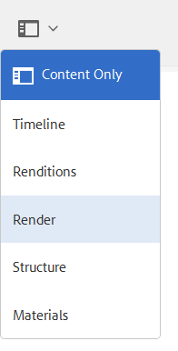

# 将AEM 3D与Autodesk Maya集成 {#integrating-aem-d-with-autodesk-maya}

>[!NOTE]
>
>此任务是可选的，并且仅适用于Windows。

您可以选择将AEM 3D与Autodesk® Maya®软件集成，以支持本机Maya文件(和`.MA``.MB`)，并允许您在AEM中使用任何可用的Maya渲染器渲染3D资产。

*此集成仅适用于Windows*。

与Autodesk Maya集成时，必须安装和配置Autodesk Maya，添加Maya可执行文件夹的路径，启用Maya以获取和渲染，并测试集成。

请参阅 [高级配置设置](advanced-config-3d.md)。

另请参 [阅将AEM 3D与AutoDesk 3ds max集成](integrating-aem-3d-with-autodesk-3ds-max.md)。

**要将AEM 3D与Autodesk Maya集成，请执行以下操作**:

1. 在承载AEM的同一台服务器上安装Autodesk Maya 2016软件。

   安装后，请验证您是否可以打开和使用Maya，并且不存在许可问题。

   >[!NOTE]
   >
   >AEM仅使用Maya命令行渲染工具(`render.exe`)。 一个Maya网络许可证最多允许五台服务器同时处理或渲染Maya内容。

1. 在Maya中，启用Autodesk FBX®插件。
1. 安装MentalRay渲染插件或其他所需的渲染器。

   安装后，验证MentalRay是否在Maya中可用。

1. 将Maya可执行文件文件夹的路径添加到Windows PATH环境变量中。

   例如，在Windows Server 2012上，点按 **[!UICONTROL开始>控制面板>系统和安全>系统>高级系统设置>环境变量**。 将文件夹的完整路径附 `Maya2016\bin` 加到系统 `Path`变量中。

   

1. 要启用Maya以进行摄取和渲染，请打开 **[!UICONTROL CRXDE Lite]** ，然后导航 `/libs/settings/dam/v3D/assetTypes/maya` 到并将“已启 **[!UICONTROL 用]** ”属性设置为 `true`。

   

1. 要启用JT(Siemens PLM Open CAD)文件格式，请导航到并将 `/libs/settings/dam/v3D/assetTypes/jt` “启用”属 **[!UICONTROL 性设置]** 为 `true`。
1. 在AEM中，将Maya启用为渲染器。 首先，导航到 **[!UICONTROL 工具>常规> CRXDE Lite]**。
1. 在 **[!UICONTROL CRXDE Lite]** 页的左侧面板中，导航到以下内容：

   `/libs/settings/dam/v3D/renderers/maya`

   

1. 将“已启 **[!UICONTROL 用]** ”属性设置为 `true`。

1. 在 **[!UICONTROL CRXDE Lite页面的左上角附近]** ，点按 **[!UICONTROL 全部保存]**。

   Maya现在启用为渲染器。

## 测试AEM 3D与Autodesk Maya的集成 {#testing-the-integration-of-aem-d-with-autodesk-maya}

1. 打开AEM资产，然后将位 `.MA` 于文件夹中的 `sample-3D-content/models` 文件上 `test3d` 传到。

   请注意， `sample-3D-content.zip` 之前下载用于验证基本3D功能。

1. 返回至 **[!UICONTROL卡片视图** ，并观察已上传资产上显示的消息横幅。

   当Maya将本机格式转换为时，将显示“转换格 `.MA` 式”横幅 `.FBX`。

1. 完成所有处理后，打开资 `logo-sphere.ma` 产并选择舞 `stage-helipad.ma` 台。

   “预览”体验与“和”的体验 `logo_sphere.fbx` 相同 `stage-helipad.fbx`。

1. Near the upper-left corner of the page, tap or click the drop-down list and then select **[!UICONTROL CRender]**.

   

1. 在“渲 **[!UICONTROL 染器]** ”下拉列表中，选择“ **[!UICONTROL Autodesk Maya]**”，然后点按“ **[!UICONTROL 开始渲染”]**。
1. 在页面的右上角附近，点按或单击“关 **[!UICONTROL 闭]** ”以返回到 **[!UICONTROL 卡片视图]** 。

   观察正在渲染的图像资产上的消息横幅(`logo-sphere`除非指定了其他图像名称)。 横幅上的进度栏显示渲染进度。

   >[!NOTE]
   >
   >渲染需要占用大量CPU，可能需要几分钟才能完成

1. 渲染完成后，打开渲染后的图像资产。

   检查渲染后的图像是否与您单击“立即渲染”时查看的图像 **[!UICONTROL 合理匹配]**。

## 启用Maya支持的其他格式 {#enabling-additional-formats-supported-by-maya}

（可选）Maya支持许多3D输入格式，任何3D输入格式均可启用，这样AEM都可识别文件类型。 启用后，AEM会将文件发送到Maya，以将其转换为可由AEM直接摄取的中间格式。

根据格式，功能支持可能受到限制（例如，材料不能传递），质量／保真度可能受到限制（例如，反向面部）。 Adobe仅支持一般机制，但不支持任何特定格式转换。

请参阅 [支持的数据导入格式| Maya](https://knowledge.autodesk.com/support/maya/learn-explore/caas/CloudHelp/cloudhelp/2016/ENU/Maya/files/GUID-69BC066D-D4D8-4B12-900C-CF42E798A5D6-htm.html) ，以了解有关Maya支持的格式的信息。

**要启用AEM支持的其他格式**:

1. 使用 **[!UICONTROL CRXDE Lite]**，导航到 `/libs/settings/dam/v3D/assetTypes`。
1. 复制jt节 **[!UICONTROL 点]** 。 右键单击 **[!UICONTROL jt节点]** ，选择 **[!UICONTROL Copy]**，然后右键单击assetTypes **[!UICONTROL 文件夹，选择]****** PastePaste。 这应该会生成一个新节点 `/apps/cq-scene7-v3D/config/assetTypes/Copy of jt`。
1. 重命名新节点，为其指定一个唯一名称，该名称表示要添加的文件类型。 文件后缀可能会被使用，也可能会被用于任何其他唯一标识符。

1. 将新节 **[!UICONTROL 点的]** “启用”属性设置为 `true`。

1. 将新备 **[!UICONTROL 注的]** “扩展”属性设置为要添加的格式的文件后缀／扩展。
1. 将MimeType **[!UICONTROL 属性设置]** 为相应的值。 `application/x-` 后跟 **[!UICONTROL Extension]** 属性的值应适用于大多数文件类型。
1. 确保“转 **[!UICONTROL 化]** ”属性设置 `fbx` 为， **[!UICONTROL IngestScrivety设置为]**`Maya`。
1. 单 **[!UICONTROL 击页面左上角]** ，附近的“全部保存”。

以下屏幕截图以COLLADA DAE为例说明了添加的文件格式：

