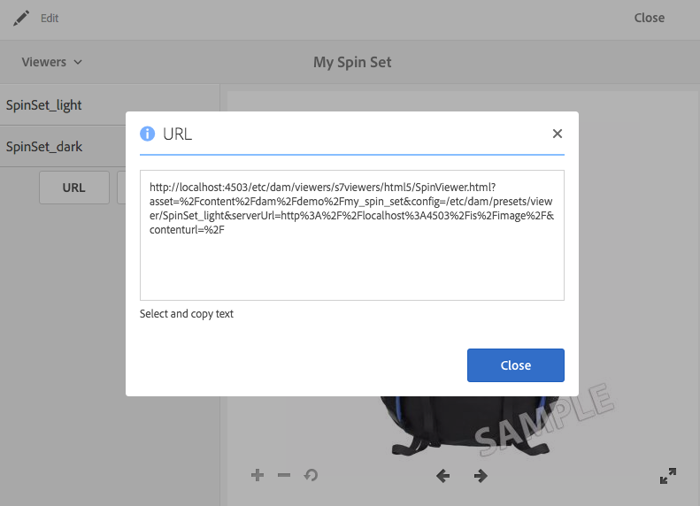

# 将URL关联到您的Web应用程序 {#linking-urls-to-your-web-application}

>[!CAUTION]
>
>AEM 6.4已结束扩展支持，本文档将不再更新。 有关更多详细信息，请参阅 [技术支助期](https://helpx.adobe.com/cn/support/programs/eol-matrix.html). 查找支持的版本 [此处](https://experienceleague.adobe.com/docs/).

您的网站和应用程序通过URL调用访问Dynamic Media服务。 发布资产后，Dynamic Media会激活引用该资产的URL字符串。 您可以将这些URL粘贴到Web浏览器中以进行测试。

仅当您 *not* 使用AEM作为WCM。 当您希望将视频播放器作为弹出窗口或模式窗口进行传送时，会使用“链接”与“嵌入”两种方式。 如果您使用AEM作为WCM， [您可以直接在页面上添加资产。](adding-dynamic-media-assets-to-pages.md)

要将这些URL字符串放置在网页和应用程序中，请从Dynamic Media复制它们。

>[!NOTE]
>
>URL字符串仅可用于资产的动态演绎版。 当前，它们不适用于DAM（而非Dynamic Media服务器）中的静态资产。 对于静态的演绎版，不会显示URL按钮。

另请参阅 [在网页上嵌入视频查看器或图像查看器。](embed-code.md)

另请参阅 [将YouTube URL关联到您的Web应用程序。](video.md)

另请参阅 [为响应式网站传送优化的图像。](responsive-site.md)

另请参阅 [上传资产。](managing-assets-touch-ui.md#uploading-assets)

## 获取资产的URL {#obtaining-a-url-for-an-asset}

您可以获取由图像预设或查看器预设生成的URL字符串。 复制URL后，它会登陆到剪贴板，以便您可以根据需要将其粘贴到网站或应用程序的页面中。

>[!NOTE]
>
>在发布选定资产后，才能复制该URL。 此外，您还必须发布查看器预设或图像预设。
>
>请参阅 [发布资产](publishing-dynamicmedia-assets.md).
>
>请参阅 [发布查看器预设](managing-viewer-presets.md#publishing-viewer-presets).
>
>请参阅 [发布图像预设](managing-image-presets.md#publishing-image-presets).

您可以通过多种不同方式获取URL字符串。 但是，以下步骤仅显示一种可使用的方法。

**获取资产的URL**:

1. 导航到 *发布* 要复制其图像预设URL或查看器预设URL的资产，然后点按该资产以将其打开。

   请注意，只有在首次&#x200B;*发布*&#x200B;资产&#x200B;*后*，才可复制 URL。此外，还必须发布查看器预设或图像预设。

   请参阅 [发布资产。](publishing-dynamicmedia-assets.md)

   请参阅 [发布查看器预设](managing-viewer-presets.md#publishing-viewer-presets).

   请参阅 [发布图像预设](managing-image-presets.md#publishing-image-presets).

1. 根据您选择的资产，执行以下操作之一：

   * 如果您选择了图像，请在下拉菜单中，点按 **[!UICONTROL 演绎版]**.

      在 **[!UICONTROL 动态]** 标题中，点按预设名称，以在右侧框架中查看其演绎版。 您可能需要滚动演绎版列表才能看到动态标题。

      在左边栏的底部，点按 **[!UICONTROL URL]**.

      

   * 如果您在下拉菜单中选择了旋转集、图像集、轮播集或视频，请点按 **[!UICONTROL 查看器]**.

      在左边栏中，点按查看器预设名称。 在单独的页面中打开该集或视频的预览。

      在左边栏的底部，点按 **[!UICONTROL URL]**.

      

1. 选择文本并将其复制到Web浏览器，以预览资产或将其添加到您的Web内容页面。

   要退出URL窗口，请点按 **[!UICONTROL X]** 或点按 **[!UICONTROL 关闭]**.

## 获取静态资产的URL {#obtaining-a-url-for-a-static-asset}

Dynamic Media支持交付静态资产，这是除图像和视频之外的其他资产。 支持的静态资产格式用于交付：

* 动画GIF
* 音频文件
* CSS
* JavaScript（当您的公司配置了自己的域时）
* PDF
* SVG
* XML
* ZIP

**获取静态资产的URL**:

1. 导航到您要复制其URL的*已发布*静态资产，然后点按该资产以将其打开。

   请记住，URL只能复制 *after* 您首先 *发布* 静态资产。

   请参阅 [发布资产。](publishing-dynamicmedia-assets.md)

1. 使用以下任一方法获取已发布静态资产的URL:

   * `The URL of the published static is the following:`

      * `https://*<server_name>*/is/content/*<company_name>*/*<static_asset_filename>*.*<extension>*`

         例如：`https://aem.com/is/content/adobe/image.gif`。
   * 单击 **[!UICONTROL 资产>动态演绎版]**，然后点按静态资产的动态演绎版，并复制URL。

      更改复制的URL以使用 `is/content` 在路径中，而不是 `is/image/`.

## 获取已发布视频呈现的视频URL {#obtaining-a-video-url-for-a-published-video-rendition}

1. 在AEM中，导航到 **[!UICONTROL 工具>部署>云>Cloud Services]**.
1. 在&#x200B;**[!UICONTROL 云服务]**&#x200B;页面上，向下滚动到 **[!UICONTROL Dynamic Media 云服务]**&#x200B;标题，然后点按显示&#x200B;**[!UICONTROL 配置]**。
1. 在&#x200B;**[!UICONTROL 可用配置]**&#x200B;下，点按所需配置的名称。

1. 在 **[!UICONTROL Dynamic Media Cloud设置]** 页面，下 **[!UICONTROL 视频服务URL]**，向下复制整个URL路径。 在稍后的步骤中，您将需要复制的URL路径。

   例如，URL路径可能如下所示：

   `https://s7athens.macromedia.com:9090/DMGateway/`

   (上述路径仅供说明；它不是您复制的实际路径。)

1. 在&#x200B;**[!UICONTROL 注册 ID]** 下，复制 ID 最后一部分中的客户名称。

   例如，如果注册ID为 `87654321|MyCompany`，则客户名称将为 `MyCompany`.

1. 在页面的左上角附近，点按 **[!UICONTROL Cloud Service]s**，然后点按AEM图标，并导航到 **[!UICONTROL 常规>CRXDE Lite]**.
1. 从JCR（Java内容存储库）中向下复制整个视频呈现路径。

   例如，视频的呈现路径可能如下所示：

   `/_renditions_/0bd/0bd28743-a616-4fe6-92aa-6eae7c2112f/avs/Momentum_1080-0x720-2600k.mp4`

   (上述路径仅供说明；它不是您复制的实际路径。)

1. 按以下顺序排列复制的信息，以形成完整的URL路径：

   `<Video_Service_URL>/public/<Customer_name_from_Registration_ID>/<Video_rendition_path>`

   例如，使用上述步骤中的示例路径和示例客户名称，完整路径如下所示：

   `https://s7athens.macromedia.com:9090/DMGateway/public/MyCompany/_renditions_/0bd/0bd28743-a616-4fe6-92aa-6eae7c2112ff/avs/Momentum_1080-0x720-2600k.mp4`

   这是已发布视频演绎版的完整视频URL。

## 获取自适应流播放(HLS)的视频URL {#obtaining-a-video-url-for-adaptive-streaming-hls}

1. 在AEM中，导航到 **[!UICONTROL 工具>部署>云>Cloud Services]**.
1. 在&#x200B;**[!UICONTROL 云服务]**&#x200B;页面上，向下滚动到 **[!UICONTROL Dynamic Media 云服务]**&#x200B;标题，然后点按显示&#x200B;**[!UICONTROL 配置]**。
1. 在&#x200B;**[!UICONTROL 可用配置]**&#x200B;下，点按所需配置的名称。
1. 在 **[!UICONTROL Dynamic MediaCloud Services设置]** 页面，请执行以下操作：

   * 在 **[!UICONTROL 视频服务URL]**，复制整个URL路径。 在这些步骤的后面部分，您将需要复制的URL路径。 例如，URL路径可能如下所示：

   `https://gateway-na.assetsadobe.com/DMGateway/`

   (上述路径仅供说明；它不是您复制的实际路径。)

   * 在&#x200B;**[!UICONTROL 注册 ID]** 下，复制 ID 最后一部分中的客户名称。在稍后这些步骤中，您将需要复制的客户名称。

      例如，如果注册ID为 `87654321|demoCo`，您复制的客户名称将为 `demoCo`.

1. 根据您所使用的视频交付协议，复制相应的协议选择器。 在这些步骤的后面部分，您将需要复制的协议选择器。

   | 您使用的视频交付协议 | 要使用的协议选择器 |
   |---|---|
   | HTTP   如果您使用HTTP（非安全视频交付），请确保在之前复制的视频服务URL值中将https更改为http。 | `public/` |
   | HTTPS | `public-ssl/` |

1. 在AEM中复制由Dynamic Media处理的完整视频资产路径。 在稍后的这些步骤中，您将需要此复制的视频资产路径。

   例如：

   `/content/dam/marketing/MyVideo.mp4`

1. 按以下顺序组合您之前复制的所有片段以创建字符串：

   &lt; `video service URL`>&lt; `protocol selector`>&lt; `customer name`>&lt; `video asset path`>

   例如，使用这些步骤中示例中复制的信息，字符串将如下所示：

   `https://gateway-na.assetsadobe.com/DMGateway/public-ssl/demoCo/content/dam/marketing/MyVideo.mp4`

1. 通过附加来完成URL `.m3u8` 到字符串的结尾。 例如，附加 `.m3u8` 对于上一步中的字符串，完整的URL路径将如下所示：

   `https://gateway-na.assetsadobe.com/DMGateway/public-ssl/demoCo/content/dam/marketing/MyVideo.mp4.m3u8`

## 使用HTTP/2交付Dynamic Media资产 {#using-http-to-deliver-your-dynamic-media-assets}

HTTP/2是经过更新的新Web协议，可改进浏览器和服务器的通信方式。 它提供了更快的信息传输，并降低了所需的处理能力。 现在，Dynamic Media资产的交付可以通过HTTP/2进行，从而提供更好的响应和加载时间。

请参阅 [HTTP2内容交付](http2.md) 有关开始使用HTTP/2与您的Dynamic Media帐户的完整详细信息。
