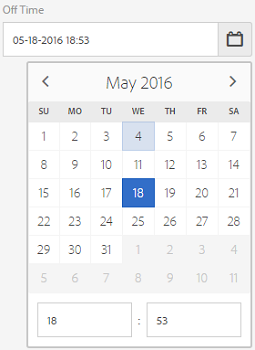
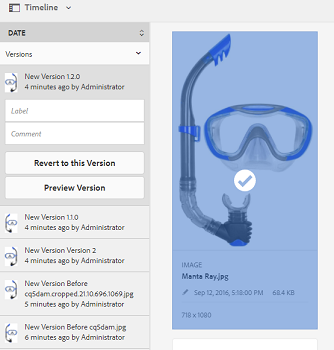

# 管理您的数字资产 {#managing-assets-with-the-touch-optimized-ui}

了解各种资产管理和编辑任务，您可以使用AEM Assets的触屏优化用户界面执行这些操作。

本文介绍如何使用Adobe Experience Manager(AEM)资产触屏优化用户界面管理和编辑资产。 For an elementary knowledge about the user interface, see [Basic handling of Touch UI](/help/sites-authoring/basic-handling.md). 要管理内容片段，请参 [阅管理内容片段](content-fragments-managing.md) 资产。

## 创建文件夹 {#create-folders}

在组织资产集合（例如，所有图像）时，您 `Nature` 可以创建文件夹来将它们放在一起。 您可以使用文件夹对资产进行分类和组织。 AEM Assets不要求您组织文件夹中的资源以更好地工作。

>[!NOTE]
>
>* 共享到Marketing Cloud时，不支 `sling:OrderedFolder` 持共享类型的“资产”文件夹。 如果要共享文件夹，请勿在创建文件夹时选择“已排序”。
>* Experience Manager不允许 `subassets` 将单词用作文件夹的名称。 它是为包含复合资产子资产的节点保留的关键字。

1. 导航到数字资产文件夹中要创建新文件夹的位置。
1. 在菜单中，单击“ **[!UICONTROL 创建]**”。 选择 **[!UICONTROL 新建文件夹]**。
1. 在“标 **[!UICONTROL 题]** ”字段中，提供文件夹名称。 默认情况下，DAM使用您提供的标题作为文件夹名称。 创建文件夹后，您可以覆盖默认文件夹并指定其他文件夹名称。
1. 单击&#x200B;**[!UICONTROL 创建]**。您的文件夹会显示在数字资产文件夹中。

不支持以下(以空格分隔的列表)字符：

* 资产文件名不能包含  `* / : [ \ \ ] | # % { } ? &`
* 资产文件夹名称不能包含  `* / : [ \ \ ] | # % { } ? \" . ^ ; + & \t`

## Upload assets {#uploading-assets}

您可以从本地文件夹或网络驱动器将各种类型的资源（包括图像、PDF文件、RAW文件等）上传到AEM Assets。

>[!NOTE]
>
>在Dynamic Media -Scene7模式下，您只能上传文件大小为2 GB或更小的资产。

您可以选择将资产上传到文件夹，无论是否分配了处理用户档案。

对于分配了处理用户档案的文件夹，用户档案名显示在卡视图的缩略图上。 在列表视图中，用户档案名称显示在处理 **[!UICONTROL 用户档案列]** 。 请参阅[处理配置文件](processing-profiles.md)。

上传资产之前，请确保其格式受 [支持](assets-formats.md)。

**要上传资产，请执行以下操作**:

1. 在“资产”Web界面中，导航到要添加数字资产的位置。
1. 要上传资产，请执行以下操作之一：

   * On the toolbar, tap the **[!UICONTROL Create]** icon. 然后，在菜单上，点按文 **[!UICONTROL 件]**。 如果需要，可以重命名显示的对话框中的文件。
   * 在支持HTML5的浏览器中，直接将资源拖动到界面上。 不显示要重命名文件的对话框。

   

   要选择多个文件，请在按住 Ctrl/Command 键的同时在文件选取器对话框中选择资产。在iPad中，一次只能选择一个文件。

   您可以暂停上传大型资产（大于500 MB），稍后从同一页面恢复它。 点按上 **[!UICONTROL 传开始]** 时显示的进度栏旁边的“暂停”图标。

   

   资产被视为大资产的大小可以配置。 例如，您可以配置系统，将1000 MB以上（而不是500 MB）的资产视为大资产。 在这种情况下，当 **[!UICONTROL 上传大]** 于1000 MB的资产时，进度栏中会显示“暂停”按钮。

   如果 **[!UICONTROL 上传的文]** 件大于1000 MB且文件小于1000 MB，则“暂停”按钮不显示。 但是，如果取消少于1000 MB的文件上传，将显示“ **[!UICONTROL 暂停]** ”按钮。

   要修改大小限制，请在CRX `chunkUploadMinFileSize` 存储库中 `fileupload`配置节点的属性。

   单击“暂停” **[!UICONTROL 图标]** ，它将切换为“播 **[!UICONTROL 放]** ”图标。 要继续上传，请单击“播 **[!UICONTROL 放]** ”图标。

   

   To cancel an ongoing upload, click the `X` button beside the progress bar. 当您取消上传操作时，AEM Assets会删除部分上传的资产。

   在低带宽情况和网络故障中，恢复上传的功能尤为有用，因为上传大型资产需要很长时间。 您可以暂停上传操作，稍后在情况好转时继续。 在继续时，从暂停的位置上传开始。

   在上传操作期间，AEM会将要上传的资产的部分作为数据块保存在CRX存储库中。 上传完成后，AEM会将这些区块合并到存储库中的单个数据块中。

   要为未完成的区块上传作业配置清除任务，请转至 `https://[aem_server]:[port]/system/console/configMgr/org.apache.sling.servlets.post.impl.helper.ChunkCleanUpTask`。

   如果您上传的资产名称与您上传资产的位置中已有资产的名称相同，则会显示一个警告对话框。

   您可以选择替换现有资产，创建另一个版本，或者重命名上传的新资产以同时保留两个资产。如果您替换现有资产，则资产的元数据以及之前所做的任何修改和历史记录（例如，注释、裁剪等）都将被删除。 如果选择保留这两个资产，则会重命名新资产。

   

   >[!NOTE]
   >
   >在名称冲 **[!UICONTROL 突]** 对话框 **[!UICONTROL 中选择替]** 换后，将为新资产重新生成资产ID。 此ID与上一个资产的ID不同。
   >
   >如果 **[!UICONTROL 启用资产]** Insights跟踪Adobe Analytics的展示次数／点击次数，则此重新生成的资产ID将使Adobe Analytics上为该资产捕获的数据无效。

   If the asset you upload exists in AEM Assets, the **[!UICONTROL Duplicates Detected]** dialog box warns that you are attempting to upload a duplicate asset. 仅当现有资产的二进制文件的SHA 1校验和值与您上传的资产的校验和值匹配时，才会显示该对话框。 在这种情况下，资产名称并不重要。 换言之，如果资产的二进制文件的SHA 1值相同，则该对话框甚至可能显示具有不同名称的资产。

   >[!NOTE]
   >
   >The **[!UICONTROL Duplicates Detected]** dialog appears only when the **[!UICONTROL Duplicate Detection]** feature is enabled. To enable the **[!UICONTROL Duplicate Detection]** feature, see [Enabling Duplicate Detection](duplicate-detection.md).

   

   Tap **[!UICONTROL Keep]** to retain the duplicate asset in AEM Assets. Tap  **[!UICONTROL Delete]** to delete the duplicate asset you uploaded.

   AEM Assets阻止您上传文件名中带有禁止字符的资产。 如果您尝试上传包含不允许的字符的资产，AEM Assets会显示一条警告消息，说明文件名中是否存在禁止的字符，并停止上传，直到您删除这些字符或上传时使用允许的名称。

   为了符合组织的特定文件命名约定，您 **[!UICONTROL 可以在“上传资产]** ”对话框中为上传的文件指定长名称。

   

   但是，不支持以下(以空格分隔的列表)字符：
   * 资产文件名不能包含  `* / : [ \ \ ] | # % { } ? &`
   * 资产文件夹名称不能包含  `* / : [ \ \ ] | # % { } ? \" . ^ ; + & \t`

   此外，资产界面还会显示您上传的最新资产或您在所有视图(卡片视图、**[!UICONTROL 列表视图]**&#x200B;视图和列 **[!UICONTROL )中首]**&#x200B;先创建的文 **[!UICONTROL 件夹]**。

   通常，在同时上传大型资产或多个资产时，可视指示器可让您评估进度。 “上 **[!UICONTROL 传进度]** ”对话框显示成功上传的文件和无法上传的文件的计数。

   

   如果在上传文件之前取消上传操作，AEM Assets将停止上传当前文件并刷新内容。 但是，不会删除已上传的文件。

### 串行上传 {#serial-uploads}

批量上传大量资产会消耗大量系统资源，这可能会对AEM部署的性能产生负面影响。 潜在的瓶颈可能是您的Internet连接、磁盘上的读写操作、Web浏览器对并发资产上传POST请求数的限制。 批量上传操作可能会失败或提前终止。 换言之，AEM资源在摄取大量文件时可能会丢失某些文件，或者完全无法摄取任何文件。

为了克服这种情况，AEM Assets在批量上传操作期间一次收录一个资产（串行上传），而不是同时录入所有资产。

资产的串行上传默认处于启用状态。 要禁用该功能并允许并发上传，请在CRXDe `fileupload` 中叠加该节点，并将属性的 `parallelUploads` 值设置为 `true`。

### 使用FTP上传资产 {#uploading-assets-using-ftp}

Dynamic Media支持通过FTP服务器批量上传资产。 如果您要上传大型资产(>1 GB)或上传整个文件夹和子文件夹，您应使用FTP。 您甚至可以设置FTP上传，以定期进行。

>[!NOTE]
>
>在Dynamic Media -Scene7模式下，您只能上传文件大小为2 GB或更小的资产。

>[!NOTE]
>
>要通过FTP在Dynamic Media中上传资产- AEM作者的Scene7模式安装功能包(FP)18912。 联系Adobe客户服务中心获取FP-18912并完成FTP帐户的设置。 请参 [阅安装功能包18912以实现批量资产迁移](/help/assets/bulk-ingest-migrate.md)。
如果您使用FTP上传资产，则会忽略AEM中指定的上传设置。 而是使用在Dynamic Media Classic中定义的文件处理规则。

**使用FTP上传资产**

1. 使用您选择的FTP客户端，使用您从供应电子邮件收到的FTP用户名和密码登录到FTP服务器。 在FTP客户端中，将文件或文件夹上传到FTP服务器。
1. [使用从供应电子邮件收到的凭据](https://www.adobe.com/marketing-cloud/experience-manager/scene7-login.html) ，登录到Dynamic Media Classic。 在全局导航栏上，点按 **[!UICONTROL 上传]**。

1. 在上 **[!UICONTROL 传]** 页面左上角附近，点按通过FTP **[!UICONTROL 选项卡]** 。
1. 在页面左侧，选择要从中上传文件的FTP文件夹；在页面的右侧，选择目标文件夹。
1. 在页面的右下角附近，点按作 **[!UICONTROL 业选项]** ，然后根据您选择的文件夹中的资产设置所需的选项。

   请参 [阅上传作业选项](#upload-job-options)。

   >[!NOTE]
   >
   >通过FTP上传资产时，您在Dynamic Media Classic(Scene7)中设置的上传作业选项优先于AEM中设置的资产处理参数。

1. 在“上传作业选项”对话框 **[!UICONTROL 的右下角]** ，点按 **[!UICONTROL 保存]**。
1. 在上传页面的右下角， **[!UICONTROL 点按]** “提交 **[!UICONTROL 上传”]**。

   要视图上传进度，请在全局导航栏上点按 **[!UICONTROL 作业]**。 “作 **[!UICONTROL 业]** ”页面显示上传的进度。 您可以随时继续在AEM中工作并返回到Dynamic Media Classic中的“作业”页，以查看进行中的作业。

   要取消正在进行的上载作业，请点 **[!UICONTROL 按]** “持续时 **[!UICONTROL 间”旁边]** 的取消。

#### 上传作业选项 {#upload-job-options}

| 上传选项 | 子选项 | 描述 |
|---|---|---|
| 作业名称 |  | 文本字段中预填充的默认名称包括用户输入的名称部分以及日期和时间戳。 您可以使用默认名称，或为此上传作业输入您自己创建的名称。  作业以及其他上传和发布作业将记录在“作业”页面上，您可以在该页面检查作业的状态。 |
| 上传后发布 |  | 自动发布您上传的资产。 |
| 在任意文件夹中覆盖相同的基本资产名称，而不考虑扩展名 |  | 如果希望上传的文件用相同的名称替换现有文件，请选择此选项。 此选项的名称可能不同，具体取决于“应用程序设置”>“常规 **[!UICONTROL 设置]** ”>“上 **[!UICONTROL 传到应用程]** 序”>“覆 **[!UICONTROL 盖图像”中]******&#x200B;的设置。 |
| 上传时解压缩ZIP或TAR文件 |  |  |
| 作业选项 |  | 点按／单 **[!UICONTROL 击作业选]** 项以打开上 [!UICONTROL 传作业选项对话框] ，然后选择影响整个上传作业的选项。 这些选项对于所有文件类型都是相同的。 您可以从“应用程序常规设置”页面开始选择上传文件的默认选项。 要打开此页，请选择“设 **[!UICONTROL 置”]** >“应 **[!UICONTROL 用程序设置]**”。 点按默 **[!UICONTROL 认上传选项]** ，以打开“上 [!UICONTROL 传作业选项] ”对话框。 |
|  | 当 | 选择一次或重复。 要设置重复作业，请选择“重复”选项（每日、每周、每月或自定义），以指定要重复FTP上传作业的时间。 然后根据需要指定计划选项。 |
|  | 包含子文件夹 | 上传您要上传的文件夹中的所有子文件夹。 您上传的文件夹及其子文件夹的名称会自动输入到AEM Assets。 |
|  | 裁剪选项 | 要从图像两侧手动裁剪，请选择“裁剪”菜单，然后选择“手动”。 然后输入要从图像的任何一侧或每一侧裁剪的像素数。 裁剪的图像多少取决于图像文件中的 ppi（每英寸像素数）设置。例如，如果图像显示 150 ppi，您在“顶部”、“右”、“底部”和“左”文本框中分别输入 75，则会从每个侧边裁剪半英寸。  要自动裁切图像中的空白像素，请打开“裁剪”菜单，选择“手动”，然后在“顶部”、“右”、“底部”和“左”字段中输入像素度量值以从两侧进行裁剪。 您还可以在“裁剪”菜单上选择“修剪”并选择以下选项：  **根据裁切** <ul><li>**颜色** -选择颜色选项。 然后，选择“角”菜单，选择图像的角，其颜色最能代表您要裁剪的空白颜色。</li><li>**透明度** -选择“透明度”选项。  **容差** -拖动滑块以指定从0到1的容差。对于基于颜色的修剪，指定0仅在像素与您在图像角中选择的颜色完全匹配时裁剪像素。 接近1的数字允许更多的颜色差异。 对于基于透明度的修剪，指定0可仅裁剪透明像素。 接近1的数字意味着更加透明。</li></ul> 请注意，这些裁剪选项是无损的。 |
|  | 颜色用户档案选项 | 在创建用于投放的优化文件时选择颜色转换：<ul><li>默认颜色保留：当图像包含色彩空间信息时，保留源图像颜色；没有颜色转换。 现在几乎所有图像都已嵌入相应的颜色用户档案。 但是，如果CMYK源图像不包含嵌入的颜色用户档案，则这些颜色将转换为sRGB（标准红绿蓝）色彩空间。 sRGB是用于在网页上显示图像的推荐色彩空间。</li><li>保留原始色彩空间：保留原始颜色，点上不进行任何颜色转换。 对于没有嵌入颜色用户档案的图像，任何颜色转换均使用在“发布”设置中配置的默认颜色用户档案进行。 颜色用户档案可能与使用此选项创建的文件中的颜色不对齐。 因此，建议您使用默认颜色保留选项。</li><li>“自定义自”>“至  ”打开菜单，因此您可以选择“转换自”和“转换至色彩空间”。 此高级选项将覆盖嵌入在源文件中的任何颜色信息。 当您提交的所有图像都包含不正确或缺少颜色用户档案数据时，请选择此选项。</li></ul> |
|  | 图像编辑选项 | 您可以保留图像中的剪切蒙版，并选择颜色用户档案。  请参 [阅在上传时设置图像编辑选项](#setting-image-editing-options-at-upload)。 |
|  | Postscript选项 | 您可以栅格化PostScript®文件、裁剪文件、维护透明背景、选择分辨率和选择色彩空间。  请参 [阅设置PostScript和Illustrator上传选项](#setting-postscript-and-illustrator-upload-options)。 |
|  | Photoshop选项 | 您可以从Adobe®Photoshop®文件创建模板、维护图层、指定如何命名图层、提取文本以及指定如何将图像定位到模板中。  请注意，AEM中不支持模板。  请参阅 [设置Photoshop上传选项](#setting-photoshop-upload-options)。 |
|  | PDF选项 | 您可以栅格化文件、提取搜索词和链接、自动生成电子目录、设置分辨率和选择色彩空间。  请注意，AEM不支持eCatalog。   请参 [阅设置PDF上传选项](#setting-pdf-upload-options)。 |
|  | Illustrator选项 | 您可以栅格化Adobe Illustrator®文件、保持透明背景、选择分辨率和选择色彩空间。  请参 [阅设置PostScript和Illustrator上传选项](#setting-postscript-and-illustrator-upload-options)。 |
|  | EVideo选项 | 您可以通过选择视频预设对视频文件进行转码。  请参 [阅设置eVideo上传选项](#setting-evideo-upload-options)。 |
|  | 批集预设 | 要从上传的文件创建图像集或旋转集，请单击要使用的预设的活动列。 您可以选择多个预设。 您可以在Dynamic Media Classic的“应用程序设置／批集预设”页面中创建预设。  请参 [阅将批集预设配置为自动生成图像集和旋转集](config-dms7.md#creating-batch-set-presets-to-auto-generate-image-sets-and-spin-sets) ，以了解有关创建批集预设的更多信息。  请参 [阅在上传时设置批集预设](#setting-batch-set-presets-at-upload)。 |

#### 在上传时设置图像编辑选项 {#setting-image-editing-options-at-upload}

上传图像文件（包括AI、EPS和PSD文件）时，可以在“上传作业选项”对话框中执 **[!UICONTROL 行以下编辑]** 操作：

* 从图像边缘裁切空格（请参阅上表中的说明）。
* 从图像两侧手动裁切（请参阅上表中的说明）。
* 选择颜色用户档案（请参阅上表中的选项说明）。
* 从剪切路径创建蒙版。
* 使用USM锐化选项锐化图像
* 挖空背景

| 选项 | 子选项 | 描述 |
|---|---|---|
| 从剪切路径创建蒙版 |  | 根据图像的剪切路径信息为图像创建蒙版。 此选项适用于使用创建了剪切路径的图像编辑应用程序创建的图像。 |
| USM锐化 |  | 允许您对最终的缩减采样图像微调锐化滤镜效果，控制效果的强度、效果的半径（以像素为单位）以及被忽略的对比度阈值。  此效果使用的选项与Photoshop的USM锐化滤镜的选项相同。 与名称相反，USM锐化是一种锐化滤镜。 在“USM锐化”下，设置所需的选项。 设置选项在下面进行了说明： |
|  | 数量 | 控制应用于边缘像素的对比度量。  把它看作效果的强度。 动态媒体中USM锐化的金额值与Adobe Photoshop的金额值之间的主要区别在于，Photoshop的金额范围在1%到500%之间。 而在Dynamic Media中，值范围为0.0到5.0。值5.0大致相当于Photoshop的500%;值0.9等于90%，依此类推。 |
|  | 半径 | 控制效果的半径。 值范围是0-250。  该效果对图像中的所有像素运行，并从所有方向的所有像素辐射出来。 半径以像素为单位。 例如，要对2000 x 2000像素图像和500 x 500像素图像获得类似的锐化效果，您应对2000 x 2000像素图像设置两个像素的半径，对500 x 500像素图像设置一个像素的半径值。 对于具有更多像素的图像，使用较大的值。 |
|  | 阈值 | 阈值是应用USM锐化滤镜时忽略的对比度范围。 因此，在使用此滤镜时，不会在图像中引入“杂色”，这一点很重要。 值范围是0-255，它是灰度图像中的亮度步骤数。 0=黑色，128=50%灰色，255=白色。  例如，阈值12会忽略皮肤色调亮度的细微变化，以避免添加杂色，但仍会为对比区域添加边缘对比度，如睫毛与皮肤的交集处。  例如，如果您有一张某人脸部的照片，USM锐化会影响图像的对比部分，如睫毛和皮肤会聚以创建明显的对比度区域以及平滑的皮肤本身。 即使最平滑的外观也会显示亮度值的细微变化。 如果不使用阈值，滤镜会突出外观像素的这些细微更改。 反过来，产生噪声和不需要的效果，同时增加睫毛的对比度，增强锐度。  为了避免此问题，引入了一个阈值，告诉滤镜忽略不显着改变对比度的像素，如平滑外观。  在前面显示的拉链图形中，注意拉链旁边的纹理。 由于阈值过低，无法抑制噪声，图像出现噪声。 |
|  | 单色 | 选择此项可使图像亮度（强度）变为USM锐化。  取消选中此选项，可单独对每个颜色组件进行锐化。 |
| 挖空背景 |  | 在上传图像时自动删除其背景。 此技术有助于引起对特定对象的注意并使其从繁忙的背景中脱颖而出。 选择以启用或“打开”挖空背景功能和以下子选项： |
|  | 角 | 必填.  用于定义要挖空的背景颜色的图像的角。  您可以选择 **左上**、 **左下**、右 **上**&#x200B;或右 **下**&#x200B;选择。 |
|  | 填充方法 | 必填.  从您设置的“角”位置控制像素透明度。  您可以从以下填充方法中进行选择： <ul><li>**Flood** 填充——将与您指定并连接到的“角”匹配的所有像素变为透明。</li><li>**匹配像素** -将所有匹配的像素变为透明，无论它们在图像上的位置如何。</li></ul> |
|  | 容差 | 可选。  根据您设置的“角”位置控制像素颜色匹配中允许的变化量。  使用值0.0精确匹配像素颜色，或使用值1.0最大变化。 |

#### 设置PostScript和Illustrator上传选项 {#setting-postscript-and-illustrator-upload-options}

上传PostScript(EPS)或Illustrator(AI)图像文件时，可以采用各种格式设置它们。 您可以栅格化文件、保持透明背景、选择分辨率和选择色彩空间。 “PostScript选项”和“Illustrator选项”下的“上传作业选项”对话框中提供格式化PostScript和PostScript文件的选项。

| 选项 | 子选项 | 描述 |
|---|---|---|
| 正在处理 |  | 选 **[!UICONTROL 择栅格]** ，将文件中的矢量图形转换为位图格式。 |
| 在渲染后的图像中保持透明背景 |  | 保持文件的背景透明度。 |
| 分辨率 |  | 确定分辨率设置。 此设置确定文件中每英寸显示的像素数。 |
| 色彩空间 |  | 选择“色彩空间”菜单，并从以下色彩空间选项中进行选择： |
|  | 自动检测 | 保留文件的色彩空间。 |
|  | 强制为RGB | 转换为RGB色彩空间。 |
|  | 强制为CMYK | 转换为CMYK色彩空间。 |
|  | 强制为灰度 | 转换为灰度色彩空间。 |

#### 设置Photoshop上传选项 {#setting-photoshop-upload-options}

PSD(Photoshop文档)文件最常用于创建图像模板。 上传PSD文件时，可以自动从文件创建图像模板（在“上传”屏幕上选择“创建模板”选项）。

如果您使用PSD文件创建模板，Dynamic Media会使用图层从PSD文件创建多个图像；它为每个图层创建一个图像。

使用上 **[!UICONTROL 述的裁剪]****[!UICONTROL 选项和颜]**&#x200B;色用户档案选项，以及Photoshop上传选项。

>[!NOTE]
>
>AEM中不支持模板。

| 选项 | 子选项 | 描述 |
|---|---|---|
| 维护图层 |  | 将PSD中的图层（如果有）拆分为单个资源。 资产图层仍与PSD关联。 可以通过在“细节”视图中打开PSD文件并选择图层面板来视图它们。 |
| 创建模板 |  | 从PSD文件中的图层创建模板。 |
| 提取文本 |  | 提取文本，以便用户在查看器中搜索文本。 |
| 将图层扩展到背景大小 |  | 将已撕开的图像图层的大小扩展到背景图层的大小。 |
| 图层命名 |  | PSD文件中的图层作为单独的图像上传。 |
|  | 图层名称 | 在PSD文件中将图像命名为图层名称之后。 例如，原始PSD文件中名为Price Tag的图层将变为名为Price Tag的图像。 但是，如果PSD文件中的图层名称是默认的Photoshop图层名称（背景、图层1、图层2等），则图像将以PSD文件中的图层编号命名，而不是以其默认图层名称命名。 |
|  | Photoshop和层号 | 在PSD文件中将图像命名为图层编号之后的图像，而忽略原始图层名称。 图像以Photoshop文件名和附加的图层编号命名。 例如，名为Spring Ad.psd的文件的第二个层被命名为Spring Ad_2，即使它在Photoshop有非默认名称。 |
|  | Photoshop和图层名称 | 在PSD文件之后命名图像，后跟图层名称或图层编号。 如果PSD文件中的图层名称是默认的Photoshop图层名称，则使用图层编号。 例如，在名为SpringAd的PSD文件中名为Price Tag的图层被命名为Spring Ad_Price Tag。 具有默认名称Layer 2的层称为Spring Ad_2。 |
| 锚点 |  | 指定如何在从PSD文件生成的分层合成生成的模板中定位图像。 默认情况下，锚点为中心。 无论替换图像的长宽比如何，中心锚点都允许替换图像以最佳方式填充相同的空间。 当引用模板并使用参数替换时，具有替换此图像的不同方面的图像会有效地占据相同的空间。 如果应用程序需要替换图像以填充模板中分配的空间，请更改为其他设置。 |

#### 设置PDF上传选项 {#setting-pdf-upload-options}

上传PDF文件时，可以采用各种格式设置它。 您可以裁切其页面、提取搜索词、输入每英寸像素分辨率并选择色彩空间。 PDF文件通常包含裁切边距、裁切标记、套准标记和其他打印机标记。 在上传PDF文件时，可以从页面两侧裁切这些标记。

>[!NOTE]
>
>aem中不支持eCatalog。

从以下选项中进行选择：

| 选项 | 子选项 | 描述 |
|---|---|---|
| 正在处理 | 栅格化 | （默认）翻页PDF文件中的页面，并将矢量图形转换为位图图像。 选择此选项可创建电子目录。 |
| 提取 | 搜索词 | 从PDF文件提取单词，以便在eCatalog查看器中按关键字搜索文件。 |
|  | 链接 | 从PDF文件提取链接并将其转换为在电子目录查看器中使用的图像映射。 |
| 从多页PDF自动生成电子目录 |  | 自动从PDF文件创建电子目录。 电子目录以您上传的PDF文件命名。 （只有在上传PDF文件时栅格化该文件时，此选项才可用。） |
| 分辨率 |  | 确定分辨率设置。 此设置确定PDF文件中每英寸显示的像素数。 默认为 150。 |
| 色彩空间 |  | 选择“色彩空间”菜单并为PDF文件选择色彩空间。 大多数PDF文件同时具有RGB和CMYK彩色图像。 RGB色彩空间是联机查看的首选。 |
|  | 自动检测 | 保留PDF文件的色彩空间。 |
|  | 强制为RGB | 转换为RGB色彩空间。 |
|  | 强制为CMYK | 转换为CMYK色彩空间。 |
|  | 强制为灰度 | 转换为灰度色彩空间。 |

#### 设置eVideo上传选项 {#setting-evideo-upload-options}

您可以通过从各种视频预设中进行选择来转换视频文件的代码。

| 选项 | 子选项 | 描述 |
|---|---|---|
| 自适应视频 |  | 可与任何宽高比配合使用的单个编码预设，用于为投放到移动设备、平板电脑和桌面创建视频。 使用此预设编码的已上传源视频的高度设置为固定。 但是，宽度会自动缩放以保留视频的宽高比。  最佳实践是使用自适应视频编码。 |
| 单个编码预设 | 对编码预设进行排序 | 选择“名称”或“大小”，按名称或分辨率大小对在桌面、移动设备和平板电脑下列出的编码预设进行排序。 |
|  | 桌面设备 | 创建MP4文件，为台式计算机提供流式或渐进式视频体验。根据所需的分辨率大小和目标数据速率选择一个或多个长宽比。 |
|  | 移动设备 | 创建MP4文件以在iPhone或Android移动设备上进行投放。选择一个或多个长宽比，其分辨率大小和目标数据速率均符合您的要求。 |
|  | 平板电脑 | 创建MP4文件以在iPad或Android平板电脑设备上投放。根据所需的分辨率大小和目标数据速率选择一个或多个长宽比。 |

#### 在上传时设置批集预设 {#setting-batch-set-presets-at-upload}

如果要从已上传的图像自动创建图像集或旋转集，请单 **[!UICONTROL 击]** 要使用的预设的“活动”列。 您可以选择多个预设。

请参 [阅将批集预设配置为自动生成图像集和旋转集](config-dms7.md#creating-batch-set-presets-to-auto-generate-image-sets-and-spin-sets) ，以了解有关创建批集预设的更多信息。

### 流式上传 {#streamed-uploads}

如果上传大量资产，对AEM服务器的I/O调用会显着增加，这会降低上传效率，甚至会导致其超时。 AEM Assets支持资产流上传。 流式上传通过在将磁盘复制到存储库之前避免在服务器上的临时文件夹中存储资产，减少了上传操作期间的磁盘I/O。 而是直接将数据传输到存储库。 这样，上传大型资产的时间和超时的可能性就会减少。 流上传默认在AEM Assets启用。

对于在JEE服务器上运行的版本小于3.1的servlet-api的AEM，禁用流上传。

### 提取包含资产的ZIP存档 {#extract-zip-archive-containing-assets}

您可以像上传任何其他受支持的资产一样上传ZIP存档。 同一文件名规则适用于ZIP文件。 AEM允许您将ZIP存档解压到DAM位置。

一次选择一个ZIP归档，单击“解 **[!UICONTROL 压归档]**”，然后选择目标文件夹。 选择一个选项以处理冲突（如果有）。 如果目标文件夹中已存在ZIP文件中的资产，您可以选择以下选项之一：跳过提取、替换现有文件、重命名以保留两个资产或创建新版本。

提取完成后，AEM会在通知区域通知您。 AEM提取ZIP时，您可以返回工作，而不中断提取。

该功能的一些限制是：

* 如果目标位置存在同名的文件夹，则ZIP文件中的资产会解压缩到现有文件夹中。

* 如果取消提取，则不会删除已提取的资产。

* 不能同时选择两个ZIP文件并解压它们。 一次只能解压一个ZIP存档。

## 预览资产 {#previewing-assets}

**要预览资产**:

1. 在资产UI中，导航到您要预览的资产所在的位置。
1. 点按所需的资产以将其打开。

1. 在预览模式下，缩放选项可用于支持的 [图像类型](assets-formats.md#supported-raster-image-formats) （通过交互式编辑）。

   要放大资产，请点 **[!UICONTROL 按+]** （或点按资产上的放大镜）。 要缩小，请点 **[!UICONTROL 击]**。 放大时，可以通过平移来仔细查看图像上的任意区域。使用&#x200B;**[!UICONTROL 重置缩放]**&#x200B;箭头可以返回原始视图。

   

   Tap the **[!UICONTROL Reset]** button to reset the view to the original size.

   

>[!MORELIKETHIS]
>
>* [预览Dynamic Media资产](/help/assets/previewing-assets.md)。
>* [视图子资产](managing-linked-subassets.md#viewing-subassets)。

## 编辑属性 {#editing-properties}

1. 导航到要编辑元数据的资产所在的位置。

1. 选择资产，然后点按工 **[!UICONTROL 具栏]** 中的属性以视图资产属性。 或者，选择资 **[!UICONTROL 产卡]** 上的属性快速操作。

   

1. 在“属 **[!UICONTROL 性]** ”页面中，编辑各个选项卡下的元数据属性。 例如，在“基 **[!UICONTROL 本]** ”选项卡下，编辑标题、说明等。

   “属性”页面 **[!UICONTROL 的布局]** 和可用的元数据属性取决于基础元数据模式。 要了解如何修改“属性”页面的 **[!UICONTROL 布局]** ，请参阅元 [数据模式](metadata-schemas.md)。

1. 要计划资产激活的特定日期/时间，请使用&#x200B;**[!UICONTROL 开始时间]**&#x200B;字段旁边的日期选取器。

   

1. 要在特定持续时间后取消激活资产，请从关闭时间字段旁边的日期选取器中选择取消激 **[!UICONTROL 活日期和时间]** 。

   取消激活日期应晚于资产的激活日期。 结束 [!UICONTROL 时间后]，资产及其演绎版无法通过资产Web界面或通过HTTP API使用。

   

1. 在“标 **[!UICONTROL 记]** ”字段中，选择一个或多个标记。 要添加自定义标记，请在框中键入标记名称，然后按 **[!UICONTROL Enter]**。 新标记保存在AEM中。

   YouTube需要标记才能发布，并且有一个指向YouTube的链接（如果可以找到合适的链接）。
要创建标记，您需要CRX存储库 `/content/cq:tags/default` 中的写入权限。

1. To provide a rating to the asset, tap the **[!UICONTROL Advanced]** tab and then tap the star at the appropriate position to assign the desired rating.

   

   您为资产分配的评级分数将显示在您的 **[!UICONTROL 评级下]**。 对资产进行评级的用户收到的资产的平均评级分数会显示在“评 **[!UICONTROL 级”下]**。 此外，在“评级细分”下显示对平均评级得分有贡献的评级分 **[!UICONTROL 数的分解]**。 您可以根据平均评级分数搜索资产。

1. 要视图资产的使用情况统计信息，请点按 **[!UICONTROL 分析]** 选项卡。

   使用情况统计信息包括：

   * 资产的查看或下载次数。
   * 渠道/设备，通过这些设备使用资产。
   * 最近使用该资产的创意解决方案。

   有关详细信息，请参阅 [资产分析](touch-ui-asset-insights.md)。

1. 点按 **[!UICONTROL 保存并关闭]**。
1. 导航到资产UI。 已编辑的元数据属性（包括标题、描述、评级等）以卡视图显示在资产卡上，并显示在列表视图的相关列下。

## 复制资产 {#copying-assets}

在复制资产或文件夹时，会复制整个资产或文件夹及其内容结构。 复制的资产或文件夹会在目标位置重复。 源位置的资产不会更改。

资产特定副本的一些属性不会结转。 例如：

* 资产ID、创建日期和时间、版本和版本历史记录。 其中一些属性由属性 `jcr:uuid`、 `jcr:created`和表示 `cq:name`。

* 每个资产及其每个演绎版的创建时间和引用路径都是唯一的。

其他属性和元数据信息将被保留。 复制资产时不会创建部分副本。

1. 在资产UI中，选择一个或多个资产，然后点按工 **[!UICONTROL 具栏]** 中的复制图标。 或者，从资 **[!UICONTROL 产卡]** 中选择复制快速操作。

   

   >[!NOTE]
   >
   >如果您使用复 **[!UICONTROL 制快速]** 操作，则一次只能复制一个资产。

1. 导航到要将资产复制到的位置。

   >[!NOTE]
   >
   >如果您在同一位置复制资产，AEM会自动生成该名称的变体。 例如，如果您复制的资产标题为Square,AEM会自动为其副本生成标题为Square1。

1. Tap the **[!UICONTROL Paste]** asset icon from the toolbar:

   

   资产会复制到此位置。

   >[!NOTE]
   >
   >The **[!UICONTROL Paste]** icon is available in the toolbar until the paste operation is completed.

### 移动或重命名资产 {#moving-or-renaming-assets}

1. 导航到要移动的资产所在的位置。

1. Select the asset, and tap the **[!UICONTROL Move]** icon from the toolbar.

   

1. In the **[!UICONTROL Move Assets]** wizard, do one of the following:

   * 指定资产在移动后的名称。 然后点按 **[!UICONTROL 下一]** 步以继续。
   * 点按 **[!UICONTROL 取消]** ，以停止该过程。

   >[!NOTE]
   >
   >您可以为资产指定相同的名称，前提是新位置中没有使用该名称的资产。但是，如果您将资产移动到存在同名资产的位置，则应使用其他名称。 如果您使用相同的名称，系统将自动生成该名称的变体。 例如，如果您的资产的名称为“Square”，系统会为其副本生成名称“Square1”。

   >[!NOTE]
   >
   >不支持以下(以空格分隔的列表)字符：
   >* 资产文件名不能包含  `* / : [ \ \ ] | # % { } ? &`
   >* 资产文件夹名称不能包含  `* / : [ \ \ ] | # % { } ? \" . ^ ; + & \t`

1. On the **[!UICONTROL Select Destination]** page, do one of the following:

   * Navigate to the new location for the assets, and then tap **[!UICONTROL Next]** to proceed.
   * Tap **[!UICONTROL Back]** to return to the **[!UICONTROL Rename]** page.

1. 如果被移动的资产具有任何引用页面、资产或收藏集，则调整引 **[!UICONTROL 用选项卡会出]** 现在选择目 **[!UICONTROL 标选项卡]** 的旁边。

   在“调整引用”页面上执 **[!UICONTROL 行下列操]** 作之一：

   * Specify the references to be adjusted based on the new details, and then tap **[!UICONTROL Move]** to proceed.
   * From the **[!UICONTROL Adjust]** column, select or deselect references to the assets.
   * Tap **[!UICONTROL Back]** to return to the **[!UICONTROL Select Destination]** page.
   * 点按 **[!UICONTROL 取消]** ，以停止移动操作。

   如果您不更新引用，则它们会继续指向资产的上一路径。 如果您调整引用，它们将更新为新的资产路径。

## 管理再现 {#managing-renditions}

1. 您可以为资产添加或删除演绎版，但原始形式除外。导航到您要为其添加或删除演绎版的资产所在的位置。

1. 点按资产以打开其资产页面。

   

1. 点按全 **[!UICONTROL 局导航]** 图标，然后从 **[!UICONTROL 列表中]** 选择“演绎版”。

   

1. 在&#x200B;**[!UICONTROL 演绎版]**&#x200B;面板中，查看为资产生成的演绎版列表。

   

   >[!NOTE]
   >
   >默认情况下，AEM Assets不在预览模式下显示资产的原始演绎版。 如果您是管理员，则可以使用叠加将AEM Assets配置为在预览模式下显示原始演绎版。

1. 选择一个演绎版以进行查看或删除。

   **删除演绎版**

   Select a rendition from the **[!UICONTROL Renditions]** panel, and then tap the **[!UICONTROL Delete Rendition]** icon from the [toolbar](/help/sites-authoring/basic-handling.md). 资产处理完成后，无法批量删除演绎版。 对于单个资产，您可以从用户界面手动删除演绎版。 对于多个资产，您可以自定义Experience Manager以删除特定演绎版或删除资产，然后重新上传已删除的资产。

   

   **上传新再现**

   Navigate to the asset details page for the asset, and tap the **[!UICONTROL Add Rendition]** icon in the toolbar to upload a new rendition for the asset.

   

   >[!NOTE]
   >
   >如果您从演绎版面板中选 **[!UICONTROL 择了演绎版]** ，工具栏会更改上下文并仅显示与演绎版相关的那些操作。 Options, such as the **[!UICONTROL Upload Rendition]** icon is not displayed. 要在工具栏中查看这些选项，请导航到资产的详细信息页面。

   您可以配置要在图像或视频资产的详细信息页面中显示的演绎版的尺寸。 根据您指定的尺寸，AEM Assets显示具有精确或最接近尺寸的再现。

   To configure rendition dimensions of an image at the asset detail level, overlay the **[!UICONTROL renditionpicker]** node `libs/dam/gui/content/assets/assetpage/jcr:content/body/content/content/items/assetdetail/items/col1/items/assetview/renditionpicker` and configure the value of the width property. 配置属性大 **[!UICONTROL 小（长）(以KB]** )代替宽度，以根据图像大小在资产详细信息页面上自定义再现。 For size-based customization, the property **[!UICONTROL preferOriginal]** assigns preference to the original if the size of the matched rendition is greater than the original.

   同样，您也可以通过覆盖 **[!UICONTROL 来自定]** 义“注释”页面图 `libs/dam/gui/content/assets/annotate/jcr:content/body/content/content/items/content/renditionpicker`像。

   

   要为视频资产配置再现尺寸，请导航到CRX **[!UICONTROL 存储库中]** ，位于该位置的 `/libs/dam/gui/content/assets/assetpage/jcr:content/body/content/content/items/assetdetail/items/col1/items/assetview/videopicker`videopicker节点，叠加该节点，然后编辑相应的属性。

   >[!NOTE]
   >
   >视频注释功能仅在提供 HTML5 兼容视频格式的浏览器上受支持。此外，该功能支持不同的视频格式，具体视浏览器而定。

有关子资产的信息，请参 [阅管理子资产](managing-linked-subassets.md)。

## Delete assets {#deleting-assets}

要解析或删除其他页面中的传入引用，请在删除资产之前更新相关引用。

此外，使用叠加禁用强制删除按钮，以禁止用户删除引用的资产和离开断开的链接。

您需要对dam/asset具有删除权限才能删除资产。 如果您只具有修改权限，则只能编辑资产元数据并向资产添加注释。 但是，您无法删除资产或其元数据。

**要删除资产**:

1. 导航到要删除的资产所在的位置。

1. Select the asset, and tap the **[!UICONTROL Delete]** icon from the toolbar.

   

1. 在确认对话框中，点按：

   * **[!UICONTROL 取消]** ，停止操作
   * **[!UICONTROL 删除]** ，以根据以下内容确认操作：

      * 如果资产没有引用，则资产会被删除。
      * If the asset has references, an error-message informs you that **[!UICONTROL One or more assets are referenced]**. You can select **[!UICONTROL Force Delete]** or **[!UICONTROL Cancel]**.

   >[!NOTE]
   >
   >要解析或删除其他页面中的传入引用，请在删除资产之前更新相关引用。
   >
   >此外，使用叠 **[!UICONTROL 加禁用]** “强制删除”按钮，以禁止用户删除引用的资产和保留断开的链接。

## 下载资产 {#downloading-assets}

See [Download assets from AEM](download-assets-from-aem.md)

## Publish assets {#publishing-assets}

如果您发布的资产正在处理，则仅会发布原始内容。 缺少再现。 等待处理完成，然后在处理完成后发布或重新发布资产。

如果要发布的文件夹包含空文件夹，则不会发布空文件夹。

有关Dynamic Media的详细信息，请参阅发 [布Dynamic Media资产](publishing-dynamicmedia-assets.md)。

**要发布资产**:

1. 导航到要发布的资产／文件夹所在的位置

1. Either select the **[!UICONTROL Publish]** quick action from the asset card, or select the asset and tap the **[!UICONTROL Quick Publish]** icon from the toolbar.
1. 如果资产引用了其他资产，向导中便会列出这些引用。仅显示自上次发布或取消发布后未发布或已修改的引用。 选择要发布的引用。

   

1. Tap **[!UICONTROL Publish]** to confirm the activation for the assets.

## 取消发布资产 {#unpublishing-assets}

取消发布复杂资产时，仅取消发布该资产。请避免取消发布引用，因为可能其他已发布的资产也引用了这些内容。

**要取消发布资产，请执行以下操作**:

1. 导航到您要从发布环境（取消发布）中删除的资产或资产文件夹的位置。

1. 选择要取消发布的资产或文件夹，然后点 **[!UICONTROL 按工具栏中]** 的管理发布图标。

   

1. 从列表 **[!UICONTROL 中选择]** “取消发布”操作。

   

1. To unpublish the asset later, select **[!UICONTROL Unpublish Later]**, and then select a date for unpublishing the asset.
1. 计划一个资产在发布环境中不再可用的日期。
1. 如果资产引用了其他资产，请选择您要取消发布的引用。 点按 **[!UICONTROL 取消发布]**。
1. 在确认对话框中，执行下列操作之一：

   * 点按 **[!UICONTROL 取消]** ，以停止操作
   * Tap **[!UICONTROL Unpublish]** to confirm that the assets are unpublished (no longer available on the publish environment) at the specified date.

## 创建已关闭的用户组 {#closed-user-group}

CUG（已关闭的用户组）用于限制对从AEM发布的特定资产文件夹的访问。 如果为文件夹创建CUG，则仅对分配的成员或组具有对文件夹（包括文件夹资产和子文件夹）的访问权限。 要访问文件夹，他们必须使用其安全凭据登录。

CUG是限制对资产访问的额外方式。 您还可以为文件夹配置登录页面。

**要创建已关闭的用户组**:

1. 从资产UI中选择一个文件夹，然后点按工 **[!UICONTROL 具栏]** 中的属性图标以显示属性页面。
1. 在“权 **[!UICONTROL 限]** ”选项卡中，在“已关闭的用户组” **[!UICONTROL 下添加成员或组]**。

   

1. 要在用户访问文件夹时显示登录屏幕，请选择“启 **[!UICONTROL 用]** ”选项。 然后，选择AEM中登录页面的路径，并保存更改。

   

   如果不指定登录页面的路径，AEM将在发布实例中显示默认登录页面。

1. 发布文件夹，然后尝试从发布实例访问它。 将显示登录屏幕。
1. 如果您是CUG成员，请输入您的安全凭据。 在AEM对您进行身份验证后，将显示文件夹。

## 搜索资产 {#searching-assets}

基本搜索在搜索和筛 [选部分有详细](/help/sites-authoring/search.md#search-and-filter) 。 使用“ **[!UICONTROL 搜索]** ”面板搜索资产、标记和元数据。 可以使用通配符星号搜索字符串的部分。 此外，您还可以使用搜索彩 **[!UICONTROL 块化]** 来自定 [义搜索面板](search-facets.md)。

对于最近上传的资产，在您在“搜索”框中键入时显示的建议列表中，不会立即显示资产的元数据（包括标题、标记等）。

这是因为，AEM Assets会等到超时期（默认为1小时）到期后再运行后台作业，为所有新上传／更新的资产索引元数据并将其添加到建议列表。

## 使用快速操作 {#quick-actions}

快速操作图标一次只能用于单个资产。根据设备，执行以下操作以显示快速操作图标：

* 触控设备：触摸并按住。 例如，在iPad上，您可以点按并按住资产，以便显示快速操作。
* 非触控设备：悬停指针。 例如，在桌面设备上，如果将指针悬停在资产缩略图上，则会显示快速操作栏。

### 导航到资产并选择 {#navigating-and-selecting-assets}

您可以使用选择图标视图、导航和选择具有任何可用视图(卡、列、列表)的 **[!UICONTROL 资产]** 。 **[!UICONTROL 选择]** “”将在卡视图中显示为快速操作。

在列表 **[!UICONTROL 视图中]** ，当您将鼠标图标悬停在缩略图上方(列表中的资产／文件夹名称前)时，会显示选择。

与列表视图类 **[!UICONTROL 似]** ，当您将鼠标图标悬停在缩略图上方列视图中的资产或文件夹名称之前时，会显示选择。

有关详细信息，请 [参阅查看和选择资源](/help/sites-authoring/basic-handling.md#viewing-and-selecting-resources)。

## 编辑图像 {#editing-images}

AEM Assets界面中的编辑工具允许您对图像资源执行小型编辑作业。 您可以对图像进行裁剪、旋转、翻转和执行其他编辑作业。 您还可以向资产添加图像映射。

以下格式的文件支持图像编辑功能：

* BMP
* GIF
* PNG
* JPEG

对于某些组件， **[!UICONTROL 全屏模]** 式还有其他可用选项。

要编辑TXT文件，请在 **[!UICONTROL Configuration Manager中设置]** Day CQ Link Externalizer。

You can also add image maps using the image editor. For details, see [Adding Image Maps](image-maps.md).

**要编辑图像**:

1. 执行以下操作之一以在编辑模式下打开资产：

   * 选择资产，然后单击工 **[!UICONTROL 具栏]** 中的编辑图标。
   * 点按 **[!UICONTROL 卡视图]** 中资产上显示的编辑选项。
   * 在资产页面中，点按工 **[!UICONTROL 具栏]** 中的编辑图标。

   

1. 要裁剪图像，请点按 **[!UICONTROL 裁剪]**。

   

1. 从列表中选择所需的选项。图像上会根据您选择的选项显示裁剪区域。利用&#x200B;**[!UICONTROL 手绘]**&#x200B;选项，您可以不受纵横比限制裁剪图像。

   

1. 选择要裁剪的区域，并在图像上调整其大小或位置。
1. 使用 **[!UICONTROL 右上角]** 的“完成”选项裁切图像。 点击 **[!UICONTROL “完成]** ”也会触发再现的重新生成。

   

1. Use the **[!UICONTROL Undo]** and **[!UICONTROL Redo]** icons on the top right to revert to the un-cropped image or retain the cropped image, respectively.

   

1. 点按相应的 **[!UICONTROL 旋转]** 图标，以顺时针或逆时针旋转图像。

   

1. 点按相应的 **[!UICONTROL 翻转]** 图标以水平或垂直翻转图像。

   

1. Tap the **[!UICONTROL Finish]** icon to save the changes.

   

## 使用时间轴 {#timeline}

通过 **[!UICONTROL 时间轴]** ，您可以视图选定项目的各种事件，如资产的活动工作流、注释、批注、活动日志和版本。

在“收 [藏集](managing-collections-touch-ui.md#navigating-the-collections-console)”控制台中， **[!UICONTROL “显示全部]** ”列表提供选项，仅用于视图注释和工作流。 此外，时间轴仅对控制台中列出的顶级集合显示。 如果您在任何集合中导航，则不会显示该集合。

**[!UICONTROL 时间轴]** 包含特 [定于内容片段的若干选项](content-fragments-managing.md#timeline-for-content-fragments);此功能 [需要AEM 6.4 Service Pack 2(6.4.2.0)或更高版本](/help/release-notes/sp-release-notes.md) 。

**要使用时间轴**:

1. 打开资产的资产页面，或在资产UI中选择它。
1. 点按全 **[!UICONTROL 局导航]** 图标，然后从 **[列表中]** 选择“时间轴”。

   

1. 在显示的列表中，使 **[!UICONTROL 用显示]** “全部”列表根据注释、版本、工作流和活动筛选结果。

   

## 添加注释 {#annotating}

注释是指添加到图像或视频的评论或解释性说明。注释使营销人员能够协作并留下资产反馈。

视频注释功能仅在提供 HTML5 兼容视频格式的浏览器上受支持。AEM Assets支持的视频格式取决于浏览器。

对于内容片段， [在编辑器中创建注释](content-fragments-variations.md#annotating-a-content-fragment);此功能 [需要AEM 6.4 Service Pack 2(6.4.2.0)或更高版本](/help/release-notes/sp-release-notes.md) 。

在保存注释之前，可以添加多个注释。

您可以向视频资产添加批注。 在对视频添加注释时，播放器会暂停，让您对帧添加注释。 有关详细信息，请参 [阅管理视频资产](managing-video-assets.md)。

您还可以向集合添加注释。 但是，如果集合包含子集合，则只能向父集合添加注释或注释。 “注 **[!UICONTROL 释]** ”选项不适用于子集合。

**要添加注释**:

1. 导航到要添加注释的资产所在的位置。
1. 点按以 **[!UICONTROL 下任一]** ，中的“注释”图标：

   * [快速操作](managing-assets-touch-ui.md#quick-actions)
   * 在选择资产或导航到资产页面后，从工具栏中

   

1. 在时间轴底部的&#x200B;**[!UICONTROL 注释]**&#x200B;框中添加注释。Alternatively, mark up an area on the image and add an annotation in the **[!UICONTROL Add Annotation]** dialog box.

   

1. 要向用户通知有关注释的信息，请指定用户的电子邮件地址并添加评论。 例如，要通知Aaron McDonald有关注释的信息，请输入@aa。 此时会出现一个列表，其中显示了所有匹配用户的提示。从列表中选择Aaron的电子邮件地址，用评论标记他。 同样，您可以在批注中的任意位置，或批注前后标记更多用户。

   >[!NOTE]
   >
   >对于非管理员用户，仅当用户在CRXDE中具有“读取”权限时，才会显 `/home` 示建议。

   

1. After adding the annotation, tap **[!UICONTROL Add]** to save it. 注释通知将发送给Aaron。

   

1. 点按 **[!UICONTROL 关闭]** ，以退 **[!UICONTROL 出注释]** 模式。
1. To view the notification, log in to AEM Assets with Aaron MacDonald&#39;s credentials and tap the **[!UICONTROL Notifications]** icon to view the notification.

1. 要选择不同的颜色以便您能够区分不同的用户，请点按 **[!UICONTROL 用户档案]** 图标，然 **[!UICONTROL 后点按我的首选项]**。

   

1. Specify the desired color in the **[!UICONTROL Annotation Color]** box, then tap **[!UICONTROL Accept]**.

   

### 视图保存的注释 {#viewing-saved-annotations}

1. 要视图已保存的资产注释，请导航到资产所在的位置，然后打开资产页面。

1. 点按全 **[!UICONTROL 局导航]** 图标，并从 **[!UICONTROL 列表点]** 按“时间轴”。

   

1. 从时间线的&#x200B;**[!UICONTROL 显示全部]**&#x200B;列表中，选择&#x200B;**[!UICONTROL 注释]**&#x200B;以根据注释过滤结果。

   

1. 点按“时间轴”面 **[!UICONTROL 板中]** 的注释，以视图图像上的相应注释。

   

1. 点按 **[!UICONTROL 删除]** ，以删除特定注释。

### 打印批注 {#printing-annotations}

如果资产具有批注或已经受审核工作流程的影响，您可以将资产连同批注和审阅状态打印为PDF文件，以便脱机审阅。

您还可以选择仅打印注释或审阅状态。

长批注在PDF文件中可能无法正常呈现。 为获得最佳渲染效果，Adobe建议您将注释限制为50字。

要打印批注和审阅状态，请点 **[!UICONTROL 按]** “打印”图标，然后按照向导中的说明操作。 仅当 **[!UICONTROL 资产至]** 少分配了一个注释或审核状态时，工具栏中才会显示打印图标。

1. 在资产UI中，打开资产的预览页面。
1. 执行下列操作之一：

   * 要打印所有批注和审阅状态，请转到步骤4。
   * 要打印特定注释和审阅状态，请打 [开时](managing-assets-touch-ui.md#timeline) 间轴，然后继续执行步骤3。

1. 要打印特定注释，请从时间轴中选择 **[!UICONTROL 注释]**。

   

   要仅打印审阅状态，请从时间轴中选 **[!UICONTROL 择它]**。

   

1. On the toolbar, tap the **[!UICONTROL Print]** icon.

   

1. 从“打 **[!UICONTROL 印]** ”对话框中，选择您希望批注或审阅状态在PDF上显示的位置。 例如，如果希望在包含打印图像的页面的右上方打印批注或状态，请使 **[!UICONTROL 用左上]** （默认）设置。

   

   您可以根据您希望批注或状态显示在打印的PDF中的位置选择其他设置。 If you want the annotations or status to appear in a page that is separate from the printed asset, choose **[!UICONTROL Next Page]**.

1. 点按 **[!UICONTROL 打印]**。 根据您在步骤2中选择的选项，生成的PDF会在指定位置显示批注或状态。 例如，如果您选择使用&#x200B;**[!UICONTROL 左上角]**&#x200B;设置打印批注和审阅状态，则生成的输出将类似于此处描述的 PDF 文件。

   

1. 使用右上方的选项下载或打印PDF。

   

   >[!NOTE]
   >
   >如果资产具有子资产，您可以打印所有子资产及其特定的页面注释。

   要修改呈现的PDF文件的外观，例如注释和状态的字体颜色、大小和样式、背景颜色，请从Configuration Manager **[!UICONTROL 中打开]****[!UICONTROL “注释PDF]**”配置，并修改所需选项。 例如，要更改批准状态的显示颜色，请修改相应字段中的颜色代码。 有关更改批注的字体颜色的信息，请参阅 [批注](managing-assets-touch-ui.md#annotating)。

   

   返回渲染的PDF文件并刷新它。 刷新的PDF反映了您所做的更改。

**要以外语打印批注，请执行以下操作**:如果资产包含外语（尤其是非拉丁语言）的批注，您必须首先在AEM服务器上配置CQ-DAM-Handler-Gibson字体管理器服务，才能打印这些批注。 在配置CQ-DAM-Handler-Gibson字体管理器服务时，请提供所需语言的字体所在的路径。

1. 打开 **[!UICONTROL CQ-DAM-Handler-Gibson Font Manager]** Service配置页 [，其URL为https://&lt;server>:&lt;port>/system/console/configMgr/com.day.cq.dam.handler.gibson.fontmanager.impl.FontManagerServiceImpl](http://localhost:4502/system/console/configMgr/com.day.cq.dam.handler.gibson.fontmanager.impl.FontManagerServiceImpl)。
1. 要配 **[!UICONTROL 置CQ-DAM-Handler-Gibson字体管理器服务]**，请执行以下操作之一：

   * 在“ **[!UICONTROL System Fonts]** ”目录选项中，指定系统上字体目录的完整路径。 例如，如果您是Mac用户，则可以像在“系统字体”目录选 `/Library/Fonts` 项中一 **[!UICONTROL 样指定路径]** 。 AEM从此目录中获取字体。
   * 在crx-quickstart文件 **夹中** ，创建 **[!UICONTROL 一个名为fonts]** 的目录。 **[!UICONTROL CQ-DAM-Handler-Gibson字体管理器服务]** ，自动获取位置的字体 `crx-quickstart/fonts`。 您可以从Adobe服务器字体目录选项 **[!UICONTROL 中覆盖此默]** 认路径。
   * 在系统中为字体创建新文件夹，并将所需的字体存储在该文件夹中。 然后，在“客户字体”目录选项中指定该文 **[!UICONTROL 件夹的完]** 整路径。

1. 通过 **[!UICONTROL URL]** https://&lt; [server>:&lt;port>/system/console/configMgr/com.day.cq.dam.core.impl.annotation.pdf.AnnotationPdfConfig访问“注释PDF”配置](http://localhost:4502/system/console/configMgr/com.day.cq.dam.core.impl.annotation.pdf.AnnotationPdfConfig)。
1. 按如 **[!UICONTROL 下方式]** ，使用正确的字体系列配置“批注PDF”:

   * 在font- `<font_family_name_of_custom_font, sans-serif>` family选项中包含字符串。 例如，如果要在CJK（中文、日文和韩文）中打印批注，请在字体系列选 `Arial Unicode MS, Noto Sans, Noto Sans CJK JP, sans-serif` 项中包含该字符串。 如果要以印地语打印批注，请下载相应的字体并将字体系列配置为Arial Unicode MS、Noto Sans、Noto Sans CJK JP、Noto Sans Devagari、sans-serif。

1. 重新启动AEM实例。

以下是如何配置AEM以在CJK（中文、日文和韩文）中打印批注的示例：

1. 通过以下链接下载Google Noto CJK字体，并将其存储在Font Manager Service中配置的字体目录中。

   * 全部在一个超级CJK字体中： [https://www.google.com/get/noto/help/cjk/](https://www.google.com/get/noto/help/cjk/)
   * Noto Sans（适用于欧洲语言）: [https://www.google.com/get/noto/](https://www.google.com/get/noto/)
   * 您选择的语言没有字体： [https://www.google.com/get/noto/](https://www.google.com/get/noto/)

1. 通过将font-family参数设置为配置批注PDF文 `Arial Unicode MS, Noto Sans, Noto Sans CJK JP, sans-serif`件。 此配置默认可用，适用于所有欧洲和CJK语言。
1. 如果您选择的语言与步骤2中提到的语言不同，请在默认字体系列后面附加一个适当（以逗号分隔）的条目。

## 创建资产版本控制 {#asset-versioning}

版本控制创建数字资产在某个特定时间点的快照。版本控制有助于在以后将资产恢复到以前的状态。 例如，如果您要撤消对资产所做的更改，请恢复该资产的未编辑版本。

以下是创建版本的方案：

* 您可以在其他应用程序中修改图像并上传到AEM Assets。 将创建图像的某个版本，这样原始图像不会被覆盖。
* 您可以编辑资产的元数据。
* 您使用AEM桌面应用程序签出现有资产并保存更改。 每次保存资产时，都会创建一个新版本。

您还可以通过工作流启用自动版本控制。 为资产创建版本时，元数据和演绎版会与该版本一起保存。 演绎版是相同图像的替代内容，例如，已上传JPEG文件的PNG演绎版。

通过版本控制功能，您可以执行以下操作：

* 创建资产的版本。
* 视图资产的当前版本。
* 将资产恢复到先前版本。

**要创建资产版本控制，请执行以下操作**:

1. 导航到您要为其创建版本的资产所在的位置，然后单击该资产以打开其资产页面。

1. 单击“ **[!UICONTROL 全局导航]** ”图标，然后从菜 **[!UICONTROL 单中选]** 择“时间轴”。

   

1. 单击 **[!UICONTROL 底部的]** “操作”，以视图您可以对资产执行的可用操作。

1. Click **[!UICONTROL Save as Version]** to create a version for the asset.

   

1. 添加标签和注释，然后单击 **[!UICONTROL 创建]** 以创建版本。 或者，点按 **[!UICONTROL 取消]** ，以退出操作。

   

1. To view the new version, open the **[!UICONTROL Show All]** list in the timeline from the asset details page or the [!DNL Assets] interface, and choose **[!UICONTROL Versions]**.

   

1. 为资产选择特定版本以对其进行预览，或启用该资产以在资产UI中显示。

   

   >[!NOTE]
   >
   >您还可以从列表视图 [或列视图](/help/sites-authoring/basic-handling.md#viewing-and-selecting-resources) 中选 [择资产](/help/sites-authoring/basic-handling.md#viewing-and-selecting-resources)。

1. 为版本添加标签和注释，以还原到资产UI中的特定版本。

   

1. To generate a preview for the version, click **[!UICONTROL Preview Version]**.
1. 要在资产UI中显示此版本，请选 **[!UICONTROL 择还原到此版本]**。
1. 要比较两个版本，请转到资产的资产页面，然后单击要与当前版本进行比较的版本。

   

1. 从时间轴中，选择要比较的版本，并将滑块向左拖动，以将此版本叠加在当前版本上并进行比较。

   

### 开始资产上的工作流 {#starting-a-workflow-on-an-asset}

请参 [阅将工作流应用于AEM资产](/help/assets/assets-workflow.md#apply-a-workflow-to-an-aem-asset)。

## 关于集合 {#collections}

集合是一组有序的资产。使用集合在用户之间共享资产。

* 收藏集可以包含来自不同位置的资产，因为它们只包含对这些资产的引用。 每个收藏集都保持资产的引用完整性。
* 您可以与具有不同权限级别的多个用户共享集合，包括编辑、查看等。

用户可以访问多个集合。 收藏集根据资产的整理方式分为以下类型：

* A collection with a **static reference list** of assets, folders, and other collections.

* A collection that uses a **search criteria** and dynamically populates assets based on the criteria. 这称为智 **能收藏**。

有关集 [合管理的详](managing-collections-touch-ui.md) 细信息，请参阅管理集合。

>[!NOTE]
>
>您需要帐户具有适当的访问权限才能创建或编辑资产。
