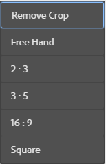
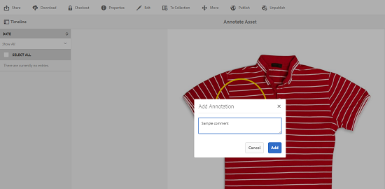

# 管理数字资产 {#managing-assets-with-the-touch-optimized-ui}

了解使用AEM Assets的触屏优化用户界面可以执行的各种资产管理和编辑任务。

本文介绍了如何使用Adobe Experience Manager(AEM)Assets触屏优化用户界面来管理和编辑资产。 有关用户界面的基本知识，请参阅[触屏UI的基本操作](/help/sites-authoring/basic-handling.md)。 要管理内容片段，请参阅[管理内容片段](content-fragments-managing.md)资产。

## 创建文件夹 {#create-folders}

组织资产集合（例如，所有`Nature`图像）时，可以创建文件夹以将它们保持在一起。 您可以使用文件夹对资产进行分类和组织。 AEM Assets不要求您组织文件夹中的资产以更好地工作。

>[!NOTE]
>
>* 共享到Marketing Cloud时，不支持共享`sling:OrderedFolder`类型的Assets文件夹。 如果要共享文件夹，请在创建文件夹时不要选择“已排序”。
>* Experience Manager不允许使用`subassets`单词作为文件夹的名称。 它是为包含复合资产子资产的节点保留的关键字。

1. 导航到数字资产文件夹中要创建新文件夹的位置。
1. 在菜单中，单击&#x200B;**[!UICONTROL 创建]**。 选择&#x200B;**[!UICONTROL 新建文件夹]**。
1. 在&#x200B;**[!UICONTROL 标题]**&#x200B;字段中，提供文件夹名称。 默认情况下，DAM会使用您提供的标题作为文件夹名称。 创建文件夹后，可以覆盖默认文件夹并指定其他文件夹名称。
1. 单击&#x200B;**[!UICONTROL 创建]**。您的文件夹会显示在数字资产文件夹中。

不支持以下（以空格分隔的）字符列表：

* 资产文件名不得包含`* / : [ \ \ ] | # % { } ? &`
* 资产文件夹名称不得包含`* / : [ \ \ ] | # % { } ? \" . ^ ; + & \t`

## 上传资产 {#uploading-assets}

您可以从本地文件夹或网络驱动器将各种类型的资产（包括图像、PDF文件、RAW文件等）上传到AEM Assets。

>[!NOTE]
>
>在Dynamic Media - Scene7模式下，您只能上传文件大小为2 GB或更小的资产。

您可以选择将资产上传到文件夹，而无论是否为文件夹分配了处理配置文件。

对于分配了处理配置文件的文件夹，卡片视图的缩略图上会显示配置文件名称。 在列表视图中，配置文件名称显示在&#x200B;**[!UICONTROL 处理配置文件]**&#x200B;列中。 请参阅[处理配置文件](processing-profiles.md)。

在上传资产之前，请确保其格式为[受支持的](assets-formats.md)。

**要上传资产**，请执行以下操作：

1. 在资产Web界面中，导航到要添加数字资产的位置。
1. 要上传资产，请执行以下操作之一：

   * 在工具栏中，点按&#x200B;**[!UICONTROL 创建]**&#x200B;图标。 然后，在菜单中，点按&#x200B;**[!UICONTROL 文件]**。 如果需要，可以在显示的对话框中重命名文件。
   * 在支持HTML5的浏览器中，直接将资产拖动到界面上。 未显示重命名文件的对话框。

   

   要选择多个文件，请在按住 Ctrl/Command 键的同时在文件选取器对话框中选择资产。在iPad中，一次只能选择一个文件。

   您可以暂停上传大型资产（大于500 MB），稍后从同一页面继续上传。 点按上传开始时显示的进度栏旁边的&#x200B;**[!UICONTROL 暂停]**&#x200B;图标。

   

   可以配置其上资产被视为大型资产的大小。 例如，您可以将系统配置为将大于1000 MB（而不是500 MB）的资产视为大型资产。 在这种情况下，当上传大于1000 MB的资产时，进度栏中的&#x200B;**[!UICONTROL 暂停]**&#x200B;按钮即会显示。

   如果上载的文件大于1000 MB且文件小于1000 MB，则&#x200B;**[!UICONTROL 暂停]**&#x200B;按钮不显示。 但是，如果取消小于1000 MB的文件上传，则会显示&#x200B;**[!UICONTROL Pause]**&#x200B;按钮。

   要修改大小限制，请在CRX存储库中配置`fileupload`节点的`chunkUploadMinFileSize`属性。

   单击&#x200B;**[!UICONTROL 暂停]**&#x200B;图标时，将切换到&#x200B;**[!UICONTROL 播放]**&#x200B;图标。 要继续上传，请单击&#x200B;**[!UICONTROL Play]**&#x200B;图标。

   

   要取消持续上传，请单击进度栏旁边的`X`按钮。 取消上传操作后，AEM Assets会删除部分上传的资产部分。

   恢复上传的功能在低带宽情况和网络故障中特别有用，在这些情况下，上传大型资产需要较长时间。 您可以暂停上传操作，稍后在情况好转时继续。 恢复时，上传会从暂停之处开始。

   在上传操作期间，AEM会将上传的资产部分作为数据块存储在CRX存储库中。 上传完成后，AEM会将这些区块整合到存储库中的单个数据块中。

   要为未完成的区块上载作业配置清理任务，请转到`https://[aem_server]:[port]/system/console/configMgr/org.apache.sling.servlets.post.impl.helper.ChunkCleanUpTask`。

   如果您上传的资产名称与上传资产所在位置已提供的资产名称相同，则会显示一个警告对话框。

   您可以选择替换现有资产，创建另一个版本，或者重命名上传的新资产以同时保留两个资产。如果替换现有资产，则资产的元数据以及之前的任何修改和历史记录（例如，批注、裁剪等）都将被删除。 如果您选择保留这两个资产，则会重命名新资产。

   

   >[!NOTE]
   >
   >在&#x200B;**[!UICONTROL 名称冲突]**&#x200B;对话框中选择&#x200B;**[!UICONTROL 替换]**&#x200B;时，将为新资产重新生成资产ID。 此ID与上一个资产的ID不同。
   >
   >如果启用了&#x200B;**[!UICONTROL 资产分析]**&#x200B;以通过Adobe Analytics跟踪展示次数/点击次数，则此重新生成的资产ID将使Adobe Analytics上为资产捕获的数据失效。

   如果您上传的资产存在于AEM Assets中，则&#x200B;**[!UICONTROL 检测到的重复项]**&#x200B;对话框会警告您正在尝试上传重复的资产。 仅当现有资产的二进制文件的SHA 1校验和值与您上传资产的校验和值匹配时，才会显示该对话框。 在这种情况下，资产名称并不重要。 换言之，如果资产的二进制文件的SHA 1值相同，则甚至可以针对名称不同的资产显示对话框。

   >[!NOTE]
   >
   >仅当启用了&#x200B;**[!UICONTROL 重复检测]**&#x200B;功能时，才会显示&#x200B;**[!UICONTROL 检测到的重复项]**&#x200B;对话框。要启用&#x200B;**[!UICONTROL 重复检测]**&#x200B;功能，请参阅[启用重复检测](duplicate-detection.md)。

   

   点按&#x200B;**[!UICONTROL Keep]**&#x200B;以在AEM Assets中保留重复的资产。 点按&#x200B;**[!UICONTROL 删除]**&#x200B;以删除您上传的重复资产。

   AEM Assets可阻止您在资产的文件名中使用禁止字符上传资产。 如果您尝试上传包含不允许的字符的资产，AEM Assets会显示一条警告消息，说明文件名中存在禁止的字符，并停止上传，直到您删除这些字符或上传时使用允许的名称为止。

   为了适合贵组织的特定文件命名约定，您可以在&#x200B;**[!UICONTROL 上传资产]**&#x200B;对话框中为上传的文件指定长名称。

   

   但是，不支持以下（以空格分隔的）字符列表：
   * 资产文件名不得包含`* / : [ \ \ ] | # % { } ? &`
   * 资产文件夹名称不得包含`* / : [ \ \ ] | # % { } ? \" . ^ ; + & \t`

   此外，资产界面还会显示您上传的最新资产或在所有视图（**[!UICONTROL 卡片视图]**、**[!UICONTROL 列表视图]**&#x200B;和&#x200B;**[!UICONTROL 列视图]**）中首先创建的文件夹。

   通常，在同时上传大型资产或多个资产时，可视指示器可让您评估进度。 **[!UICONTROL 上载进度]**&#x200B;对话框显示已成功上载文件的计数以及未能上载的文件。

   

   如果您在上传文件之前取消上传操作，AEM Assets将停止上传当前文件并刷新内容。 但是，不会删除已上传的文件。

### 串行上传 {#serial-uploads}

批量上传大量资产会消耗大量系统资源，这可能会对AEM部署的性能产生负面影响。 潜在的瓶颈可能是您的Internet连接、磁盘上的读写操作、Web浏览器对并发POST上传请求数的限制。 批量上传操作可能会失败或提前终止。 换言之，AEM资产在摄取大量文件时可能会丢失某些文件，或者完全无法摄取任何文件。

为了克服这种情况，AEM Assets在批量上传操作期间一次摄取一个资产（串行上传），而不是同时摄取所有资产。

默认情况下，会启用资产的序列上传。 要禁用该功能并允许并发上传，请在CRXDe中叠加`fileupload`节点，并将`parallelUploads`属性的值设置为`true`。

### 使用FTP上传资产 {#uploading-assets-using-ftp}

Dynamic Media支持通过FTP服务器批量上传资产。 如果您打算上传大资产(> 1 GB)或上传整个文件夹和子文件夹，则应使用FTP。 您甚至可以设置FTP上传以按定期计划进行。

>[!NOTE]
>
>在Dynamic Media - Scene7模式下，您只能上传文件大小为2 GB或更小的资产。

>[!NOTE]
>
>要在AEM作者上通过Dynamic Media中的FTP上传资产 — 请在上安装Scene7模式安装功能包(FP)18912。 联系Adobe客户关怀团队以访问FP-18912并完成FTP帐户的设置。 请参阅[安装批量资产迁移功能包18912](/help/assets/bulk-ingest-migrate.md)。
>
>如果您使用FTP上传资产，则会忽略AEM中指定的上传设置。 而是使用Dynamic Media Classic中定义的文件处理规则。

**使用FTP上传资产**

1. 使用您选择的FTP客户端，使用您从配置电子邮件收到的FTP用户名和密码登录到FTP服务器。 在FTP客户端中，将文件或文件夹上传到FTP服务器。
1. 打开[Dynamic Media Classic桌面应用程序](https://experienceleague.adobe.com/docs/dynamic-media-classic/using/getting-started/signing-out.html#getting-started)，然后使用从配置电子邮件收到的凭据登录到您的帐户。
1. 在全局导航栏上，点按&#x200B;**[!UICONTROL Upload]**。
1. 在&#x200B;**[!UICONTROL 上传]**&#x200B;页面左上角附近，点按&#x200B;**[!UICONTROL 通过FTP]**&#x200B;选项卡。
1. 在页面左侧，选择要从中上传文件的FTP文件夹；在页面右侧，选择目标文件夹。
1. 在页面的右下角附近，点按&#x200B;**[!UICONTROL 作业选项]** ，然后根据您选择的文件夹中的资产设置所需的选项。

   请参阅[上传作业选项](#upload-job-options)。

   >[!NOTE]
   >
   >当您通过FTP上传资产时，您在Dynamic Media Classic中设置的上传作业选项会优先于在AEM中设置的资产处理参数。

1. 在&#x200B;**[!UICONTROL 上传作业选项]**&#x200B;对话框的右下角，点按&#x200B;**[!UICONTROL 保存]**。
1. 在&#x200B;**[!UICONTROL Upload]**&#x200B;页面的右下角，点按&#x200B;**[!UICONTROL Submit Upload]**。

   要查看上传进度，请在全局导航栏中，点按&#x200B;**[!UICONTROL 作业]**。 **[!UICONTROL 作业]**&#x200B;页面显示上传进度。 您可以随时继续在AEM中工作并返回到Dynamic Media Classic中的“作业”页面，以查看正在进行的作业。

   要取消正在进行的上载作业，请点按&#x200B;**[!UICONTROL 持续时间]**&#x200B;时间旁边的&#x200B;**[!UICONTROL 取消]**。

#### 上载作业选项 {#upload-job-options}

| 上传选项 | 子选项 | 描述 |
|---|---|---|
| 作业名称 |  | 在文本字段中预填充的默认名称包括用户输入的名称部分以及日期和时间戳。 您可以使用默认名称或输入您自己为此上载作业创建的名称。  作业以及其他上传和发布作业会记录在“作业”页面上，您可以在该页面中检查作业的状态。 |
| 上传后发布 |  | 自动发布您上传的资产。 |
| 在任意文件夹中覆盖相同的基本资产名称，而不考虑扩展名 |  | 如果希望上传的文件替换具有相同名称的现有文件，请选择此选项。 此选项的名称可能不同，具体取决于&#x200B;**[!UICONTROL 应用程序设置]** > **[!UICONTROL 常规设置]** > **[!UICONTROL 上传到应用程序]** > **[!UICONTROL 覆盖图像]**&#x200B;中的设置。 |
| 上传时解压缩ZIP或TAR文件 |  |  |
| 作业选项 |  | 点按/单击&#x200B;**[!UICONTROL 作业选项]**&#x200B;以打开[!UICONTROL 上传作业选项]对话框，然后选择影响整个上传作业的选项。 所有文件类型的这些选项都是相同的。 您可以从“应用程序常规设置”页面开始，选择上传文件的默认选项。要打开此页，请选择&#x200B;**[!UICONTROL 设置]** > **[!UICONTROL 应用程序设置]**。 点按&#x200B;**[!UICONTROL 默认上传选项]**&#x200B;按钮以打开[!UICONTROL 上传作业选项]对话框。 |
|  | 当 | 选择一次性或定期。 要设置循环作业，请选择重复选项（每日、每周、每月或自定义）以指定希望FTP上传作业何时重复。 然后根据需要指定计划选项。 |
|  | 包含子文件夹 | 上传您要上传的文件夹中的所有子文件夹。 您上传的文件夹及其子文件夹的名称会自动输入到AEM Assets中。 |
|  | 裁剪选项 | 要从图像的侧边手动裁剪，请选择“裁剪”菜单，然后选择“手动”。 然后，输入要从图像的任何一侧或每一侧裁剪的像素数。 裁剪的图像多少取决于图像文件中的 ppi（每英寸像素数）设置。例如，如果图像显示 150 ppi，您在“顶部”、“右”、“底部”和“左”文本框中分别输入 75，则会从每个侧边裁剪半英寸。  要自动从图像裁剪空白像素，请打开“裁剪”菜单，选择“手动”，然后在“顶部”、“右”、“底部”和“左”字段中输入像素测量值以从侧边裁剪。您还可以在“裁剪”菜单中选择“裁切”，然后选择以下选项：  **根据** <ul><li>**颜色**  — 选择“颜色”选项。然后，选择“角”菜单，并选择图像的角，其颜色最能代表要裁剪的空格颜色。</li><li>**透明度**  — 选择“透明度”选项。  **容差**  — 拖动滑块以指定0到1的容差。对于基于颜色的修剪，指定0以仅当像素与您在图像角部选择的颜色完全匹配时，才裁剪像素。接近1的数字允许更多颜色差异。 对于基于透明度的裁切，请指定0，以仅在像素是透明的情况下裁剪像素。接近1的数字使透明度更高。</li></ul> 请注意，这些裁剪选项是无损的。 |
|  | 颜色配置文件选项 | 在创建用于交付的优化文件时，选择颜色转换：<ul><li>默认颜色保留：当图像包含色彩空间信息时，保持源图像的色彩；没有颜色转换。 如今，几乎所有图像都已嵌入相应的颜色配置文件。 但是，如果CMYK源图像不包含嵌入的颜色配置文件，则颜色将转换为sRGB（标准红绿蓝）颜色空间。 sRGB是在网页上显示图像的推荐颜色空间。</li><li>保留原始色彩空间：保留原始颜色，点上不进行任何颜色转换。 对于没有嵌入颜色配置文件的图像，可使用“发布”设置中配置的默认颜色配置文件完成任何颜色转换。 颜色配置文件可能与使用此选项创建的文件中的颜色不一致。 因此，我们鼓励您使用默认颜色保留选项。</li><li>自定义从>自定义至 打开菜单，以便您选择“从中转换”和“转换为色彩空间”。 此高级选项将覆盖嵌入到源文件中的任何颜色信息。 如果您提交的所有图像都包含不正确或缺少的颜色配置文件数据，请选择此选项。</li></ul> |
|  | 图像编辑选项 | 您可以在图像中保留剪贴蒙版，并选择颜色配置文件。  请参 [阅在上传时设置图像编辑选项](#setting-image-editing-options-at-upload)。 |
|  | Postscript选项 | 您可以栅格化PostScript®文件、裁剪文件、维护透明背景、选择分辨率和选择色彩空间。  请参 [阅设置PostScript和Illustrator上传选项](#setting-postscript-and-illustrator-upload-options)。 |
|  | Photoshop选项 | 您可以从Adobe® Photoshop®文件创建模板、维护图层、指定图层的命名方式、提取文本，以及指定图像如何定位到模板中。  请注意，AEM不支持模板。  请参 [阅设置Photoshop上传选项](#setting-photoshop-upload-options)。 |
|  | PDF选项 | 您可以栅格化文件、提取搜索词和链接、自动生成eCatalog、设置分辨率并选择色彩空间。  请注意， AEM不支持eCatalog。  请参 [阅设置PDF上传选项](#setting-pdf-upload-options)。 |
|  | Illustrator选项 | 您可以栅格化Adobe Illustrator®文件、维护透明背景、选择分辨率和选择色彩空间。  请参 [阅设置PostScript和Illustrator上传选项](#setting-postscript-and-illustrator-upload-options)。 |
|  | 视频选项 | 您可以通过选择视频预设来对视频文件进行转码。  请参 [阅设置eVideo上传选项](#setting-evideo-upload-options)。 |
|  | 批次集预设 | 要从上传的文件创建图像集或旋转集，请单击要使用的预设的活动列。 您可以选择多个预设。 您可以在Dynamic Media Classic的“应用程序设置/批集预设”页面中创建预设。  请参 [阅配置批集预设以自动生成图像集和旋转集，以了](config-dms7.md#creating-batch-set-presets-to-auto-generate-image-sets-and-spin-sets) 解有关创建批集预设的更多信息。  请参 [阅在上传时设置批集预设](#setting-batch-set-presets-at-upload)。 |

#### 在上传时设置图像编辑选项 {#setting-image-editing-options-at-upload}

在上传图像文件（包括AI、EPS和PSD文件）时，可以在&#x200B;**[!UICONTROL 上传作业选项]**&#x200B;对话框中执行以下编辑操作：

* 从图像边缘裁剪空格（请参阅上表中的描述）。
* 从图像的侧边手动裁剪（请参阅上表中的描述）。
* 选择颜色配置文件（请参阅上表中的选项说明）。
* 从剪贴路径创建蒙版。
* 使用USM锐化选项锐化图像
* 挖空背景

| 选项 | 子选项 | 描述 |
|---|---|---|
| 从剪贴路径创建蒙版 |  | 根据图像的剪切路径信息为图像创建蒙版。 此选项适用于通过在其中创建了剪切路径的图像编辑应用程序创建的图像。 |
| 钝化蒙版 |  | 允许您对最终的缩减采样图像微调锐化滤镜效果，控制效果的强度、效果的半径（以像素为单位）以及被忽略的对比度阈值。  此效果使用的选项与Photoshop的USM锐化滤镜的选项相同。与名称所暗示的相反，USM锐化是一种锐化滤镜。 在“USM锐化”下，设置所需的选项。 设置选项在以下内容中进行了描述： |
|  | 数量 | 控制应用于边缘像素的对比度量。  把它看作效果的强度。Dynamic Media中USM锐化的量值与Adobe Photoshop中的量值之间的主要区别在于，Photoshop的量范围在1%到500%之间。 而在Dynamic Media中，值范围为0.0到5.0。在Photoshop中，值5.0大致相当于500%;值0.9等于90%，依此类推。 |
|  | 半径 | 控制效果的半径。 值范围为0-250。  该效果在图像中的所有像素上运行，并在所有方向上从所有像素辐射出来。半径以像素为单位进行测量。 例如，要对2000 x 2000像素图像和500 x 500像素图像获得类似的锐化效果，可以在2000 x 2000像素图像上设置两个像素的半径，在500 x 500像素图像上设置一个像素的半径值。 像素数较多的图像会使用较大的值。 |
|  | 阈值 | 阈值是在应用“USM锐化”滤镜时忽略的对比度范围。 务必要确保在使用此滤镜时不会在图像中引入“杂色”。 值范围为0-255，这是灰度图像中亮度步骤的数量。 0=黑色，128=50%灰色，255=白色。  例如，阈值为12时，会忽略肤色亮度的细微变化，以避免添加杂色，但仍会为对比区域（如睫毛与皮肤相遇的地方）添加边缘对比度。  例如，如果您有某人脸部的照片，USM锐化会影响图像的对比部分，例如睫毛和皮肤相遇以创建明显的对比度区域，以及平滑的皮肤本身。即使最平滑的皮肤也表现出亮度值的细微变化。 如果不使用阈值，滤镜会突出皮肤像素中的这些细微更改。 反过来，产生噪声和不期望的效果，同时增加睫毛的对比度，增强锐度。  为避免出现此问题，引入了一个阈值，用于告知滤镜忽略不会显着更改对比度的像素，如平滑的皮肤。  在前面显示的拉链图中，请注意拉链旁边的纹理。由于阈值过低，无法抑制噪声，出现图像噪声。 |
|  | 单色 | 选择以使图像亮度（强度）钝化。  取消选择以单独对每个颜色组件进行锐化。 |
| 挖空背景 |  | 在上传图像时自动删除该图像的背景。 此技术有助于引起对特定对象的注意并使其从繁忙的背景中脱颖而出。 选择以启用或“打开”“挖空背景”功能和以下子选项： |
|  | 角 | 必填.  用于定义要挖空的背景颜色的图像的角。  您可以从左 **上角**、左 **下角**、右上角 ****&#x200B;或右 **下角**&#x200B;进行选择。 |
|  | 填充方法 | 必填.  从您设置的“角”位置控制像素透明度。  您可以从以下填充方法中进行选择： <ul><li>**Flood Fill**  — 将与您指定并与之连接的“角”匹配的所有像素变为透明。</li><li>**匹配像素**  — 将所有匹配的像素设置为透明，而不管它们在图像上的位置。</li></ul> |
|  | 容差 | 可选。  根据您设置的“角”位置控制像素颜色匹配中允许的变化量。  使用0.0值与像素颜色完全匹配，或者使用1.0值最大可变。 |

#### 设置PostScript和Illustrator上传选项 {#setting-postscript-and-illustrator-upload-options}

上传PostScript(EPS)或Illustrator(AI)图像文件时，可以采用各种方式设置它们的格式。 您可以栅格化文件、维护透明背景、选择分辨率和选择色彩空间。 PostScript选项和Illustrator选项下的“上传作业选项”对话框中提供了用于设置PostScript和Illustrator文件格式的选项。

| 选项 | 子选项 | 描述 |
|---|---|---|
| 正在处理 |  | 选择&#x200B;**[!UICONTROL 光栅化]**&#x200B;以将文件中的矢量图形转换为位图格式。 |
| 在渲染的图像中维护透明背景 |  | 保持文件的背景透明度。 |
| 分辨率 |  | 确定分辨率设置。 此设置确定文件中每英寸显示的像素数。 |
| 色彩空间 |  | 选择“色彩空间”菜单，然后从以下色彩空间选项中进行选择： |
|  | 自动检测 | 保留文件的色彩空间。 |
|  | 强制为RGB | 转换为RGB色彩空间。 |
|  | 强制为CMYK | 转换为CMYK色彩空间。 |
|  | 强制作为灰度 | 转换为灰度色彩空间。 |

#### 设置Photoshop上传选项 {#setting-photoshop-upload-options}

PSD(Photoshop文档)文件最常用于创建图像模板。 上传PSD文件时，可以从文件自动创建图像模板（在“上传”屏幕上选择“创建模板”选项）。

如果使用PSD文件创建模板，则Dynamic Media会从带有图层的文件中创建多个图像；它会为每个图层创建一个图像。

使用上述的&#x200B;**[!UICONTROL 裁剪选项]**&#x200B;和&#x200B;**[!UICONTROL 颜色配置文件选项]**，并使用Photoshop上传选项。

>[!NOTE]
>
>AEM不支持模板。

| 选项 | 子选项 | 描述 |
|---|---|---|
| 维护图层 |  | 将PSD中的图层（如果有）拆分为单个资产。 资产层仍与PSD关联。 可通过在“详细信息”视图中打开PSD文件并选择图层面板来查看它们。 |
| 创建模板 |  | 从PSD文件中的层创建模板。 |
| 提取文本 |  | 提取文本，以便用户在查看器中搜索文本。 |
| 将图层扩展到背景大小 |  | 将撕裂图像层的大小扩展到背景层的大小。 |
| 层命名 |  | PSD文件中的图层将作为单独的图像上传。 |
|  | 层名称 | 在PSD文件中将图像命名为图层名称之后的图像。 例如，原始PSD文件中名为“价格标签”的图层将变为名为“价格标签”的图像。 但是，如果PSD文件中的层名称是默认的Photoshop层名称（背景、层1、层2等），则图像的命名将以PSD文件中的层编号而不是默认层名称来命名。 |
|  | Photoshop和层号 | 在PSD文件中将图像命名为图层编号之后的图像，而忽略原始图层名称。 图像以Photoshop文件名和附加的图层编号命名。 例如，名为Spring Ad.psd的文件的第二层名为Spring Ad_2，即使它在Photoshop中具有非默认名称。 |
|  | Photoshop和层名称 | 在PSD文件后面命名图像，后跟图层名称或图层编号。 如果PSD文件中的层名称是缺省的Photoshop层名称，则使用层编号。 例如，在名为SpringAd的PSD文件中，名为Price Tag的层被命名为Spring Ad_Price Tag。 缺省名称为Layer 2的层称为Spring Ad_2。 |
| 锚点 |  | 指定如何在模板中定位图像，这些模板是从PSD文件生成的分层组合生成的。 默认情况下，锚点为中心。 无论替换图像的长宽比如何，中心锚点都允许替换图像最好地填充相同的空间。 引用模板和使用参数替换时，具有不同方面的图像会替换此图像，因此，当引用模板和使用参数替换时，会有效地占用相同的空间。 如果您的应用程序需要替换图像来填充模板中分配的空间，请更改为其他设置。 |

#### 设置PDF上传选项 {#setting-pdf-upload-options}

上传PDF文件时，可以采用多种格式设置其格式。 您可以裁剪其页面、提取搜索词、输入每英寸像素的分辨率并选择色彩空间。 PDF文件通常包含裁切边距、裁切标记、注册标记和其他打印机标记。 在上传PDF文件时，您可以从页面的两侧裁剪这些标记。

>[!NOTE]
>
>eCatalog在AEM中不受支持。

从以下选项中进行选择：

| 选项 | 子选项 | 描述 |
|---|---|---|
| 正在处理 | 光栅化 | （默认）拆除PDF文件中的页面，并将矢量图形转换为位图图像。 选择此选项可创建eCatalog。 |
| 提取 | 搜索词 | 从PDF文件中提取单词，以便在eCatalog查看器中按关键字搜索文件。 |
|  | 链接 | 从PDF文件中提取链接，并将其转换为在eCatalog查看器中使用的图像映射。 |
| 从多页面PDF自动生成eCatalog |  | 自动从PDF文件创建eCatalog。 eCatalog以您上传的PDF文件命名。 （仅当您在上传PDF文件时栅格化该文件时，此选项才可用。） |
| 分辨率 |  | 确定分辨率设置。 此设置确定PDF文件中每英寸显示的像素数。 默认为 150。 |
| 色彩空间 |  | 选择“色彩空间”菜单，然后为PDF文件选择色彩空间。 大多数PDF文件都具有RGB和CMYK彩色图像。 RGB色彩空间是联机查看的首选方式。 |
|  | 自动检测 | 保留PDF文件的色彩空间。 |
|  | 强制为RGB | 转换为RGB色彩空间。 |
|  | 强制为CMYK | 转换为CMYK色彩空间。 |
|  | 强制作为灰度 | 转换为灰度色彩空间。 |

#### 设置eVideo上传选项 {#setting-evideo-upload-options}

您可以通过从各种视频预设中进行选择来对视频文件进行转码。

| 选项 | 子选项 | 描述 |
|---|---|---|
| 自适应视频 |  | 一种编码预设，可与任何宽高比配合使用，用于创建视频以传送到移动设备、平板电脑和桌面。 使用此预设编码的已上传源视频的高度会保持不变。 但是，宽度会自动缩放以保留视频的宽高比。  最佳实践是使用自适应视频编码。 |
| 单个编码预设 | 对编码预设进行排序 | 选择名称或大小，按名称或分辨率大小对“桌面”、“移动设备”和“平板电脑”下列出的编码预设进行排序。 |
|  | 桌面设备 | 创建MP4文件，以便向台式计算机提供流式或渐进式视频体验。选择一个或多个具有所需分辨率大小和目标数据速率的纵横比。 |
|  | 移动设备 | 创建MP4文件，以在iPhone或Android移动设备上交付。选择一个或多个具有所需分辨率大小和目标数据速率的纵横比。 |
|  | 平板电脑 | 创建MP4文件，以在iPad或Android平板电脑设备上交付。选择一个或多个具有所需分辨率大小和目标数据速率的纵横比。 |

#### 在上传时设置批集预设 {#setting-batch-set-presets-at-upload}

如果要根据上传的图像自动创建图像集或旋转集，请单击要使用的预设的&#x200B;**[!UICONTROL 活动]**&#x200B;列。 您可以选择多个预设。

请参阅[将批集预设配置为自动生成图像集和旋转集](config-dms7.md#creating-batch-set-presets-to-auto-generate-image-sets-and-spin-sets) ，以了解有关创建批集预设的更多信息。

### 流式上传 {#streamed-uploads}

如果您上传大量资产，则对AEM服务器的I/O调用会急剧增加，这会降低上传效率，甚至会导致其超时。 AEM Assets支持流式上传资产。 流式上传在上传操作期间减少了磁盘I/O，方法是在将磁盘复制到存储库之前，避免将资产存储在服务器上的临时文件夹中。 相反，数据会直接传输到存储库。 这样，上传大型资产的时间和超时的可能性就会减少。 流式上传默认在AEM Assets中启用。

对于在JEE服务器上运行的AEM，如果Servlet-api版本低于3.1，则将禁用流上传。

### 提取包含资产的ZIP存档 {#extract-zip-archive-containing-assets}

您可以像上传任何其他受支持的资产一样上传ZIP存档。 相同的文件名规则适用于ZIP文件。 AEM允许您将ZIP存档提取到DAM位置。

一次选择一个ZIP存档，单击&#x200B;**[!UICONTROL 提取存档]**，然后选择目标文件夹。 选择一个选项以处理冲突（如果有）。 如果目标文件夹中已存在ZIP文件中的资产，则可以选择以下选项之一：跳过提取、替换现有文件、重命名以保留两个资产或创建新版本。

提取完成后，AEM会在通知区域通知您。 在AEM提取邮政编码时，您可以在不中断提取的情况下返回工作。

该功能的一些限制包括：

* 如果目标位置存在同名的文件夹，则会从ZIP文件中提取现有文件夹中的资产。

* 如果取消提取，则不会删除已提取的资产。

* 不能同时选择两个ZIP文件并解压缩它们。 一次只能提取一个ZIP存档。

## 预览资产 {#previewing-assets}

**要预览资产**:

1. 在资产UI中，导航到要预览的资产所在的位置。
1. 点按所需的资产以将其打开。

1. 在预览模式下，缩放选项适用于[支持的图像类型](assets-formats.md#supported-raster-image-formats)（通过交互式编辑）。

   要放大资产，请点按&#x200B;**[!UICONTROL +]**（或点按资产上的放大镜）。 要缩小，请点按&#x200B;**[!UICONTROL -]**。 放大时，可以通过平移来仔细查看图像上的任意区域。使用&#x200B;**[!UICONTROL 重置缩放]**&#x200B;箭头可以返回原始视图。

   

   点按&#x200B;**[!UICONTROL Reset]**&#x200B;按钮，将视图重置为原始大小。

   

>[!MORELIKETHIS]
>
>* [预览Dynamic Media Assets](/help/assets/previewing-assets.md)。
>* [查看子资产](managing-linked-subassets.md#viewing-subassets)。

## 编辑属性 {#editing-properties}

1. 导航到要编辑元数据的资产所在的位置。

1. 选择资产，然后点按工具栏中的&#x200B;**[!UICONTROL 属性]** ，以查看资产属性。 或者，选择资产卡上的&#x200B;**[!UICONTROL 属性]**&#x200B;快速操作。

   

1. 在&#x200B;**[!UICONTROL 属性]**&#x200B;页面中，编辑各个选项卡下的元数据属性。 例如，在&#x200B;**[!UICONTROL Basic]**&#x200B;选项卡下，编辑标题、描述等。

   **[!UICONTROL 属性]**&#x200B;页面的布局和可用的元数据属性取决于基础元数据架构。 要了解如何修改&#x200B;**[!UICONTROL 属性]**&#x200B;页面的布局，请参阅[元数据架构](metadata-schemas.md)。

1. 要计划资产激活的特定日期/时间，请使用&#x200B;**[!UICONTROL 开始时间]**&#x200B;字段旁边的日期选取器。

   

1. 要在特定持续时间后停用资产，请从&#x200B;**[!UICONTROL Off Time]**&#x200B;字段旁边的日期选取器中选择停用日期和时间。

   停用日期应晚于资产的激活日期。 在[!UICONTROL 结束时间]之后，资产及其演绎版无法通过Assets Web界面或HTTP API使用。

   

1. 在&#x200B;**[!UICONTROL 标记]**&#x200B;字段中，选择一个或多个标记。 要添加自定义标记，请在框中键入标记的名称，然后按&#x200B;**[!UICONTROL Enter]**。 新标记将保存在AEM中。

   YouTube需要标记才能发布，并具有指向YouTube的链接（如果找到合适的链接）。
要创建标记，您需要CRX存储库中`/content/cq:tags/default`的写入权限。

1. 要为资产提供评级，请点按&#x200B;**[!UICONTROL 高级]**&#x200B;选项卡，然后点按相应位置的星形以指定所需的评级。

   

   您为资产分配的评级分数显示在&#x200B;**[!UICONTROL 您的评级]**&#x200B;下。 从对资产进行评级的用户那里收到的资产的平均评级分数显示在&#x200B;**[!UICONTROL 评级]**&#x200B;下。 此外，在&#x200B;**[!UICONTROL 评级划分]**&#x200B;下显示对平均评级得分有贡献的评级得分的划分。 您可以根据平均评分得分搜索资产。

1. 要查看资产的使用情况统计信息，请点按&#x200B;**[!UICONTROL 分析]**&#x200B;选项卡。

   使用情况统计信息包括：

   * 查看或下载资产的次数。
   * 使用资产的渠道/设备。
   * 最近使用了资产的创意解决方案。

   有关更多详细信息，请参阅[资产分析](touch-ui-asset-insights.md)。

1. 点按&#x200B;**[!UICONTROL 保存并关闭]**。
1. 导航到资产UI。 编辑后的元数据属性（包括标题、描述、评级等）会显示在卡片视图的资产卡片上，以及列表视图的相关列下。

## 复制资产 {#copying-assets}

复制资产或文件夹时，会复制整个资产或文件夹及其内容结构。 复制的资产或文件夹会复制在目标位置。 不会更改源位置的资产。

资产特定副本特有的一些属性不会结转。 例如：

* 资产ID、创建日期和时间，以及版本和版本历史记录。 其中一些属性由属性`jcr:uuid`、`jcr:created`和`cq:name`表示。

* 每个资产及其每个演绎版的创建时间和引用路径都是唯一的。

其他属性和元数据信息将保留。 复制资产时，不会创建部分副本。

1. 从资产UI中，选择一个或多个资产，然后点按工具栏中的&#x200B;**[!UICONTROL 复制]**&#x200B;图标。 或者，从资产卡中选择&#x200B;**[!UICONTROL Copy]**&#x200B;快速操作。

   

   >[!NOTE]
   >
   >如果您使用&#x200B;**[!UICONTROL Copy]**&#x200B;快速操作，则一次只能复制一个资产。

1. 导航到要将资产复制到的位置。

   >[!NOTE]
   >
   >如果您在同一位置复制资产，AEM 会自动生成该名称的变体。例如，如果您复制的资产名为“Square”，AEM 会自动为其副本生成名称“Square1”。

1. 点按工具栏中的&#x200B;**[!UICONTROL 粘贴]**&#x200B;资产图标：

   

   资产将会复制到此位置。

   >[!NOTE]
   >
   >在粘贴操作完成之前，工具栏中会显示&#x200B;**[!UICONTROL 粘贴]**&#x200B;图标。

## 移动和重命名资产 {#moving-or-renaming-assets}

将资产（或文件夹）移动到其他位置后，与复制资产时不会复制资产（或文件夹）。 资产（或文件夹）将放置在目标位置，并从源位置中删除。 您还可以在将资产移动到新位置时对其重命名。 如果您将已发布的资产移动到其他位置，则可以选择重新发布资产。 默认情况下，对已发布资产执行移动操作时会自动取消发布该资产。 如果作者在移动资产时选择[!UICONTROL Republish]选项，则会重新发布已移动的资产。

要移动资产或文件夹，请执行以下操作：

1. 导航到要移动的资产所在的位置。

要移动资产或文件夹，请执行以下操作：

1. 导航到要移动的资产所在的位置。

1. 选择资产，然后单击工具栏中的&#x200B;**[!UICONTROL 移动]**选项。
   

1. 在[!UICONTROL 移动资产]向导中，执行以下操作之一：

   * 指定移动资产后资产的名称。 然后，单击&#x200B;**[!UICONTROL Next]**&#x200B;以继续。

   * 单击&#x200B;**[!UICONTROL 取消]**&#x200B;以停止该过程。
   >[!NOTE]
   >
   >* 您可以为资产指定相同的名称，前提是新位置中没有使用该名称的资产。但是，如果您将资产移动到某个位置，而该位置存在具有相同名称的资产，则应使用其他名称。 如果使用相同的名称，则系统会自动生成该名称的变体。 例如，如果资产的名称为“Square”，则系统会为其副本生成名称“Square1”。
   >* 重命名时，文件名中不允许包含空格。

1. 在&#x200B;**[!UICONTROL 选择目标]**&#x200B;对话框中，执行下列操作之一：

   * 导航到资产的新位置，然后单击&#x200B;**[!UICONTROL 下一步]**&#x200B;以继续。

   * 单击&#x200B;**[!UICONTROL 返回]**&#x200B;以返回到&#x200B;**[!UICONTROL 重命名]**&#x200B;屏幕。

1. 如果被移动的资产具有任何引用页面、资产或收藏集，则&#x200B;**[!UICONTROL 调整引用]**&#x200B;选项卡会显示在&#x200B;**[!UICONTROL 选择目标]**&#x200B;选项卡旁边。

   在&#x200B;**[!UICONTROL Adjust References]**&#x200B;屏幕中执行下列操作之一：

   * 根据新的详细信息指定要调整的引用，然后单击&#x200B;**[!UICONTROL 移动]**&#x200B;以继续。

   * 在&#x200B;**[!UICONTROL 调整]**&#x200B;列中，选择/取消选择对资产的引用。
   * 单击&#x200B;**[!UICONTROL 返回]**&#x200B;以返回到&#x200B;**[!UICONTROL 选择目标]**&#x200B;屏幕。

   * 单击&#x200B;**[!UICONTROL 取消]**&#x200B;以停止移动操作。

   如果您没有更新引用，则引用将继续指向资产的上一个路径。 如果调整引用，它们将更新为新的资产路径。

### 使用拖动操作移动资产 {#move-using-drag}

您可以通过将资产（或文件夹）拖动到目标位置，而不是使用用户界面中的[!UICONTROL 移动]选项，将资产（或文件夹）移动到同级文件夹。 但是，此操作只能在列表视图中执行。

通过拖动资产来移动资产不会打开[!UICONTROL 移动资产]向导，因此您在移动资产时无法选择重命名资产。 此外，在移动已发布的资产时，会通过拖动重新发布资产，而无需征求用户重新发布的批准。

## 管理演绎版 {#managing-renditions}

1. 您可以为资产添加或删除演绎版，但原始形式除外。导航到您要为其添加或删除演绎版的资产所在的位置。

1. 点按资产以打开其资产页面。

   

1. 点按&#x200B;**[!UICONTROL 全局导航]**&#x200B;图标，然后从列表中选择&#x200B;**[!UICONTROL 演绎版]**。

   

1. 在&#x200B;**[!UICONTROL 演绎版]**&#x200B;面板中，查看为资产生成的演绎版列表。

   

   >[!NOTE]
   >
   >默认情况下，AEM Assets不会在预览模式下显示资产的原始演绎版。 如果您是管理员，则可以使用叠加图来配置AEM Assets，以便在预览模式下显示原始演绎版。

1. 选择一个演绎版以进行查看或删除。

   **删除演绎版**

   从&#x200B;**[!UICONTROL 演绎版]**&#x200B;面板中选择一个演绎版，然后点按[工具栏](/help/sites-authoring/basic-handling.md)中的&#x200B;**[!UICONTROL 删除演绎版]**&#x200B;图标。 资产处理完成后，无法批量删除演绎版。 对于单个资产，您可以从用户界面手动删除演绎版。 对于多个资产，您可以自定义Experience Manager以删除特定演绎版或删除资产，然后重新上传已删除的资产。

   

   **上传新演绎版**

   导航到资产的资产详细信息页面，然后点按工具栏中的&#x200B;**[!UICONTROL 添加演绎版]**&#x200B;图标，以上传资产的新演绎版。

   

   >[!NOTE]
   >
   >如果从&#x200B;**[!UICONTROL “演绎版”]**&#x200B;面板选择演绎版，则工具栏更改上下文并仅显示与该演绎版相关的那些操作。未显示选项，如&#x200B;**[!UICONTROL 上传演绎版]**&#x200B;图标。 要在工具栏中查看这些选项，请导航到资产的详细信息页面。

   您可以配置要在图像或视频资产的详细信息页面中显示的演绎版的维度。 根据您指定的维度，AEM Assets会显示具有精确或最接近维度的演绎版。

   要在资产详细信息级别配置图像的演绎版尺寸，请叠加&#x200B;**[!UICONTROL renditionpicker]**&#x200B;节点`libs/dam/gui/content/assets/assetpage/jcr:content/body/content/content/items/assetdetail/items/col1/items/assetview/renditionpicker`并配置width属性的值。 配置属性&#x200B;**[!UICONTROL 大小（长）(以 KB 计）]**&#x200B;代替宽度，以根据图像大小在资源详细信息页面上自定义演绎版。对于基于大小的自定义，如果匹配的再现的大小大于原始再现，则属性&#x200B;**[!UICONTROL preferOriginal]**&#x200B;会为原始再现分配首选项。

   同样，您也可以通过叠加`libs/dam/gui/content/assets/annotate/jcr:content/body/content/content/items/content/renditionpicker`来自定义&#x200B;**[!UICONTROL Annotation]**&#x200B;页面图像。

   

   要为视频资产配置演绎版维度，请导航到CRX存储库中位于`/libs/dam/gui/content/assets/assetpage/jcr:content/body/content/content/items/assetdetail/items/col1/items/assetview/videopicker`的&#x200B;**[!UICONTROL videopicker]**&#x200B;节点，叠加该节点，然后编辑相应的属性。

   >[!NOTE]
   >
   >视频注释功能仅在提供 HTML5 兼容视频格式的浏览器上受支持。此外，该功能支持不同的视频格式，具体视浏览器而定。

有关子资产的信息，请参阅[管理子资产](managing-linked-subassets.md)。

## 删除资产 {#deleting-assets}

要解析或删除其他页面中的传入引用，请在删除资产之前更新相关引用。

此外，还可以使用叠加禁用强制删除按钮，以禁止用户删除引用的资产并保留断开的链接。

您需要对dam/asset具有删除权限，才能删除资产。 如果您只有修改权限，则只能编辑资产元数据并向资产添加注释。 但是，您无法删除资产或其元数据。

**要删除资产**:

1. 导航到要删除的资产所在的位置。

1. 选择资产，然后点按工具栏中的&#x200B;**[!UICONTROL 删除]**&#x200B;图标。

   

1. 在确认对话框中，点按：

   * **** 取消停止操作
   * **** 删除，以根据以下条件确认操作：

      * 如果资产没有引用，则资产会被删除。
      * 如果资产包含引用，则会出现一条错误消息，通知您&#x200B;**[!UICONTROL 引用了一个或多个资产]**。您可以选择&#x200B;**[!UICONTROL 强制删除]**&#x200B;或&#x200B;**[!UICONTROL 取消]**。

   >[!NOTE]
   >
   >要解析或删除其他页面中的传入引用，请在删除资产之前更新相关引用。
   >
   >此外，还应使用叠加禁用&#x200B;**[!UICONTROL 强制删除]**&#x200B;按钮，以禁止用户删除引用的资产并保留断开的链接。

## 下载资产 {#downloading-assets}

请参阅[从AEM](download-assets-from-aem.md)下载资产

## 发布和取消发布资产 {#publish-assets}

在[!DNL Experience Manager]作者上传、处理或编辑资产后，您需要将资产发布到发布服务器。 发布后，资产将公开可用。 取消发布操作会从发布服务器中删除资产，但不会从创作服务器中删除资产。

有关特定于[!DNL Dynamic Media]的信息，请参阅[publishing [!DNL Dynamic Media] assets](publishing-dynamicmedia-assets.md)。

1. 导航到要发布或要从发布环境中删除的资产文件夹（取消发布）的位置。

1. 选择要取消发布的资产或文件夹，然后单击工具栏中的&#x200B;**[!UICONTROL 管理发布]** 选项。 或者，要快速发布，请从工具栏中选择&#x200B;**[!UICONTROL 快速发布]**&#x200B;选项。 如果要发布的文件夹包含空文件夹，则不会发布空文件夹。

1. 根据需要选择&#x200B;**[!UICONTROL Publish]**&#x200B;或&#x200B;**[!UICONTROL Unpublish]**&#x200B;选项。

   
   *图：发布和取消发布选项和计划选项。*

1. 选择&#x200B;**[!UICONTROL Now]**&#x200B;立即对资产执行操作，或选择&#x200B;**[!UICONTROL 稍后]**&#x200B;以计划操作。 如果选择&#x200B;**[!UICONTROL 稍后]**&#x200B;选项，请选择日期和时间。 单击&#x200B;**[!UICONTROL 下一步]**。

1. 发布时，如果资产引用了其他资产，则向导中会列出其引用。 只会显示那些自上次发布以来未发布或修改的引用。 选择要发布的引用。

1. 取消发布时，如果资产引用了其他资产，请选择要取消发布的引用。 单击&#x200B;**[!UICONTROL 取消发布]**。 在确认对话框中，单击&#x200B;**[!UICONTROL 取消]**&#x200B;以停止操作，或单击&#x200B;**[!UICONTROL 取消发布]**&#x200B;以确认将在指定的日期取消发布资产。

了解以下与发布或取消发布资产或文件夹相关的限制和提示：

* [!UICONTROL 管理发布]选项仅对具有复制权限的用户帐户可用。
* 取消发布复杂资产时，仅取消发布资产。 请避免取消发布引用，因为其他已发布的资产可能会引用这些引用。
* 未发布空文件夹。
* 如果您发布的资产正在处理，则只会发布原始内容。 缺少演绎版。 等待处理完成，然后在处理完成后发布或重新发布资产。

## 创建已关闭的用户组 {#closed-user-group}

CUG（已关闭的用户组）用于限制对从AEM发布的特定资产文件夹的访问权限。 如果您为文件夹创建CUG，则对该文件夹（包括文件夹资产和子文件夹）的访问权限将仅限于分配的成员或组。 要访问文件夹，用户必须使用其安全凭据登录。

CUG是一种限制对资产访问的额外方式。 您还可以为文件夹配置登录页面。

**要创建已关闭的用户组**:

1. 从资产UI中选择一个文件夹，然后点按工具栏中的&#x200B;**[!UICONTROL 属性]**&#x200B;图标，以显示属性页面。
1. 在&#x200B;**[!UICONTROL 权限]**&#x200B;选项卡中，在&#x200B;**[!UICONTROL 已关闭的用户组]**&#x200B;下添加成员或组。

   

1. 要在用户访问文件夹时显示登录屏幕，请选择&#x200B;**[!UICONTROL 启用]**&#x200B;选项。 然后，在AEM中选择登录页面的路径，并保存更改。

   

   如果未指定登录页面的路径，则AEM会在发布实例中显示默认的登录页面。

1. 发布文件夹，然后尝试从发布实例访问该文件夹。 将显示登录屏幕。
1. 如果您是CUG成员，请输入您的安全凭据。 在AEM对您进行身份验证后，文件夹即会显示。

## 搜索资产 {#searching-assets}

[搜索和筛选](/help/sites-authoring/search.md#search-and-filter)部分详细介绍了基本搜索。 使用&#x200B;**[!UICONTROL 搜索]**&#x200B;面板可搜索资产、标记和元数据。 您可以使用通配符星号搜索字符串的部分内容。 此外，您还可以使用[搜索彩块化](search-facets.md)自定义&#x200B;**[!UICONTROL 搜索]**&#x200B;面板。

对于最近上传的资产，在Omnisearch框中键入内容时显示的建议列表中不会立即显示其元数据（包括标题、标记等）。

这是因为AEM Assets会等到超时时间段（默认为1小时）到期，然后运行后台作业来为所有新上传/更新的资产的元数据编制索引，并将其添加到建议列表中。

## 使用快速操作 {#quick-actions}

快速操作图标一次只能用于单个资产。根据您的设备，执行以下操作以显示快速操作图标：

* 触控设备：触摸并按住。 例如，在iPad上，您可以点按并按住资产，以便显示快速操作。
* 非触控设备：悬停指针。 例如，在桌面设备上，如果将指针悬停在资产缩略图上，则会显示快速操作栏。

### 导航到并选择资产 {#navigating-and-selecting-assets}

您可以使用&#x200B;**[!UICONTROL 选择]**&#x200B;图标，查看、导航和选择具有任何可用视图（卡片、列、列表）的资产。 **** “选择”在卡片视图中显示为快速操作。

在列表视图中，当您将鼠标图标悬停在缩略图上列表中资产/文件夹名称之前时，会显示&#x200B;**[!UICONTROL 选择]** 。

与列表视图类似，当您将鼠标图标悬停在列视图中资产或文件夹名称之前的缩略图上时，会显示&#x200B;**[!UICONTROL 选择]** 。

有关更多信息，请参阅[查看和选择资源](/help/sites-authoring/basic-handling.md#viewing-and-selecting-resources)。

## 编辑图像 {#editing-images}

利用AEM Assets界面中的编辑工具，可对图像资产执行小型编辑作业。 您可以裁剪、旋转、翻转和对图像执行其他编辑作业。 您还可以将图像映射添加到资产。

以下格式的文件支持图像编辑功能：

* BMP
* GIF
* PNG
* JPEG

对于某些组件，**[!UICONTROL 全屏]**&#x200B;模式具有其他可用选项。

要编辑TXT文件，请在Configuration Manager中设置&#x200B;**[!UICONTROL Day CQ Link Externalizer]**。

您还可以使用图像编辑器添加图像映射。有关详细信息，请参阅[添加图像映射](image-maps.md)。

**要编辑图像**，请执行以下操作：

1. 执行下列操作之一，以在编辑模式下打开资产：

   * 选择资产，然后单击工具栏中的&#x200B;**[!UICONTROL 编辑]**&#x200B;图标。
   * 点按卡片视图中资产上显示的&#x200B;**[!UICONTROL 编辑]**&#x200B;选项。
   * 在资产页面中，点按工具栏中的&#x200B;**[!UICONTROL 编辑]**&#x200B;图标。

   

1. 要裁剪图像，请点按&#x200B;**[!UICONTROL 裁剪]**。

   

1. 从列表中选择所需的选项。图像上会根据您选择的选项显示裁剪区域。利用&#x200B;**[!UICONTROL 手绘]**&#x200B;选项，您可以不受纵横比限制裁剪图像。

   

1. 选择要裁剪的区域，并在图像上调整其大小或位置。
1. 使用右上角的&#x200B;**[!UICONTROL 完成]**&#x200B;选项裁剪图像。 点按&#x200B;**[!UICONTROL 完成]**&#x200B;也会触发演绎版的重新生成。

   

1. 使用右上角的&#x200B;**[!UICONTROL 撤消]**&#x200B;和&#x200B;**[!UICONTROL 重做]**&#x200B;图标分别恢复到未裁剪的图像或保留裁剪的图像。

   

1. 点按相应的&#x200B;**[!UICONTROL 旋转]**&#x200B;图标，以顺时针或逆时针旋转图像。

   

1. 点按相应的&#x200B;**[!UICONTROL 翻转]**&#x200B;图标，以水平或垂直翻转图像。

   

1. 点按&#x200B;**[!UICONTROL 完成]**&#x200B;图标以保存更改。

   

## 使用时间轴 {#timeline}

通过&#x200B;**[!UICONTROL 时间轴]**，您可以查看选定项目的各种事件，如资产的活动工作流、评论、批注、活动日志和版本。

在[收藏集控制台](managing-collections-touch-ui.md#navigating-the-collections-console)中， **[!UICONTROL 显示所有]**&#x200B;列表提供了仅查看注释和工作流的选项。 此外，时间轴仅对控制台中列出的顶级收藏集显示。 如果您在任何收藏集中导航，则不会显示该收藏集。

**** 时间轴包含特 [定于内容片段的多个选项](content-fragments-managing.md#timeline-for-content-fragments);此功能需 [要AEM 6.4 Service Pack 2(6.4.2.0)](/help/release-notes/sp-release-notes.md) 或更高版本。

**要使用时间轴**，请执行以下操作：

1. 为资产打开资产页面，或在资产UI中选择资产页面。
1. 点按&#x200B;**[!UICONTROL 全局导航]**&#x200B;图标，然后从列表中选择&#x200B;**[时间轴]**。

   

1. 在显示的列表中，使用&#x200B;**[!UICONTROL 显示所有]**&#x200B;列表，根据注释、版本、工作流和活动筛选结果。

   

## 添加注释 {#annotating}

注释是指添加到图像或视频的评论或解释性说明。通过注释，营销人员能够协作并提供有关资产的反馈。

视频注释功能仅在提供 HTML5 兼容视频格式的浏览器上受支持。AEM Assets支持的视频格式取决于浏览器。

对于内容片段，在编辑器](content-fragments-variations.md#annotating-a-content-fragment)中创建[注释；此功能需要[AEM 6.4 Service Pack 2(6.4.2.0)](/help/release-notes/sp-release-notes.md)或更高版本。

在保存注释之前，您可以添加多个注释。

您可以向视频资产添加注释。 在对视频添加注释时，播放器会暂停，以允许您对帧添加注释。 有关详细信息，请参阅[管理视频资产](managing-video-assets.md)。

您还可以向收藏集添加注释。 但是，如果收藏集包含子收藏集，则您只能向父收藏集添加注释或注释。 **[!UICONTROL 注释]**&#x200B;选项不适用于子集合。

**要添加注释**，请执行以下操作：

1. 导航到要添加注释的资产所在的位置。
1. 点按以下任一位置中的&#x200B;**[!UICONTROL 注释]**&#x200B;图标：

   * [快速操作](managing-assets-touch-ui.md#quick-actions)
   * 从工具栏中选择资产或导航到资产页面

   

1. 在时间轴底部的&#x200B;**[!UICONTROL 注释]**&#x200B;框中添加注释。或者，在图像上标出一个区域，然后在&#x200B;**[!UICONTROL 添加注释]**&#x200B;对话框中添加注释。

   

1. 要通知用户有关注释的信息，请指定用户的电子邮件地址并添加评论。 例如，要通知Aaron McDonald有关注释的信息，请输入@aa。 此时会出现一个列表，其中显示了所有匹配用户的提示。从列表中选择Aaron的电子邮件地址，以使用评论标记他。 同样，您可以在批注中的任意位置、批注前后标记更多用户。

   >[!NOTE]
   >
   >对于非管理员用户，仅当用户在CRXDE的`/home`具有读取权限时，才会显示建议。

   

1. 添加注释后，点按&#x200B;**[!UICONTROL 添加]**&#x200B;以保存注释。 此时系统便会向 Aaron 发送注释通知。

   

1. 点按&#x200B;**[!UICONTROL 关闭]**&#x200B;以退出&#x200B;**[!UICONTROL 注释]**&#x200B;模式。
1. 要查看通知，请使用Aaron MacDonald的凭据登录AEM Assets，然后点按&#x200B;**[!UICONTROL Notifications]**&#x200B;图标以查看通知。

1. 要选择不同的颜色以便区分不同的用户，请点按&#x200B;**[!UICONTROL 配置文件]**&#x200B;图标，然后点按&#x200B;**[!UICONTROL 我的首选项]**。

   

1. 在&#x200B;**[!UICONTROL 注释颜色]**&#x200B;框中指定所需的颜色，然后点按&#x200B;**[!UICONTROL 接受]**。

   

### 查看保存的注释 {#viewing-saved-annotations}

一次只能查看一个注释。

>[!NOTE]
>
>如果您选择多个批注，则用户界面上将显示最新的批注。
>
>仅支持多选将注释资产打印为PDF。

1. 要查看资产的已保存注释，请导航到资产的位置，然后打开资产页面。

1. 点按&#x200B;**[!UICONTROL 全局导航]**&#x200B;图标，然后点按列表中的&#x200B;**[!UICONTROL 时间轴]**。

   

1. 从时间线的&#x200B;**[!UICONTROL 显示全部]**&#x200B;列表中，选择&#x200B;**[!UICONTROL 注释]**&#x200B;以根据注释过滤结果。

   

1. 点按&#x200B;**[!UICONTROL 时间轴]**&#x200B;面板中的注释，以查看图像上的相应注释。

   

1. 点按&#x200B;**[!UICONTROL 删除]**&#x200B;以删除特定注释。

### 打印批注 {#printing-annotations}

如果资产具有批注或者已经受过审阅工作流，您可以将资产以及批注和审阅状态打印为PDF文件，以供离线审阅。

您还可以选择仅打印批注或审阅状态。

>[!NOTE]
>
>在以PDF格式打印注释的资产时，您可以选择多个批注。

长批注可能无法在PDF文件中正确呈现。 为了获得最佳渲染效果，Adobe建议您将注释限制为50个词。

要打印批注和查看状态，请点按&#x200B;**[!UICONTROL 打印]**&#x200B;图标，然后按照向导中的说明操作。 只有当资产至少分配了一个注释或审阅状态时，工具栏中才会显示&#x200B;**[!UICONTROL 打印]**&#x200B;图标。

1. 从资产UI中，打开资产的预览页面。
1. 执行下列操作之一：

   * 要打印所有批注和审阅状态，请转到步骤4。
   * 要打印特定批注和审阅状态，请打开[时间轴](managing-assets-touch-ui.md#timeline)，然后继续执行步骤3。

1. 要打印特定注释，请从&#x200B;**[!UICONTROL 时间轴]**&#x200B;中选择注释。

   

   要仅打印审阅状态，请从&#x200B;**[!UICONTROL 时间轴]**&#x200B;中选择该状态。

   

1. 在工具栏中，点按&#x200B;**[!UICONTROL 打印]**&#x200B;图标。

   

1. 从&#x200B;**[!UICONTROL 打印]**&#x200B;对话框中，选择希望批注或审阅状态在PDF中显示的位置。 例如，如果希望在包含打印图像的页面的右上角打印批注或状态，请使用&#x200B;**[!UICONTROL 左上角]**（默认）设置。

   

   您可以根据希望批注或状态在打印的PDF中显示的位置选择其他设置。 如果希望批注或状态显示在与打印资产不同的页面中，请选择&#x200B;**[!UICONTROL 下一页]**。

1. 点按&#x200B;**[!UICONTROL 打印]**。 根据您在步骤2中选择的选项，生成的PDF会在指定位置显示批注或状态。 例如，如果您选择使用&#x200B;**[!UICONTROL 左上角]**&#x200B;设置打印批注和审阅状态，则生成的输出将类似于此处描述的 PDF 文件。

   

1. 使用右上方的选项下载或打印PDF。

   

   >[!NOTE]
   >
   >如果资产具有子资产，则可以打印所有子资产及其特定的页面注释。

   要修改呈现的PDF文件的外观，例如注释和状态的字体颜色、大小和样式、背景颜色，请从&#x200B;**[!UICONTROL Configuration Manager]**&#x200B;中打开&#x200B;**[!UICONTROL 注释PDF配置]**，并修改所需的选项。 例如，要更改已批准状态的显示颜色，请修改相应字段中的颜色代码。 有关更改批注字体颜色的信息，请参阅[批注](managing-assets-touch-ui.md#annotating)。

   

   返回到渲染的PDF文件并刷新它。 刷新后的PDF将反映您所做的更改。

**要以外语打印批注**:如果资产包含外语（特别是非拉丁语言）的批注，则必须首先在AEM服务器上配置CQ-DAM-Handler-Gibson字体管理器服务，才能打印这些批注。在配置CQ-DAM-Handler-Gibson字体管理器服务时，请提供所需语言字体所在的路径。

1. 从URL [https://&lt;server>:&lt;port>/system/console/configMgr/com.day.cq.dam.handler.gibson.fontmanager.impl.FontManagerServiceImpl](http://localhost:4502/system/console/configMgr/com.day.cq.dam.handler.gibson.fontmanager.impl.FontManagerServiceImpl)中打开&#x200B;**[!UICONTROL CQ-DAM-Handler-Gibson字体管理器服务]**&#x200B;配置页。
1. 要配置&#x200B;**[!UICONTROL CQ-DAM-Handler-Gibson字体管理器服务]**，请执行下列操作之一：

   * 在&#x200B;**[!UICONTROL System Fonts]**&#x200B;目录选项中，指定系统上字体目录的完整路径。 例如，如果您是Mac用户，则可以在&#x200B;**[!UICONTROL System Fonts]**&#x200B;目录选项中将路径指定为`/Library/Fonts`。 AEM从此目录中获取字体。
   * 在&#x200B;**[!UICONTROL crx-quickstart]**&#x200B;文件夹内创建名为&#x200B;**fonts**&#x200B;的目录。 **[!UICONTROL CQ-DAM-Handler-Gibson字体管理器服]** 务会自动获取位置的字体 `crx-quickstart/fonts`。您可以从&#x200B;**[!UICONTROL Adobe服务器字体]**&#x200B;目录选项中覆盖此默认路径。
   * 为系统中的字体创建新文件夹，并将所需的字体存储在该文件夹中。 然后，在&#x200B;**[!UICONTROL Customer Fonts]**&#x200B;目录选项中指定该文件夹的完整路径。

1. 从URL [https://&lt;server>访问&#x200B;**[!UICONTROL 注释PDF]**&#x200B;配置：&lt;port>/system/console/configMgr/com.day.cq.dam.core.impl.annotation.pdf.AnnotationPdfConfig](http://localhost:4502/system/console/configMgr/com.day.cq.dam.core.impl.annotation.pdf.AnnotationPdfConfig)。
1. 使用正确的字体系列集配置&#x200B;**[!UICONTROL 注释PDF]**，如下所示：

   * 在font-family选项中包含字符串`<font_family_name_of_custom_font, sans-serif>`。 例如，如果要在CJK（中文、日文和韩文）中打印注释，请在字体系列选项中包含字符串`Arial Unicode MS, Noto Sans, Noto Sans CJK JP, sans-serif`。 如果要在印地语中打印注释，请下载相应的字体，并将字体系列配置为Arial Unicode MS、Noto Sans、Noto Sans CJK JP、Noto Sans Devanagari、san-serif。

1. 重新启动AEM实例。

以下是如何配置AEM以在CJK（中文、日语和韩语）中打印注释的示例：

1. 从以下链接下载Google Noto CJK字体，并将其存储在“字体管理器”服务中配置的字体目录中。

   * 全部采用一种超级CJK字体：[https://www.google.com/get/noto/help/cjk/](https://www.google.com/get/noto/help/cjk/)
   * Noto Sans（欧洲语言）：[https://www.google.com/get/noto/](https://www.google.com/get/noto/)
   * 您选择的语言的字体：[https://www.google.com/get/noto/](https://www.google.com/get/noto/)

1. 通过将font-family参数设置为`Arial Unicode MS, Noto Sans, Noto Sans CJK JP, sans-serif`来配置注释PDF文件。 此配置默认可用，适用于所有欧洲和CJK语言。
1. 如果您选择的语言与步骤2中提到的语言不同，请在默认字体系列后附加一个适当（以逗号分隔）的条目。

## 创建资产版本控制 {#asset-versioning}

版本控制创建数字资产在某个特定时间点的快照。版本控制有助于在以后将资产恢复到以前的状态。 例如，如果要撤消对资产所做的更改，请恢复该资产未经编辑的版本。

以下是创建版本的情景：

* 您可以在其他应用程序中修改图像并上传到AEM Assets。 将创建图像的某个版本，以便不会覆盖原始图像。
* 您可以编辑资产的元数据。
* 您可以使用AEM桌面应用程序签出现有资产并保存更改。 每次保存资产时，都会创建一个新版本。

您还可以通过工作流启用自动版本控制。 为资产创建版本时，元数据和演绎版会与该版本一起保存。 演绎版是相同图像的替代呈现形式，例如上传的JPEG文件的PNG演绎版。

版本控制功能允许您执行以下操作：

* 创建资产的版本。
* 查看资产的当前修订版本。
* 将资产恢复到之前的版本。

**要创建资产版本控制**:

1. 导航到要为其创建版本的资产所在的位置，然后单击该资产以打开其资产页面。

1. 单击&#x200B;**[!UICONTROL 全局导航]**&#x200B;图标，然后从菜单中选择&#x200B;**[!UICONTROL 时间轴]**。

   

1. 单击底部的&#x200B;**[!UICONTROL 操作]** ，以查看可以对资产执行的可用操作。

1. 单击&#x200B;**[!UICONTROL 另存为版本]**，为资产创建一个版本。

   

1. 添加标签和注释，然后单击&#x200B;**[!UICONTROL 创建]**&#x200B;以创建版本。 或者，点按&#x200B;**[!UICONTROL 取消]**&#x200B;以退出操作。

   

1. 要查看新版本，请从资产详细信息页面或[!DNL Assets]界面中打开时间轴中的&#x200B;**[!UICONTROL 显示所有]**&#x200B;列表，然后选择&#x200B;**[!UICONTROL 版本]**。

   

1. 为资产选择特定版本以进行预览，或者启用资产以在资产UI中显示。

   

   >[!NOTE]
   >
   >您还可以从[列表视图](/help/sites-authoring/basic-handling.md#viewing-and-selecting-resources)或[列视图](/help/sites-authoring/basic-handling.md#viewing-and-selecting-resources)中选择资产。

1. 为版本添加标签和注释，以还原到Assets UI中的特定版本。

   

1. 要为版本生成预览，请单击&#x200B;**[!UICONTROL 预览版本]**。
1. 要在资产UI中显示此版本，请选择&#x200B;**[!UICONTROL 还原到此版本]**。
1. 要比较两个版本，请转到资产的资产页面，然后单击要与当前版本进行比较的版本。

   

1. 从时间轴中，选择要比较的版本，然后将滑块向左拖动，以将此版本叠加在当前版本上并进行比较。

   

### 在资产上启动工作流 {#starting-a-workflow-on-an-asset}

请参阅[将工作流应用到AEM资产](/help/assets/assets-workflow.md#apply-a-workflow-to-an-aem-asset)。

## 关于收藏集 {#collections}

收藏集是一组有序的资产。可使用收藏集在用户之间共享资产。

* 收藏集可以包含来自不同位置的资产，因为它们只包含对这些资产的引用。 每个收藏集均维护资产的引用完整性。
* 您可以与具有不同权限级别（包括编辑、查看等）的多个用户共享收藏集。

用户可以访问多个收藏集。 收藏集的类型如下，具体取决于收藏集整理资产的方式：

* 具有&#x200B;**静态引用列表**&#x200B;的资产、文件夹和其他收藏集的收藏集。

* 使用&#x200B;**搜索条件**&#x200B;并根据条件动态填充资产的集合。 这称为&#x200B;**智能收藏集**。

有关集合管理的详细信息，请参阅[管理集合](managing-collections-touch-ui.md)。

>[!NOTE]
>
>要创建或编辑资产，您需要您的帐户拥有适当的访问权限。
