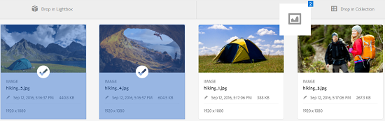

# 管理收藏集 {#managing-collections}

集合是Adobe Experience Manager资产内的一组资产。 使用收藏集可在用户之间共享资产。该集合可以是静态集合或基于搜索结果的动态集合。

与文件夹不同，收藏集可以包含来自不同位置的资产。 您可以与分配了不同权限级别（包括查看、编辑等）的不同用户共享集合。

您可以与一个用户共享多个收藏集。每个收藏集都包含对资产的引用。收藏集中会保持资产的引用完整性。

收藏集根据资产的整理方式分为以下类型：

* 包含资产、文件夹和其他收藏集的静态引用列表的收藏集。
* 智能收藏集，它根据搜索条件动态地包含资产。

## 访问集合控制台{#navigating-the-collections-console}

要打开&#x200B;**[!UICONTROL 集合]**，请点按或单击Experience Manager标志。 在导航页面中，转至&#x200B;**[!UICONTROL 资产]** > **[!UICONTROL 集合]**。

## 创建集合{#creating-a-collection}

您可以创建具有[静态引用](#creating-a-collection-with-static-references)或基于[基于搜索条件的筛选器](#creating-a-smart-collection)的集合。 您还可以从Lightbox创建收藏集。

### 创建包含静态引用的集合{#creating-a-collection-with-static-references}

您可以创建包含静态引用的收藏集，例如包含对资产、文件夹、收藏集、旋转集和图像集的引用的收藏集。

1. 导航到&#x200B;**[!UICONTROL 收藏集]**&#x200B;控制台。
1. 在工具栏中，点按／单击&#x200B;**[!UICONTROL 创建]**。
1. 在&#x200B;**[!UICONTROL 创建集合]**&#x200B;页面中，输入集合的标题和可选说明。
1. 向收藏集添加成员并分配相应的权限。或者，选择&#x200B;**[!UICONTROL 公共收藏集]**，以允许所有用户访问该收藏集。

   >[!NOTE]
   >
   >要使成员能够与其他用户共享集合，请在路径`home/users`提供`dam-users`组读取权限。 为位于`/content/dam/collections`的用户授予权限，允许用户在弹出视图中列表集合。 或者，也可以将用户作为`dam-users`组的一部分。

1. （可选）为集合添加缩略图图像。
1. 点按／单 **[!UICONTROL 击创建]**，然后点按／单 **[!UICONTROL 击确定]** ，关闭对话框。 具有指定标题和属性的集合将在“收藏集”控制台中打开。

   >[!NOTE]
   >
   >Experience Manager资产允许您为收藏集创建审核任务，这与为资产文件夹创建审核任务的方式类似。

   要将资产添加到收藏集，请导航到资产用户界面。 有关详细信息，请参阅[将资产添加到集合](/help/assets/managing-collections-touch-ui.md#adding-assets-to-a-collection)。

### 使用dropzone {#create-collections-using-dropzone}创建集合

您可以将资产从资产UI拖动到集合。 您还可以创建收藏集的副本并将资产拖动到该集合。

1. 从资产UI中，选择要添加到收藏集的资产。
1. 将资产拖到&#x200B;**[!UICONTROL 放入集合]**&#x200B;区域。

   

   当拖放区变为活动状态且其标签变为&#x200B;**[!UICONTROL 拖放到添加]**&#x200B;时，松开鼠标按钮。

   

   或者，点按／单击工具栏中的&#x200B;**[!UICONTROL 到集合]**&#x200B;图标。

   

1. 在&#x200B;**[!UICONTROL 添加到收藏集]**&#x200B;页面中，点按/单击工具栏中的&#x200B;**[!UICONTROL 创建收藏集]**&#x200B;图标。

   如果要将资产添加到现有收藏集，请从页面中选择它，然后点按／单击添 **[!UICONTROL 加]**。 默认情况下，将选择最近更新的集合。

1. 在&#x200B;**[!UICONTROL 创建新收藏集]**&#x200B;对话框中，指定收藏集的名称。如果希望所有用户都可以访问该收藏集，请选择&#x200B;**[!UICONTROL 公共收藏集]**。
1. 点按／单击&#x200B;**[!UICONTROL 继续]**&#x200B;以创建集合。

### 创建智能收藏集{#creating-a-smart-collection}

智能收藏集使用搜索条件动态填充资产。 您只能使用文件（而不是文件夹、文件和文件夹）创建智能收藏集。

要创建智能收藏集，请执行以下步骤：

1. 导航到资产用户界面，然后点按／单击搜索图标。

1. 在“全搜索”框中输入搜索关键字，然后按Enter。 打开过滤器面板并应用搜索筛选器。

1. 从&#x200B;**[!UICONTROL 文件和文件夹]**&#x200B;列表中，选择&#x200B;**[!UICONTROL 文件]**。

   

1. 点按／单击&#x200B;**[!UICONTROL 保存智能收藏集]**。
1. 指定集合的名称。 选择&#x200B;**[!UICONTROL Public]**&#x200B;以将具有查看器角色的DAM用户组添加到智能收藏集。

   

   >[!NOTE]
   >
   >如果选择&#x200B;**[!UICONTROL 公共]**，则创建智能集合后，具有所有者角色的所有人都可以使用该智能集合。 如果取消选择&#x200B;**[!UICONTROL Public]**&#x200B;选项，则DAM用户组不再与智能集合关联。

1. 点按/单击&#x200B;**[!UICONTROL 保存]**，以创建智能收藏集，然后关闭消息框以完成该进程。

   新的智能收藏集也会添加到“保存的搜索”]**列表。**[!UICONTROL 

   

   “创建智能选 **[!UICONTROL 择”按钮的标签会变]** 为“编 **[!UICONTROL 辑智能选择”]**。 要编辑智能收藏集的设置，请从“文件和文 **[!UICONTROL 件夹]** ”列 **[!UICONTROL 表中选择“文件]** ”。 然后，点按／单击编辑 **[!UICONTROL 智能选择]** 按钮。

   

## 将资产添加到集合{#adding-assets-to-a-collection}

您可以将资产添加到包含一系列引用的资产或文件夹的收藏集中。智能收藏集可使用搜索查询来填充资产。因此，对资产和文件夹的静态引用不适用于此类收藏集。

1. 在资产用户界面中，选择资产，然后点按／单击工具栏中的&#x200B;**[!UICONTROL 收藏集]**&#x200B;图标。

   

   或者，也可以将资产拖动到接口上的&#x200B;**[!UICONTROL 放入集合]**&#x200B;区域。 当区域的标签变为&#x200B;**[!UICONTROL 拖放到添加]**&#x200B;时，添加资产。

1. 在&#x200B;**[!UICONTROL 添加到收藏集]**&#x200B;页面中，选择要将资产添加到的收藏集。

1. 点按／单击&#x200B;**[!UICONTROL 添加]**，然后关闭确认消息。 资产会添加到收藏集。

## 编辑智能收藏集{#editing-a-smart-collection}

智能集合是通过保存搜索来构建的，因此您可以通过修改保存的搜索[的搜索参数来更改其内容。](#editing-saved-searches)

1. 在资产用户界面中，点按／单击工具栏中的搜索图标。

   

1. 将光标置于“Omnisearch”（全搜索）框中，按Return键。

1. 点按／单击GlobalNav图标以显示“过滤器”面板。

1. 从&#x200B;**[!UICONTROL 保存的搜索]**&#x200B;列表中，选择要修改的智能收藏集。“搜索”面板显示为保存的搜索配置的过滤器。

   

1. 从&#x200B;**[!UICONTROL 文件和文件夹]**&#x200B;列表中，选择&#x200B;**[!UICONTROL 文件]**。

1. 根据需要修改一个或多个过滤器。 点按／单击&#x200B;**[!UICONTROL 编辑智能收藏集]**。

   您还可以编辑智能收藏集的名称。

   

1. 点按／单击&#x200B;**[!UICONTROL 保存]**。 此时会出现&#x200B;**[!UICONTROL 编辑智能收藏集]**&#x200B;对话框。

1. 点按／单击&#x200B;**[!UICONTROL 覆盖]**，将原始智能收藏集替换为已编辑的收藏集。 或者，选择&#x200B;**[!UICONTROL 另存为]**&#x200B;以单独保存已编辑的集合。

1. 在确认对话框中，点按／单击&#x200B;**[!UICONTROL 保存]**&#x200B;以完成该过程。

## 视图和编辑集合元数据{#viewing-and-editing-collection-metadata}

收藏集元数据由与收藏集相关的数据组成，其中包括添加的任何标记。

1. 从收藏集控制台中，选择一个收藏集，然后点按／单击工具栏中的&#x200B;**[!UICONTROL 属性]**&#x200B;图标。
1. 在&#x200B;**[!UICONTROL 收藏集元数据]**&#x200B;页面中，从&#x200B;**[!UICONTROL 基本]**&#x200B;和&#x200B;**[!UICONTROL 高级]**&#x200B;选项卡中查看收藏集元数据。
1. 根据需要修改元数据，然后点按／单击工具栏中的&#x200B;**[!UICONTROL 保存并关闭]**&#x200B;以保存更改。

### 批量{#editing-collection-metadata-in-bulk}编辑多个集合的元数据

您可以同时编辑多个集合的元数据。 此功能可帮助您快速复制多个集合中的常见元数据。

1. 在“收藏集”控制台中，选择要编辑其元数据的两个或多个收藏集。
1. 在工具栏中，点按／单击&#x200B;**[!UICONTROL 属性]**。
1. 在&#x200B;**[!UICONTROL 收藏集元数据]**&#x200B;页面中，根据需要编辑&#x200B;**[!UICONTROL 基本]**&#x200B;和&#x200B;**[!UICONTROL 高级]**&#x200B;选项卡下的元数据。
1. 要视图特定集合的元数据属性，请在集合列表中取消选择其余的集合。 元数据编辑器字段会填充特定集合的元数据。

   >[!NOTE]
   >
   >* 在集合属性页面中，您可以通过取消选择集合来从集合列表中删除集合。 收藏集列表默认选中所有收藏集。 您删除的集合的元数据不会更新。
   >* 在列表顶部，选中&#x200B;**[!UICONTROL 标题]**&#x200B;附近的复选框，在选择集合和清除列表之间切换。

1. 点按／单击工具栏中的&#x200B;**[!UICONTROL 保存并关闭]**，然后关闭确认对话框以完成该过程。
1. 要将新元数据与现有元数据追加，请选择&#x200B;**[!UICONTROL 追加模式]**。 如果不选中此选项，则新元数据将替换字段中的现有元数据。点按／单击 **[!UICONTROL 提交]**。

   >[!NOTE]
   >
   >您为所选集合添加的元数据将覆盖这些集合的以前元数据。 使用[!UICONTROL 追加模式]在可包含多个值的字段中向现有元数据添加新值。 单值字段始终被覆盖。 您在[!UICONTROL 标记]字段中添加的任何标记都会附加到元数据中的标记的现有列表。

要自定义元数据[!UICONTROL 属性]页面，包括添加、修改和删除元数据属性，请使用模式编辑器。

>[!TIP]
>
>批量编辑方法适用于集合中的可用资产。 对于跨文件夹可用或符合通用标准的资产，可在搜索这些资产后批量更新元数据。

## 搜索集合{#searching-collections}

您可以从“收藏集”控制台中搜索收藏集。当您在“全搜索”框中使用关键字进行搜索时，AEM Assets会搜索集合名称、元数据和添加到集合的标记。

如果您从顶级搜索集合，则搜索结果中只返回单个集合。 收藏集中的资产或文件夹将被排除。 在所有其他情况下（例如，在单个收藏集或文件夹层次结构中），都会返回所有相关资产、文件夹和收藏集。

## 在集合中搜索{#searching-within-collections}

在收藏集控制台中，点按／单击收藏集以将其打开。

在收藏集中，AEM资产搜索仅限于您正在查看的收藏集中的资产（及其标记和元数据）。 当您在某个文件夹内进行搜索时，将返回当前文件夹中所有匹配的资产和子文件夹。 当您在收藏集中进行搜索时，只会返回与收藏集直接成员匹配的资产、文件夹和其他收藏集。

## 编辑集合设置{#editing-collection-settings}

您可以编辑集合设置（如标题和说明），或向集合添加成员。

1. 选择集合，然后点按／单击工具栏中的&#x200B;**[!UICONTROL 设置]**&#x200B;图标。 或者，也可以使用集合缩略图中的&#x200B;**[!UICONTROL 设置]**&#x200B;快速操作。
1. 修改&#x200B;**[!UICONTROL “集合设置”]**&#x200B;页中的集合设置。例如，修改集合标题、描述、成员和权限，如[添加集合](#creating-a-collection)中所述。

1. 要保存更改，请点按／单击&#x200B;**[!UICONTROL 保存]**。

## 删除集合{#deleting-a-collection}

1. 从收藏集控制台中，选择一个或多个收藏集，然后点按／单击工具栏中的删除图标。

1. 在对话框中，点按／单击&#x200B;**[!UICONTROL 删除]**&#x200B;以确认删除操作。

   >[!NOTE]
   >
   >您还可以通过[删除保存的搜索](#deleting-saved-searches)来删除智能收藏集。

## 下载集合{#downloading-a-collection}

当您下载收藏集时，会下载该收藏集中的整个资产层次结构，包括文件夹和子收藏集。

1. 从“集合”控制台中，选择要下载的一个或多个集合。
1. 在工具栏中，点按／单击下载图标。
1. 在&#x200B;**[!UICONTROL 下载]**&#x200B;对话框中，点按／单击&#x200B;**[!UICONTROL 下载]**。 如果要下载集合中资产的演绎版，请选择&#x200B;**[!UICONTROL 演绎版]**。 选择&#x200B;**[!UICONTROL 电子邮件]**&#x200B;选项，向集合所有者发送电子邮件通知。

   当您选择要下载的集合时，将下载集合下的完整文件夹层次结构。 要将您下载的每个集合（包括嵌套在父集合下的子集合中的资产）包含在单个文件夹中，请选择&#x200B;**[!UICONTROL 为每个资产创建单独的文件夹]**。

## 创建嵌套集合{#creating-nested-collections}

您可以将一个收藏集添加到另一个收藏集中，从而创建嵌套式收藏集。

1. 从收藏集控制台中，选择所需的收藏集或收藏集组，然后点按或单击工具栏中的&#x200B;**[!UICONTROL 到收藏集]**&#x200B;图标。

   

1. 从&#x200B;**[!UICONTROL 添加到集合]**&#x200B;页面中，选择要在其中添加集合的集合。

   >[!NOTE]
   >
   >默认情况下，在&#x200B;**[!UICONTROL 添加到集合]**&#x200B;页面中选择最近更新的集合。

1. 点按／单击&#x200B;**[!UICONTROL 添加]**。 系统会显示一条消息，确认该集合已添加到&#x200B;**[!UICONTROL 选择目标]**&#x200B;页面中的目标集合。 关闭消息以完成该过程。

>[!NOTE]
>
>无法嵌套智能收藏集。也就是说，智能收藏集不能包含其他任何收藏集。

## 保存的搜索 {#saved-searches}

在“资产”用户界面中，您可以根据某些规则、搜索条件或自定义搜索彩块化来搜索或筛选资产。 如果将这些搜索另存为“保 **[!UICONTROL 存的搜索]**”，则以后可以从“筛选器”面板的“保存的 **[!UICONTROL 搜索]** ”列表中访问它们。 创建保存的搜索也会创建智能收藏集。

### 创建保存的搜索{#creating-saved-searches}

创建智能收藏集时将创建保存的搜索。智能收藏集会自动添加到&#x200B;**[!UICONTROL 保存的搜索]**&#x200B;列表。集合的“保存的搜索”查询保存在crxde的`dam:query`属性中，crxde的相对位置为`/content/dam/collections/`。 您可以保存的搜索以及列表中显示的保存的搜索没有限制。

>[!NOTE]
>
>您可以按共享静态收藏集的相同方式共享智能收藏集。

### 编辑保存的搜索{#editing-saved-searches}

编辑保存的搜索与编辑智能收藏集相同。 有关详细信息，请参阅[编辑智能收藏集](/help/assets/managing-collections-touch-ui.md#editing-a-smart-collection)。

### 删除保存的搜索{#deleting-saved-searches}

1. 在资产用户界面中，点按／单击工具栏中的搜索图标。

   

1. 将光标置于Omnisearch字段中，按Enter键。

1. 单击或点按GlobalNav图标以显示“过滤器”面板。

1. 在&#x200B;**[!UICONTROL 保存的搜索]**&#x200B;列表中，点按／单击要删除的智能收藏集旁边的删除图标。

   

1. 在对话框中，点按／单击&#x200B;**[!UICONTROL 删除]**&#x200B;以删除保存的搜索。

## 对集合{#running-a-workflow-on-a-collection}执行工作流

您可以为集合中的资产运行工作流。 如果集合包含嵌套集合，则该工作流也会运行在嵌套集合中的资产上。 但是，如果集合和嵌套集合包含重复资产，则此工作流仅对此类资产运行一次。

1. 从收藏集控制台中，选择要在其上运行工作流的收藏集。
1. 点按／单击GlobalNav图标，然后从列表中选择&#x200B;**[!UICONTROL 时间轴]**。
1. 在时间轴中，单击或点按底部的尖角图标，然后点按／单击开始工 **[!UICONTROL 作流]**。

   

1. 在&#x200B;**[!UICONTROL 启动工作流]**&#x200B;部分，从列表中选择工作流模型。例如，选择 **[!UICONTROL DAM 更新资产]**&#x200B;模型。
1. 输入工作流的标题，然后点按／单击&#x200B;**[!UICONTROL 开始]**。
1. 在对话框中，点按／单击&#x200B;**[!UICONTROL 继续]**。 该工作流将运行在集合中的所有资产上。

>[!MORELIKETHIS]
>
>* [配置Experience Manager资产电子邮件通知](/help/sites-administering/notification.md#assetsconfig)
>* [为集合创建审阅任务](bulk-approval.md)

