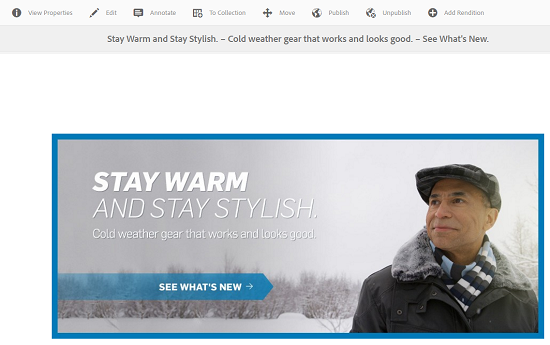
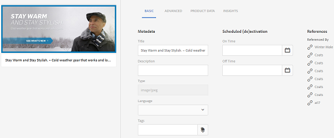

# 使用子资产管理复合资产 {#managing-compound-assets}

Adobe Experience Manager(AEM)资产可以识别上传的文件是否包含对存储库中已存在资产的引用。 此功能仅适用于支持的文件格式。 如果上传的资产包含对AEM资产的任何引用，则会在上传的资产和引用的资产之间创建双向链接。

除了消除冗余外，在Adobe Creative Cloud应用程序中引用AEM资产还可增强协作，提高用户的效率和工作效率。

AEM Assets支 **持双向引用**。 您可以在已上传文件的资产详细信息页面中查找引用的资产。 此外，您还可以在被引用资产的资产详细信息页面中视图AEM资产的引用文件。

引用会根据引用资产的路径、文档ID和实例ID解析。

## Add AEM Assets as references in Adobe Illustrator {#refai}

您可以从 Adobe Illustrator 文件中引用现有的 AEM 资产。

1. 使用 [AEM桌面应用程序](https://helpx.adobe.com/experience-manager/desktop-app/aem-desktop-app.html)，将AEM Assets存储库作为驱动器装载到本地计算机上。 在已装载的驱动器中，导航到要引用的资产所在的位置。
1. 将资产从安装的驱动器拖到 Illustrator 文件。
1. Save the Illustrator file to the mounted drive, or [upload](managing-assets-touch-ui.md#uploading-assets) to the AEM repository.
1. 该工作流完成后，转到资产的详细信息页面。 对现有AEM资产的引用列在“引 **[!UICONTROL 用]** ”列的“ **[!UICONTROL 依赖项]** ”下。

   

1. “依赖关系”下显示的 **[!UICONTROL 引用资]** 产也可由当前文件以外的文件引用。 要视图引用资产文件的列表，请在依赖项下单击资产 ****。

   

1. Click the **[!UICONTROL View Properties]** icon from the toolbar. 在属性页面中，引用当前资产的文件列表显示在“基 **[!UICONTROL 本]** ”选项卡的“引 **[!UICONTROL 用]** ”列下方。

   

## Add AEM assets as references in Adobe InDesign {#add-aem-assets-as-references-in-adobe-indesign}

要从InDesign文件中引用AEM资产，请将AEM资产拖动到InDesign文件，或将InDesign文件导出为ZIP文件。

AEM Assets已存在引用的资产。 您可以通过配置InDesign服 [务器来提取子资产](indesign.md)。 InDesign文件中的嵌入式资产会提取为子资产。

>[!NOTE]
>
>如果InDesign服务器是代理的，则InDesign文件的预览将嵌入到其XMP元数据中。 在这种情况下，缩略图提取不是明确必需的。 但是，如果InDesign服务器未代理，则必须显式提取InDesign文件的缩略图。

### Create references By Dragging AEM assets {#create-references-by-dragging-aem-assets}

此操作过程类似于[将 AEM 资产作为引用添加到 Adobe Illustrator 中](#refai)。

### Create references to AEM assets by exporting a ZIP file {#create-references-to-aem-assets-by-exporting-a-zip-file}

1. Perform the steps in [Creating Workflow Models](/help/sites-developing/workflows-models.md) to create a new workflow.
1. 使用Adobe InDesign的“打包”功能导出文档。Adobe InDesign可以将文档和关联资产作为包出口。在这种情况下，导出的文件夹包含一个“链接”文件夹，其中包含InDesign文件中的子资产。
1. 创建 ZIP 文件并将其上传到 AEM 存储库。
1. 启动 Unarchiver 工作流。
1. When the workflow completes, the references in the Links folder are automatically referenced as subassets. To view a list of referred assets, navigate to the asset details page of the InDesign asset and close the [Rail](/help/sites-authoring/basic-handling.md#rail-selector).

## Add AEM assets as references in Adobe Photoshop {#refps}

1. 使用WebDav客户端，将AEM Assets装载为驱动器。
1. 要在 Photoshop 文件中创建 AEM 资产引用，请使用 Photoshop 中的“放置链接”功能，导航到已安装驱动器中的相应资产。

   

1. Save in Photoshop file to the mounted drive or or [upload](managing-assets-touch-ui.md#uploading-assets) to the AEM repository.
1. 工作流完成后，对现有AEM资产的引用会列在资产详细信息页面中。

   To view the referenced assets, close the [Rail](/help/sites-authoring/basic-handling.md#rail-selector) in the asset details page.

1. The referenced assets also contain the list of assets they are referenced from. To view a list of referenced assets, navigate to the asset details page and close the [rail](/help/sites-authoring/basic-handling.md#rail-selector).

>[!NOTE]
>
>复合资产中的资产也可以根据其文档ID和实例ID进行引用。 此功能仅在Adobe Illustrator和Adobe Photoshop版本中可用。 对于其他资产，引用基于主复合资产中链接资产的相对路径进行，如在AEM的早期版本中所述。

## 创建子资产 {#generate-subassets}

对于多页格式(PDF文件、AI文件、Microsoft PowerPoint和Apple Keynote文件以及Adobe InDesign文件)的受支持资产，AEM可以生成与原始资产的每个单独页面对应的子资产。 这些子资产与父资产 *相关联* ，有助于进行多页视图。 出于所有其他目的，子资产会像AEM中的普通资产一样处理。

默认情况下，子资产生成处于禁用状态。 要启用子资产生成，请执行以下步骤：

1. 以管理员身份登录Experience Manager。 访问 **[!UICONTROL 工具>工作流>模型]**。
1. 选择 **[!UICONTROL DAM更新资产工作流]** ，然后单击 **[!UICONTROL 编辑]**。
1. 单击 **[!UICONTROL 切换侧面板]** ，然后找到 **[!UICONTROL 创建子资产步骤]** 。 将步骤添加到工作流。 单击&#x200B;**[!UICONTROL 同步]**。

要生成子资产，请执行以下操作之一：

* 新资产：DAM [!UICONTROL 更新资产工作流] ，对上传到AEM的任何新资产执行。 子资产是为新的多页资产自动生成的。
* 现有多页资产：按照以下任 [!UICONTROL 一步骤手动执行] DAM更新资产工作流：

   * 选择一个资产，然 [!UICONTROL 后单击] “时间轴”以打开左侧面板。 或者，使用键盘快捷键 `alt + 3`。 单击 [!UICONTROL 开始工]作流，选 [!UICONTROL 择DAM更新资产]，单击 [!UICONTROL 开始]，然后 [!UICONTROL 单击继]续。
   * 选择资产，然后单击工 [!UICONTROL 具栏中的创建] >工作流。 从弹出对话框中，选 [!UICONTROL 择DAM更新资产] ，单击 [!UICONTROL 开始]，然后 [!UICONTROL 单击继续]。

特别是对于Microsoft Word文档，请执 **[!UICONTROL 行DAM分析Word文档工作流]** 。 它从Microsoft `cq:Page` Word文档的内容生成一个组件。 从文档提取的图像从组件中引 `cq:Page` 用。 即使禁用了子资产生成，也会提取这些图像。

## View subassets {#viewing-subassets}

仅当生成子资产并且这些子资产可用于选定的多页资产时，才会显示子资产。 要视图生成的子资产，请打开多页资产。 在页面的左上角，单击左边栏图  单 **[!UICONTROL 击列表中的]** 子资产。 当您从列表 **[!UICONTROL 中选择]** “子资产”时。 或者，使用键盘快捷键 `alt + 5`。

## 视图多页文件的页面 {#view-pages-of-a-multi-page-file}

您可以使用AEM Assets的页面查看器功能视图多页文件，如PDF、INDD、PPT、PPTX和AI文件。 打开多页资产，然后 **[!UICONTROL 单击页面]** 左上角的视图页面。 打开的页面查看器显示资产的页面以及用于浏览和缩放每个页面的控件。

对于InDesign，您可以使用InDesign服务器提取页面。 如果在创建预览文件时保存了一InDesign页面，则页面提取不需要InDesign Server。

工具栏、左边栏和页面查看器控件中提供以下选项：

* **[!UICONTROL 桌面操作]** ，使用AEM桌面应用程序打开或显示特定子资产。 如果您使用AEM [桌面应用程序](https://experienceleague.adobe.com/docs/experience-manager-desktop-app/using/using.html?lang=en#desktopactions-v2) ，请参阅如何配置桌面操作。

* **[!UICONTROL 属性]** 选项会打开 [!UICONTROL 特定子资] 产的属性页面。

* **[!UICONTROL “注释]** ”选项允许您对特定子资产进行注释。 在打开父资产进行查看时，您在单独的子资产上使用的注释会一起收集和显示。

* **[!UICONTROL “页面概述]** ”选项同时显示所有子资产。

* **[!UICONTROL 单击]** “左边栏”图标后，左边栏  ，显示文件的活动流。

## 最佳实践和限制 {#best-practice-limitation-tips}

* 子资产生成会占用大量资源用于任何Experience Manager部署。 如果您是在上传复杂资产时生成子资产，请在DAM更新资产工作流中添加该步骤。 如果要按需生成子资产，请创建单独的工作流以生成子资产。 专用工作流允许您跳过DAM更新资产工作流中的其他步骤并保存计算资源。

>[!MORELIKETHIS]
>
>* [使用Adobe Experience Manager桌面应用程序](https://experienceleague.adobe.com/docs/experience-manager-desktop-app/using/using.html)

