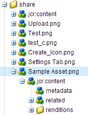
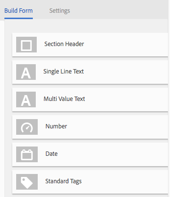
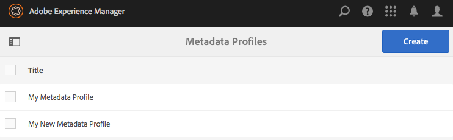

# 元数据配置文件 {#metadata-profiles}

元数据用户档案允许您将默认元数据应用到文件夹内的资产。创建元数据用户档案并将其应用到文件夹。您随后上传到文件夹的任何资产都会继承您在元数据用户档案中配置的默认元数据。

## 添加元数据用户档案{#adding-a-metadata-profile}

1. 点按或单击AEM徽标，然后导航到&#x200B;**[!UICONTROL 工具>资产>元数据用户档案]**，然后点按&#x200B;**[!UICONTROL 创建]**。
1. 输入元数据用户档案的标题（例如示例元数据），然后单击&#x200B;**[!UICONTROL 提交]**。 将显示元数据用户档案的&#x200B;**[!UICONTROL 编辑表单]**。

   

1. 单击某个组件，然后在&#x200B;**[!UICONTROL 设置]**&#x200B;选项卡中配置其属性。例如，单击&#x200B;**[!UICONTROL Description]**&#x200B;组件并编辑其属性。

   

   编辑&#x200B;**[!UICONTROL Description]**&#x200B;组件的以下属性：

   * **[!UICONTROL 字段标签]**:元数据属性的显示名称。仅供用户参考。
   * **[!UICONTROL 映射到属性]**:此属性的值提供资产节点在存储库中保存的相对路径／名称。该值应始终与开始 `./` ，因为它指示该路径位于资产的节点下。

   

   您为&#x200B;**[!UICONTROL 映射到属性]**&#x200B;指定的值会作为属性存储在资产的元数据节点下。例如，如果您指定`/jcr:content/metadata/dc:desc` 作为映射到属 **[!UICONTROL 性的名称]**,AEM Assets将值 `dc:desc` 存储在资产的元数据节点。

   * **[!UICONTROL 默认值]**：使用此属性可为元数据组件添加默认值。例如，如果指定“我的说明”，则此值将分配给资产元数据节点的属性`dc:desc`。

   

   >[!NOTE]
   >
   >向新元数据属性添加默认值（在中尚不存在）。 `/jcr:content/metadata` 节点)默认情况下不在资产的“属性”页面上显示属 **** 性及其值。要视图资产[!UICONTROL 属性]页面上的新属性，请修改相应的模式表单。

1. （可选）从&#x200B;**[!UICONTROL 构建表单]**&#x200B;选项卡向&#x200B;**[!UICONTROL 编辑表单]**&#x200B;添加更多组件，并在&#x200B;**[!UICONTROL 设置]**&#x200B;选项卡中配置其属性。**[!UICONTROL 构建表单]**&#x200B;选项卡提供以下属性：

| 组件 | 属性 |
|---|---|
| [!UICONTROL 章节标题] | 字段标签， 说明 |
| [!UICONTROL 单行文本] | 字段标签， 映射到属性， 默认值 |
| [!UICONTROL 多值文本] | 字段标签， 映射到属性， 默认值 |
| [!UICONTROL 数字] | 字段标签， 映射到属性， 默认值 |
| [!UICONTROL 日期] | 字段标签， 映射到属性， 默认值 |
| [!UICONTROL 标准标记] | 字段标签， 映射到属性， 默认值， 说明 |

1. 单击&#x200B;**[!UICONTROL 完成]**。元数据用户档案添加到&#x200B;**[!UICONTROL 元数据用户档案]**&#x200B;页面中的用户档案列表。

   

## 复制元数据用户档案{#copying-a-metadata-profile}

1. 在&#x200B;**[!UICONTROL 元数据用户档案]**&#x200B;页面中，选择一个用户档案以制作其副本。

   

1. 单击工具栏中的&#x200B;**[!UICONTROL 复制]**。
1. 在&#x200B;**[!UICONTROL 复制元数据用户档案符]**&#x200B;对话框中，输入用户档案新副本的标题。
1. 单击&#x200B;**[!UICONTROL 复制]**。在&#x200B;**[!UICONTROL 元数据用户档案]**&#x200B;页面的用户档案列表中显示用户档案的副本。

   

## 删除元数据用户档案{#deleting-a-metadata-profile}

1. 在&#x200B;**[!UICONTROL 元数据配置文件]**&#x200B;页面中，选择要删除的配置文件。

   

1. 单击工具栏中的&#x200B;**[!UICONTROL 删除元数据用户档案]**。
1. 在对话框中，单击&#x200B;**[!UICONTROL 删除]**&#x200B;以确认删除操作。 元数据用户档案会从列表中删除。

## 将元数据用户档案应用于文件夹{#applying-a-metadata-profile-to-folders}

当您将元数据配置文件分配给文件夹之后，该文件夹中的所有子文件夹都会自动继承父文件夹的配置文件。这就意味着您只能为每个文件夹分配一个元数据配置文件。因此，您在上传、存储、使用资产以及将资产存档的过程中，请妥善安排文件夹结构。

如果您为文件夹分配了一个不同的元数据配置文件，新配置文件就会取代之前的配置文件。此前存在的文件夹资产将保持不变。此后添加到该文件夹的资产将会应用新的配置文件。

在用户界面中，卡名称中显示的用户档案名称会指示已为其分配用户档案的文件夹。

您可以将元数据用户档案应用于特定文件夹或全局应用于所有资产。

### 将元数据用户档案应用于特定文件夹{#applying-metadata-profiles-to-specific-folders}

您可以从&#x200B;**[!UICONTROL 工具]**&#x200B;菜单中将元数据配置文件应用到文件夹，或者如果您在文件夹中，也可以直接从&#x200B;**[!UICONTROL 属性]**&#x200B;中应用。本节将介绍如何通过这两种方式将元数据配置文件应用到文件夹。

如果文件夹已经分配了配置文件，则文件夹名称正下方会显示配置文件的名称。

#### 从用户档案用户界面{#applying-metadata-profiles-to-folders-from-profiles-user-interface}将元数据用户档案应用到文件夹

1. 点按AEM徽标，然后导航到&#x200B;**[!UICONTROL 工具>资产>元数据用户档案]**。
1. 选择您要应用到一个或多个文件夹的元数据配置文件。

   

1. 点按&#x200B;**[!UICONTROL 将元数据用户档案应用到文件夹]**，选择要用于接收新上传资产的一个或多个文件夹，然后点按&#x200B;**[!UICONTROL 完成]**。 如果文件夹已经分配了配置文件，则文件夹名称正下方会显示配置文件的名称。

#### 从属性{#applying-metadata-profiles-to-folders-from-properties}将元数据用户档案应用到文件夹

1. 在左边栏中，点按&#x200B;**[!UICONTROL 资产]**，然后导航到要应用元数据用户档案的文件夹。
1. 在文件夹中，点按复选标记以选择它，然后点按&#x200B;**[!UICONTROL 属性]**。

1. 选择&#x200B;**[!UICONTROL 元数据配置文件]**&#x200B;选项卡，从下拉菜单中选择配置文件，然后单击&#x200B;**[!UICONTROL 保存]**。

   

   如果文件夹已经分配了配置文件，则文件夹名称正下方会显示配置文件的名称。

### 全局应用元数据用户档案{#applying-a-metadata-profile-globally}

除了将用户档案应用到文件夹之外，您还可以全局应用一个用户档案，以便上传到任何文件夹中的AEM资产的任何内容都应用了选定的。 要全局应用元数据用户档案，请执行以下步骤：

1. 执行下列操作之一：

   * 导航到`https://[aem_server]:[port]/mnt/overlay/dam/gui/content/assets/foldersharewizard.html/content/dam`并应用相应的用户档案，然后点按或单击&#x200B;**[!UICONTROL 保存]**。

      

   * 导航到CRXDE Lite到以下节点：`/content/dam/jcr:content`。 添加属性`metadataProfile:/etc/dam/metadata/dynamicmedia/<name_of_metadata_profile>`并点按&#x200B;**[!UICONTROL 保存全部]**。

      

## 从文件夹{#removing-a-metadata-profile-from-folders}删除元数据用户档案

当您将元数据配置文件从文件夹删除之后，该文件夹中的所有子文件夹都会自动删除从父文件夹继承的配置文件。但是，此前对文件夹中的文件所做的处理均予以保留。

您可以从&#x200B;**[!UICONTROL 工具]**&#x200B;菜单中的文件夹删除元数据配置文件，或者如果您在文件夹中，也可以直接从&#x200B;**[!UICONTROL 属性]**&#x200B;中删除。本节将介绍如何通过这两种方式将元数据配置文件从文件夹中删除。

### 通过用户档案用户界面{#removing-metadata-profiles-from-folders-via-profiles-user-interface}将元数据用户档案从文件夹删除

要通过用户档案用户界面将元数据用户档案从文件夹删除，请执行以下步骤：

1. 点按AEM徽标，然后导航到&#x200B;**[!UICONTROL 工具>资产>元数据用户档案]**。
1. 选择您要从一个或多个文件夹删除的元数据配置文件。
1. 点按&#x200B;**[!UICONTROL 从文件夹]**&#x200B;删除元数据用户档案，选择要用于从中删除用户档案的一个或多个文件夹，然后点按&#x200B;**[!UICONTROL 完成]**。

   如果元数据配置文件的名称不再出现在文件夹名称的下方，则可以确定该元数据配置文件不再应用于该文件夹。

### 通过属性{#removing-metadata-profiles-from-folders-via-properties}从文件夹删除元数据用户档案

1. 点按AEM徽标，然后导航&#x200B;**[!UICONTROL 资产]**，然后导航到您要从中删除元数据用户档案的文件夹。
1. 在文件夹中，点按复选标记以选择它，然后点按&#x200B;**[!UICONTROL 属性]**。
1. 选择&#x200B;**[!UICONTROL 元数据用户档案]**&#x200B;选项卡，然后从下拉菜单中选择&#x200B;**[!UICONTROL 无]**。 点按&#x200B;**[!UICONTROL 保存]**。

如果文件夹已经分配了配置文件，则文件夹名称正下方会显示配置文件的名称。
