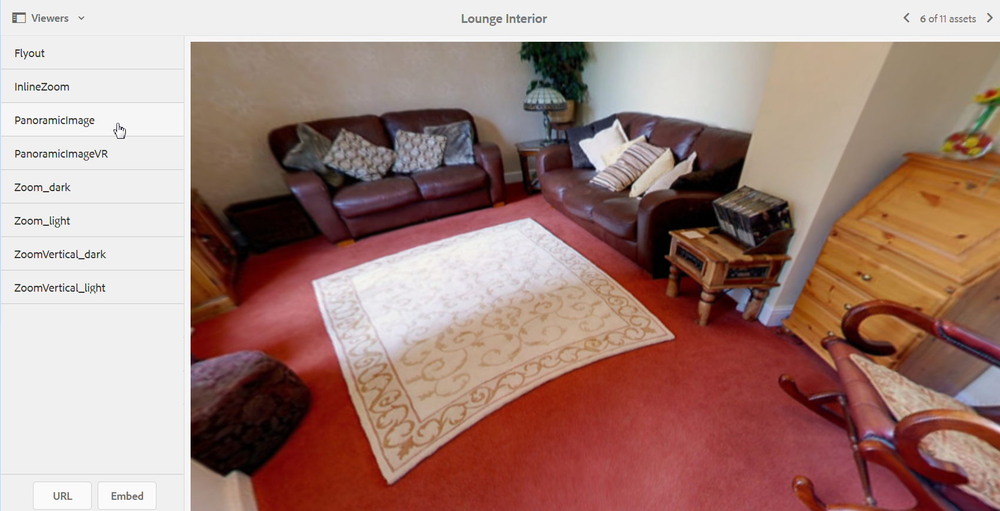

# 全景图像 {#panoramic-images}

本节介绍如何使用全景图像查看器渲染球面全景图像，实现房间、属性、位置或风景的沉浸式360°查看体验。

See also [Managing Viewer Presets](managing-viewer-presets.md).

## 上传资产以用于全景图像查看器 {#uploading-assets-for-use-with-the-panoramic-image-viewer}

要使上传的资产成为您要与全景图像查看器一起使用的球面全景图像，该资产必须具有以下一种或两种：

* 宽高比为2。

   您可以在以下位置覆盖CRXDE Lite中 **[!UICONTROL 的]** 2默认长宽比设置：

   `/conf/global/settings/cloudconfigs/dmscene7/jcr:content`

* 用关键字 `equirectangular`标记， `spherical`或和 `panorama`，或 `spherical` 和 `panoramic`。 请参 [阅使用标记](/help/sites-authoring/tags.md)。

纵横比和关键字条件都适用于资产详细信息页面和&#x200B;**[!UICONTROL 全景媒体]** 组件的全景资产。

要上传资产以用于全景图图像查看器，请参阅 [上传资产](managing-assets-touch-ui.md#uploading-assets)。

## 配置Dynamic Media Classic {#configuring-dynamic-media-classic-scene}

要使全景图像查看器在AEM中正常工作，必须将全景图像查看器预设与特定于Dynamic Media Classic和Dynamic Media Classic的元数据同步，以便查看器预设在JCR中进行更新。 为此，请按照以下方式配置Dynamic Media Classic:

1. [登录每个公司帐户的Dynamic](https://www.adobe.com/marketing-cloud/experience-manager/scene7-login.html) Media Classic实例。

1. 在页面的右上角附近，单击“设置”>“应 **[!UICONTROL 用程序设置”>“发布设置”>“图像服务器]**”。
1. 在“图 **[!UICONTROL 像服务器]** 发布”页面 **[!UICONTROL 顶部附近的“发布上下文]** ”下拉菜单中，选择“图 **[!UICONTROL 像服务”]**。

1. 在同一图像 **[!UICONTROL 服务器发布页]** ，找到标题 **[!UICONTROL 请求属性]**。
1. 在“请求 **[!UICONTROL 属性]** ”标题下，找 **[!UICONTROL 到“回复图像大小限制”]**。 然后，在关联的“宽 **[!UICONTROL 度]** ”和“ **[!UICONTROL 高度]** ”字段中，增加全景图像允许的最大图像大小。

   Dynamic Media Classic的像素数限制为25,000,000像素。 宽高比为2:1的图像的最大允许大小为7000 x 3500。 但是，对于典型的桌面屏幕，4096 x 2048像素就足够了。

   >[!NOTE]
   >
   >仅支持在允许的最大图像大小范围内的图像。 对超过大小限制的图像的请求将产生403响应。

1. 在“请 **[求属性]** ”标题下，执行以下操作：

   * 将“请 **[!UICONTROL 求模糊化模式]** ”设置 **[!UICONTROL 为“禁用]**”。
   * 将“请 **[!UICONTROL 求锁定模式]** ”设置 **[!UICONTROL 为“禁用]**”。

   在AEM中使用全景媒体组 **[!UICONTROL 件时]** ，这些设置是必需的。

1. 在“图像服务器 **[!UICONTROL 发布”页面]** 的底部，点按左侧 **[!UICONTROL 的保存]**。

1. 在右下角，点按关 **[!UICONTROL 闭]**。

### 全景媒体组件疑难解答 {#troubleshooting-the-panoramic-media-wcm-component}

如果您将图像放入WCM **[!UICONTROL 中的]** Panoramic Media组件中，并且组件占位符折叠，您可能需要对以下问题进行疑难解答：

* 如果遇到“403禁止”错误，则可能是由于请求的图像大小过大所致。 查看配 *置Dynamic Media Classic* (Scene7) [中的“回复图像大小限制”设置](#configuring-dynamic-media-classic-scene)。

* 对于页面上 *显示的资产* “锁定无效”或“分析 *错误* ”错误，请选中“请 **[!UICONTROL 求模糊化模式]** ”和“ **** 请求锁定模式”，以确保它们被禁用。
* 对于受污染的画布错误，请为图 **[!UICONTROL 像资产的先前请求设置规则集定义文件路径]** 和失效CTN。
* 如果图像请求的大小超过支持的限制后图像质量变得非常低，请检查“JPEG编 **[!UICONTROL 码属性”>“质量]** ”设置是否为空。 “质量”字段的 **[!UICONTROL 典型设]** 置是 `95`。 您可以在“图像服务器发布”页 **[!UICONTROL 面上找到该设]** 置。 要访问页面，请参阅 [配置Dynamic Media Classic](#configuring-dynamic-media-classic-scene)。

## 预览全景图像 {#previewing-panoramic-images}

See [Previewing Assets](previewing-assets.md).

## 发布全景图像 {#publishing-panoramic-images}

请参阅[发布资产](publishing-dynamicmedia-assets.md)。
