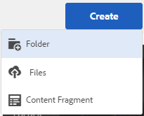

# 专用文件夹共享 {#private-folder-sharing}

您可以在Adobe Experience Manager(AEM)资产用户界面中创建仅供您使用的专用文件夹。 您可以将此专用文件夹共享给其他用户，并为其分配各种权限。 根据您分配的权限级别，用户可以对文件夹执行各种任务，例如，视图文件夹中的资产或编辑资产。

1. 在“资产”控制台中，点按／单击工具栏中的&#x200B;**[!UICONTROL 创建]**，然后从菜单中选择&#x200B;**[!UICONTROL 文件夹]**。

   

1. 在&#x200B;**[!UICONTROL 添加文件夹]**&#x200B;对话框中，输入文件夹的标题和名称（可选），然后选择&#x200B;**[!UICONTROL 专用]**。

   

1. 点按/单击&#x200B;**[!UICONTROL 创建]**。将在UI中创建专用文件夹。

   

1. 要与其他用户共享文件夹并为用户分配权限，请选择文件夹，然后单击/点按工具栏中的&#x200B;**[!UICONTROL 属性]**&#x200B;图标。

   

   >[!NOTE]
   >
   >在您共享文件夹之前，该文件夹对任何其他用户都不可见。

1. 在“文件夹属性”页面中，从&#x200B;**[!UICONTROL 添加用户]**&#x200B;列表中选择用户，为用户分配专用文件夹的角色，然后单击&#x200B;**[!UICONTROL 添加]**。

   

   >[!NOTE]
   >
   >对于您向其共享文件夹的用户，您可以分配各种角色，例如“编辑者”‘、“所有者”或“查看者”。如果为用户分配了“所有者”角色，则用户对该文件夹具有“编辑者”权限。 此外，用户还可以与他人共享文件夹。 如果您分配了“编辑者”角色，则用户可以编辑您的专用文件夹中的资产。 如果您为用户分配了“查看者”角色，用户就只能查看您专用文件夹中的资产。

1. 单击&#x200B;**[!UICONTROL 保存]**。根据您分配的角色，用户在登录 AEM Assets 时便会被分配一组针对您的专用文件夹所拥有的权限。
1. 单击&#x200B;**[!UICONTROL 确定]**&#x200B;以关闭确认消息。
1. 您向用户共享文件夹时，用户会收到共享通知。使用用户凭据登录AEM Assets以视图通知。

   

1. 点按／单击通知图标以打开通知列表。

   

1. 单击／点按管理员共享的专用文件夹的条目以打开该文件夹。

>[!NOTE]
>
>要创建专用文件夹，您需要对要创建专用文件夹的父文件夹具有“读取”和“编辑ACL”权限。 如果您不是管理员，则默认情况下，*/content/dam*&#x200B;上不会为您启用这些权限。 在这种情况下，首先获得用户ID/组的这些权限，然后再尝试创建专用文件夹或视图文件夹设置。

