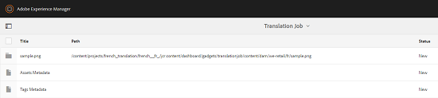

# 相关资产{#related-assets}

Adobe Experience Manager(AEM)Assets允许您使用相关资产功能根据组织的需求手动关联资产。 例如，您可以将许可证文件与类似主题上的资产或图像/视频相关联。 您可以与共享某些公共属性的资产相关联。 您还可以使用该功能在资产之间创建源/派生关系。 例如，如果您有一个从INDD文件生成的PDF文件，则可以将PDF文件与其源INDD文件相关联。

这样，您就可以灵活地将低分辨率文件（例如PDF/JPG）共享给供应商/代理，并仅应请求提供高分辨率文件（例如INDD）。

## 相关资产{#relating-assets}

1. 从资产界面中，打开要关联的资产的属性页面。

   

   或者，从列表视图中选择资产。

   

   您还可以从收藏集中选择资产。

   

1. 要将另一个资产与您选择的资产关联，请单击/点按工具栏中的&#x200B;**[!UICONTROL 关联]**&#x200B;图标。

   

1. 执行下列操作之一：

   * 要关联资产的源文件，请从列表中选择&#x200B;**[!UICONTROL 源]**。
   * 要与派生文件相关联，请从列表中选择&#x200B;**[!UICONTROL 派生]**。
   * 要在资产之间创建双向关系，请从列表中选择&#x200B;**[!UICONTROL 其他]**。

   

1. 从&#x200B;**[!UICONTROL 选择资产]**&#x200B;屏幕中，导航到要关联的资产的位置，然后选择该资产。

   

1. 单击/点按&#x200B;**[!UICONTROL Confirm]**&#x200B;图标。
1. 单击/点按&#x200B;**[!UICONTROL 确定]**&#x200B;以关闭对话框。 根据您在步骤3中选择的关系，相关资产会列在&#x200B;**[!UICONTROL Related]**&#x200B;部分的相应类别下。 例如，如果您所关联的资产是当前资产的源文件，则该资产会列在&#x200B;**[!UICONTROL Source]**&#x200B;下。

   

1. 要取消资产关联，请单击/点按工具栏中的&#x200B;**[!UICONTROL 取消关联]**&#x200B;图标。

   

1. 从&#x200B;**[!UICONTROL 删除关系]**&#x200B;对话框中选择要取消关联的资产，然后单击/点按&#x200B;**[!UICONTROL 取消关系]**。

   

1. 单击/点按&#x200B;**[!UICONTROL 确定]**&#x200B;以关闭对话框。 您删除了关系的资产将从&#x200B;**[!UICONTROL Related]**&#x200B;部分下的相关资产列表中删除。

## 翻译相关资产{#translating-related-assets}

使用相关资产功能在资产之间创建源/派生关系在翻译工作流程中也很有帮助。 当您对派生资产运行翻译工作流时，AEM Assets会自动获取源文件引用的任何资产并包含该资产进行翻译。 这样，源资产引用的资产与源资产和派生资产一起进行折算。 例如，假定您的英语副本包含派生资产及其源文件，如所示。

如果源文件与另一个资产相关，则AEM Assets会获取引用的资产，并将其包含在内以进行翻译。

1. 按照[创建新翻译项目](translation-projects.md#create-a-new-translation-project)中的步骤，将源文件夹中的资产翻译为目标语言。 例如，在本例中，将资产翻译为法语。
1. 从项目页面中，打开翻译文件夹。

   

1. 单击/点按项目拼贴以打开详细信息页面。

   

1. 单击/点按翻译作业卡片下方的省略号，以查看翻译状态。

   

1. 选择资产，然后单击/点按工具栏中的&#x200B;**[!UICONTROL 在资产]**&#x200B;中显示，以查看资产的翻译状态。

   

1. 要验证是否已翻译与源相关的资产，请单击/点按源资产。

   

1. 选择与源相关的资产，然后单击/点按资产&#x200B;]**中的**[!UICONTROL &#x200B;显示。 随即会显示已翻译的相关资产。

   
