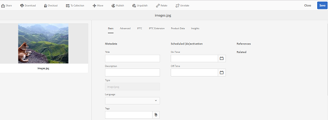

# 相关资产 {#related-assets}

>[!CAUTION]
>
>AEM 6.4已结束扩展支持，本文档将不再更新。 有关更多详细信息，请参阅 [技术支助期](https://helpx.adobe.com/cn/support/programs/eol-matrix.html). 查找支持的版本 [此处](https://experienceleague.adobe.com/docs/).

Adobe Experience Manager Assets允许您使用相关资产功能根据贵组织的需求手动关联资产。 例如，您可以将许可证文件与类似主题上的资产或图像/视频相关联。 您可以与共享某些公共属性的资产相关联。 您还可以使用该功能在资产之间创建源/派生关系。 例如，如果您有一个从INDD文件生成的PDF文件，则可以将PDF文件与其源INDD文件相关联。

这样，您就可以灵活地将低分辨率文件(例如PDF/JPG)共享给供应商/代理，并仅应请求提供高分辨率文件（例如INDD）。

## 相关资产 {#relating-assets}

1. 从资产界面中，打开要关联的资产的属性页面。

   

   或者，从列表视图中选择资产。

   

   您还可以从收藏集中选择资产。

   

1. 要将其他资产与您选择的资产关联，请单击/点按 **[!UICONTROL 关联]** 图标。

   

1. 执行下列操作之一：

   * 要关联资产的源文件，请选择 **[!UICONTROL 来源]** 列表。
   * 要关联派生文件，请选择 **[!UICONTROL 派生]** 列表。
   * 要在资产之间创建双向关系，请选择 **[!UICONTROL 其他]** 列表。

   

1. 从 **[!UICONTROL 选择资产]** ，导航到要关联的资产的位置，然后选择该资产。

   

1. 单击/点按 **[!UICONTROL 确认]** 图标。
1. 单击/点按 **[!UICONTROL 确定]** 来关闭对话框。 根据您在步骤3中选择的关系，相关资产会列在 **[!UICONTROL 相关]** 中。 例如，如果您所关联的资产是当前资产的源文件，则该资产会列在 **[!UICONTROL 来源]**.

   

1. 要取消资产关联，请单击/点按 **[!UICONTROL 不相关]** 图标。

   

1. 选择要从 **[!UICONTROL 删除关系]** 对话框，然后单击/点按 **[!UICONTROL 不相关]**.

   

1. 单击/点按 **[!UICONTROL 确定]** 来关闭对话框。 您删除关系的资产将从 **[!UICONTROL 相关]** 中。

## 折算相关资产 {#translating-related-assets}

使用相关资产功能在资产之间创建源/派生关系在翻译工作流程中也很有帮助。 当您对派生资产运行翻译工作流时， [!DNL Experience Manager] 资产会自动获取源文件引用的任何资产，并将其包含在内以进行翻译。 这样，源资产引用的资产与源资产和派生资产一起进行折算。 例如，假定您的英语副本包含派生资产及其源文件，如所示。

如果源文件与另一个资产相关， [!DNL Experience Manager] 资产会获取引用的资产，并包含该资产以进行翻译。

1. 按照 [创建新的翻译项目](translation-projects.md#create-a-new-translation-project). 例如，在本例中，将资产翻译为法语。
1. 从项目页面中，打开翻译文件夹。

   

1. 单击/点按项目拼贴以打开详细信息页面。

   

1. 单击/点按翻译作业卡片下方的省略号，以查看翻译状态。

   

1. 选择资产，然后单击/点按 **[!UICONTROL 在资产中显示]** ，以查看资产的翻译状态。

   

1. 要验证是否已翻译与源相关的资产，请单击/点按源资产。

   

1. 选择与源相关的资产，然后单击/点按 **[!UICONTROL 在资产中显示]**. 随即会显示已翻译的相关资产。

   
