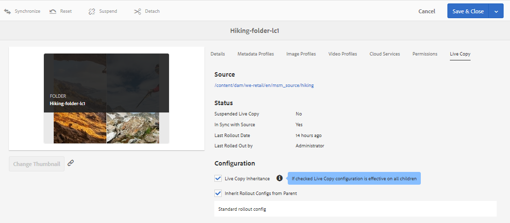
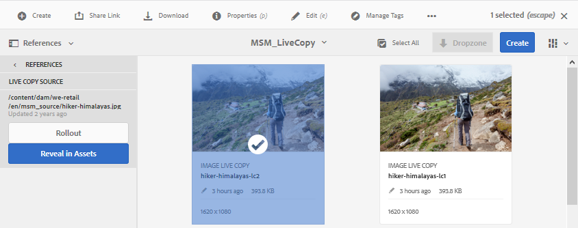

# 对资产{#reuse-assets-using-msm-for-assets}使用MSM重用资产

Adobe Experience Manager(AEM)的多站点管理器(MSM)功能使用户能够重用一次创作的内容，并在多个Web位置间重复使用。 数字资产与MSM的“资产”功能也适用。 使用MSM for Assets，您可以：

* 只需创建一次资产，即可复制这些资产，以便在站点的其他区域重复使用。
* 在同步过程中保留多个副本，并更新一次原始主副本，以将更改推送到子副本。
* 通过临时或永久暂停父资产和子资产之间的链接来进行本地更改。

## 前提条件 {#msm-prerequisites}

要将MSM用于资产，请至少安装Service Pack 5。 有关详细信息，请参阅发行说明。
[发行说明](/help/release-notes/assets.md)。

## 了解优势和概念{#understand-benefits-concepts}

### 工作方式及优势{#how-it-works-the-benefits}

要了解在多个Web位置重复使用相同内容（文本和资产）的使用方案，请参阅[可能的MSM方案](/help/sites-administering/msm.md#possible-scenarios)。 AEM保留原始资产与其链接副本之间的链接，称为Live Copy(LC)。 维护的链接允许将集中的更改推送到多个Live Copy。 这样可以在消除管理重复副本的限制的同时加快更新。 更改的传播是无错的和集中的。 该功能允许仅允许选定Live Copy进行更新。 用户可以分离链接（即中断继承），并进行在下次更新主副本和转出更改时不会覆盖的本地编辑。 可以对若干选定的元数据字段或整个资产进行分离。 它允许灵活地本地更新最初从主副本继承的资产。

MSM在源资产及其Live Copy之间保持实时关系，以便：

* 对源资产所做的更改也会应用（转出）到Live Copy，即Live Copy与源同步。

* 您可以通过暂停Live关系来更新Live Copy，或删除几个有限字段的继承。 对源的修改不再应用于Live Copy。

### MSM资产术语表{#glossary-msm-for-assets}

* **来源：** 原始资产或文件夹。从中派生Live Copy的主副本。

* **Live Copy:** 与其源同步的源资产／文件夹的副本。Live Copy可以是更多Live Copy的源。 请参见[如何创建LC](#create-live-copy-asset)。

* **继承：** Live Copy资产／文件夹与其源之间的链接／引用，系统使用它来记住将更新发送到的位置。继承存在于元数据字段的粒度级别。 可以删除选择性元数据字段的继承，同时保留源与其Live Copy之间的实时关系。

* **转出**:将对源所做的修改推送到其Live Copy下游的操作。可以使用转出操作在一次转出中更新一个或多个Live Copy。 请参阅[转出](#rollout-action)。

* **转出配置：** 确定同步哪些属性、方式和时间的规则。创建Live Copy时会应用这些配置；稍后可以编辑；并且子项可以从其父资产继承转出配置。 对于MSM for Assets，请仅使用标准转出配置。 其他转出配置对于资产不可用于MSM。

* **同步：** 除了转出之外，还有一个操作，通过从源向Live Copy发送更新，实现了源与其Live Copy之间的对等性。将为特定Live Copy启动同步，操作会从源中提取更改。 使用此操作，只能更新其中一个Live Copy。 请参阅[同步操作](#about-synchronize-action)。

* **暂停：** 暂时删除Live Copy与其源资产／文件夹之间的Live关系。你可以恢复关系。 请参阅[暂停操作](#suspend-and-resume-relationship)。

* **恢复：** 恢复Live关系，以便Live Copy再次开始从源接收更新。请参阅[恢复操作](#suspend-and-resume-relationship)。

* **重置：重** 置操作会通过覆盖任何本地更改，使Live Copy再次成为源的副本。它还会删除继承取消并重置所有元数据字段的继承。 要在将来进行本地修改，您必须再次取消特定字段的继承。 请参阅对LC[的本地修改。](#make-local-modifications-to-live-copy)

* **分离：** 不可撤消地删除Live Copy资产／文件夹的Live关系。分离操作后，Live Copy永远无法接收源的更新，并且它不再是Live Copy了。 请参阅[删除关系](#remove-live-relationship)。

## 创建资产{#create-live-copy-asset}的Live Copy

要从一个或多个源资产或文件夹创建Live Copy，请执行以下操作之一：

* **方法1**:选择源资产，然后单击 **[!UICONTROL 顶部的创]** 建>实时文案自工具栏。
* **方法2**:在AEM用户界面中， **[!UICONTROL 单击界]** 面右上角的“创建”>“实时文案”。

您可以一次创建资产或文件夹的Live Copy。 您可以创建从资产或作为Live Copy本身的文件夹派生的Live Copy。

用例不支持内容片段(CF)。 在尝试创建其Live Copy时，CF将按原样复制，而不与任何关系。 复制的CF是及时的快照，在更新原始CF时不更新。

要使用第一种方法创建Live Copy，请执行以下步骤：

1. 选择源资产或文件夹。 在工具栏中，单击&#x200B;**[!UICONTROL 创建> Live Copy]**。
   
1. 选择源资产或文件夹。 单击&#x200B;**[!UICONTROL 下一步]**。
1. 提供标题和名称。 资源没有子项。 创建文件夹的Live Copy时，您可以选择包括或排除子项。
1. 选择转出配置。 单击&#x200B;**[!UICONTROL 创建]**。

要使用第二种方法创建Live Copy，请执行以下步骤：

1. 在AEM接口中，从右上角单击&#x200B;**[!UICONTROL 创建> Live Copy]**。
   
1. 选择源资产或文件夹。 单击&#x200B;**[!UICONTROL 下一步]**。
1. 选择目标文件夹。 单击&#x200B;**[!UICONTROL 下一步]**。
1. 提供标题和名称。 资源没有子项。 创建文件夹的Live Copy时，您可以选择包括或排除子项。
1. 选择转出配置。 单击&#x200B;**[!UICONTROL 创建]**。

>[!NOTE]
>
>移动源或Live Copy时，将保留关系。 删除Live Copy后，关系即被删除。

## 视图源和Live Copy的各种属性和状态{#view-properties-statuses-source-and-lc}

您可以从AEM用户界面的各个区域视图Live Copy的信息和MSM相关状态，如关系、同步、转出等。 以下两种方法适用于资产和文件夹：

* 选择Live Copy资产，并在其&#x200B;**[!UICONTROL 属性]**&#x200B;页面中查找信息。
* 从&#x200B;**[!UICONTROL Live Copy控制台]**&#x200B;中选择源文件夹并查找每个Live Copy的详细信息。

>[!TIP]
>
>要检查几个单独的Live Copy的状态，请使用第一个方法，该方法请参见&#x200B;**[!UICONTROL 属性]**&#x200B;页。 要检查多个Live Copy的状态，请使用第二种方法，即参见&#x200B;**[!UICONTROL 关系状态]**&#x200B;页。

### Live Copy的信息和状态{#information-status-of-one-lc}

要检查Live Copy资产或文件夹的信息和状态，请按照以下步骤操作。

1. 选择Live Copy资产或文件夹。 单击工具栏中的&#x200B;**[!UICONTROL 属性]**。 或者，使用键盘快捷键`p`。
1. 单击&#x200B;**[!UICONTROL Live Copy]**。 您可以检查源的路径、挂起状态、同步状态、上次转出日期以及上次转出的用户。
   
1. 在子资产借用Live Copy配置时，您可以启用或禁用。
1. 您可以为Live Copy选择选项，以从父项继承转出配置或更改配置。

### 文件夹{#information-status-of-all-lcs-of-folder}的所有Live Copy的信息和状态

AEM提供一个控制台来检查源文件夹的所有Live Copy的状态。 此控制台显示所有子资产的状态。

1. 选择源文件夹。 单击工具栏中的&#x200B;**[!UICONTROL 属性]**。 或者，使用键盘快捷键`p`。
1. 单击 **[!UICONTROL Live Copy 源]**。要打开控制台，请单击 **[!UICONTROL Live Copy 概述]**。此功能板提供所有子资产的顶级状态。
   
1. 要查看 Live Copy 文件夹中每个资产的详细信息，请选择一个资产，然后单击工具栏中的&#x200B;**[!UICONTROL 关系状态]**。
   

>[!TIP]
>
>您可以快速查看其他文件夹的Live Copy状态，而无需浏览太多。 只需在&#x200B;**[!UICONTROL Live Copy Overview]**&#x200B;接口中上部的弹出列表中更改文件夹即可。

### 源{#quick-actions-from-references-rail-for-source}的“引用”边栏中的快速操作

对于源资产或文件夹，您可以看到以下信息，并直接从引用边栏执行以下操作：

* 请参阅Live Copy的路径。
* 在AEM用户界面中打开或显示特定的Live Copy。
* 将更新同步到特定Live Copy。
* 暂停关系或更改特定Live Copy的转出配置。
* 访问Live Copy概述控制台。

选择源资产或文件夹，打开左边栏，然后单击&#x200B;**[!UICONTROL 引用]**。 或者，选择一个资产或文件夹，然后使用键盘快捷键 `Alt + 4`。

对于特定Live Copy，单击&#x200B;**[!UICONTROL 编辑Live Copy]**&#x200B;以暂停关系或更改转出配置。

### Live Copy {#quick-actions-from-references-rail-for-live-copy}的“引用”边栏中的快速操作

对于Live Copy资产或文件夹，您可以看到以下信息，并直接从引用边栏中执行以下操作：

* 查看源的路径。
* 在AEM用户界面中打开或显示特定的Live Copy。
* 推出更新。

选择 Live Copy 资产或文件夹，打开左边栏，然后单击&#x200B;**[!UICONTROL 引用]**。或者，选择一个资产或文件夹，然后使用键盘快捷键 `Alt + 4`。

## 将修改从源传播到Live Copy {#propagate-modifications-from-source-to-live-copies}

修改源后，可以使用同步操作或转出操作将更改传播到Live Copy。 要了解两个操作之间的区别，请参阅[词汇表](#glossary-msm-for-assets)。

### 转出操作{#rollout-action}

您可以从源资产启动转出操作，并更新全部或部分选择的Live Copy。

1. 选择Live Copy资产或文件夹。 单击工具栏中的&#x200B;**[!UICONTROL 属性]**。 或者，使用键盘快捷键`p`。
1. 单击 **[!UICONTROL Live Copy 源]**。单击工具栏中的&#x200B;**[!UICONTROL 转出]**。
1. 选择要更新的Live Copy。 单击&#x200B;**[!UICONTROL 转出]**。
1. 要转出对子资产进行的更新，请选择&#x200B;**[!UICONTROL 转出源和所有子资产]**。
   

>[!NOTE]
>
>在源资产中所做的修改仅转出到直接相关的Live Copy。 如果Live Copy是从其他Live Copy派生的，则修改不会转出到派生的Live Copy。

或者，在选择特定Live Copy后，也可以从[!UICONTROL 引用]边栏启动转出操作。 有关详细信息，请参阅[ References rail for Live Copy](#quick-actions-from-references-rail-for-live-copy)中的快速操作。 在此转出方法中，只更新所选Live Copy及其子项（可选）。

### 关于同步操作{#about-synchronize-action}

同步操作仅将源中的修改拉入所选Live Copy。 同步操作尊重并保留取消继承后完成的本地修改。 不会覆盖本地修改，也不会重新建立取消的继承。 可以通过三种方式启动同步操作。

| 在AEM界面中的位置 | 何时及为何使用 | 如何使用 |
|---|---|---|
| [!UICONTROL 引用边] 栏 | 在已选择源时快速同步。 | 请参阅[源](#quick-actions-from-references-rail-for-source)引用边栏中的快速操作 |
| 工具栏。 | 在Live Copy属性已打开时启动同步。 | 请参阅[同步Live Copy](#synchronize-live-copy) |
| [!UICONTROL Live Copy概述控] 制台 | 选择源文件夹或[!UICONTROL Live Copy概述]控制台已打开时，快速同步多个资产（不一定全部）。 同步操作是一次为一个资产启动的，但是这是一次为多个资产执行同步的更快方式。 | 请参阅[对Live Copy文件夹中的许多资产执行的操作](#take-actions-on-many-assets-in-lcfolder) |

### 同步Live Copy {#synchronize-live-copy}

要开始同步操作，请打开Live **[!UICONTROL Copy的]** “属性”页，单击 **[!UICONTROL Live Copy]** ，然后单击工具栏中所需的操作。

要了解与同步操作相关的状态和信息，请参阅[文件夹](#information-status-of-all-lcs-of-folder)的所有Live Copy的信息和状态。

>[!NOTE]
>
>如果关系被挂起，则同步操作在工具栏中不可用。 尽管同步操作在[!UICONTROL 引用]边栏中可用，但即使在报告成功转出后，修改也不会传播。

## 暂停和恢复关系{#suspend-and-resume-relationship}

您可以暂时暂停关系，以阻止Live Copy接收对源资产或文件夹所做的修改。 还可以恢复Live Copy的关系，以便开始从源接收修改。

要暂停或继续，请打 **[!UICONTROL 开Live Copy的]** “属性”页面，单击 **[!UICONTROL Live Copy]** ，然后从工具栏中单击所需的操作。

或者，您也可以从 **[!UICONTROL Live Copy 概述]**&#x200B;控制台快速暂停或恢复 Live Copy 文件夹中多个资产的关系。请参阅[对 Live Copy 文件夹中的许多资产执行操作](#take-actions-on-many-assets-in-lcfolder)。

## 对Live Copy进行本地修改{#make-local-modifications-to-live-copy}

Live Copy是创建时原始源的副本。 Live Copy的元数据值是从源继承的。 元数据字段单独维护与源资产各个字段的继承。

但是，您可以灵活地对Live Copy进行本地修改，以更改一些选定的属性。 要进行本地修改，请取消所需属性的继承。 取消一个或多个元数据字段的继承后，资产的实时关系和其他元数据字段的继承将保留。 任何同步或转出不会覆盖本地修改。 为此，请打开Live copy资 **[!UICONTROL 产的“属性]** ”页面，单击元数 **[!UICONTROL 据字段旁的“取消继承]** ”图标。

您可以撤消所有本地修改并将资产还原到其源的状态。 不可撤消且即时地重置操作会覆盖所有本地修改，并在所有元数据字段上重新建立继承。 要还原，请从Live Copy资产的&#x200B;**[!UICONTROL 属性]**&#x200B;页面，单击工具栏中的&#x200B;**[!UICONTROL 重置]**。

## 删除实时关系{#remove-live-relationship}

您可以使用分离操作完全删除源与Live Copy之间的关系。 Live Copy分离后将成为独立的资产或文件夹。 它在分离后立即在AEM界面中显示为新资产。 要从Live Copy的源中分离Live Copy，请按照以下步骤操作。

1. 选择Live Copy资产或文件夹。 单击工具栏中的&#x200B;**[!UICONTROL 属性]**。 或者，也可以使用键盘快捷键p。
1. 单击&#x200B;**[!UICONTROL Live Copy]**。 单击工具栏中的&#x200B;**[!UICONTROL 分离]**。 在显示的对话框中单击&#x200B;**[!UICONTROL 分离]**。
   

>[!CAUTION]
>
>单击对话框中的[!UICONTROL 分离]后，该关系即被删除。 无法通过单击“属性”页上的[!UICONTROL 取消]来撤消此操作。

或者，您也可以从&#x200B;**[!UICONTROL Live Copy概述]**&#x200B;控制台快速分离Live Copy文件夹中的多个资产。 请参阅[对 Live Copy 文件夹中的许多资产执行操作](#take-actions-on-many-assets-in-lcfolder)。

## 对Live Copy文件夹{#take-actions-on-many-assets-in-lcfolder}中的许多资产执行操作

如果您在Live Copy文件夹中包含多个资产，则启动每个资产的操作可能会非常繁琐。 您可以从Live Copy控制台快速对许多资产启动基本操作。 以上方法继续适用于单个资产。

1. 选择源文件夹。 单击工具栏中的&#x200B;**[!UICONTROL 属性]**。 或者，也可以使用键盘快捷键p。
1. 单击 Live Copy 源。要打开控制台，请单击 **[!UICONTROL Live Copy 概述]**。
1. 在此功能板中，从 Live Copy 文件夹中选择 Live Copy 资产。单击工具栏中的所需操作。可用的操作有&#x200B;**[!UICONTROL Edit]**、**[!UICONTROL Synchronize]**、**[!UICONTROL Reset]**、**[!UICONTROL Suspend]**&#x200B;和&#x200B;**[!UICONTROL Detach]**。 您可以快速对任意数量的Live Copy文件夹中的任何资产启动这些操作，这些文件夹与选定的源文件夹存在Live关系。
   

## 扩展资产{#extend-msm-for-assets}的MSM

AEM允许您使用MSM Java API扩展功能。 对于“资产”，扩展的工作方式与MSM在“站点”方面的工作方式相同。 有关详细信息，请参阅[扩展MSM](../sites-developing/extending-msm.md)和以下部分，以了解有关特定任务的信息：

* [API概述](../sites-developing/extending-msm.md#overview-of-the-java-api)
* [创建新的同步操作](../sites-developing/extending-msm.md#creating-a-new-synchronization-action)
* [创建新转出配置](../sites-developing/extending-msm.md#creating-a-new-rollout-configuration)
* [创建并使用一个简单的LiveActionFactory类](../sites-developing/extending-msm.md#creating-and-using-a-simple-liveactionfactory-class)

>[!NOTE]
>
>* MSM for Site中的Blueprint在MSM for Assets中称为Live Copy源。
>* MSM for Assets不支持删除创建站点向导中的章节步骤。
>* 对于资产，MSM不支持在页面属性（触屏优化UI）上配置MSM锁。

## 资产管理任务对Live Copy的影响{#impact-of-asset-management-tasks-on-live-copies}

Live Copy和源是可以作为数字资产在一定程度上进行管理的资产或文件夹。 AEM的一些资产管理任务对Live Copy具有特定影响。

* 复制Live Copy时，会创建一个与第一个Live Copy源相同的Live Copy资产。
* 当您移动源或其Live Copy时，Live关系将保留。
* 编辑操作不适用于Live Copy资产。
* 签出操作不适用于Live Copy资产。
* 对于源文件夹，可以使用创建审阅任务的选项。
* 在列表视图和列视图中查看资产列表时，Live Copy资产或文件夹会对其显示“Live Copy”。 这有助于您轻松识别文件夹中的Live Copy。

## 比较资产和站点的MSM {#compare-msm-for-assets-and-sites}

在更多情况下，“资产”为MSM与“站点”功能的MSM行为相匹配。 需要注意的主要区别是：

* 在站点中，您可以比较蓝图及其Live Copy，但是在资产中无法将源与其Live Copy进行比较。
* 网站通常有子项，但资产则没有。 创建单个资产的Live Copy时，不提供包含或排除子项的选项。
* MSM for Assets不支持删除创建站点向导中的章节步骤。
* 对于资产，MSM不支持在页面属性（触屏优化UI）上配置MSM锁。
* 对于MSM for Assets，请仅使用标准转出配置。 其他转出配置对于资产不可用于MSM。

## MSM对资产的限制{#limitations-of-msm-for-assets}

以下是MSM对资产的限制。

* 用例不支持内容片段(CF)。 在尝试创建其Live Copy时，CF将按原样复制，而不与任何关系。 复制的CF是及时的快照，在更新原始CF时不更新。
