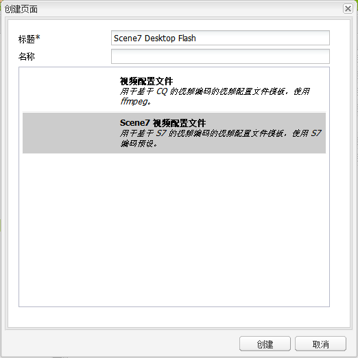
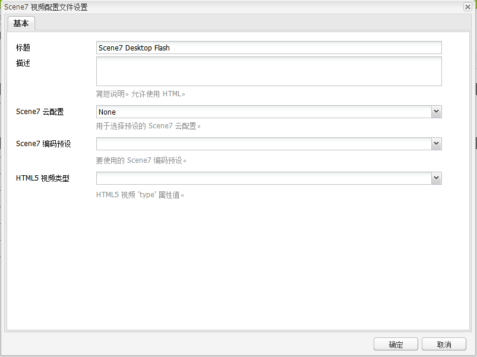

# 视频 {#video}

>[!CAUTION]
>
>AEM 6.4已结束扩展支持，本文档将不再更新。 有关更多详细信息，请参阅 [技术支助期](https://helpx.adobe.com/cn/support/programs/eol-matrix.html). 查找支持的版本 [此处](https://experienceleague.adobe.com/docs/).

Assets提供了集中式视频资产管理，您可以在其中将视频直接上传到Assets，以自动编码到Dynamic Media Classic。 您还可以直接从Assets中访问Dynamic Media Classic视频以进行页面创作。

Dynamic Media Classic视频集成将优化视频的覆盖范围扩展到所有屏幕（自动设备和带宽检测）。

的 **[!UICONTROL Scene7视频]** 组件会自动执行设备和带宽检测，以在台式机、平板电脑和移动设备上播放正确的格式和质量的视频。

您可以包含自适应视频集，而不是仅包含单个视频资产。 自适应视频集是一个容器，可容纳在多个屏幕上无缝播放视频时需要的所有视频演绎版。 自适应视频集按不同的比特率和格式对同一视频的版本进行编码。 例如，400 kbps、800 kbps和1000 kbps。 您可以使用自适应视频集和S7视频组件来实现跨多种屏幕类型的自适应视频流播放。 例如，桌面、iOS、Android、BlackBerry和Windows移动设备。

请参阅 [Dynamic Media Classic文档有关自适应视频集的更多信息](https://experienceleague.adobe.com/docs/experience-manager-cloud-service/assets/dynamicmedia/video-profiles.html#dynamicmedia).

## 关于FFMPEG和Dynamic Media Classic {#about-ffmpeg-and-scene}

默认的视频编码过程基于使用基于FFMPEG的与视频配置文件的集成。 因此，现成的DAM摄取工作流包含以下两个基于ffmpeg的工作流步骤：

* FFMPEG缩略图
* FFMPEG编码

启用和配置Dynamic Media Classic集成不会从现成的DAM摄取工作流中自动删除或停用这两个工作流步骤。 如果您已在Experience Manager中使用基于FFMPEG的视频编码，则可能已在创作环境中安装FFMPEG。 在这种情况下，使用DAM摄取的新视频将进行两次编码：一次从FFMPEG编码器获取，一次从Dynamic Media Classic集成获取。

如果您已在AEM和FFMPEG中配置基于FFMPEG的视频编码，则可以从DAM摄取工作流中删除两个FFMPEG工作流。

## 支持的格式 {#supported-formats}

Scene7视频组件支持以下格式：

* F4V H.264
* MP4 H.264

## 确定上传视频的位置 {#deciding-where-to-upload-your-video}

决定将视频资产上传到何处取决于以下内容：

* 您是否需要视频资产的工作流？
* 您是否需要对视频资产进行版本控制？

如果上述任一问题的答案为“是”或两者都为“是”，则请将视频直接上传到AdobeDAM。 如果两个问题的答案都为“否”，请将您的视频直接上传到Dynamic Media Classic。 接下来的部分将介绍每个方案的工作流程。

### 如果您直接将视频上传到AdobeDAM {#if-you-are-uploading-your-video-directly-to-adobe-dam}

如果您需要为资产提供工作流或版本控制，请先上传到AdobeDAM。 建议使用以下工作流：

1. 将视频资产上传到AdobeDAM，并自动对其进行编码和发布到Dynamic Media Classic。
1. 在Experience Manager中，在 **[!UICONTROL 电影]** 选项卡。
1. 作者 **[!UICONTROL Scene7视频]** 或 **[!UICONTROL 基础视频]** 组件。

### 如果您要将视频上传到Scene7 {#if-you-are-uploading-your-video-to-scene}

如果您不需要为资产设置工作流或版本控制，请将资产上传到Scene7。 建议使用以下工作流：

1. 在Dynamic Media Classic, [设置计划的FTP上传和编码到Scene7（系统自动）](https://experienceleague.adobe.com/docs/dynamic-media-classic/using/upload-publish/uploading-files.html#preparing-your-assets-and-folders-for-uploading).
1. 在Experience Manager中，在 **[!UICONTROL Scene7]** 选项卡。
1. 使用创作 **[!UICONTROL Scene7视频]** 组件。

## 配置与Scene7的集成视频 {#configuring-integration-with-scene-video}

要配置通用预设，请执行以下操作：

1. 在 **[!UICONTROL Cloud Services]**，导航到您的 **[!UICONTROL Scene7]** 配置，单击 **[!UICONTROL 编辑]**.
1. 选择 **[!UICONTROL 视频]** 选项卡。

   

   >[!NOTE]
   >
   >的 **[!UICONTROL 视频]** 选项卡。

1. 选择自适应视频编码配置文件、现成的单个视频编码配置文件或自定义视频编码配置文件。

   >[!NOTE]
   >
   >有关视频预设含义的更多信息，请参阅 [Dynamic Media Classic文档](https://experienceleague.adobe.com/docs/dynamic-media-classic/using/setup/application-setup.html#video-presets-for-encoding-video-files).
   >
   >Adobe建议您在配置通用预设时选择两个自适应视频集，或选择 **[!UICONTROL 自适应视频编码]** 选项。

1. 选定的编码配置文件会自动应用于上传到您为此Scene7云配置设置的CQ DAM目标文件夹的所有视频。 您可以使用不同的目标文件夹设置多个Scene7云配置，以根据需要应用不同的编码配置文件。

## 更新查看器和编码预设 {#updating-viewer-and-encoding-presets}

如果在Scene7中更新了Experience Manager中的视频预设，则需要更新查看器和编码预设。 在这种情况下，导航到云配置中的Scene7配置，然后单击 **[!UICONTROL 更新查看器和编码预设]**.

## 将主控视频从AdobeDAM上传到Scene7 {#uploading-your-master-video}

1. 导航到CQ DAM目标文件夹，您已在该文件夹中使用Scene7编码配置文件设置云配置。
1. 单击 **[!UICONTROL 上传]** 上传主控视频。 DAM更新资产工作流完成并 **[!UICONTROL 发布到Scene7]** 有复选标记。

   >[!NOTE]
   >
   >生成视频缩略图需要一些时间。

   将DAM主控视频拖动到视频组件访问 *全部* Scene7编码了代理演绎版以供交付。

## 基础视频组件与Scene7视频组件 {#foundation-video-component-versus-scene-video-component}

使用Experience Manager时，您可以同时访问站点中可用的视频组件和Scene7视频组件。 这些组件不能互换。

Scene7视频组件仅适用于Scene7视频。 基础组件可处理从Experience Manager（使用ffmpeg）和Scene7视频存储的视频。

下表说明了何时使用哪个组件：

>[!NOTE]
>
>S7视频组件现成使用通用视频配置文件。 但是，您可以在Experience Manager中获取基于HTML5的视频播放器。 简单地复制现成HTML5视频播放器的嵌入代码，并将其放入Experience Manager页面。

## Experience Manager视频组件 {#aem-video-component}

即使建议使用Scene7视频组件来查看Scene7视频，为了内容完整起见，也应将Scene7视频与基础视频组件结合使用。

### Experience Manager视频与Scene7视频比较 {#aem-video-and-scene-video-comparison}

下表简要比较了Experience Manager基础视频组件与Scene7视频组件之间支持的功能：

|  | Experience Manager基础视频 | Scene7视频 |
|---|---|---|
| 方法 | HTML5第一种方法。 Flash仅用于非HTML5回退。 | Flash。 HTML5用于移动设备和平板电脑。 |
| 交付 | 渐进 | 自适应流播放 |
| 跟踪 | 是 | 是 |
| 可扩展性 | 是 | 是(使用 [HTML5查看器SDK API文档](https://s7d1.scene7.com/s7sdk/3.10/docs/jsdoc/index.html)) |
| 移动视频 | 是 | 是 |

### 设置 {#setting-up}

#### 创建视频配置文件 {#creating-video-profiles}

根据在Scene7云配置中选择的Scene7编码预设，会创建各种视频编码。 要使用基础视频组件，必须为选定的每个Scene7编码预设创建视频配置文件。 此方法允许视频组件相应地选择DAM演绎版。

>[!NOTE]
>
>必须激活新视频配置文件及其更改才能发布。

1. 在Experience Manager中，点按 **[!UICONTROL 工具] > [!UICONTROL 配置控制台]**.
1. 从 **[!UICONTROL 配置控制台]** 导航到 **[!UICONTROL 工具> DAM >视频配置文件]** 中。
1. 创建Scene7视频配置文件。 在 **[!UICONTROL 新建……]** 下拉列表中，选择 **[!UICONTROL 创建页面]** ，然后选择Scene7视频配置文件模板。 为新的视频配置文件页面指定一个名称并单击 **[!UICONTROL 创建]**.

   

1. 编辑新的视频配置文件。 首先选择云配置。 然后，选择在云配置中选择的相同编码预设。

   

   | 属性 | 描述 |
   |---|---|
   | Scene7 云配置 | 用于编码预设的云配置。 |
   | Scene7 编码预设 | 要将此视频配置文件映射到的编码预设。 |
   | HTML5 视频类型 | 此属性允许您设置HTML5视频源元素的type属性值。 S7编码预设未提供此信息，但需要使用HTML5视频元素正确渲染视频时需要此信息。 提供了常用格式的列表，但其他格式可能会被覆盖。 |

   对在云配置中选择的所有要在视频组件中使用的编码预设重复此步骤。

#### 配置设计 {#configuring-design}

的 **[!UICONTROL 基础视频]** 组件必须了解用于构建视频源列表的视频配置文件。 打开视频组件设计对话框，并配置组件设计以使用新的视频配置文件。

>[!NOTE]
>
>如果您使用 **[!UICONTROL 基础视频]** 组件，请在移动页面的设计中重复这些步骤。

>[!NOTE]
>
>对设计所做的更改需要激活设计，以便在发布时生效。

1. 打开 **[!UICONTROL 基础视频]** 组件的“设计”对话框，并更改为 **[!UICONTROL 用户档案]** 选项卡。 然后，删除现成的用户档案并添加新的S7视频用户档案。 “设计”对话框中配置文件列表的顺序定义视频源元素在渲染时的顺序。
1. 对于不支持HTML5的浏览器，视频组件允许您配置Flash回退。 打开视频组件设计对话框，然后更改为 **[!UICONTROL Flash]** 选项卡。 配置Flash Player设置并为Flash Player分配备用配置文件。

#### 核对清单 {#checklist}

1. 创建S7云配置。 确保已设置视频编码预设并且导入器正在运行。
1. 为在云配置中选择的每个视频编码预设创建S7视频配置文件。
1. 必须激活视频配置文件。
1. 配置 **[!UICONTROL 基础视频]** 组件。
1. 完成设计更改后，激活设计。
