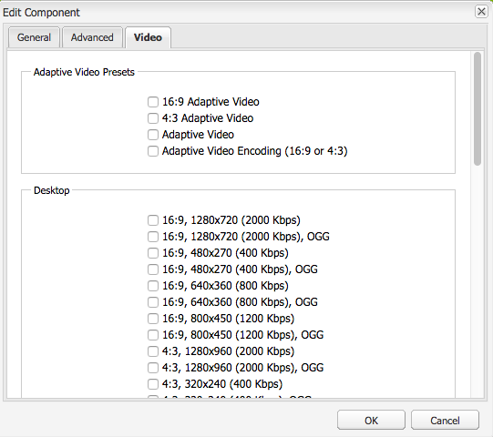

# 视频 {#video}

Assets提供了集中式视频资产管理，您可以在其中直接将视频上传到Assets，以自动编码到Dynamic Media Classic。 您还可以直接从Assets中访问Dynamic Media Classic视频以进行页面创作。

Dynamic Media Classic视频集成将优化视频的覆盖范围扩展到所有屏幕（自动设备和带宽检测）。

**[!UICONTROL Scene7视频]**&#x200B;组件会自动执行设备和带宽检测，以在台式机、平板电脑和移动设备上播放正确的格式和正确质量的视频。

您可以包含自适应视频集，而不是仅包含单个视频资产。 自适应视频集是一个容器，可容纳在多个屏幕上无缝播放视频时需要的所有视频演绎版。 自适应视频集按不同的比特率和格式对同一视频的版本进行编码。 例如，400 kbps、800 kbps和1000 kbps。 您可以使用自适应视频集和S7视频组件来实现跨多种屏幕类型的自适应视频流播放。 例如，桌面设备、iOS、Android、BlackBerry和Windows移动设备。

有关更多信息，请参阅[Dynamic Media Classic自适应视频集文档](https://experienceleague.adobe.com/docs/experience-manager-cloud-service/assets/dynamicmedia/video-profiles.html#dynamicmedia)。

## 关于FFMPEG和Dynamic Media Classic {#about-ffmpeg-and-scene}

默认的视频编码流程以使用基于 FFMPEG 的视频配置文件集成为基础。因此，现成的DAM摄取工作流包含以下两个基于ffmpeg的工作流步骤：

* FFMPEG 缩略图
* FFMPEG 编码

启用和配置Dynamic Media Classic集成不会从现成的DAM摄取工作流中自动删除或停用这两个工作流步骤。 如果您已在Experience Manager中使用基于FFMPEG的视频编码，则可能已在创作环境中安装FFMPEG。 在这种情况下，使用DAM摄取的新视频将进行两次编码：一次从FFMPEG编码器获取，一次从Dynamic Media Classic集成获取。

如果您已在AEM和FFMPEG中配置基于FFMPEG的视频编码，则可以从DAM摄取工作流中删除两个FFMPEG工作流。

## 支持的格式 {#supported-formats}

Scene7 视频组件支持以下格式：

* F4V H.264
* MP4 H.264

## 确定要将视频上传到的位置 {#deciding-where-to-upload-your-video}

确定要将视频资产上传到的位置取决于以下因素：

* 您是否需要对视频资产使用工作流？
* 您是否需要对视频资产进行版本控制？

如果上述任一问题的答案为“是”或两个问题的答案都为“是”，请将您的视频直接上传到 Adobe DAM。如果两个问题的答案都为“否”，请将您的视频直接上传到Dynamic Media Classic。 接下来的部分将介绍每个方案的工作流程。

### 如果您直接将视频上传到AdobeDAM {#if-you-are-uploading-your-video-directly-to-adobe-dam}

如果您需要为资产提供工作流或版本控制，请先上传到AdobeDAM。 下面是建议的工作流：

1. 将视频资产上传到AdobeDAM，并自动对视频资产进行编码和发布到Dynamic Media Classic。
1. 在Experience Manager中，在内容查找器的&#x200B;**[!UICONTROL Movies]**&#x200B;选项卡的WCM中访问视频资产。
1. 使用&#x200B;**[!UICONTROL Scene7 Video]**&#x200B;或&#x200B;**[!UICONTROL Foundation Video]**&#x200B;组件进行创作。

### 如果您要将视频上传到 Scene7 {#if-you-are-uploading-your-video-to-scene}

如果您不需要为资产设置工作流或版本控制，请将资产上传到Scene7。 下面是建议的工作流：

1. 在Dynamic Media Classic中，[设置到Scene7的计划FTP上传和编码（系统自动）](https://experienceleague.adobe.com/docs/dynamic-media-classic/using/upload-publish/uploading-files.html#preparing-your-assets-and-folders-for-uploading)。
1. 在Experience Manager中，在内容查找器的&#x200B;**[!UICONTROL Scene7]**&#x200B;选项卡的WCM中访问视频资产。
1. 使用&#x200B;**[!UICONTROL Scene7 Video]**&#x200B;组件进行创作。

## 配置与 Scene7 视频的集成 {#configuring-integration-with-scene-video}

要配置通用预设，请执行以下操作：

1. 在&#x200B;**[!UICONTROL 云服务]**&#x200B;中，导航到 **[!UICONTROL Scene7]** 配置，然后单击&#x200B;**[!UICONTROL 编辑]**。
1. 选择&#x200B;**[!UICONTROL 视频]**&#x200B;选项卡。

   

   >[!NOTE]
   >
   >如果页面中没有云配置，则不会显示&#x200B;**[!UICONTROL 视频]**&#x200B;选项卡。

1. 选择自适应视频编码配置文件、现成的单个视频编码配置文件，或自定义视频编码配置文件。

   >[!NOTE]
   >
   >有关视频预设含义的更多信息，请参阅[Dynamic Media Classic文档](https://experienceleague.adobe.com/docs/dynamic-media-classic/using/setup/application-setup.html#video-presets-for-encoding-video-files)。
   >
   >Adobe 建议您在配置通用预设时选择两个自适应视频集，或选择&#x200B;**[!UICONTROL 自适应视频编码]**&#x200B;选项。

1. 选定的编码配置文件会自动应用于上传到您为此 Scene7 云配置设置的 CQ DAM 目标文件夹的所有视频。您可以根据需要设置多个具有不同目标文件夹的 Scene7 云配置，以便应用不同的编码配置文件。

## 更新查看器和编码预设 {#updating-viewer-and-encoding-presets}

如果在Scene7中更新了Experience Manager中的视频预设，则需要更新查看器和编码预设。 在这种情况下，导航到云配置中的Scene7配置，然后单击&#x200B;**[!UICONTROL 更新查看器和编码预设]**。

## 将主控视频从AdobeDAM上传到Scene7 {#uploading-your-master-video}

1. 导航到在其中为云配置设置了 Scene7 编码配置文件的 CQ DAM 目标文件夹。
1. 单击&#x200B;**[!UICONTROL 上传]**&#x200B;以上传主视频。DAM更新资产工作流完成后，视频上传和编码将完成，并且&#x200B;**[!UICONTROL 发布到Scene7]**&#x200B;带有复选标记。

   >[!NOTE]
   >
   >生成视频缩略图需要一些时间。

   将DAM主控视频拖动到视频组件上，可访问&#x200B;*所有* Scene7编码的代理演绎版以进行交付。

## 基础视频组件与 Scene7 视频组件 {#foundation-video-component-versus-scene-video-component}

使用Experience Manager时，您可以同时访问站点中可用的视频组件和Scene7视频组件。 这些组件不能交换使用。

Scene7 视频组件仅适用于 Scene7 视频。基础组件可处理从Experience Manager（使用ffmpeg）和Scene7视频存储的视频。

下表说明了何时使用哪个组件：

>[!NOTE]
>
>S7视频组件现成使用通用视频配置文件。 但是，您可以在Experience Manager中获取基于HTML5的视频播放器。 简单地复制现成HTML5视频播放器的嵌入代码，并将其放入Experience Manager页面。

## Experience Manager视频组件 {#aem-video-component}

即使建议使用Scene7视频组件来查看Scene7视频，为了内容完整起见，也应将Scene7视频与基础视频组件结合使用。

### Experience Manager视频与Scene7视频比较 {#aem-video-and-scene-video-comparison}

下表简要比较了Experience Manager基础视频组件与Scene7视频组件之间支持的功能：

|  | Experience Manager基础视频 | Scene7 视频 |
|---|---|---|
| 方法 | HTML5 为首选方法。Flash 仅用作不可使用 HTML5 时的回退方法。 | 在大多数台式机上使用 Flash。在移动设备和平板电脑上使用 HTML5。 |
| 交付 | 渐进式 | 自适应流式传输 |
| 跟踪 | 是 | 是 |
| 可扩展性 | 是 | 是（带有[HTML5查看器SDK API文档](https://s7d1.scene7.com/s7sdk/3.10/docs/jsdoc/index.html)） |
| 移动视频 | 是 | 是 |

### 设置 {#setting-up}

#### 创建视频配置文件 {#creating-video-profiles}

根据在Scene7云配置中选择的Scene7编码预设，会创建各种视频编码。 要使用基础视频组件，必须为选定的每个Scene7编码预设创建视频配置文件。 此方法允许视频组件相应地选择DAM演绎版。

>[!NOTE]
>
>必须激活新的视频配置文件以及对其所做的更改，才能进行发布。

1. 在Experience Manager中，点按&#x200B;**[!UICONTROL 工具] > [!UICONTROL 配置控制台]**。
1. 从&#x200B;**[!UICONTROL 配置控制台]**&#x200B;导航到导航树中的&#x200B;**[!UICONTROL 工具> DAM >视频配置文件]**。
1. 创建Scene7视频配置文件。 在&#x200B;**[!UICONTROL 新建……]**&#x200B;下拉列表中，选择&#x200B;**[!UICONTROL 创建页面]**，然后选择Scene7视频配置文件模板。 为新的视频配置文件页面指定一个名称，然后单击&#x200B;**[!UICONTROL 创建]**。

   

1. 编辑新的视频配置文件。首先选择云配置。然后，选择在云配置中选定的相同编码预设。

   

   | 属性 | 描述 |
   |---|---|
   | Scene7 云配置 | 用于编码预设的云配置。 |
   | Scene7 编码预设 | 要将此视频配置文件映射到的编码预设。 |
   | HTML5 视频类型 | 利用此属性，可设置HTML5视频源元素的type属性值。 此信息不是由 S7 编码预设提供，但却是使用 HTML5 视频元素正确渲染视频所必需的信息。提供了通用格式列表，但是通用格式可被其他格式覆盖。 |

   对要在视频组件中使用的云配置中选定的所有编码预设重复此步骤。

#### 配置设计 {#configuring-design}

**[!UICONTROL Foundation Video]**&#x200B;组件必须了解用于构建视频源列表的视频配置文件。 打开视频组件设计对话框，并配置组件设计以使用新的视频配置文件。

>[!NOTE]
>
>如果您在移动设备页面上使用&#x200B;**[!UICONTROL Foundation Video]**&#x200B;组件，请在移动设备页面的设计中重复这些步骤。

>[!NOTE]
>
>对设计所做的更改需要激活设计，以便在发布时生效。

1. 打开&#x200B;**[!UICONTROL Foundation Video]**&#x200B;组件的设计对话框，并更改为&#x200B;**[!UICONTROL Profiles]**&#x200B;选项卡。 然后，删除现成的用户档案并添加新的S7视频用户档案。 “设计”对话框中配置文件列表的顺序定义视频源元素在渲染时的顺序。
1. 对于不支持HTML5的浏览器，视频组件允许您配置Flash回退。 打开视频组件设计对话框，并切换到&#x200B;**[!UICONTROL Flash]**&#x200B;选项卡。 配置Flash Player设置并为Flash Player分配备用配置文件。

#### 核对清单 {#checklist}

1. 创建S7云配置。 确保已设置视频编码预设并且导入器正在运行。
1. 为云配置中选定的每个视频编码预设创建对应的 S7 视频配置文件。
1. 必须激活视频配置文件。
1. 在页面上配置&#x200B;**[!UICONTROL Foundation Video]**&#x200B;组件的设计。
1. 完成对设计的更改后，激活设计。
