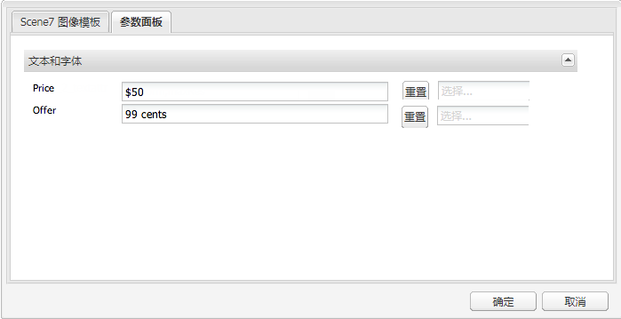
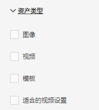
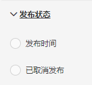

# 将Dynamic Media Classic组件添加到页面 {#adding-scene-features-to-your-page}

>[!CAUTION]
>
>AEM 6.4已结束扩展支持，本文档将不再更新。 有关更多详细信息，请参阅 [技术支助期](https://helpx.adobe.com/cn/support/programs/eol-matrix.html). 查找支持的版本 [此处](https://experienceleague.adobe.com/docs/).

Adobe Dynamic Media Classic是一个托管解决方案，用于管理、增强、发布富媒体资产并将其交付到Web、移动设备、电子邮件以及连接Internet的显示屏和打印设备。

您可以在各种查看器中查看在Dynamic Media Classic中发布的AEM资产：

* 缩放
* 弹出
* 视频
* 图像模板
* 图像

您可以将数字资产直接从AEM发布到Dynamic Media Classic，也可以将数字资产从Dynamic Media Classic发布到AEM。

本文档介绍如何将数字资产从AEM发布到Dynamic Media Classic，反之亦然。 此外，还详细介绍了查看器。 有关为Dynamic Media Classic配置AEM的信息，请参阅 [将Dynamic Media Classic与AEM集成](/help/sites-administering/scene7.md).

另请参阅 [添加图像映射](image-maps.md).

有关将视频组件与AEM结合使用的更多信息，请参阅 [视频](video.md).

>[!NOTE]
>
>如果Dynamic Media Classic资产显示不正确，请确保Dynamic Media已 [已禁用](config-dynamic.md#disabling-dynamic-media) 然后刷新页面。

## 从资产手动发布到Dynamic Media Classic {#manually-publishing-to-scene-from-assets}

您可以按如下方式将数字资产发布到Dynamic Media Classic:

* [在Assets控制台的经典用户界面中](/help/sites-classic-ui-authoring/manage-assets-classic-s7.md#publishing-from-the-assets-console)
* [在资产的经典用户界面中](/help/sites-classic-ui-authoring/manage-assets-classic-s7.md#publishing-from-an-asset)
* [在经典用户界面中，从CQ Target文件夹外部](/help/sites-classic-ui-authoring/manage-assets-classic-s7.md#publishing-assets-from-outside-the-cq-target-folder)

>[!NOTE]
>
>AEM将异步发布到Dynamic Media Classic。 在单击 **[!UICONTROL 发布]**，则您的资产可能需要几秒钟时间才能发布到Dynamic Media Classic。

## Dynamic Media Classic组件 {#scene-components}

AEM中提供了以下Dynamic Media Classic组件：

* 缩放
* 弹出（缩放）
* 图像模板
* 图像
* 视频

>[!NOTE]
>
>默认情况下，这些组件不可用，需要在 **[!UICONTROL 设计]** 模式。

在 **[!UICONTROL 设计]** 模式下，您可以像任何其他AEM组件一样将组件添加到页面。 如果资产位于同步文件夹、页面或具有Dynamic Media Classic云配置，则尚未发布到Dynamic Media Classic的资产会发布到Dynamic Media Classic。

>[!NOTE]
>
>如果要创建和开发自定义查看器，并使用内容查找器，则需要明确地添加 **[!UICONTROL 全屏]** 参数。

### Flash 查看器生命周期终止通知 {#flash-viewers-end-of-life-notice}

自2017年1月31日起，Adobe Dynamic Media Classic停止支持Flash查看器平台。

### 将Dynamic Media Classic组件(Scene7)添加到页面 {#adding-a-scene-component-to-a-page}

向页面添加Dynamic Media Classic(Scene7)组件与向任何页面添加组件相同。 以下各节详细介绍了Dynamic Media Classic组件。

**将Dynamic Media Classic(Scene7)组件添加到页面**:

1. 在AEM中，打开要添加Dynamic Media Classic(Scene7)组件的页面。

1. 如果没有可用的Dynamic Media Classic组件，请单击 **[!UICONTROL 设计]** 模式下，点按任何带蓝色边框的组件，然后点按 **[!UICONTROL 父项]** 图标，然后 **[!UICONTROL 配置]** 图标。 在 **[!UICONTROL Parsys（设计）]**，选择所有Dynamic Media Classic组件以使其可用，然后单击 **[!UICONTROL 确定]**.

   

1. 单击 **[!UICONTROL 编辑]** 返回 **[!UICONTROL 编辑]** 模式。

1. 将组件从Sidekick中的Dynamic Media Classic组拖动到页面上所需位置。

1. 单击 **[!UICONTROL 配置]** 图标以打开组件。

1. 根据需要编辑组件，然后单击 **[!UICONTROL 确定]** 保存更改。
1. 将图像或视频从内容浏览器拖动到您添加到页面的Dynamic Media Classic组件上。

   >[!NOTE]
   >
   >仅在触屏UI中，必须将图像或视频拖放到您放置在页面上的Dynamic Media Classic组件上。 不支持先选择和编辑Dynamic Media Classic组件，然后再选择资产。

### 向响应式网站添加交互式查看体验 {#adding-interactive-viewing-experiences-to-a-responsive-website}

资产的响应式设计意味着资产会根据资产的显示位置进行相应调整。 通过响应式设计，可以在多个设备上有效地显示相同的资产。

另请参阅 [网页响应式设计](/help/sites-developing/responsive.md).

**向响应式网站添加交互式查看体验**:

1. 登录AEM，并确保您 [已配置Adobe Dynamic Media ClassicCloud Services](/help/sites-administering/scene7.md#configuring-scene-integration) 以及Dynamic Media Classic组件的可用性。

   >[!NOTE]
   >
   >如果Dynamic Media Classic组件不可用，请确保 [以通过设计模式启用它们](/help/sites-authoring/default-components-designmode.md).

1. 在具有 **[!UICONTROL Dynamic Media Classic]** 组件，拖动 **[!UICONTROL 图像]** 组件。
1. 选择组件，然后点按配置图标。
1. 在 **[!UICONTROL Dynamic Media Classic设置]** 选项卡来调整断点。

   

1. 确认查看器正在响应式调整大小，并且所有交互均已针对桌面、平板电脑和移动设备进行优化。

### 所有Dynamic Media Classic组件通用的设置 {#settings-common-to-all-scene-components}

尽管配置选项各不相同，但以下各项对所有人都是通用的 [!UICONTROL Dynamic Media Classic] 组件：

* **[!UICONTROL 文件引用]**
浏览到要引用的文件。 文件引用会显示资产URL，但不一定是完整的Dynamic Media Classic URL（包括URL命令和参数）。 您无法在此字段中添加Dynamic Media Classic URL命令和参数。 必须通过组件中的相应功能添加这些组件。
* **[!UICONTROL 宽度]**
允许您设置宽度。
* **[!UICONTROL 高度]**
允许您设置高度。

通过打开（双击）Dynamic Media Classic组件(例如，在您打开 **[!UICONTROL 缩放]** 组件：

### 缩放 {#zoom}

HTML5缩放组件会在您按 **[!UICONTROL +]** 按钮。

资产底部有缩放工具。 点按 **[!UICONTROL +]** 放大。 点按 **[!UICONTROL -]** 减少。 点按 **[!UICONTROL x]** 或者，使用重置缩放箭头可将图像恢复为导入时的原始大小。 点按对角线箭头以使其全屏显示。 点按 **[!UICONTROL 编辑]** 以配置组件。 通过此组件，您可以配置 [所有通用设置 [!UICONTROL Dynamic Media Classic] 组件](#settings-common-to-all-scene-components).

### 弹出 {#flyout}

在HTML5 **[!UICONTROL 弹出]** ，则资产会显示为分屏；将资产保留在指定的大小；右侧将显示缩放部分。 点按 **[!UICONTROL 编辑]** 以配置组件。 通过此组件，您可以配置 [所有Dynamic Media Classic组件通用的设置](#settings-common-to-all-scene-components).

>[!NOTE]
>
>如果 **[!UICONTROL 弹出]** 组件使用自定义大小，然后使用该自定义大小并禁用组件的响应设置。
>
>如果 **[!UICONTROL 弹出]** 组件使用默认大小，如 **[!UICONTROL 设计视图]**，则会使用默认大小，组件会在启用组件响应设置的情况下，延伸以适应页面布局大小。 但是，请注意，组件的响应设置存在限制。 当您使用 **[!UICONTROL 弹出]** 组件，则不应将其用于整个页面拉伸。 否则， **[!UICONTROL 弹出]** 可能会超出页面的右边框。

### 图像 {#image}

Dynamic Media Classic **[!UICONTROL 图像]** 组件允许您在图像中添加Dynamic Media Classic功能，如Dynamic Media Classic修饰符、图像或查看器预设以及锐化。 Dynamic Media Classic **[!UICONTROL 图像]** 组件与AEM中具有特殊Dynamic Media Classic功能的其他图像组件类似。 在此示例中，图像具有Dynamic Media Classic URL修饰符， **&amp;op_invert=1** 应用。

* **[!UICONTROL 标题，替换文本]**
在 **[!UICONTROL 高级]** 选项卡上，为图像添加标题，并为关闭了图形的用户添加替换文本。

* **[!UICONTROL URL，在中打开]**
您可以从中设置资产以打开链接。 设置 **[!UICONTROL URL]** 和 **[!UICONTROL 在中打开]** 指示您希望在同一窗口还是新窗口中打开该窗口。

* **[!UICONTROL 查看器预设]**
从下拉菜单中选择现有的查看器预设。 如果您要查找的查看器预设不可见，则可能需要使其可见。 请参阅 [管理查看器预设](/help/assets/managing-viewer-presets.md). 如果您使用的是图像预设，则无法选择查看器预设，反之亦然。

* **[!UICONTROL Dynamic Media Classic配置]**
选择要从SPS获取活动图像预设的Dynamic Media Classic配置。

* **[!UICONTROL 图像预设]**
从下拉菜单中选择现有的图像预设。 如果您要查找的图像预设不可见，则可能需要使其可见。 请参阅 [管理图像预设](/help/assets/managing-image-presets.md). 如果您使用的是图像预设，则无法选择查看器预设，反之亦然。

* **[!UICONTROL 输出格式]**
选择图像的输出格式，例如jpeg。 根据您选择的输出格式，您可能还有其他配置选项。 请参阅 [图像预设最佳实践](/help/assets/managing-image-presets.md#image-preset-options).

* **[!UICONTROL 锐化]**
选择要锐化图像的方式。 有关锐化的详情，请参阅 [图像预设最佳实践](/help/assets/managing-image-presets.md#image-preset-options) 和 [锐化最佳实践](/help/assets/assets/sharpening_images.pdf).

* **[!UICONTROL URL修饰符]**
您可以通过提供其他Dynamic Media Classic图像命令来更改图像效果。 这些内容在 [图像预设](/help/assets/managing-image-presets.md) 和 [命令引用](https://experienceleague.adobe.com/docs/dynamic-media-developer-resources/image-serving-api/image-serving-api/http-protocol-reference/command-reference/c-command-reference.html).

* **[!UICONTROL 断点]**
如果您的网站是响应式的，您需要调整断点。 断点之间必须用逗号分隔(、)。

### 图像模板 {#image-template}

[Dynamic Media Classic图像模板](https://experienceleague.adobe.com/docs/dynamic-media-classic/using/template-basics/creating-template.html#creating-the-initial-template) 是已导入到Dynamic Media Classic的分层Photoshop内容，其中内容和属性已进行参数化，以便进行可变性。 的 **[!UICONTROL 图像模板]** 组件允许您在AEM中导入图像并动态更改文本。 此外，您还可以配置 **[!UICONTROL 图像模板]** 组件来使用client context中的值，以便每个用户以个性化方式体验图像。

点按 **[!UICONTROL 编辑]** 以配置组件。 您可以配置 [所有Dynamic Media Classic组件通用的设置](#settings-common-to-all-scene-components) 以及本节中描述的其他设置。

* **[!UICONTROL 文件引用、宽度、高度]**
请参阅所有Dynamic Media Classic组件通用的设置。

   >[!NOTE]
   >
   >Dynamic Media Classic URL命令和参数不能直接添加到文件引用URL中。 只能在组件UI(位于 **[!UICONTROL 参数]** 的上界。

* **[!UICONTROL 标题，替换文本]**
在Dynamic Media Classic图像模板选项卡中，为图像添加标题，并为关闭图形的用户添加替换文本。

* **[!UICONTROL URL，在中打开]**
您可以从中设置资产以打开链接。 设置URL，然后在打开方式中指示您希望在同一窗口还是新窗口中将其打开。

* **[!UICONTROL 参数面板]**
在导入图像时，参数会预填充来自图像的信息。 如果没有可动态更改的内容，则此窗口为空。

#### 动态更改文本 {#changing-text-dynamically}

要动态更改文本，请在字段中输入新文本，然后单击 **[!UICONTROL 确定]**. 在本例中， **[!UICONTROL 价格]** 现在是50美元，运费是99美分。

图像中的文本会发生更改。 您可以通过点按将文本重置为原始值 **[!UICONTROL 重置]** 字段旁边。

#### 更改文本以反映客户端上下文值的值 {#changing-text-to-reflect-the-value-of-a-client-context-value}

要将字段链接到客户端上下文值，请点按 **[!UICONTROL 选择]** 要打开client-context菜单，请选择client context，然后点按 **[!UICONTROL 确定]**. 在此示例中，名称会因将名称与配置文件中带格式的名称链接在一起而发生更改。

文本反映当前已登录用户的名称。 您可以通过单击 **[!UICONTROL 重置]** 字段旁边。

#### 使Dynamic Media Classic图像模板成为链接 {#making-the-scene-image-template-a-link}

1. 在页面上，Dynamic Media Classic **[!UICONTROL 图像模板]** 组件，点按 **[!UICONTROL 编辑]**.
1. 在 **[!UICONTROL URL]** 字段，输入用户在点按图像时转到的URL。 在 **[!UICONTROL 在中打开]** 字段中，选择是希望打开目标（新窗口还是同一窗口）。

   

1. 点按 **[!UICONTROL 确定]**.

### 视频组件 {#video-component}

Dynamic Media Classic **[!UICONTROL 视频]** 组件(可从Sidekick的Dynamic Media Classic部分获取)使用设备和带宽检测为每个屏幕提供正确的视频。 此组件是一个HTML5视频播放器；它是可跨渠道使用的单个查看器。

它可用于自适应视频集、单个MP4视频或单个F4V视频。

请参阅 [视频](s7-video.md) 有关视频如何与Dynamic Media Classic集成一起使用的更多信息。 此外，请参阅 [Dynamic Media Classic视频组件与Foundation视频组件](s7-video.md).

### 视频组件的已知限制 {#known-limitations-for-the-video-component}

AdobeDAM和WCM显示是否上传了主控视频。 它们不显示以下代理资产：

* Dynamic Media Classic编码演绎版
* Dynamic Media Classic自适应视频集

将自适应视频集与Dynamic Media Classic视频组件一起使用时，您需要调整组件大小以适合视频的尺寸。

## Dynamic Media Classic内容浏览器 {#scene-content-browser}

通过Dynamic Media Classic内容浏览器，您可以直接在AEM中查看Dynamic Media Classic中的内容。 要访问内容浏览器，请在 **[!UICONTROL 内容查找器]**，选择 **[!UICONTROL Dynamic Media Classic]** 在触屏优化用户界面或 **[!UICONTROL S7]** 图标。 两个用户界面的功能是相同的。

如果您有多个配置，则默认情况下，AEM会显示 [默认配置](/help/sites-administering/scene7.md#configuring-a-default-configuration). 您可以直接在Dynamic Media Classic内容浏览器的下拉菜单中选择不同的配置。

>[!NOTE]
>
>* 位于临时文件夹中的资产将不会显示在Dynamic Media Classic内容浏览器中。
>* When [已启用安全预览](/help/sites-administering/scene7.md#configuring-the-state-published-unpublished-of-assets-pushed-to-scene)，则Dynamic Media Classic上已发布和未发布的资产都会显示在Dynamic Media Classic内容浏览器中。
>* 如果您没有看到 **[!UICONTROL Dynamic Media Classic]** 或 **[!UICONTROL S7]** 图标作为内容浏览器中的选项，您需要 [配置Dynamic Media Classic以与AEM配合使用](/help/sites-administering/scene7.md).
>* 对于视频，Dynamic Media Classic内容浏览器支持：
   >   * 自适应视频集：容器，以便跨多个屏幕无缝播放所需的所有视频演绎版
   >   * 单个MP4视频
   >   * 单个F4V视频

### 在触屏优化UI中浏览内容 {#browsing-content-in-the-touch-optimized-ui}

您可以在触屏优化UI或经典UI中访问内容浏览器。 目前，触屏优化具有以下限制：

* 不支持从Dynamic Media ClassicFlashFXG和资产。

通过选择 **[!UICONTROL Dynamic Media Classic]** 从第三个下拉菜单中。 如果尚未配置Dynamic Media Classic/AEM集成，则Dynamic Media Classic不会显示在列表中。

>[!NOTE]
>
>* Dynamic Media Classic内容浏览器加载了大约100个资产，并按名称对它们进行排序。
>* 如果您设置了安全的预览服务器，则浏览器将使用该预览服务器来渲染缩略图和资产。
>

此外，您还可以通过将鼠标悬停在浏览器中的资产上，浏览分辨率信息、大小、修改后间隔天数和文件名。

* 对于自适应视频集和模板，不会为缩略图生成大小信息。
* 对于自适应视频集，不会为缩略图生成分辨率。

### 使用内容浏览器搜索Dynamic Media Classic资产 {#searching-for-scene-assets-with-the-content-browser}

搜索Dynamic Media Classic资产与搜索AEM资产类似，不同之处在于，在搜索时，您实际上会在Dynamic Media Classic系统中看到资产的远程视图，而不是将资产直接导入AEM。

您可以使用经典UI或触屏优化UI来查看和搜索资产。 根据界面，搜索方式会略有不同。

在任一UI中搜索时，您都可以按以下条件进行筛选（如触屏优化UI中的此处所示）：

* **[!UICONTROL 输入关键词]**
您可以按名称搜索资产。 在搜索时，您输入的关键词是文件名的开头。 例如，键入“swimming”一词将查找以这些字母开头的任何资产文件名。 在键入搜索词后，请务必点按Enter以查找资产。

* **[!UICONTROL 文件夹/路径]**
显示的文件夹名称基于您选择的配置。 您可以向下展开到较低级别，方法是点按文件夹图标并选择子文件夹，然后点按复选标记以将其选中。

如果输入关键字并选择文件夹，则AEM会搜索该文件夹和任何子文件夹。 但是，如果您在搜索时未输入任何关键字，则选择文件夹后，将仅显示该文件夹中的资产，且不会包含任何子文件夹。

默认情况下，AEM会搜索选定的文件夹和所有子文件夹。

* **[!UICONTROL 资产类型]**
选择 **[!UICONTROL Dynamic Media Classic]** 浏览Dynamic Media Classic内容。 仅当已配置Dynamic Media Classic时，此选项才可用。

* **[!UICONTROL 配置]**
如果您在 [!UICONTROL Cloud Services]，您可以在此处选择它。 因此，文件夹将根据您选择的配置进行更改。

* **[!UICONTROL 资产类型]**
在Dynamic Media Classic浏览器中，您可以筛选结果以包含以下任何内容：图像、模板、视频和自适应视频集。 如果您未选择任何资产类型，则默认情况下，AEM会搜索所有资产类型。

>[!NOTE]
>
>* 在经典UI中，您还可以搜索 **Flash** 和 **FXG**. 当前不支持在触屏优化UI中过滤这些内容。
>
>* 搜索视频时，您正在搜索单个演绎版。 结果会返回原始呈现版本（仅&amp;ast;.mp4）和编码呈现版本。
>* 在搜索自适应视频集时，您正在搜索文件夹和所有子文件夹，但前提是您向搜索添加了关键字。 如果您未添加关键词，则AEM不会搜索子文件夹。
>

* **[!UICONTROL 发布状态]**
您可以根据发布状态筛选资产： **[!UICONTROL 未发布]** 或 **[!UICONTROL 已发布]**. 如果未选择任何 **[!UICONTROL 发布状态]**，则AEM默认会搜索所有发布状态。

