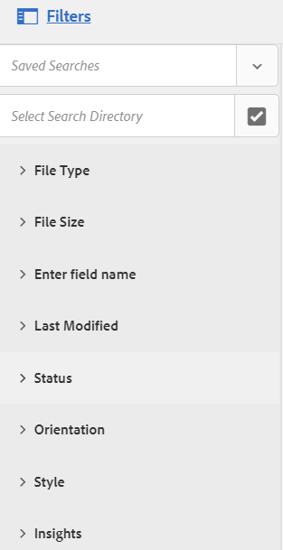
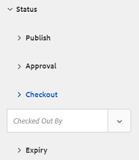

# 在AEM中搜索资产 {#search-assets-in-aem}

了解如何使用“筛选器”面板在AEM中查找所需的资产，以及如何使用在搜索中显示的资产。

使用“筛选器”面板可搜索资产、文件夹、标记和元数据。 可以使用通配符星号搜索字符串的部分。

“筛选器”面板提供了多种选项，可以通过多种方式而不是按常规分类顺序搜索资产和文件夹。

您可以根据以下选项（谓词）进行搜索：

* 文件类型
* 文件大小
* 字段名称
* 上次修改时间
* 状态
* 方向
* 样式
* 分析

<!-- TBD keystroke 65 article and port applicable changes here. This content goes. -->

您可以自定义“筛选器”面板，并使用搜索彩块化添加／删 [除搜索谓词](search-facets.md)。 要显示“滤镜”面板，请执行以下步骤：

1. 在资产用户界面中，点按／单击工  ，以显示Omnisearch框。
1. 输入您的搜索词并按Enter。 或者，只需按Enter键，无需输入任何搜索词。 请勿输入任何前导空格，否则搜索将不起作用。

1. 点按／单击GlobalNav图标。 此时将显示“滤镜”面板。

   

   根据您搜索的项目类型，搜索结果顶部会指示匹配项数。

   

## 搜索文件类型 {#search-for-file-types}

“筛选器”面板有助于为您的搜索体验添加更多粒度，并使搜索功能更具通用性。 您可以轻松向下展开到所需的详细程度。

例如，如果要查找图像，请使用“文件类 **[!UICONTROL 型]** ”谓词选择是要位图图像还是矢量图像。

您可以通过为图像指定MIME类型进一步缩小搜索范围。

同样，在搜索文档时，可以指定格式，例如PDF或MS Word。

## 根据文件大小进行搜索 {#search-based-on-file-size}

使用“ **文件大小** ”谓词可根据资产的大小搜索资产。 您可以指定大小范围的下限和上限以缩小搜索范围。 您还可以指定度量单位，例如千字节、兆字节等。

## 根据上次修改资产的时间进行搜索 {#search-based-on-when-assets-are-last-modified}

如果您管理的是进行中的资产或监视审核工作流，则可以根据准确的时间戳搜索上次修改资产的时间。 例如，指定修改资产的前后日期。

您还可以使用以下选项在搜索中实现更高级别的粒度：

## 基于状态搜索 {#search-based-on-status}

使用状 **态谓词** ，可根据各种类型的状态（如发布、批准、结帐和到期）搜索资产。

例如，在监视资产发布时，您可以使用相应的选项搜索要发布的资产。

在监视资产的审核状态时，请使用相应的选项来查找已批准的资产或待批准的资产。

## 根据洞察数据搜索 {#search-based-on-insights-data}

使用“ **分析** ”谓词，根据从各种创意应用程序获取的资产使用情况统计数据搜索资产。 使用数据按以下类别分组：

* 使用分数
* 展示次数
* 点击量
* 显示资产的媒体渠道

