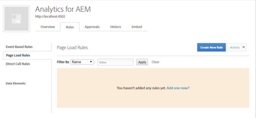
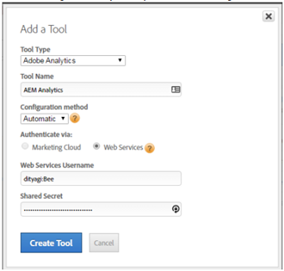

# 通过DTM实现资产洞察 {#enabling-asset-insights-through-dtm}

Adobe动态标签管理是一种激活数字营销工具的工具。 酒店免费提供给Adobe Analytics客户。 您可以自定义跟踪代码，使第三方CMS解决方案能够使用资产分析，也可以使用DTM插入资产分析标记。 只支持并提供图像洞察。

>[!CAUTION]
>
>AdobeDTM已弃用，支持Adobe Experience Platform Launch，并且很快将 [结束其使用](https://medium.com/launch-by-adobe/dtm-plans-for-a-sunset-3c6aab003a6f)。 Adobe建议您使 [用Launch进行资产分析](https://experienceleague.adobe.com/docs/experience-manager-learn/assets/advanced/asset-insights-launch-tutorial.html)。

执行以下步骤以通过DTM启用资产分析：

1. Tap/click the AEM logo, and go to **[!UICONTROL Tools > Assets > Insights Configuration]**.
1. [使用DTMCloud Service配置AEM实例](../sites-administering/dtm.md)

   登录https://dtm.adobe.com并从用户档案图标访问帐 [户](https://dtm.adobe.com/) 设 **[!UICONTROL 置后，API令牌]** 应可用。 从资产分析的角度来看，不需要执行此步骤，因为AEM Sites与资产分析的集成仍在进行之中。

1. 登录到https://dtm.adobe.com [](https://dtm.adobe.com/)，然后根据需要选择公司。
1. 创建／打开现有Web属性

   * 选择“ **[!UICONTROL Web属性]** ”选项卡，然后点按／单 **[!UICONTROL 击添加属性]**。
   * 根据需要更新字段，然后点按／单 **[!UICONTROL 击创建属性]** (请参 [阅文档](https://helpx.adobe.com/experience-manager/using/dtm.html))。

   

1. 在“规 **[!UICONTROL 则]** ”选项卡中，从导 **[!UICONTROL 航窗格中选择“页面加载规则]** ”，然后点按／单 **[!UICONTROL 击创建新规则]**。

   

1. 展开 **[!UICONTROL Javascript /第三方标记]**。 然后点按／单 **[!UICONTROL 击顺序HTML]** 选 **[!UICONTROL 项卡中的添]** 加新脚本，以打开“脚本”对话框。

   

1. Tap/click the AEM logo, and go to **[!UICONTROL Tools > Assets]**.
1. 点按／单 **[!UICONTROL 击“分析页面跟踪器]**”，复制跟踪器代码，然后将其粘贴到您在步骤6中打开的“脚本”对话框中。 保存更改。

   >[!NOTE]
   >
   >* `AppMeasurement.js` 已删除。 它预计可通过DTM的Adobe Analytics工具获得。
   >* 将删除对 `assetAnalytics.dispatcher.init()` 的呼叫。 一旦DTM的Adobe Analytics工具完成加载，该函数将被调用。
   >* 根据托管资产分析页面跟踪器(例如AEM、CDN等)的位置，脚本源的来源可能需要更改。
   >* 对于AEM托管的页面跟踪器，源应使用调度程序实例的主机名指向发布实例。


1. 打开 [https://dtm.adobe.com](https://dtm.adobe.com)。 单击Web属性中的“概述”，然后单击“添加工具”或打开现有的“Adobe Analytics工具”。 创建工具时，可将“配置方法”设置为“自动”。

   

   根据需要选择暂存／生产报表包。

1. 展开 **[!UICONTROL “库管理]**”，并确保将“ **[!UICONTROL 加载库]** ”设置为“ **[!UICONTROL 页面顶部”]**。

   

1. 展开 **[!UICONTROL “自定义页面代码]**”，然后单击或点 **[!UICONTROL 按打开编辑器]**。

   

1. 在窗口中粘贴以下代码：

   ```java
   var sObj;
   
   if (arguments.length > 0) {
     sObj = arguments[0];
   } else {
     sObj = _satellite.getToolsByType('sc')[0].getS();
   }
   _satellite.notify('in assetAnalytics customInit');
   (function initializeAssetAnalytics() {
     if ((!!window.assetAnalytics) && (!!assetAnalytics.dispatcher)) {
       _satellite.notify('assetAnalytics ready');
       /** NOTE:
           Copy over the call to 'assetAnalytics.dispatcher.init()' from Assets Pagetracker
           Be mindful about changing the AppMeasurement object as retrieved above.
       */
       assetAnalytics.dispatcher.init(
             "",  /** RSID to send tracking-call to */
             "",  /** Tracking Server to send tracking-call to */
             "",  /** Visitor Namespace to send tracking-call to */
             "",  /** listVar to put comma-separated-list of Asset IDs for Asset Impression Events in tracking-call, e.g. 'listVar1' */
             "",  /** eVar to put Asset ID for Asset Click Events in, e.g. 'eVar3' */
             "",  /** event to include in tracking-calls for Asset Impression Events, e.g. 'event8' */
             "",  /** event to include in tracking-calls for Asset Click Events, e.g. 'event7' */
             sObj  /** [OPTIONAL] if the webpage already has an AppMeasurement object, please include the object here. If unspecified, Pagetracker Core shall create its own AppMeasurement object */
             );
       sObj.usePlugins = true;
       sObj.doPlugins = assetAnalytics.core.updateContextData;
       assetAnalytics.core.optimizedAssetInsights();
     }
     else {
       _satellite.notify('assetAnalytics not available. Consider updating the Custom Page Code', 4);
     }
   })();
   ```

   * DTM中的页面加载规则仅包含pagetracker.js代码。 任何 `assetAnalytics` 字段都被视为默认值的覆盖。 默认情况下，它们不是必需的。
   * 确保已 `assetAnalytics.dispatcher.init()` 初始化并可用 `_satellite.getToolsByType('sc')[0].getS()` 后调用 `assetAnalytics,dispatcher.init` 代码。 因此，您可以跳过在步骤11中添加它。
   * 正如在“洞察页面跟踪器”代码(“工&#x200B;**[!UICONTROL 具”>“资产”>“洞察页面跟踪器]**”)中的注释中所指出的，当页面跟踪器未创建对象时，前三个参数 `AppMeasurement` (RSID、跟踪服务器和访客命名空间)将不起作用。 而是传递空字符串以突出显示它。

      其余参数与“分析配置”页面(“工具”>“资&#x200B;**[!UICONTROL 产”>“分析配置”]**)中配置的参数相对应。

   * 通过查询所有可用的SiteCatalyst引擎 `satelliteLib` 来检索AppMeasurement对象。 如果配置了多个标记，请相应地更改数组选择器的索引。 阵列中的条目按DTM界面中可用的SiteCatalyst工具进行排序。

1. 保存并关闭“代码编辑器”窗口，然后在“工具”配置中保存更改。
1. 在“批准 **[!UICONTROL ”]** 选项卡中，批准两个待处理的批准。 DTM标记已准备好插入网页。 有关如何在网页中插入DTM标记的详细信息，请参 [阅在自定义页面模板中集成DTM](https://blogs.adobe.com/experiencedelivers/experience-management/integrating-dtm-custom-aem6-page-template/)。
