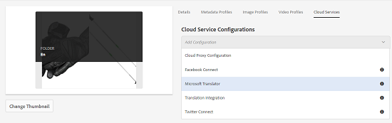

# 将翻译云服务应用到文件夹 {#applying-translation-cloud-services-to-folders}

>[!CAUTION]
>
>AEM 6.4已结束扩展支持，本文档将不再更新。 有关更多详细信息，请参阅 [技术支助期](https://helpx.adobe.com/cn/support/programs/eol-matrix.html). 查找支持的版本 [此处](https://experienceleague.adobe.com/docs/).

Adobe Experience Manager允许您使用所选翻译提供商提供的基于云的翻译服务，以确保根据您的要求对资产进行翻译。

您可以将翻译云服务直接应用到您的资产文件夹，以便在翻译工作流程中使用这些服务。

## 应用翻译服务 {#applying-the-translation-services}

将翻译云服务直接应用到您的资产文件夹，无需在创建或更新翻译工作流时配置翻译服务。

1. 从资产UI中，选择要将翻译服务应用到的文件夹。
1. 在工具栏中，单击/点按&#x200B;**[!UICONTROL 属性]**&#x200B;图标，以显示&#x200B;**[!UICONTROL 文件夹属性]**&#x200B;页面。

   

1. 导航到&#x200B;**[!UICONTROL 云服务]**&#x200B;选项卡。
1. 从Cloud Service配置列表中，选择所需的翻译提供程序。 例如，如果要从Microsoft获取翻译服务，请选择 **[!UICONTROL Microsoft Translator]**.

   

1. 为翻译提供程序选择连接器。

   

1. 在工具栏中，单击/点按&#x200B;**[!UICONTROL 保存]**，然后单击&#x200B;**[!UICONTROL 确定]**&#x200B;以关闭对话框。翻译服务将应用于文件夹。

## 应用自定义翻译连接器  {#applying-custom-translation-connector}

如果要为要在翻译工作流程中使用的翻译服务应用自定义连接器。要应用自定义连接器，请首先从“包管理器”安装连接器。然后，从云服务控制台配置连接器。配置连接器后，该连接器会显示在[应用翻译服务](transition-cloud-services.md#applying-the-translation-services)中所述的“云服务”选项卡的连接器列表中。应用自定义连接器并运行翻译工作流后，翻译项目的&#x200B;**[!UICONTROL 翻译摘要]**&#x200B;拼贴会在&#x200B;**[!UICONTROL 提供程序]**&#x200B;和&#x200B;**[!UICONTROL 方法]**&#x200B;标题下显示连接器详细信息。

1. 从包管理器安装连接器。
1. 单击/点按 [!DNL Experience Manager] 徽标，然后导航到 **[!UICONTROL 工具>部署>Cloud Services]**.
1. 在&#x200B;**[!UICONTROL 云服务]**&#x200B;页面的&#x200B;**[!UICONTROL 第三方服务]**&#x200B;下找到安装的连接器。

   

1. 单击/点按 **[!UICONTROL 立即配置]** 用于打开的链接 **[!UICONTROL 创建配置]** 对话框。

   

1. 指定连接器的标题和名称，然后单击/点按&#x200B;**[!UICONTROL 创建]**。自定义连接器位于[应用翻译服务](#applying-the-translation-services)步骤 5 中所述的&#x200B;**[!UICONTROL 云服务]**&#x200B;选项卡的连接器列表中。
1. 在应用自定义连接器后，运行[创建翻译项目](translation-projects.md)中描述的任何翻译工作流。在&#x200B;**[!UICONTROL 项目]**&#x200B;控制台中验证翻译项目的&#x200B;**[!UICONTROL 翻译摘要]**&#x200B;拼贴中连接器的详细信息。

   
