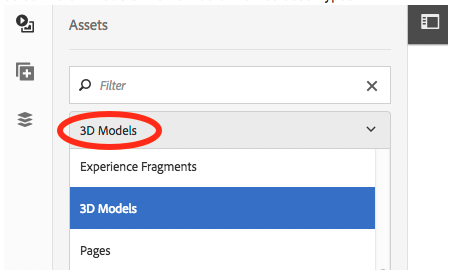

# 使用3D Sites组件{#working-with-the-d-sites-component}

AEM 3D包含一个AEM Sites组件，可用于在网页上实现3D模型的交互式查看。

添加3D组件后，您可以[视图该组件中的3D资产。](viewing-3d-assets.md)

## 将3D组件添加到页面模板{#adding-the-d-component-to-the-page-template}

必须先在页面中启用3D组件，然后才能将其放置到页面中。 有关在模板中启用组件的详细信息，请参阅[编辑模板](/help/sites-authoring/templates.md#editing-a-template-layout-template-author)。

**将3D组件添加到页面模板**:

1. 导航到&#x200B;**[!UICONTROL 工具>常规>模板]**。

1. 导航到要在其中启用3D组件的页面模板，然后选择该模板。

1. 点按&#x200B;**[!UICONTROL 编辑]**&#x200B;以打开模板。
1. 在页面右上角的下拉菜单中，选择&#x200B;**[!UICONTROL 结构]**&#x200B;模式（如果它尚未处于活动状态）。

   

1. 点按&#x200B;**[!UICONTROL 布局容器]**&#x200B;区域以选择它。

1. 点按&#x200B;**[!UICONTROL 策略]**&#x200B;按钮以打开&#x200B;**[!UICONTROL 策略编辑器]**。
1. 在&#x200B;**[!UICONTROL 属性]**&#x200B;部分，选择&#x200B;**[!UICONTROL 3D]**&#x200B;复选标记，然后点按&#x200B;**[!UICONTROL 完成]**&#x200B;以保存更改并关闭&#x200B;**[!UICONTROL 策略编辑器]**。

   您现在可以将3D站点组件放置到使用此模板的所有页面上。

## 将3D查看器组件添加到网页{#adding-the-d-viewer-component-to-a-web-page}

>[!CAUTION]
>
>此版本的AEM 3D仅支持每个网页上3D组件的一个实例。 同一页面上的多个3D组件无法正常工作。

**要将3D查看器组件添加到网页，请执行以下操作**:

1. 打开AEM Sites，选择要向其添加3D组件的网页。

1. 点按&#x200B;**[!UICONTROL 编辑]**（铅笔）图标以在页面编辑器中打开页面。 确保在页面右上方附近选择了&#x200B;**[!UICONTROL 编辑]**&#x200B;模式。

   

1. 点按边栏选择器以打开侧面板。

1. 点按加号图标以打开&#x200B;**[!UICONTROL 组件]**&#x200B;列表。

1. 将&#x200B;**[!UICONTROL 3D查看器]**&#x200B;组件&#x200B;]**列表从**[!UICONTROL &#x200B;组件&lt;a3/>拖动到页面上希望显示3D查看器的位置。

## 配置3D组件{#configuring-the-d-component}

1. 在“AEM Sites”页面编辑器中，选择之前添加到页面的&#x200B;**[!UICONTROL 3D查看器]**&#x200B;组件。

1. 点按&#x200B;**[!UICONTROL 配置]**&#x200B;图标（扳手）以打开组件配置对话框。

   您可以设置以下组件属性：

   <table> 
    <tbody> 
    <tr> 
    <td>属性</td> 
    <td>描述</td> 
    <td>适用性</td> 
    </tr> 
    <tr> 
    <td>高度（像素）</td> 
    <td>以像素为单位指定3D组件的所需高度。 如果留空，则默认值为600像素。</td> 
    <td> </td> 
    </tr> 
    <tr> 
    <td>舞台名称</td> 
    <td>
从可用舞台的列表中选择3D舞台。 舞台提供背景和照明。
 
请参阅<a href="/help/assets/about-the-use-of-stages-in-aem-3d.md" target="_blank">关于AEM 3D Sites中舞台的使用</a>。
 </td> 
    <td>Adobe Dimension资产被忽略。</td> 
    </tr> 
    <tr> 
    <td>自动旋转速度(RPM)</td> 
    <td>
3D查看器在加载和重置后连续环绕相机运行。 自动旋转在用户启动手动绕行操作时终止。
 
您可以使用以下值以RPM指定旋转速度：
 
        <ul> 
        <li>将正值设置为向右旋转</li> 
        <li>将负值设置为向左旋转</li> 
        <li>设置0值以禁用自动旋转。</li> 
        </ul> 
默认为3 RPM，相当于每完整旋转20秒。    <strong>注意：</strong> 旋转速度假定为60/秒帧速率。通常，在功能更强大的图形硬件上，通过小型到中型的型号实现此速度。 较大型号或较慢的设备以较低的速率自动旋转。
 </td> 
    <td>Adobe Dimension资产被忽略。</td> 
    </tr> 
    <tr> 
    <td>导航按钮颜色</td> 
    <td>使用拾色器为查看器的控制按钮选择主颜色。</td> 
    <td>对Adobe Dimension来说，我们无视。</td> 
    </tr> 
    <tr> 
    <td>导航悬停颜色</td> 
    <td>使用拾色器为查看器的控制按钮选择悬停／选定颜色。</td> 
    <td>Adobe Dimension资产被忽略。</td> 
    </tr> 
    <tr> 
    <td>显示色板</td> 
    <td>供将来使用。</td> 
    <td>Adobe Dimension资产被忽略。</td> 
    </tr> 
    <tr> 
    <td>显示GLTF相机预设</td> 
    <td>显示或隐藏Adobe Dimension资产中可能存在的相机预设。</td> 
    <td>仅限Adobe Dimension资产。</td> 
    </tr> 
    <tr> 
    <td>GLTF背景颜色</td> 
    <td>如果3D模型不包含背景，则默认背景颜色。</td> 
    <td>仅限Adobe Dimension资产。</td> 
    </tr> 
    </tbody> 
   </table>

1. 点按复选标记以保存更改。

   除了组件配置对话框中的可用设置之外，还有许多全局配置设置可用，这些设置可以通过CRXDE Lite进行修改。
有关这些全局设置的详细信息，请参见[高级配置设置](advanced-config-3d.md)。

## 将3D模型分配给组件{#assigning-a-d-model-to-the-component}

1. 在AEM Sites页面编辑器中，单击&#x200B;**[!UICONTROL 资产]**&#x200B;图标以打开侧面板中的资产列表卡。

1. 选择&#x200B;**[!UICONTROL 3D模型]**&#x200B;过滤器以隐藏不需要的资产类型。

   

1. 搜索或滚动到要在所编辑的页面上视图的3D资产。

1. 将3D资产从&#x200B;**[!UICONTROL 资产]**&#x200B;列表拖动到之前放在页面上的&#x200B;**[!UICONTROL 3D查看器]**&#x200B;组件。

   Adobe Dimension资产是使用基于glTF open standard的新查看器技术渲染的，而所有其他3D资产类型都依赖经典的AEM 3D webGL查看器。 该组件会根据3D模型的类型自动选择相应的查看器。

## 预览包含3D组件{#previewing-a-web-page-that-has-a-d-component}的网页

当网页处于&#x200B;**[!UICONTROL 编辑]**&#x200B;模式时，3D组件显示3D模型，但不能与模型交互。

您可以在页面编辑器中预览网页，并完全访问3D组件的功能。

另请参阅[在站点3D组件中查看3D资产](viewing-3d-assets.md#viewing-d-assets-in-the-sites-d-component)。

**预览包含3D组件的网页**:

1. 执行以下操作之一：

   * 在页面的右上角附近，单击&#x200B;**[!UICONTROL 预览]**&#x200B;进入预览模式。
   * 从浏览器中的页面URL中删除`/edit.html`。

## 发布页面和资产{#publishing-the-page-and-assets}

有关如何发布资产的信息，请参阅[发布资产](managing-assets-touch-ui.md)。 有关如何发布页面的信息，请参阅[发布页面](/help/sites-authoring/publishing-pages.md)。

>[!NOTE]
>
>使用&#x200B;**[!UICONTROL 页面信息]**&#x200B;菜单上的&#x200B;**[!UICONTROL 发布页面]**&#x200B;菜单项将发布页面和所有主页面相关性。 以这种方式发布页面时，可能由3D模型和／或3D舞台引用的辅助依赖项（如纹理映射和IBL图像）不会发布。
>
>Adobe建议您在发布引用这些资产的网页之前，直接从AEM Assets发布所有3D资产及其依赖关系。

