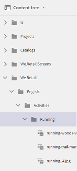

# 资产{#user-experience-enhancements-in-assets}中的用户体验增强功能

AEM 6.4 Assets包括多项可用性改进，可提供无缝的用户体验并提高工作效率。 您能够创建/管理上市内容的速度的提高提高了业务的内容速度。

该界面响应更快，可帮助您高效管理大量资产组合。 您可以快速搜索、显示、排序和顺利滚动很长的项目列表。

您可以个性化各种视图 — 卡片视图、列表视图和列视图。 例如，您可以配置要在卡片视图中显示的缩略图大小。 对于列表视图，您可以配置要在列表中为资产显示的详细信息级别。 AEM 6.4 Assets包含一个新的树视图，通过该视图，您可以方便地浏览资产存储库并查找资产。

## 延迟加载{#lazy-loading}

在AEM 6.4 Assets中浏览/搜索资产时，一次最多会显示200个资产。 您可以更快地滚动浏览结果，在浏览很长的结果列表时尤其有用。 由于一次加载的资产数量很大，因此浏览体验会很流畅。

如果您点按/单击资产以查看其详细信息页面，则只需点按/单击工具栏中的“返回”按钮，即可返回到结果页面。

## 卡片视图改进{#card-view-improvements}

根据您使用的设备和所需的详细信息量，您可以在卡片视图中调整资产缩略图的大小。 这样，您就可以个性化视图并控制显示的缩略图数量。

要在卡片视图中调整缩略图大小，请执行以下步骤：

1. 点按/单击工具栏中的布局图标，然后选择&#x200B;**[!UICONTROL 查看设置]**&#x200B;选项。

   

1. 从&#x200B;**[!UICONTROL 查看设置]**&#x200B;对话框中，选择所需的缩略图大小，然后点按/单击&#x200B;**[!UICONTROL 更新]**。

   

1. 查看以所选大小显示的缩略图。

   

现在，卡片视图中的图块会显示其他信息，如发布状态。

## 列表视图改进{#list-view-improvements}

在列表视图中，第一列默认显示资产的文件名。 还会显示其他信息，如发布和处理状态以及区域设置。

您可以选择配置要显示的详细信息量。 点按/单击布局图标，选择&#x200B;**[!UICONTROL 查看设置]**&#x200B;选项，然后指定您希望在&#x200B;**[!UICONTROL 查看设置]**&#x200B;对话框中显示的列。

## 列视图改进{#column-view-improvements}

除了卡片视图和列表视图之外，您现在还可以从列视图导航到资产的详细信息页面。 从列视图中选择资产，然后点按/单击资产快照下的&#x200B;**[!UICONTROL 更多详细信息]**。

## 树视图{#tree-view}

AEM 6.4 Assets包含树视图，通过该视图，您可以方便地浏览资产层次结构并导航到所需的资产或文件夹。

要打开树视图，请点按/单击`Assets UI`中的GlobalNav图标，然后从菜单中选择&#x200B;**[!UICONTROL 内容树]**。

在内容层次结构中，导航到所需的资产。

## 导航资产详细信息{#navigating-asset-details}

资产详细信息页面现在包含工具栏中的上一个和下一个按钮，以便您能够连续查看文件夹中的所有图像。

根据您的设备，您还可以轻扫或使用键盘上的箭头键在图像之间来回移动。

根据所选布局，您可以通过以下方式打开资产的详细信息页面：

| **查看** | **如何打开资产详细信息页面** |
|---|---|
| [!UICONTROL 卡片视图] | 点按/单击资产拼贴。 |
| [!UICONTROL 列表视图] | 点按/单击列表中资产所对应的行条目。 |
| [!UICONTROL 列视图] | 点按/单击资产快照中的&#x200B;**[!UICONTROL 更多详细信息]**&#x200B;按钮。 |

使用上一步/下一步按钮可在资产之间来回移动。

