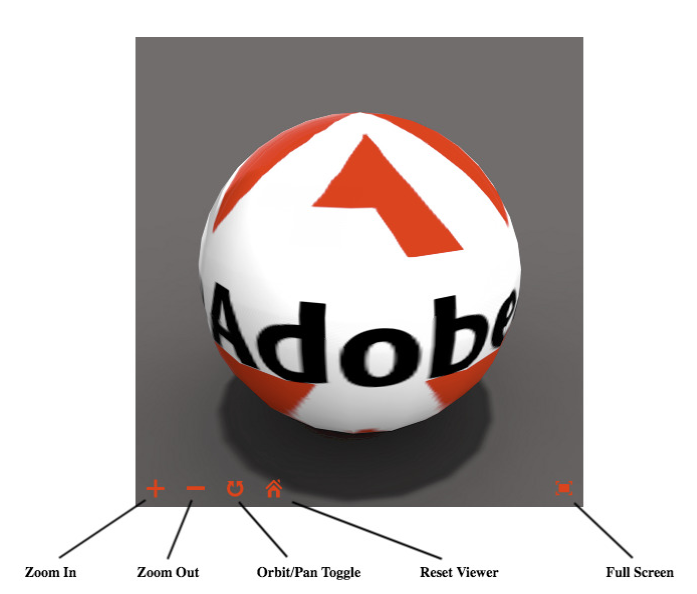

# 查看 3D 资产 {#viewing-d-assets}

>[!IMPORTANT]
>
>AEM 6.4中不再支持AEM 3D。 Adobe建议您将AEM中的3D资源功 [能用作Cloud Service](https://docs.adobe.com/content/help/en/experience-manager-cloud-service/assets/dynamicmedia/assets-3d.html)[或AEM 6.5.3或更高版本。](https://docs.adobe.com/content/help/en/experience-manager-65/assets/dynamic/assets-3d.html) 视图3D资产。

此文档介绍如何视图资产详细信息中的3D资产，以及如何视图站点中3D组件中的资产。

## 在“资产详细信息”页面中查看3D资产 {#viewing-d-assets-in-the-asset-details-page}

AEM 中的资产详细信息页面提供了交互式 3D 查看器。该查看器提供了各种控件，其中包括一组交互式相机控件，可让您对 3D 资产执行绕行、缩放和平移操作。

除了在 AEM 3D 中使用默认舞台之外，您还可以使用在第三方应用程序中创建并上传到 AEM 的舞台。

请参阅[关于在 AEM 3D 中使用舞台](about-the-use-of-stages-in-aem-3d.md)。

>[!NOTE]
>
>要查看 3D 资产，您的设备或桌面浏览器必须已启用 WebGL。此外，基础图形硬件必须具备足够的功能和内存来渲染所需大小和复杂度的模型。 某些预览功能（如投影）并非在所有浏览器上都可用。

### 查看 3D 资产时的性能注意事项 {#performance-considerations-when-you-view-d-assets}

在资产详细信息页面视图中打开 3D 资产所用的时间取决于多个因素。这些因素包括如下几项：

* 服务器的带宽和延迟。
* 模型大小（人脸数量）。
* 映射的数量和大小。
* 舞台的复杂性。例如，IBL 图像的大小。

此外，在以交互方式操作相机时，还要考虑客户端计算机（如工作站、笔记本或移动触控设备）的功能。 具备良好图形功能的相当强大的系统可以使交互式 3D 查看体验更流畅、更舒适。

**要视图3D资产**:

1. 确保您已将 3D 资产上传到 AEM。

   请参阅[关于 AEM 中 3D 资产的上传和处理](upload-processing-3d-assets.md)。

1. From AEM, on the **[!UICONTROL Navigation]** page, tap **[!UICONTROL Assets]**.
1. Near the upper-right corner of the page, from the **[!UICONTROL View]** drop-down list, tap **[!UICONTROL Card View]**.
1. 导航到要查看的 3D 资产。
1. 点按3D资产的卡片，以在资产详细信息页面中将其打开。
1. 执行以下操作之一：

   * 在资产详细信息页面的右下角，使用相机控件调板更改资产的各种视图。

      如果您使用的是没有滚轮的非触控输入设备（例如经典的 Apple 单键鼠标），您仍可以在各种模式下更改 3D 资产的缩放级别或透视效果。通过在按住 `SHIFT` 键的同时按下鼠标按钮并向上或向下拖动，可以完成该操作。

      使用典型笔记本电脑上的触控板时，通常很难用双指手势来控制缩放或透视行为。在这种情况下，您可以在操作过程中按住 `SHIFT` 键。这样可以降低捏合手势的速度，并使您可以更轻松地达到所需的确切缩放级别或透视效果。Alternately, you can use a one finger drag up or down while the `SHIFT`key is pressed to affect zoom or perspective behaviors.
   <table> 
    <tbody> 
      <tr> 
      <td><strong>相机控件名称</strong>  </td> 
      <td><strong>描述</strong></td> 
      </tr> 
      <tr> 
      <td>
缩放
 
或
 
佩尔普
 </td> 
      <td>
点按或单击可在缩放和透视模式之间切换。
 
Or, press and hold down the <code>ALT/OPTION</code> key during the action to temporarily toggle to Perspective  mode. 松开该键可恢复到“缩放”模式。
 
      <ul> 
      <li><strong>缩放</strong>-将相机移近或远离您正在查看的资产的近摄和远摄  。 缩放是鼠标滚轮（如果可用）、移动设备上的双指捏合手势，或者在按住 Shift 键的同时使用鼠标左键向上或向下拖动时的默认行为。</li> 
      <li><strong>透视</strong>-更改相机的焦距(也称为视图场)，同时保持视图中资产的相对大小。 透视是鼠标滚轮（如果可用）、移动设备上的双指捏合手势，或者在按住 Shift 键的同时使用鼠标左键向上或向下拖动时的替换行为。</li> 
      </ul> </td> 
      </tr> 
      <tr> 
      <td>
绕行
 
或
 
平
 </td> 
      <td>
点按或单击可在“绕行”和“平移”模式之间切换。
 
Or, press and hold the <code>ALT/OPTION</code> key during the action to temporarily toggle to Pan mode. 松开该键可恢复到“绕行”模式。
 
      <ul> 
      <li><strong>绕行</strong>-在以目标点为中心的球体上移动查看摄像机，该点默认位于3D资产的中心附近。 绕行是鼠标左键拖动或移动设备上的单次触摸拖动的默认行为。</li> 
      <li><strong>平移</strong>-在查看平面中移动相机。 目标点会相应移动，这样随后的绕行操作将会使相机围绕新的目标点移动。平移是鼠标左键拖动和单次触摸拖动的替换行为。</li> 
      </ul> </td> 
      </tr> 
      <tr> 
      <td>
检查
 
或
 
目标
 </td> 
      <td>
点按或单击可在检查模式和目标模式之间切换。
 
      <ul> 
      <li><strong>检查</strong>-点按或单击进入目标模式。</li> 
      <li><strong>目标</strong>-点按或单击3D资产上任意位置的点，以将视图放在资产该部分的中心。  绕行操作使用新的目标点。</li> 
      </ul> </td> 
      </tr> 
      <tr> 
      <td>重置</td> 
      <td>点按或单击以将视图目标点恢复到模型的中心。 Reset also moves the camera  closer or further away to show the asset in its entirety and at a reasonable viewing size.</td> 
      </tr> 
    </tbody> 
    </table>

   * Near the upper-right corner of the asset details page, tap the **[!UICONTROL Stage Selector]** icon. 选择要应用于 3D 资产的包含背景和灯光的舞台名称。

   

   舞台提供查看3D模型的环境背景、地平面和照明。

   请参阅[关于在 AEM 3D 中使用舞台](about-the-use-of-stages-in-aem-3d.md)。

   * Near the upper-right corner of the asset details page, tap the **[!UICONTROL Camera Selector]** icon, then select a camera view that you want to apply to the 3D asset.

   

   舞台通常会提供预定义相机。您可以重新选择当前相机以将其恢复到预定义设置。

   请参阅[关于在 AEM 3D 中使用舞台](about-the-use-of-stages-in-aem-3d.md)。

1. 在该页面的右上角，点按&#x200B;**[!UICONTROL 保存]**。
1. 执行下列操作之一：

   * 渲染 3D 资产。

      请参阅[渲染 3D 资产](rendering-3d-assets.md)。

   * 在该页面的右上角，点按&#x200B;**[!UICONTROL 关闭]**&#x200B;以返回到“资产”页面。

## 在站点3D组件中查看3D资产 {#viewing-d-assets-in-the-sites-d-component}

>[!NOTE]
>
>本节仅适用于用于除Adobe Dimension以外的3D资产类型的经典webGL查看器。

根据设备类型，您可以通过各种方式访问3D组件功能。

有关更多信息，请参阅下列主题：

* [触摸屏设备](#touchscreen-devices)
* [触摸板设备](#touchpad-devices)
* [鼠标和轨迹球装置](#mouse-and-trackball-devices)

另请参 [阅预览包含3D组件的网页](using-the-3d-sites-component.md#previewing-a-web-page-that-has-a-d-component)。

### 触摸屏设备 {#touchscreen-devices}

要在触摸屏设备上使用3D组件：

1. 使用单指拖动或轻扫以围绕对象移动（“绕行”）视点（“相机”）。 可以从任何方向视图对象。

1. 使用两指捏合将相机移近或远离对象。 此操作与放大或缩小类似，允许您检查对象的详细信息。 或者，按住+或——按钮可将相机移近或远离对象。

1. 使用两指拖动来平移相机。 此操作可横向移动相机，使您在放大时查看对象的不同部分。 或者，点按“ **[!UICONTROL 绕行／平移切换]** ”按钮可切换至“平移”模式，然后使用单指拖动来平移相机。 点按“绕 **[!UICONTROL 行／平移切换]** ”按钮以还原 **[!UICONTROL 到“绕行]** ”模式。

1. 点按 **[!UICONTROL 重置查看器]** ，以重置相机。 此操作将对象恢复为完全视图，如果启用，则恢复自动旋转。

1. 点 **[!UICONTROL 按全屏]** ，进入全屏模式（如果设备支持）。 再 **[!UICONTROL 次点按]** “全屏”以将3D查看器恢复为页面嵌入模式。

### 触摸板设备 {#touchpad-devices}

要与触摸板设备一起使用3D组件：

1. 在按住（左）触摸板按钮的同时使用单指拖动，以围绕对象移动（“绕行”）视点（“相机”）。 可以从任何方向视图对象。

1. 用两指向下或向上拖动触控板按钮，向上移动相机，使相机离对象更近或更远。 此操作与放大或缩小类似，允许检查对象的详细信息。 或者，单击并按住 **[!UICONTROL “放大]** ” **[!UICONTROL 或“缩小]** ”按钮，使相机离对象更近或更远。

1. 按住ALT/option键和(左 **)触摸板按钮** ，单指拖动即可平移相机。 此操作可横向移动相机，使您在放大时查看对象的不同部分。 或者，单击“绕 **[!UICONTROL 行／平移切换]** ”按钮可切换到 **** 平移模式，然后在按住（左）按钮的同时使用单指拖动来平移相机。 再次单 **[!UICONTROL 击“绕行／平移]** ”按钮以恢复到“绕 **[!UICONTROL 行]** ”模式。

1. 单击 **[!UICONTROL 重置查看器]** ，以重置相机。 此操作将对象恢复为完全视图，如果启用，则恢复自动旋转。

1. 单击 **[!UICONTROL “全屏]** ”以进入全屏模式。 使用键 **盘上** 的Esc键或再次单 **[!UICONTROL 击“全屏]** ”，将3D查看器恢复为页面嵌入模式。

### 鼠标和轨迹球装置 {#mouse-and-trackball-devices}

要使用鼠标和轨迹球设备处理3D组件：

1. 在按住鼠标左键的同时进行拖动，以围绕对象移动（“绕行”）视点（“相机”）。 可以从任何方向视图对象。

1. 使用滚轮可使相机离对象更近或更远。 这与放大或缩小类似，允许您检查对象的详细信息。 或者，单击并按住 **[!UICONTROL “放大]** ” **[!UICONTROL 或“缩小]** ”按钮，使相机离对象更近或更远。

1. 按住ALT/ **option键和** 鼠标左键拖动以平移相机。 这样，相机可横向移动，以在放大时查看对象的不同部分。 或者，单击“绕 **[!UICONTROL 行／平移切换]** ”按钮可切换 **[!UICONTROL 到“平移]** ”模式，然后按住鼠标左键拖动以平移相机。 再次单 **[!UICONTROL 击“绕行／平移]** ”切换以还原 **[!UICONTROL 到“绕行]** ”模式。
1. 单击 **[!UICONTROL 重置查看器]** ，以重置相机。 此操作将对象恢复为完全视图，如果启用，则恢复自动旋转。
1. 单击 **[!UICONTROL “全屏]** ”以进入全屏模式。 使用键 **[!UICONTROL 盘上]** 的Esc键或再次单 **[!UICONTROL 击“全屏]** ”，将3D查看器恢复为页面嵌入模式。

