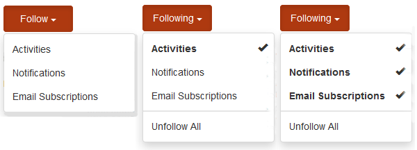

# 活动流功能 {#activity-streams-feature}

>[!CAUTION]
>
>AEM 6.4已结束扩展支持，本文档将不再更新。 有关更多详细信息，请参阅 [技术支助期](https://helpx.adobe.com/cn/support/programs/eol-matrix.html). 查找支持的版本 [此处](https://experienceleague.adobe.com/docs/).

## 简介 {#introduction}

已登录社区成员的活动，例如向论坛或博客发帖，被收集到流中，该流可通过配置以各种方式过滤和显示 `Activity Streams` 组件。

跟踪功能为社区成员关注感兴趣的帖子或关注其他社区成员的活动添加了另一种活动视图。

此文档部分描述

* 将活动流组件添加到AEM站点
* 活动流组件的配置设置

## 将活动流添加到页面 {#adding-activity-streams-to-a-page}

如果需要添加 `Activity Streams` 组件添加到创作模式下的页面，可使用组件浏览器找到

* `Communities / Activity Streams`

并将其拖动到应显示活动流的页面上的位置。

有关必要信息，请访问 [社区组件基础知识](basics.md).

当 [所需的客户端库](essentials-activities.md#essentials-for-client-side) 包含，这是 `Activity Streams` 组件将显示：

## 配置活动流 {#configuring-activity-streams}

选择已放置的 `Activity Streams` 要访问和选择的组件 `Configure` 图标，打开编辑对话框。

在 **[!UICONTROL 用户活动]** 选项卡，指定要显示的活动：

* **[!UICONTROL 最大活动数]**
要显示的活动数
* **[!UICONTROL 流资源路径]**
将留空，默认为社区站点或社区组。 流资源路径可标识活动源。 默认值为空。
* **[!UICONTROL 显示用户活动视图]**
如果选中此选项，则“活动”页面将包含一个选项卡，该选项卡会根据当前成员在社区中生成的活动筛选活动。 默认选中。
* **[!UICONTROL 显示所有活动视图]**
如果选中此项，则活动页面将包含一个选项卡，其中包含在当前成员有权访问的社区中生成的所有活动。 默认选中。
* **[!UICONTROL 显示以下视图]**
如果选中此项，则活动页面将包含一个选项卡，该选项卡会根据当前成员关注的活动筛选活动。 默认选中。

## 以下视图 {#following-view}

必须配置组件才能启用以下功能。 允许遵循的功能包括 [博客](blog-feature.md), [论坛](forum.md), [问题解答](working-with-qna.md), [日历](calendar.md), [文件库](file-library.md)和 [评论](comments.md).

的 **关注** 按钮提供了将条目作为活动进行跟踪的方法， [通知](notifications.md)和/或 [订阅](subscriptions.md). 每次 **关注** 按钮时，可以打开或关闭选定内容。 的 `Email Subscriptions` 仅在配置后才存在选择。

如果选择了以下任何方法，则按钮的文本将更改为 **关注**. 为方便起见，可以选择 `Unfollow All` 以关闭所有方法。

的 **关注** 按钮：

* 查看其他成员的配置文件时
* 在主功能页面上，如论坛、QnA和博客
   * 遵循该常规功能的所有活动

* 对于特定条目，如论坛主题、问题解答问题或博客文章
   * 跟踪该特定条目的所有活动

## 附加信息 {#additional-information}

有关 [活动流要点](essentials-activities.md) 页面。
